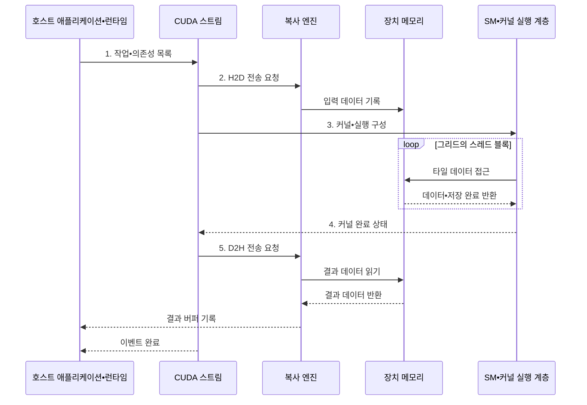

---
sidebar:
  order: 42
  label: "042. CUDA 병렬 컴퓨팅 (CUDA Parallel Computing)"
  badge:
    text: "기출 • 50%"
    variant: note
title: "CUDA 병렬 컴퓨팅 (CUDA Parallel Computing)"
date: "2026-08-05T00:48:09+09:00"
tags:
  - "notes-hardware"
weight: 42
extra:
  question_no: "042"
  source_status: "기출"
  source_history: "135회"
  priority: 50
  priority_note: "커널•메모리•스트림 최적화의 기출 주제"
---

## Ⅰ. 개요

<details><summary>핵심 용어</summary>

- **통합 컴퓨팅 장치 구조(Compute Unified Device Architecture, CUDA)**: NVIDIA GPU에서 병렬 연산을 구현하는 플랫폼이자 프로그래밍 모델이다.
- **호스트(Host)**: CUDA 작업과 데이터를 준비하여 그래픽 처리 장치(Graphics Processing Unit, GPU)에 제출하고 결과를 처리하는 중앙 처리 장치(Central Processing Unit, CPU) 측 실행 환경이다.
- **장치(Device)**: CUDA 커널을 실행하고 장치 메모리를 제공하는 GPU 측 실행 환경이다.

</details>

- 정의/개념: NVIDIA GPU의 **병렬 실행 플랫폼**
- 배경/필요성: CPU 소수 스레드로는 대규모 데이터 **처리량 제약**

#### 한줄 요약

- CPU가 작업표를 만들면 GPU의 여러 작업조가 일을 나눠 처리한다

## Ⅱ. 특징

<details><summary>핵심 용어</summary>

- **커널(Kernel)**: GPU의 다수 스레드가 서로 다른 데이터에 병렬로 실행하는 함수이다.
- **그리드(Grid)**: 커널이 실행하는 전체 스레드 블록 집합
- **블록(Block)**: 협력 가능한 CUDA 스레드 묶음
- **스레드(Thread)**: CUDA 커널의 개별 실행 단위
- **병합 접근(Coalesced Access)**: 인접 스레드의 연속 메모리 요청을 적은 수의 전송으로 합치는 접근 방식이다.
- **스트림(Stream)**: 등록한 복사와 커널 작업을 순서대로 처리하면서 다른 스트림과의 중첩 실행을 허용하는 대기열이다.

</details>

- 작업 제출과 커널 실행을 구분하는 **호스트•장치 분리**
- **그리드•블록•스레드** 계층으로 병렬 작업 구성
- 트랜잭션을 줄이는 **병합 접근**, 복사 지연을 숨기는 **스트림 중첩**

#### 한줄 요약

- 작업조 크기를 맞추고 조건이 되면 운반과 계산을 겹쳐 진행한다

## Ⅲ. 구조 및 구성요소

<details><summary>핵심 용어</summary>

- **호스트 런타임(Host Runtime)**: 장치 메모리 할당과 데이터 복사 및 커널 실행 요청을 관리하는 소프트웨어 계층이다.
- **커널 실행 계층(Kernel Execution Hierarchy)**: 그리드의 블록을 SM에 배치하고 블록의 스레드를 병렬 실행하는 구조이다.
- **장치 메모리 계층(Device Memory Hierarchy)**: 레지스터와 공유 메모리 및 전역 메모리를 접근 범위와 지연에 따라 구성한 저장 구조이다.
- **스트리밍 멀티프로세서(Streaming Multiprocessor, SM)**: 커널의 스레드 블록을 배치해 실행하는 그래픽 처리 장치(Graphics Processing Unit, GPU) 연산 단위이다.

</details>

```text
[호스트 런타임] -- [CUDA 스트림] -- [커널 실행 계층] -- [장치 메모리 계층]
```

선의 의미: 호스트의 제출 계층과 장치의 실행•메모리 계층이 CUDA 스트림을 매개로 결합된 정적 소프트웨어•하드웨어 구조다.

| 구성요소 | 책임 |
|:---|:---|
| 호스트 런타임 | 할당•복사•**실행 관리** |
| CUDA 스트림 | 작업 순서•**의존성 관리** |
| 커널 실행 계층 | 병렬 **그리드•블록 배치** |
| 장치 메모리 계층 | 범위별 **데이터 저장•공급** |

#### 한줄 요약

- 런타임이 스트림에 작업을 등록하면 실행 계층과 메모리가 순서대로 처리한다.

## Ⅳ. 흐름도

<details><summary>핵심 용어</summary>

- **복사 엔진(Copy Engine)**: 그래픽 처리 장치(Graphics Processing Unit, GPU) 연산 코어와 별도로 호스트와 장치 메모리 사이의 직접 메모리 접근(Direct Memory Access, DMA) 전송을 수행하는 하드웨어이다.
- **호스트-장치 전송(Host-to-Device•Device-to-Host, H2D•D2H)**: 중앙 처리 장치(Central Processing Unit, CPU) 메모리에서 GPU 메모리로 입력을 보내고 결과를 반대로 가져오는 데이터 이동이다.
- **이벤트(Event)**: 스트림 사이의 작업 의존성과 비동기 완료 시점을 표시하는 동기화 객체이다.

</details>



**동작 원리**

1. **작업•의존성 목록**: 복사•커널의 비동기 순서
2. **H2D 전송 요청**: 장치 메모리에 적재할 입력
3. **커널•실행 구성**: 함수와 그리드•블록 크기
4. **커널 완료 상태**: 타일 처리 종료와 복사 허용
5. **D2H 전송 요청**: 호스트에 기록할 결과 범위

#### 한줄 요약

- 스트림은 입력 복사•커널•결과 복사를 순서대로 실행하고 이벤트로 완료를 알린다

## Ⅴ. 종류 및 비교

<details><summary>핵심 용어</summary>

- **SYCL**: 여러 제조사의 가속기를 표준 C++ 코드로 제어하는 이식형 병렬 프로그래밍 모델이다.
- **다차원 실행 범위(N-Dimensional Range, ND-range)**: SYCL에서 전체 작업 항목과 작업 그룹의 다차원 배치를 나타내는 실행 범위이다.
- **중앙 처리 장치 멀티스레딩(Central Processing Unit Multithreading, CPU 멀티스레딩)**: 여러 독립 스레드나 태스크를 CPU 코어에 배치하여 동시에 실행하는 방식이다.

</details>

| 병렬 프로그래밍 방식 | CUDA | SYCL | CPU 멀티스레딩 |
|:---|:---|:---|:---|
| 적용 기준 | NVIDIA **세부 최적화** | 다중 제조사 **이식성** | 복잡한 분기•**작은 작업** |
| 핵심 특징 | **그리드•블록•스레드** | **ND-range•작업 그룹** | 독립 **스레드•태스크** |
| 한계 | 공급자 종속•**전송 병목** | 구현별 **성능 편차** | 제한된 **병렬 처리량** |

> 요약: NVIDIA 최적화는 CUDA, 이식성은 SYCL이 적합하다

#### 한줄 요약

- 전용 공장 최적화는 CUDA, 여러 공장 이동은 SYCL이 알맞다

## Ⅵ. 실무 고려사항 및 대책

<details><summary>핵심 용어</summary>

- **전역 동기화(Global Synchronization)**: 모든 관련 작업이 끝날 때까지 후속 실행을 멈춰 불필요한 직렬화를 만들 수 있는 동기화이다.
- **고정 호스트 메모리(Pinned Host Memory)**: 비동기 DMA 전송을 위해 운영체제가 물리 페이지를 교체하지 않도록 고정한 호스트 메모리이다.
- **점유율(Occupancy)**: 스트리밍 멀티프로세서(Streaming Multiprocessor, SM)에 상주하는 워프 수가 하드웨어 최대치에서 차지하는 비율이다.
- **연산 집약도(Arithmetic Intensity)**: 메모리에서 이동한 데이터 양에 비해 수행한 연산량의 비율이다.

</details>

| 문제 | 대책 | 효과 |
|:---|:---|:---|
| 복사•커널 중첩을 차단하는 **전역 동기화** | 실제 의존성만 표현하는 **스트림•이벤트** | **동시 실행** 확대 |
| 호스트•장치 전송이 연산 시간을 초과 | **고정 호스트 메모리**•비동기 복사•배치 적용 | 전송 비용 절감 |
| **비동기 커널 오류** 의 지연 발견 | 실행 직후 확인과 경계별 **로그** 적용 | 오류 **원인 위치** 식별 |
| 블록•레지스터•공유 메모리 **불균형** | **점유율•대역폭•연산 집약도** 공동 탐색 | 병목별 **자원 조정** |

> 행렬 곱은 입력을 공유 메모리 크기의 타일로 나누고 블록 안의 여러 스레드가 같은 값을 반복 사용해 전역 메모리 전송을 줄인다.

#### 한줄 요약

- 행렬 타일을 공유 메모리에서 재사용하고 여러 스트림의 복사•연산을 겹쳐 전송 병목을 줄인다

## Ⅶ. 결론

<details><summary>핵심 용어</summary>

- **공급자 종속(Vendor Lock-in)**: 코드와 최적화가 특정 제조사의 하드웨어 및 소프트웨어 생태계에 의존하는 상태이다.
- **이식성(Portability)**: 같은 프로그램을 여러 제조사의 가속기에서 적은 수정으로 실행할 수 있는 성질이다.
- **세부 최적화(Hardware-specific Optimization)**: 특정 그래픽 처리 장치(Graphics Processing Unit, GPU)의 실행 구조와 메모리 계층에 맞춰 성능을 조정하는 작업이다.

</details>

- **NVIDIA 최적화** 는 CUDA, **다중 제조사 이식성** 은 SYCL 선택

#### 한줄 요약

- 전용 공장을 채울 일감이 많고 이동비를 줄일 수 있을 때 CUDA를 쓴다
