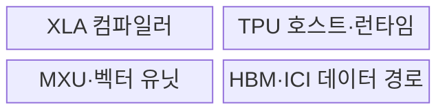
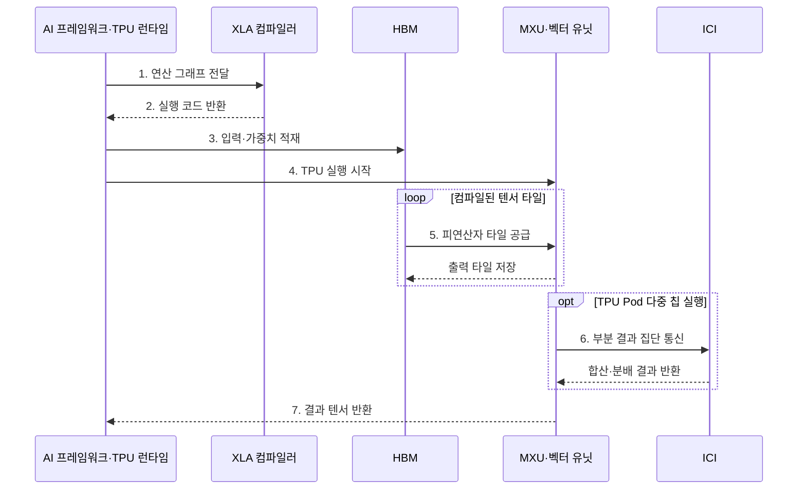

---
sidebar:
  order: 43
  label: "043. TPU 텐서 처리 장치 (Tensor Processing Unit)"
  badge:
    text: "기출 · 70%"
    variant: note
title: "TPU 텐서 처리 장치 (Tensor Processing Unit)"
date: "2026-07-28T12:57:04+09:00"
tags:
  - "notes-hardware"
weight: 43
extra:
  question_no: "043"
  source_status: "기출"
  source_history: "126회, 134회"
  priority: 70
  priority_note: "반복 기출, 행렬 가속과 다중 칩 확장의 핵심"
---

## 미리 알고가기

- **텐서 처리 장치(Tensor Processing Unit, TPU)**: Google이 설계한 신경망 행렬 연산 전용 AI 가속기
- **가속 선형 대수(Accelerated Linear Algebra, XLA)**: 연산 그래프를 최적화하여 TPU 실행 코드로 변환하는 컴파일러
- **텐서(Tensor)**: 다차원 수치 배열을 나타내는 데이터 객체
- **행렬 곱셈 장치(Matrix Multiply Unit, MXU)**: 곱셈·누산 배열로 대규모 행렬 곱을 처리하는 TPU 연산 장치
- **시스톨릭 배열(Systolic Array)**: 인접 연산기가 값·부분합을 전달하는 배열
- **벡터 유닛(Vector Unit)**: 행렬 외 벡터·활성화 연산을 처리하는 유닛
- **고대역폭 메모리(High Bandwidth Memory, HBM)**: TPU 연산 배열에 가중치와 활성값을 공급하는 고대역폭 메모리
- **칩 간 연결망(Inter-Chip Interconnect, ICI)**: 여러 TPU 칩 사이의 집단 통신을 전달하는 전용 연결망
- **샤딩(Sharding)**: 모델·데이터를 여러 칩에 나누는 배치 방식
- **인공지능(Artificial Intelligence, AI)**: 학습한 모델로 분류·예측하며 TPU가 신경망 행렬 연산을 가속하는 기술
- **그래픽 처리 장치(Graphics Processing Unit, GPU)**: 프로그램 가능한 병렬 코어와 커널로 범용 병렬 연산을 처리하는 프로세서
- **신경망 처리 장치(Neural Processing Unit, NPU)**: 단말에서 신경망 연산을 낮은 전력으로 실행하는 전용 프로세서
- **단일 명령 다중 스레드(Single Instruction, Multiple Threads, SIMT)**: 워프의 활성 스레드에 공통 명령을 발행하는 GPU 실행 모델
- **TPU Pod**: 여러 TPU 칩을 고속 연결망으로 묶어 하나의 대규모 학습 자원처럼 쓰는 시스템
- **런타임(Runtime)**: 컴파일한 작업을 장치에 제출하고 입출력·상태·오류를 관리하는 실행 소프트웨어
- **연산 융합·타일링(Operation Fusion·Tiling)**: 연속 연산을 하나로 합쳐 중간 이동을 줄이고 큰 텐서를 장치 자원에 맞는 블록으로 나누는 최적화
- **집단 통신(Collective Communication)**: 여러 칩이 부분 결과를 합산·분배·교환하는 다자간 통신
- **연산자(Operator)**: 행렬 곱·활성화처럼 신경망 그래프를 구성하는 개별 계산
- **폴백(Fallback)**: TPU가 지원하지 않는 연산을 CPU 같은 다른 장치에서 실행하는 대체 처리
- **모양 버킷화(Shape Bucketing)**: 가변 길이 입력을 몇 개의 대표 텐서 모양으로 묶어 컴파일 실행 파일의 종류를 제한하는 기법
- **컴파일 캐시(Compilation Cache)**: 같은 연산 그래프·텐서 모양의 XLA 결과를 저장해 후속 실행의 재컴파일을 피하는 저장소

## Ⅰ. 개요

- 정의/개념: Google의 **신경망 행렬 연산 전용** 가속기
- 배경/필요성: 대규모 행렬 곱의 **처리 효율 확대**

### 쉽게 이해하기 (학습용)

- 큰 곱셈을 전용 계산판에 맞춰 잘라 여러 공장에 나눠 보낸다

## Ⅱ. 특징

- **XLA 컴파일**로 연산 융합·타일·샤딩 결정
- **시스톨릭 MXU**로 행렬 곱·부분합 전달
- **HBM·ICI 대역폭**이 단일·다중 칩 처리량 결정

### 쉽게 이해하기 (학습용)

- 행렬 연산 배열의 활용률이 높아도 HBM 공급 대역폭이나 칩 간 통신이 병목이면 전체 성능이 제한된다

## Ⅲ. 구조 및 구성요소

| 구성요소 | 책임 |
|:---|:---|
| XLA 컴파일러 | 융합·타일링·**샤딩 생성** |
| TPU 호스트·런타임 | 작업 제출·**상태 관리** |
| MXU·벡터 유닛 | 행렬·활성화 **연산 처리** |
| HBM·ICI 데이터 경로 | 데이터 공급·**집단 통신** |

### 쉽게 이해하기 (학습용)

- XLA가 작업을 나누고 HBM과 ICI가 MXU·벡터 유닛에 데이터를 공급한다.

## Ⅳ. 흐름도

**동작 원리**

- **1. 연산 그래프 전달**: 연산·모양 제출
- **2. 실행 코드 반환**: 융합·샤딩 결정
- **3. 입력·가중치 적재**: HBM 배치
- **4. TPU 실행 시작**: 코드 제출
- **5. 피연산자 타일 공급**: MXU 전달
- **6. 부분 결과 집단 통신**: ICI 교환
- **7. 결과 텐서 반환**: 실행 완료

### 쉽게 이해하기 (학습용)

- XLA가 연산을 타일·샤드로 나누면 HBM이 MXU에 공급하고 ICI가 칩별 부분 결과를 합친다

## Ⅴ. 종류 및 비교

| AI 가속기 | TPU | GPU | NPU |
|:---|:---|:---|:---|
| 적용 기준 | 대규모 행렬·**다중 칩 학습** | 가변 커널·**범용 병렬** | 저전력 **단말 추론** |
| 핵심 특징 | XLA·**시스톨릭 배열** | SIMT 워프·**범용 커널** | 신경망 **전용 데이터 경로** |
| 한계 | 재컴파일·폴백·**집단 통신** | 분기 발산·**메모리 병목** | 연산자·메모리·**도구 제약** |

> 요약: 행렬은 TPU, 가변 커널은 GPU, 단말은 NPU가 적합하다

### 쉽게 이해하기 (학습용)

- 큰 행렬은 TPU, 변하는 작업은 GPU, 단말의 작은 추론은 NPU가 맞다

## Ⅵ. 실무 고려사항 및 대책

| 고려사항 | 대책 | 효과 |
|:---|:---|:---|
| 입력 모양 변화로 XLA 재컴파일 반복 | 대표 모양 고정·버킷화와 컴파일 캐시 적용 | 시작 지연 감소 |
| 미지원 연산의 CPU 폴백으로 전송 증가 | 연산자 지원 여부 사전 분석과 그래프 재작성 | 장치 경계 왕복 최소화 |
| HBM 대역폭 부족으로 MXU 유휴 | 연산 융합·타일링과 데이터 재사용률 개선 | 연산 배열 활용률 향상 |
| 샤딩 불균형·ICI 집단 통신 정체 | 계산·통신량 기반 샤딩과 통신 중첩 적용 | 다중 칩 확장 효율 향상 |

> 대규모 학습은 입력을 대표 텐서 모양으로 버킷화하고 XLA 결과를 캐시해 반복 재컴파일 지연을 줄인다.

### 쉽게 이해하기 (학습용)

- 입력 모양을 버킷화하고 컴파일 결과를 재사용해 XLA 재컴파일 지연을 줄인다

## Ⅶ. 결론

- **행렬 비율·컴파일 시간·HBM·ICI 사용률** 기반 적용

### 쉽게 이해하기 (학습용)

- 계산 시간이 설계도 작성과 공장 연락보다 길 때 TPU가 이롭다
