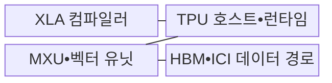
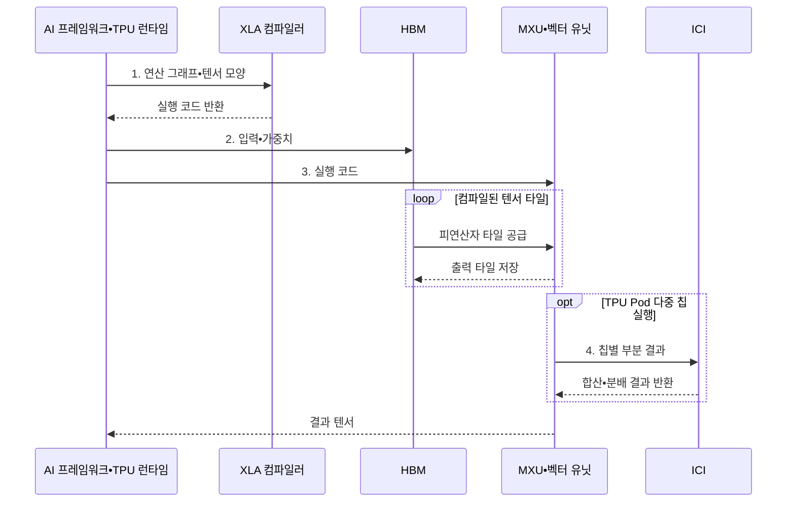

---
sidebar:
  order: 43
  label: "043. TPU 텐서 처리 장치 (Tensor Processing Unit)"
  badge:
    text: "기출 • 70%"
    variant: note
title: "TPU 텐서 처리 장치 (Tensor Processing Unit)"
date: "2026-08-03T09:07:03+09:00"
tags:
  - "notes-hardware"
weight: 43
extra:
  question_no: "043"
  source_status: "기출"
  source_history: "126회, 134회"
  priority: 70
  priority_note: "반복 기출, 행렬 가속과 다중 칩 확장의 핵심"
---

## Ⅰ. 개요

핵심 용어

- **텐서 처리 장치(Tensor Processing Unit, TPU)**: Google이 신경망의 대규모 행렬 연산을 효율적으로 처리하도록 설계한 전용 인공지능 가속기이다.
- **텐서(Tensor)**: 신경망의 입력과 가중치 및 중간 결과를 표현하는 다차원 수치 배열이다.
- **행렬 연산 전용 가속(Matrix-specialized Acceleration)**: 행렬 곱의 반복적인 데이터 이동과 계산을 전용 회로에 맞춰 처리하는 방식이다.

- 정의/개념: Google의 **신경망 행렬 연산 전용** 가속기
- 배경/필요성: 범용 코어는 대규모 행렬 곱의 **전력•처리 효율 제약**

#### 한줄 요약

- 큰 곱셈을 전용 계산판에 맞춰 잘라 여러 공장에 나눠 보낸다

## Ⅱ. 특징

핵심 용어

- **가속 선형 대수(Accelerated Linear Algebra, XLA)**: 연산 그래프를 융합•타일링•샤딩하여 TPU 실행 코드로 변환하는 컴파일러이다.
- **시스톨릭 배열(Systolic Array)**: 인접한 연산기들이 피연산자와 부분합을 규칙적으로 전달하며 행렬 곱을 처리하는 배열이다.
- **고대역폭 메모리(High Bandwidth Memory, HBM)**: TPU 연산 배열에 가중치와 활성값을 높은 전송률로 공급하는 메모리이다.
- **칩 간 연결망(Inter-Chip Interconnect, ICI)**: 여러 TPU 칩 사이에서 부분 결과와 집단 통신 데이터를 전달하는 전용 연결망이다.
- **행렬 곱셈 장치(Matrix Multiply Unit, MXU)**: 시스톨릭 배열로 곱셈•누산을 수행하는 TPU 핵심 연산 장치이다.

- 연산 융합•타일•샤딩을 결정하는 **XLA 컴파일**
- 행렬 곱•부분합을 전달하는 **시스톨릭 MXU**
- 단일 칩 처리량을 제한하는 **HBM 대역폭**, 다중 칩 처리량을 제한하는 **ICI 대역폭**

#### 한줄 요약

- 행렬 연산 배열의 활용률이 높아도 HBM 공급 대역폭이나 칩 간 통신이 병목이면 전체 성능이 제한된다

## Ⅲ. 구조 및 구성요소

핵심 용어

- **행렬 곱셈 장치(Matrix Multiply Unit, MXU)**: 곱셈•누산 배열로 대규모 행렬 곱을 처리하는 TPU의 핵심 연산 장치이다.
- **벡터 유닛(Vector Unit)**: 활성화와 정규화처럼 행렬 곱 이외의 원소별•벡터 연산을 처리하는 장치이다.
- **텐서 처리 장치 런타임(Tensor Processing Unit Runtime, TPU 런타임)**: 컴파일된 작업을 장치에 제출하고 입출력과 상태 및 오류를 관리하는 실행 소프트웨어이다.
- **가속 선형 대수(Accelerated Linear Algebra, XLA)•고대역폭 메모리(High Bandwidth Memory, HBM)•칩 간 연결망(Inter-Chip Interconnect, ICI)**: 작업을 컴파일하고 단일•다중 칩 데이터 경로를 제공하는 구성이다.

| 구성요소 | 책임 |
|:---|:---|
| XLA 컴파일러 | 융합•타일링•**샤딩 생성** |
| TPU 호스트•런타임 | 작업 제출•**상태 관리** |
| MXU•벡터 유닛 | 행렬•활성화 **연산 처리** |
| HBM•ICI 데이터 경로 | 데이터 공급•**집단 통신** |

#### 한줄 요약

- XLA가 작업을 나누고 HBM과 ICI가 MXU•벡터 유닛에 데이터를 공급한다.

## Ⅳ. 흐름도

핵심 용어

- **연산 그래프(Computation Graph)**: 신경망의 연산자와 텐서 의존 관계를 노드와 간선으로 나타낸 구조이다.
- **타일링(Tiling)**: 큰 텐서를 장치의 메모리와 연산 배열 크기에 맞는 작은 블록으로 나누는 최적화이다.
- **집단 통신(Collective Communication)**: 여러 칩이 부분 결과를 합산•분배•교환하는 다자간 통신이다.
- **인공지능(Artificial Intelligence, AI)•텐서 처리 장치(Tensor Processing Unit, TPU)•TPU Pod**: 신경망 작업과 이를 단일•다중 칩에서 처리하는 가속기 환경이다.
- **가속 선형 대수(Accelerated Linear Algebra, XLA)•고대역폭 메모리(High Bandwidth Memory, HBM)**: 연산 그래프를 컴파일하고 타일 데이터를 공급하는 구성이다.
- **행렬 곱셈 장치(Matrix Multiply Unit, MXU)•칩 간 연결망(Inter-Chip Interconnect, ICI)**: 타일 연산과 칩별 부분 결과 통신을 담당하는 장치이다.

**동작 원리**

1. **연산 그래프•텐서 모양**: XLA 융합•샤딩 입력
2. **입력•가중치**: HBM에 배치할 피연산자
3. **실행 코드**: MXU•벡터 유닛의 타일 연산 계획
4. **칩별 부분 결과**: ICI 합산•분배 대상

#### 한줄 요약

- XLA가 연산을 타일•샤드로 나누면 HBM이 MXU에 공급하고 ICI가 칩별 부분 결과를 합친다

## Ⅴ. 종류 및 비교

핵심 용어

- **텐서 처리 장치 포드(Tensor Processing Unit Pod, TPU Pod)**: 여러 TPU 칩을 고속 연결망으로 묶어 하나의 대규모 학습 자원처럼 사용하는 시스템이다.
- **그래픽 처리 장치(Graphics Processing Unit, GPU)**: 프로그램 가능한 병렬 코어와 커널로 가변적인 병렬 연산을 처리하는 프로세서이다.
- **신경망 처리 장치(Neural Processing Unit, NPU)**: 단말에서 신경망 연산을 낮은 전력으로 실행하도록 설계한 전용 프로세서이다.
- **단일 명령 다중 스레드(Single Instruction, Multiple Threads, SIMT)**: GPU 워프의 활성 스레드에 공통 명령을 발행하는 실행 방식이다.

| AI 가속기 | TPU | GPU | NPU |
|:---|:---|:---|:---|
| 적용 기준 | 대규모 행렬•**다중 칩 학습** | 가변 커널•**범용 병렬** | 저전력 **단말 추론** |
| 핵심 특징 | XLA•**시스톨릭 배열** | SIMT 워프•**범용 커널** | 신경망 **전용 데이터 경로** |
| 한계 | 재컴파일•폴백•**집단 통신** | 분기 발산•**메모리 병목** | 연산자•메모리•**도구 제약** |

> 요약: 행렬은 TPU, 가변 커널은 GPU, 단말은 NPU가 적합하다

#### 한줄 요약

- 큰 행렬은 TPU, 변하는 작업은 GPU, 단말의 작은 추론은 NPU가 맞다

## Ⅵ. 실무 고려사항 및 대책

핵심 용어

- **모양 버킷화(Shape Bucketing)**: 가변 길이 입력을 몇 개의 대표 텐서 모양으로 묶어 컴파일 결과의 종류를 제한하는 기법이다.
- **컴파일 캐시(Compilation Cache)**: 같은 연산 그래프와 텐서 모양의 가속 선형 대수(Accelerated Linear Algebra, XLA) 결과를 저장하여 재컴파일을 피하는 저장소이다.
- **폴백(Fallback)**: 텐서 처리 장치(Tensor Processing Unit, TPU)가 지원하지 않는 연산을 중앙 처리 장치(Central Processing Unit, CPU) 같은 다른 장치에서 실행하는 대체 처리이다.
- **샤딩(Sharding)**: 모델이나 데이터를 여러 TPU 칩에 나누어 배치하고 병렬 처리하는 방식이다.
- **고대역폭 메모리(High Bandwidth Memory, HBM)•행렬 곱셈 장치(Matrix Multiply Unit, MXU)•칩 간 연결망(Inter-Chip Interconnect, ICI)**: 데이터 공급과 행렬 연산 및 다중 칩 통신을 담당하는 장치이다.

| 문제 | 대책 | 효과 |
|:---|:---|:---|
| 입력 모양 변화로 **재컴파일 반복** | **모양 버킷화•컴파일 캐시** 적용 | **시작 지연** 감소 |
| 미지원 연산의 **CPU 폴백** | 지원 분석과 **그래프 재작성** | 장치 경계 **왕복 최소화** |
| **HBM 대역폭 부족** 으로 MXU 유휴 | **연산 융합•타일링** 과 재사용 개선 | **연산 배열 활용률** 향상 |
| 샤딩 불균형•**ICI 정체** | 계산•통신량 기반 **샤딩•통신 중첩** | **다중 칩 확장 효율** 향상 |

> 대규모 학습은 입력을 대표 텐서 모양으로 버킷화하고 XLA 결과를 캐시해 반복 재컴파일 지연을 줄인다.

#### 한줄 요약

- 입력 모양을 버킷화하고 컴파일 결과를 재사용해 XLA 재컴파일 지연을 줄인다

## Ⅶ. 결론

핵심 용어

- **대규모 행렬 연산(Large-scale Matrix Computation)**: 충분히 큰 행렬 곱을 반복하여 전용 배열의 처리량을 활용하는 작업이다.
- **다중 칩 학습(Multi-chip Training)**: 모델이나 데이터를 여러 가속기에 분할하고 집단 통신으로 결과를 동기화하는 학습 방식이다.
- **가변 커널(Variable Kernel)**: 모델이나 작업에 따라 실행 코드와 제어 흐름이 자주 달라지는 병렬 연산 함수이다.
- **텐서 처리 장치(Tensor Processing Unit, TPU)•그래픽 처리 장치(Graphics Processing Unit, GPU)•TPU Pod**: 대규모 행렬과 가변 커널 및 다중 칩 학습에 사용하는 가속기 환경이다.

- **대규모 행렬•Pod 학습** 은 TPU, **가변 커널** 은 GPU 선택

#### 한줄 요약

- 계산 시간이 설계도 작성과 공장 연락보다 길 때 TPU가 이롭다
