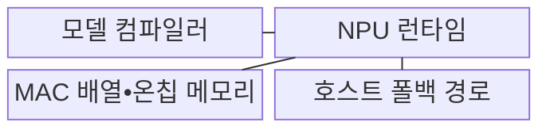
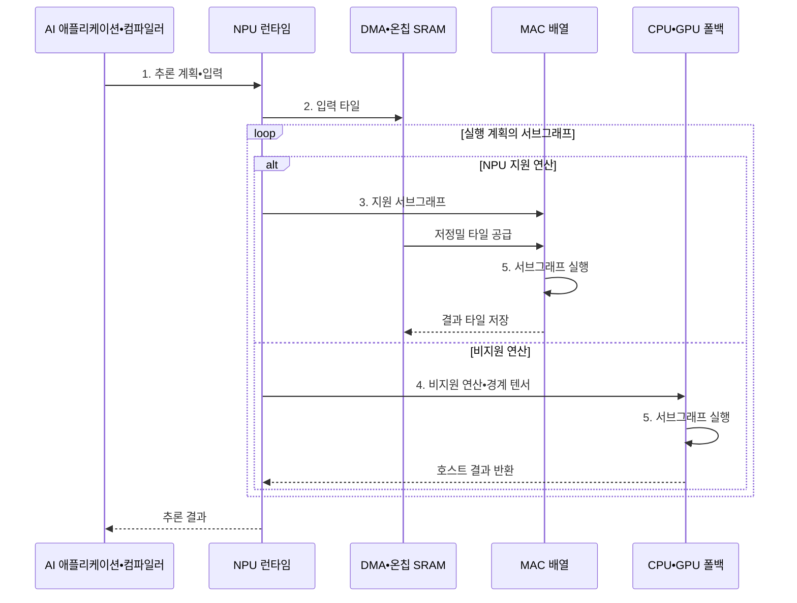

---
sidebar:
  order: 44
  label: "044. NPU 신경망 처리 장치 (Neural Processing Unit)"
  badge:
    text: "기출 • 85%"
    variant: note
title: "NPU 신경망 처리 장치 (Neural Processing Unit)"
date: "2026-08-04T14:09:12+09:00"
tags:
  - "notes-hardware"
weight: 44
extra:
  question_no: "044"
  source_status: "기출"
  source_history: "126회, 134회, 135회, 137회, 138회"
  priority: 85
  priority_note: "다섯 회 반복, 온디바이스 AI 가속의 핵심"
---

## Ⅰ. 개요

핵심 용어

- **신경망 처리 장치(Neural Processing Unit, NPU)**: 신경망 연산을 낮은 전력과 짧은 지연으로 처리하도록 설계한 병렬 가속기이다.
- **전용 연산 배열(Dedicated Compute Array)**: 신경망의 반복적인 곱셈•누산을 병렬로 처리하도록 규칙적으로 배치한 회로이다.
- **근접 메모리(Near-compute Memory)**: 연산기에 데이터를 가까이 보관하여 외부 메모리 전송을 줄이는 저장 구조이다.
- **인공지능(Artificial Intelligence, AI)**: 학습한 모델로 추론•인식 등 지능형 작업을 수행하는 기술이다.
- **CPU**: Central Processing Unit, 범용 제어를 담당하는 처리 장치
- **GPU**: Graphics Processing Unit, 프로그램식 병렬 처리 장치

- 정의/개념: 신경망 **전용 연산 배열•근접 메모리** 기반 가속기
- 배경/필요성: CPU•GPU 추론은 단말의 **전력•지연 제약**

#### 한줄 요약

- 전용 로봇이 신경망 계산을 가까운 부품함과 함께 처리한다

## Ⅱ. 특징

핵심 용어

- **곱셈-누산 배열(Multiply-Accumulate Array, MAC Array)**: 다수의 곱셈•누산 연산기를 배치하여 텐서 연산을 병렬 처리하는 배열이다.
- **온칩 정적 임의 접근 메모리(On-chip SRAM)**: 입력과 가중치 및 중간값을 연산기 가까이에 보관하는 고속 메모리이다.
- **초당 조 연산(Tera Operations Per Second, TOPS)**: 특정 데이터 정밀도와 조건에서 장치가 수행할 수 있는 초당 최대 연산 수이다.
- **종단 지연(End-to-end Latency)**: 입력 준비부터 신경망 처리 장치(Neural Processing Unit, NPU)와 폴백 구간을 거쳐 최종 결과가 나올 때까지의 전체 시간이다.

- 신경망 연산을 병렬 처리하는 **저정밀 MAC 배열**
- 외부 메모리 전송을 줄이는 **온칩 SRAM 재사용**
- **TOPS** 보다 지원률•폴백을 포함한 **종단 지연** 평가

#### 한줄 요약

- 로봇이 못하는 일을 직원에게 넘길수록 전달 시간이 커진다

## Ⅲ. 구조 및 구성요소

핵심 용어

- **모델 컴파일러(Model Compiler)**: 모델을 양자화하고 지원 여부에 따라 분할하여 신경망 처리 장치(Neural Processing Unit, NPU) 코드를 생성하는 도구이다.
- **NPU 런타임(NPU Runtime)**: 컴파일된 모델의 버퍼와 실행 순서 및 장치 전환을 관리하는 소프트웨어이다.
- **호스트 폴백 경로(Host Fallback Path)**: NPU가 지원하지 않는 연산을 중앙 처리 장치(Central Processing Unit, CPU)나 그래픽 처리 장치(Graphics Processing Unit, GPU)에서 대체 실행하는 경로이다.
- **곱셈 누산(Multiply-Accumulate, MAC)**: 신경망 텐서 연산의 곱셈 결과를 부분합에 누적하는 기본 연산이다.

| 구성요소 | 책임 |
|:---|:---|
| 모델 컴파일러 | 양자화•분할•**장치 코드 생성** |
| NPU 런타임 | 실행 순서•**전송•동기화** |
| MAC 배열•온칩 메모리 | 병렬 연산•**데이터 재사용** |
| 호스트 폴백 경로 | 비지원 연산의 **대체 실행** |

#### 한줄 요약

- 컴파일러가 작업을 나누고 런타임이 NPU 실행과 호스트 폴백을 연결한다.

## Ⅳ. 흐름도

핵심 용어

- **서브그래프 분할(Subgraph Partitioning)**: 지원 연산과 비지원 연산을 장치별 실행 구간으로 나누는 과정이다.
- **직접 메모리 접근(Direct Memory Access, DMA)**: 전용 엔진이 외부 메모리와 온칩 메모리 사이에서 데이터를 직접 전송하는 방식이다.
- **경계 텐서(Boundary Tensor)**: 서로 다른 장치에서 실행되는 서브그래프 사이에 전달되는 중간 데이터이다.

**동작 원리**

1. **추론 계획•입력**: 컴파일된 서브그래프와 입력
2. **입력 타일**: DMA로 SRAM에 전송할 데이터
3. **지원 서브그래프**: 저정밀 MAC 배열의 실행 단위
4. **비지원 연산•경계 텐서**: CPU•GPU 대체 실행 입력
5. **서브그래프 실행**: NPU 가속 또는 CPU•GPU 대체 연산

#### 한줄 요약

- 런타임은 지원 연산을 NPU에서 실행하고 비지원 연산은 경계 텐서와 함께 CPU•GPU로 넘긴다

## Ⅴ. 종류 및 비교

핵심 용어

- **온디바이스 추론(On-device Inference)**: 입력을 원격 서버로 보내지 않고 단말 안에서 모델 예측을 실행하는 방식이다.
- **단일 명령 다중 스레드(Single Instruction, Multiple Threads, SIMT)**: 하나의 명령을 그래픽 처리 장치(Graphics Processing Unit, GPU) 워프의 활성 스레드에 공통 발행하는 실행 모델이다.
- **동적 분기(Dynamic Branching)**: 입력이나 실행 상태에 따라 런타임에 선택되는 제어 흐름이다.

| 신경망 실행 장치 | NPU | GPU | CPU |
|:---|:---|:---|:---|
| 적용 기준 | 저전력 **온디바이스 추론** | 가변 모델•**학습•범용 병렬** | 동적 분기•**전후처리** |
| 핵심 특징 | MAC 배열•**근접 SRAM** | SIMT 워프•**범용 커널** | 범용 코어•**캐시** |
| 한계 | 연산자•양자화•**폴백 제약** | 메모리 지연•**전력 소모** | 낮은 **신경망 처리량** |

> 요약: 저전력 추론은 NPU, 가변 병렬 연산은 GPU가 적합하다

#### 한줄 요약

- 작은 전력의 반복 추론은 NPU, 변하는 병렬 일은 GPU가 맞다

## Ⅵ. 실무 고려사항 및 대책

핵심 용어

- **양자화(Quantization)**: 부동소수점 가중치와 활성값을 저비트 정수로 근사하여 연산과 메모리 비용을 줄이는 변환이다.
- **보정(Calibration)**: 대표 입력 데이터로 양자화 범위를 정하고 정확도 손실을 조정하는 과정이다.
- **연산자 지원 범위(Operator Coverage)**: 전체 신경망 연산 가운데 신경망 처리 장치(Neural Processing Unit, NPU) 코드로 변환하여 실행할 수 있는 범위이다.
- **연산자 결합(Operator Fusion)**: 연속된 연산자를 하나의 장치 연산으로 묶어 중간 저장과 장치 전환을 줄이는 최적화이다.

| 문제 | 대책 | 효과 |
|:---|:---|:---|
| 저정밀 양자화로 **정확도 저하** | 대표 보정 데이터와 **종단 정확도** 검증 | **품질 손실** 통제 |
| 비지원 연산 **폴백 비용 증가** | **연산자 결합** 과 지원 범위 분석 | **NPU 실행 구간** 확대 |
| 외부 전송으로 **MAC 배열 유휴** | **타일링•온칩 재사용•DMA 중첩** | 실효 **처리량** 향상 |
| 열•전력 한도로 **지속 성능 저하** | **온도•전력 감시** 와 주파수 조정 | 배터리•**지속 지연** 안정화 |

> 화상회의 모델은 지원되는 전처리•신경망 연산을 결합해 NPU 서브그래프를 넓히고 CPU 왕복을 줄인다.

#### 한줄 요약

- 지원 연산을 결합해 NPU 서브그래프를 넓히면 CPU•GPU 폴백의 복사•동기화가 줄어든다

## Ⅶ. 결론

핵심 용어

- **지원률(Support Coverage)**: 전체 모델 연산 중 신경망 처리 장치(Neural Processing Unit, NPU)에서 직접 실행되는 연산의 비율이다.
- **저전력 추론(Low-power Inference)**: 제한된 배터리와 열 한도 안에서 모델 예측을 수행하는 실행 조건이다.
- **가변 연산(Variable Operation)**: 모델이나 입력에 따라 연산 종류와 제어 흐름이 자주 달라지는 작업이다.

- 지원률 높고 **저전력 추론** 이면 NPU, **가변 연산** 은 GPU 선택

#### 한줄 요약

- 로봇 담당 비율이 높고 직원에게 넘기는 비용이 작을 때 도입한다
