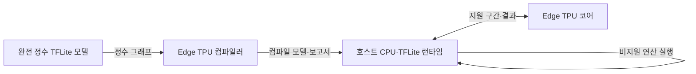
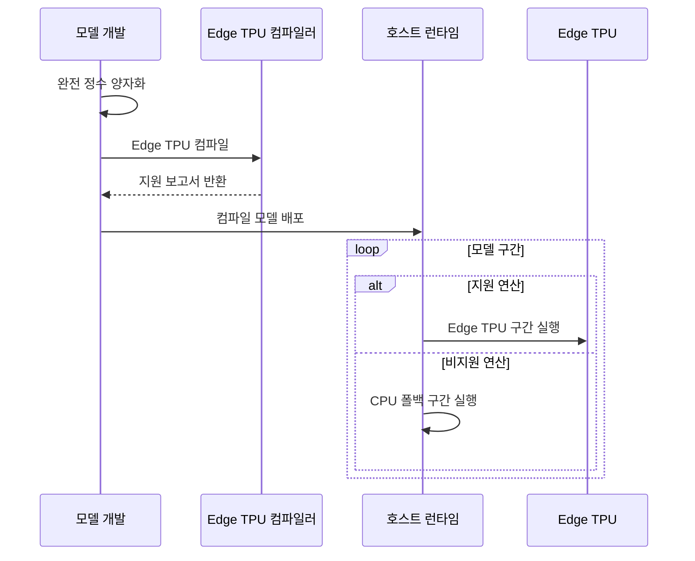

---
sidebar:
  order: 45
  label: "045. Edge TPU (Edge TPU)"
  badge:
    text: "기출 · 30%"
    variant: note
title: "Edge TPU (Edge TPU)"
date: "2026-07-27T23:59:59+09:00"
tags:
  - "notes-hardware"
weight: 45
extra:
  question_no: "045"
  source_status: "기출"
  source_history: "138회"
  priority: 30
  priority_note: "완전 정수·CPU 구간의 배포 판단"
---

## 미리 알고가기

- **에지 텐서 처리 장치(Edge Tensor Processing Unit, Edge TPU)**: ‘에지 티피유’로 읽고 영문 머리글자를 딴 TPU 계열명이며, 현장 장치의 정수 추론용 전용 반도체
- **텐서플로 라이트(TensorFlow Lite, TFLite)**: ‘티에프 라이트’로 읽는 TensorFlow Lite의 축약 표기이며, 단말 추론 모델 형식과 런타임
- **완전 정수 양자화(Full Integer Quantization)**: 가중치·활성값·입출력의 정수 변환
- **Edge TPU 컴파일러(Edge TPU Compiler)**: 지원 연산을 Edge TPU 실행 코드로 변환
- **중앙 처리 장치(Central Processing Unit, CPU)**: 전후처리와 비지원 연산 담당
- **신경망 처리 장치(Neural Processing Unit, NPU)**: 신경망 연산용 단말 가속기
- **시스템온칩(System on Chip, SoC)**: 여러 기능을 한 다이에 통합한 칩
- **클라우드 TPU(Cloud TPU)**: 데이터센터 학습·추론용 TPU
- **가속 선형 대수(Accelerated Linear Algebra, XLA)**: TPU 그래프용 컴파일러
- **주문형 반도체(Application-Specific Integrated Circuit, ASIC)**: 특정 기능을 고정 회로로 구현해 전력·지연을 줄인 전용 반도체
- **텐서(Tensor)**: 신경망의 입력·가중치·활성값을 나타내는 다차원 수치 배열
- **연산자(Operator)**: 합성곱·활성화처럼 신경망 그래프를 구성하는 개별 계산
- **런타임(Runtime)**: 모델 구간을 CPU와 Edge TPU에 제출하고 버퍼·결과를 관리하는 실행 소프트웨어
- **폴백(Fallback)**: Edge TPU가 지원하지 않는 연산을 호스트 CPU에서 실행하는 대체 처리
- **벤더(Vendor)**: NPU 하드웨어와 전용 모델 변환·실행 도구를 제공하는 제조사
- **네트워크 왕복(Network Round Trip)**: 단말이 서버에 요청을 보내고 결과를 받을 때까지의 통신 경로와 지연
- **스마트 카메라(Smart Camera)**: 영상 모델을 내장해 촬영 현장에서 객체·이상 상태를 판정하는 카메라

## Ⅰ. 개요

- 정의/개념: 완전 정수 TFLite의 **현장 추론용 ASIC**
- 기존 한계: 클라우드 추론은 **망 지연·연결 의존성** 발생

### 쉽게 이해하기 (학습용)

- 본사에 문제를 보내지 않고 현장 계산기가 바로 판단하는 것과 같다

## Ⅱ. 특징

- **완전 정수 실행**으로 메모리·전력 소모 절감
- **지원 연산 컴파일**로 Edge TPU 실행 구간 생성
- **CPU 폴백 구간**이 길수록 전송·실행 지연 증가

### 쉽게 이해하기 (학습용)

- 계산기 사전에 있는 8비트 문제만 장치가 맡고 나머지는 직원이 푼다

## Ⅲ. 아키텍처 및 구성요소

| 설계 요소 | 설명 |
|:---|:---|
| 완전 정수 TFLite 모델 | 가중치·활성값·입출력을 정수로 표현 |
| Edge TPU 컴파일러 | 지원 구간을 분할해 실행 코드 생성 |
| 호스트 CPU·TFLite 런타임 | 장치 호출·전후처리·비지원 연산 수행 |
| Edge TPU 코어 | 컴파일된 정수 텐서 연산 실행 |

> 요약: 컴파일러가 Edge TPU와 CPU 구간을 분할

### 쉽게 이해하기 (학습용)

- 번역기가 문제를 나누면 계산기와 직원이 각자 맡는다

## Ⅳ. 원리 및 절차 흐름도

| 절차 | 설명 |
|:---|:---|
| 완전 정수 양자화 | 가중치·활성값·입출력 정수화 |
| Edge TPU 컴파일 | 지원 연산을 분할해 장치 코드 생성 |
| 지원 보고서 반환 | 지원·비지원 연산 구간 검토 |
| 컴파일 모델 배포 | 모델·호스트 런타임 설치 |
| Edge TPU 구간 실행 | 정수 텐서를 처리해 호스트에 결과 반환 |
| CPU 폴백 구간 실행 | 비지원 연산을 호스트에서 처리 |

> 요약: 지원 구간은 Edge TPU, 잔여 구간은 CPU

### 쉽게 이해하기 (학습용)

- 문제를 8비트로 바꾸고 계산기 사전에 맞는지 확인한 뒤 현장에 둔다

## Ⅴ. 종류 및 비교

| 추론 가속 배치 | Edge TPU | 온디바이스 NPU | 클라우드 TPU |
|:---|:---|:---|:---|
| 적용 기준 | 현장 센서·**저전력 정수 추론** | 제품 통합·**단말 추론** | 대형 학습·**대규모 추론** |
| 핵심 특징 | 연결형 **모듈 가속기** | SoC **내장 가속기** | 데이터센터 **가속기** |
| 한계 | 지원 연산·**CPU 전환 지연** | 벤더별 연산·**도구 제약** | 클라우드 비용·**망 왕복 지연** |

> 요약: 배치·모델 형식·전송 지연으로 가속기 선택

### 쉽게 이해하기 (학습용)

- Edge TPU는 현장 계산기, NPU는 내장 부품, 클라우드 TPU는 중앙 공장과 같다

## Ⅵ. 실무 사례

1. 스마트 카메라는 **비지원 연산자 대체**로 CPU 구간 축소

### 쉽게 이해하기 (학습용)

- 직원에게 넘어가던 문제를 계산기가 아는 유형으로 바꿔 대기 시간을 줄인다

## Ⅶ. 결론

- **완전 정수 컴파일**과 짧은 CPU 구간이면 Edge TPU 선택

### 쉽게 이해하기 (학습용)

- 계산기가 핵심 문제를 직접 풀 때 쓰고 직원 일이 길면 모델을 바꾼다
