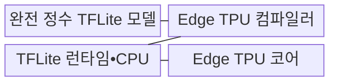
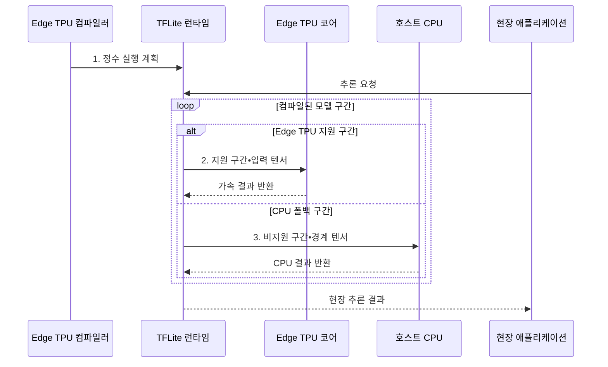

---
sidebar:
  order: 45
  label: "045. Edge TPU (Edge TPU)"
  badge:
    text: "기출 • 30%"
    variant: note
title: "Edge TPU (Edge TPU)"
date: "2026-08-03T08:48:47+09:00"
tags:
  - "notes-hardware"
weight: 45
extra:
  question_no: "045"
  source_status: "기출"
  source_history: "138회"
  priority: 30
  priority_note: "완전 정수•CPU 구간의 배포 판단"
---

## Ⅰ. 개요

핵심 용어

- **에지 텐서 처리 장치(Edge Tensor Processing Unit, Edge TPU)**: 에지 장치에서 정수 양자화 신경망 추론을 실행하도록 설계한 전용 반도체이다.
- **현장 추론(Edge Inference)**: 입력 데이터를 원격 서버로 보내지 않고 센서나 단말이 설치된 현장에서 모델을 실행하는 방식이다.
- **주문형 반도체(Application-Specific Integrated Circuit, ASIC)**: 특정 기능의 연산 경로를 고정 회로로 구현하여 전력과 지연을 줄인 반도체이다.

- 정의/개념: 완전 정수 양자화 TensorFlow Lite 모델을 실행하는 **에지 현장 추론용 ASIC**
- 배경/필요성: 클라우드 추론은 망 단절 시 **현장 판정 불가**

#### 한줄 요약

- 본사에 문제를 보내지 않고 현장 계산기가 바로 판단하는 것과 같다

## Ⅱ. 특징

핵심 용어

- **완전 정수 양자화(Full Integer Quantization)**: 모델의 가중치와 활성값 및 입출력을 정수 형식으로 변환하는 기법이다.
- **지원 연산 컴파일(Supported-operation Compilation)**: 장치가 직접 실행할 수 있는 연산자를 찾아 전용 실행 코드로 변환하는 과정이다.
- **중앙 처리 장치 폴백(Central Processing Unit Fallback, CPU 폴백)**: 에지 텐서 처리 장치(Edge Tensor Processing Unit, Edge TPU)가 지원하지 않는 연산을 호스트 CPU에서 대체 실행하는 처리이다.
- **장치 전환 비용(Device-transition Cost)**: 서로 다른 처리 장치 사이에서 텐서를 복사하고 실행을 동기화할 때 생기는 시간과 전력 비용이다.

- 메모리•전력 소모를 줄이는 **완전 정수 실행**
- Edge TPU 실행 구간을 생성하는 **지원 연산 컴파일**
- 전송•실행 지연을 늘리는 긴 **CPU 폴백 구간**

#### 한줄 요약

- 계산기 사전에 있는 8비트 문제만 장치가 맡고 나머지는 직원이 푼다

## Ⅲ. 구조 및 구성요소

핵심 용어

- **텐서플로 라이트(TensorFlow Lite, TFLite)**: 모바일과 에지 장치용 추론 모델 형식 및 경량 실행 런타임이다.
- **에지 텐서 처리 장치 컴파일러(Edge Tensor Processing Unit Compiler, Edge TPU 컴파일러)**: 지원 연산을 찾아 모델을 분할하고 Edge TPU 장치 코드를 생성하는 도구이다.
- **텐서플로 라이트 런타임(TensorFlow Lite Runtime, TFLite 런타임)**: 모델 구간을 중앙 처리 장치(Central Processing Unit, CPU)와 Edge TPU에 제출하고 버퍼 및 결과를 관리하는 실행 소프트웨어이다.

| 구성요소 | 책임 |
|:---|:---|
| 완전 정수 TFLite 모델 | 정수 **배포 그래프** 제공 |
| Edge TPU 컴파일러 | 구간 분할•**장치 코드 생성** |
| TFLite 런타임•CPU | 호출•전후처리•**폴백 실행** |
| Edge TPU 코어 | 정수 **추론 연산 실행** |

#### 한줄 요약

- 컴파일러가 정수 모델을 Edge TPU와 CPU 실행 구간으로 나눈다.

## Ⅳ. 흐름도

핵심 용어

- **정수 실행 계획(Integer Execution Plan)**: 모델의 연산 순서와 에지 텐서 처리 장치(Edge Tensor Processing Unit, Edge TPU) 및 중앙 처리 장치(Central Processing Unit, CPU)에 배치된 구간을 기록한 실행 정보이다.
- **경계 텐서(Boundary Tensor)**: Edge TPU 구간과 CPU 구간 사이에서 전달되는 중간 데이터이다.
- **지원 구간(Supported Segment)**: Edge TPU가 직접 실행할 수 있는 연속된 정수 연산자 묶음이다.
- **에지 텐서 처리 장치(Edge Tensor Processing Unit, Edge TPU)•중앙 처리 장치(Central Processing Unit, CPU)**: 지원 구간과 폴백 구간을 각각 실행하는 장치이다.
- **텐서플로 라이트(TensorFlow Lite, TFLite)**: 실행 계획과 장치별 모델 구간을 관리하는 경량 런타임이다.

**동작 원리**

1. **정수 실행 계획**: Edge TPU•CPU 구간 정보
2. **지원 구간•입력 텐서**: 장치 정수 연산의 입력
3. **비지원 구간•경계 텐서**: CPU 대체 실행의 입력

#### 한줄 요약

- 런타임은 지원 구간을 Edge TPU에, 비지원 구간을 경계 텐서와 함께 CPU에 맡긴다

## Ⅴ. 종류 및 비교

핵심 용어

- **온디바이스 신경망 처리 장치(On-device Neural Processing Unit, 온디바이스 NPU)**: 제품의 시스템 온 칩(System on Chip, SoC)에 내장되어 단말 신경망 추론을 실행하는 가속기이다.
- **클라우드 텐서 처리 장치(Cloud Tensor Processing Unit, 클라우드 TPU)**: 데이터센터에서 대규모 학습과 추론을 처리하도록 제공되는 TPU 자원이다.
- **에지 텐서 처리 장치(Edge Tensor Processing Unit, Edge TPU)**: 현장 센서에 연결해 저전력 정수 추론을 수행하는 가속기이다.
- **네트워크 왕복 지연(Network Round-trip Latency)**: 단말이 서버에 요청을 전송하고 결과를 받을 때까지 발생하는 통신 지연이다.

| 추론 가속 배치 | Edge TPU | 온디바이스 NPU | 클라우드 TPU |
|:---|:---|:---|:---|
| 적용 기준 | 현장 센서•**저전력 정수 추론** | 제품 통합•**단말 추론** | 대형 학습•**대규모 추론** |
| 핵심 특징 | 연결형 **모듈 가속기** | SoC **내장 가속기** | 데이터센터 **가속기** |
| 한계 | 지원 연산•**CPU 전환 지연** | 벤더별 연산•**도구 제약** | 클라우드 비용•**망 왕복 지연** |

> 요약: 배치•모델 형식•전송 지연으로 가속기 선택

#### 한줄 요약

- Edge TPU는 현장 계산기, NPU는 내장 부품, 클라우드 TPU는 중앙 공장과 같다

## Ⅵ. 실무 고려사항 및 대책

핵심 용어

- **대표 보정 데이터(Representative Calibration Data)**: 실제 입력 분포를 대표하여 정수 양자화의 값 범위와 스케일을 정하는 데이터이다.
- **지원 연산자 대체(Operator Substitution)**: 비지원 연산을 의미가 같은 지원 연산 조합으로 바꾸어 가속 구간을 넓히는 작업이다.
- **원자적 모델 교체(Atomic Model Replacement)**: 새 모델을 완전히 검증한 뒤 한 번의 전환으로 활성 모델을 바꾸는 배포 방식이다.
- **모델 롤백(Model Rollback)**: 새 모델의 정확도나 호환성에 문제가 생기면 이전 정상 모델로 되돌리는 복구 절차이다.
- **중앙 처리 장치(Central Processing Unit, CPU)•에지 텐서 처리 장치(Edge Tensor Processing Unit, Edge TPU)**: 비지원 연산과 지원 정수 연산을 각각 실행하는 장치이다.

| 문제 | 대책 | 효과 |
|:---|:---|:---|
| 완전 정수 양자화로 정확도 저하 | **대표 보정 데이터** 와 종단 정확도 비교 | **품질 손실** 통제 |
| 잦은 **CPU 폴백 경계** 로 복사 증가 | 지원 연산자 **대체•결합** 과 보고서 검토 | **장치 전환** 최소화 |
| 단말 **메모리•전력•열** 한도 초과 | 모델•해상도•**실행 주기** 단계 조정 | **지속 추론** 안정화 |
| 현장 오프라인 장치의 모델 업데이트 실패 | 서명 검증•**원자적 모델 교체•롤백** 적용 | **배포 신뢰성** 확보 |

> 스마트 카메라는 비지원 연산자를 Edge TPU 지원 연산 조합으로 바꿔 CPU 폴백 경계와 텐서 복사를 줄인다.

#### 한줄 요약

- 비지원 연산을 지원 연산 조합으로 바꾸면 CPU 폴백 경계와 텐서 복사가 줄어든다

## Ⅶ. 결론

핵심 용어

- **지원 연산률(Supported-operation Ratio)**: 전체 모델 연산 가운데 에지 텐서 처리 장치(Edge Tensor Processing Unit, Edge TPU)에서 직접 실행되는 연산의 비율이다.
- **오프라인 추론(Offline Inference)**: 외부 네트워크 연결 없이 단말 내부 자원만으로 모델 결과를 계산하는 방식이다.
- **지속 추론(Sustained Inference)**: 장시간의 전력과 열 한도에서도 목표 실행 주기와 지연을 유지하는 추론이다.

- 높은 **지원 연산률** 및 오프라인 추론 필요 시 **Edge TPU** 적용

#### 한줄 요약

- 계산기가 핵심 문제를 직접 풀 때 쓰고 직원 일이 길면 모델을 바꾼다
