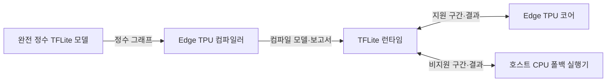
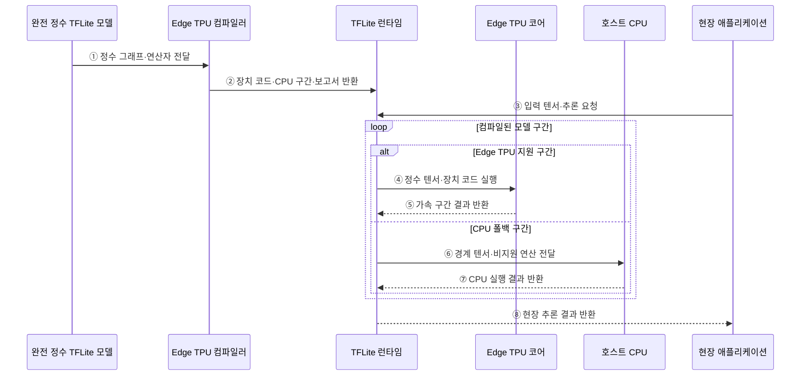

---
sidebar:
  order: 45
  label: "045. Edge TPU (Edge TPU)"
  badge:
    text: "기출 · 30%"
    variant: note
title: "Edge TPU (Edge TPU)"
date: "2026-07-28T12:57:56+09:00"
tags:
  - "notes-hardware"
weight: 45
extra:
  question_no: "045"
  source_status: "기출"
  source_history: "138회"
  priority: 30
  priority_note: "완전 정수·CPU 구간의 배포 판단"
---

## 미리 알고가기

- **에지 텐서 처리 장치(Edge Tensor Processing Unit, Edge TPU)**: 에지 장치의 정수 양자화 추론에 특화된 전용 반도체
- **텐서플로 라이트(TensorFlow Lite, TFLite)**: 모바일·에지 장치용 추론 모델 형식과 경량 실행 런타임
- **완전 정수 양자화(Full Integer Quantization)**: 가중치·활성값·입출력의 정수 변환
- **Edge TPU 컴파일러(Edge TPU Compiler)**: 지원 연산을 Edge TPU 실행 코드로 변환
- **중앙 처리 장치(Central Processing Unit, CPU)**: 전후처리와 비지원 연산 담당
- **신경망 처리 장치(Neural Processing Unit, NPU)**: 신경망 연산용 단말 가속기
- **시스템온칩(System on Chip, SoC)**: 여러 기능을 한 다이에 통합한 칩
- **클라우드 TPU(Cloud TPU)**: 데이터센터 학습·추론용 TPU
- **가속 선형 대수(Accelerated Linear Algebra, XLA)**: TPU 그래프용 컴파일러
- **주문형 반도체(Application-Specific Integrated Circuit, ASIC)**: 특정 기능을 고정 회로로 구현해 전력·지연을 줄인 전용 반도체
- **텐서(Tensor)**: 신경망의 입력·가중치·활성값을 나타내는 다차원 수치 배열
- **연산자(Operator)**: 합성곱·활성화처럼 신경망 그래프를 구성하는 개별 계산
- **런타임(Runtime)**: 모델 구간을 CPU와 Edge TPU에 제출하고 버퍼·결과를 관리하는 실행 소프트웨어
- **폴백(Fallback)**: Edge TPU가 지원하지 않는 연산을 호스트 CPU에서 실행하는 대체 처리
- **벤더(Vendor)**: NPU 하드웨어와 전용 모델 변환·실행 도구를 제공하는 제조사
- **네트워크 왕복(Network Round Trip)**: 단말이 서버에 요청을 보내고 결과를 받을 때까지의 통신 경로와 지연
- **스마트 카메라(Smart Camera)**: 영상 모델을 내장해 촬영 현장에서 객체·이상 상태를 판정하는 카메라
- **대표 보정 데이터(Representative Calibration Data)**: 실제 입력 분포를 대표하도록 뽑아 정수 양자화의 값 범위와 스케일을 정하는 데이터
- **원자적 모델 교체(Atomic Model Replacement)**: 새 모델 파일을 완전하게 검증한 뒤 한 번의 전환으로 활성 모델을 바꿔 중간 상태 노출을 막는 배포 방식
- **모델 롤백(Model Rollback)**: 새 모델의 정확도·기동·호환성 문제가 발생하면 이전 정상 모델로 되돌리는 복구 절차

## Ⅰ. 개요

- 정의/개념: 완전 정수 TFLite의 **현장 추론용 ASIC**
- 기존 한계: 클라우드 추론은 **망 지연·연결 의존성** 발생

### 쉽게 이해하기 (학습용)

- 본사에 문제를 보내지 않고 현장 계산기가 바로 판단하는 것과 같다

## Ⅱ. 특징

- **완전 정수 실행**으로 메모리·전력 소모 절감
- **지원 연산 컴파일**로 Edge TPU 실행 구간 생성
- **CPU 폴백 구간**이 길수록 전송·실행 지연 증가

### 쉽게 이해하기 (학습용)

- 계산기 사전에 있는 8비트 문제만 장치가 맡고 나머지는 직원이 푼다

## Ⅲ. 아키텍처 및 구성요소

### 도표안 A. Edge TPU·CPU 폴백 정적 구조

| 설계 요소 | 입력·상태 | 역할 |
|:---|:---|:---|
| 완전 정수 TFLite 모델 | 정수 가중치·활성값·입출력 | 배포 그래프 제공 |
| Edge TPU 컴파일러 | 정수 그래프·지원 연산 목록 | 구간 분할·장치 코드 생성 |
| 호스트 CPU·TFLite 런타임 | 모델 구간·버퍼·장치 상태 | 호출·전후처리·폴백 실행 |
| Edge TPU 코어 | 컴파일된 정수 텐서 | 전용 추론 연산 실행 |

> 요약: 컴파일러가 Edge TPU와 CPU 구간을 분할

### 도표안 B. 컴파일 모델 실행·CPU 폴백 시퀀스

### 동작 원리

1. **① 정수 그래프·연산자 전달**: 완전 정수 양자화를 마친 TFLite 모델을 Edge TPU 컴파일러에 입력해 각 연산자의 지원 여부를 분석한다.
2. **② 장치 코드·CPU 구간·보고서 반환**: 컴파일러는 지원 연산을 Edge TPU 코드로 묶고 비지원 구간과 장치 메모리 사용량을 보고서와 함께 런타임에 제공한다.
3. **③ 입력 텐서·추론 요청**: 스마트 카메라 등의 현장 애플리케이션은 센서 입력을 정수 텐서로 만들어 TFLite 런타임에 제출한다.
4. **④ 정수 텐서·장치 코드 실행**: 지원 구간이면 런타임은 입력 텐서와 컴파일된 코드를 Edge TPU에 보내 저정밀 전용 회로에서 실행한다.
5. **⑤ 가속 구간 결과 반환**: Edge TPU는 구간의 출력 텐서를 런타임에 반환해 다음 장치 또는 CPU 구간으로 넘긴다.
6. **⑥ 경계 텐서·비지원 연산 전달**: 비지원 연산을 만나면 런타임은 장치 실행을 동기화하고 경계 텐서를 호스트 CPU 형식으로 전달한다.
7. **⑦ CPU 실행 결과 반환**: CPU는 전후처리나 비지원 연산을 실행한 뒤 다음 모델 구간의 입력을 런타임에 돌려준다.
8. **⑧ 현장 추론 결과 반환**: 모든 구간이 끝나면 런타임은 네트워크 왕복 없이 최종 판정 결과를 현장 애플리케이션에 반환한다.

### 쉽게 이해하기 (학습용)

- 번역기가 문제를 나누면 계산기와 직원이 각자 맡는다

## Ⅳ. 종류 및 비교

| 추론 가속 배치 | Edge TPU | 온디바이스 NPU | 클라우드 TPU |
|:---|:---|:---|:---|
| 적용 기준 | 현장 센서·**저전력 정수 추론** | 제품 통합·**단말 추론** | 대형 학습·**대규모 추론** |
| 핵심 특징 | 연결형 **모듈 가속기** | SoC **내장 가속기** | 데이터센터 **가속기** |
| 한계 | 지원 연산·**CPU 전환 지연** | 벤더별 연산·**도구 제약** | 클라우드 비용·**망 왕복 지연** |

> 요약: 배치·모델 형식·전송 지연으로 가속기 선택

### 쉽게 이해하기 (학습용)

- Edge TPU는 현장 계산기, NPU는 내장 부품, 클라우드 TPU는 중앙 공장과 같다

## Ⅴ. 실무 고려사항 및 대응 방안

| 운영 위험 | 대응 | 기대 효과 |
|:---|:---|:---|
| 완전 정수 양자화로 정확도 저하 | 대표 보정 데이터와 종단 정확도 비교 | 품질 손실 통제 |
| 잦은 CPU 폴백 경계로 복사·대기 증가 | 지원 연산자 대체·결합과 컴파일 보고서 검토 | 장치 전환 최소화 |
| 단말 메모리·전력·열 한도 초과 | 모델 크기·입력 해상도·실행 주기 단계 조정 | 지속 추론 안정화 |
| 현장 오프라인 장치의 모델 업데이트 실패 | 서명 검증·원자적 교체·이전 모델 롤백 적용 | 배포 신뢰성 확보 |

> 스마트 카메라는 비지원 연산자를 Edge TPU 지원 연산 조합으로 바꿔 CPU 폴백 경계와 텐서 복사를 줄인다.

### 쉽게 이해하기 (학습용)

- 계산기가 아는 구간은 Edge TPU가 처리하고 나머지는 CPU가 이어받는다.
- 직원에게 넘어가던 문제를 계산기가 아는 유형으로 바꿔 대기 시간을 줄인다

## Ⅵ. 결론

- 엣지 추론을 위해 정수 연산·폴백을 검토하여 **Edge TPU** 활용

### 쉽게 이해하기 (학습용)

- 계산기가 핵심 문제를 직접 풀 때 쓰고 직원 일이 길면 모델을 바꾼다
