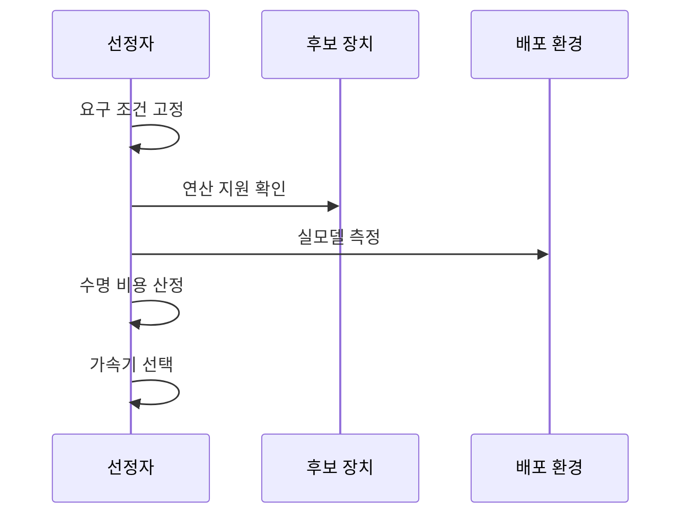

---
sidebar:
  order: 46
  label: "046. AI 가속기 비교 — CPU·GPU·NPU·FPGA·ASIC (AI Accelerator Comparison)"
  badge:
    text: "기출 · 85%"
    variant: note
title: "AI 가속기 비교 — CPU·GPU·NPU·FPGA·ASIC (AI Accelerator Comparison)"
date: "2026-07-27T23:59:59+09:00"
tags:
  - "notes-hardware"
weight: 46
extra:
  question_no: "046"
  source_status: "기출"
  source_history: "126회, 134회, 137회"
  priority: 85
  priority_note: "부하·변경성·전력·물량별 선택 기준"
---

## 미리 알고가기

- **인공지능(Artificial Intelligence, AI)**: ‘에이아이’로 읽고 영문 머리글자를 딴 약어이며, 학습한 모델로 분류·예측하는 기술
- **중앙 처리 장치(Central Processing Unit, CPU)**: ‘씨피유’로 읽고 영문 머리글자를 딴 약어이며, 제어·분기와 비지원 연산 처리
- **그래픽 처리 장치(Graphics Processing Unit, GPU)**: ‘지피유’로 읽고 영문 머리글자를 딴 약어이며, 다수 스레드로 행렬 연산을 병렬 처리
- **신경망 처리 장치(Neural Processing Unit, NPU)**: ‘엔피유’로 읽고 영문 머리글자를 딴 약어이며, 신경망 연산을 전용 배열에서 실행
- **현장 프로그래머블 게이트 배열(Field-Programmable Gate Array, FPGA)**: 논리·배선을 현장에서 재구성
- **주문형 반도체(Application-Specific Integrated Circuit, ASIC)**: 고정 연산 경로를 실리콘에 구현
- **단일 명령 다중 스레드(Single Instruction, Multiple Threads, SIMT)**: 한 명령으로 여러 GPU 스레드를 실행
- **비트스트림(Bitstream)**: FPGA 논리·배선 구성 파일
- **비반복 엔지니어링(Non-Recurring Engineering, NRE)**: 칩 설계·검증·마스크의 초기 비용
- **폴백(Fallback)**: 비지원 연산을 다른 장치에서 실행
- **정점 성능(Peak Performance)**: 모든 연산 자원을 이상적으로 채웠을 때 가능한 이론상 최대 처리량
- **실모델 적합성(Workload Fit)**: 실제 모델의 연산자·정밀도·메모리 이동이 후보 장치에서 얼마나 직접 실행되는지 나타내는 적합도
- **수명주기 비용(Lifecycle Cost)**: 설계·구매·전력·운영·교체까지 전체 사용 기간에 드는 비용
- **컴파일러·런타임(Compiler·Runtime)**: 컴파일러는 모델을 장치 코드로 바꾸고 런타임은 작업 배치·버퍼·장치 전환을 관리함
- **인터커넥트(Interconnect)**: CPU·가속기·메모리 사이에서 텐서와 제어 신호를 전달하는 연결
- **텐서(Tensor)**: 모델 입력·가중치·활성값을 나타내는 다차원 수치 배열
- **커널(Kernel)**: GPU 같은 가속기에서 병렬 실행하는 연산 함수
- **데이터 병렬화(Data Parallelism)**: 같은 모델을 여러 장치에 복제하고 입력 묶음을 나눠 동시에 학습하는 방식
- **온디바이스 추론(On-device Inference)**: 원격 서버 없이 단말 안에서 모델 예측을 실행하는 방식
- **결정적 지연(Deterministic Latency)**: 같은 조건에서 처리 시간이 좁은 범위에 머물러 마감 시간을 예측할 수 있는 성질

## Ⅰ. 개요

- **정의/개념**: 워크로드 특성에 맞춘 **AI 가속기 선택 체계**
- **기존 한계**: 단일 장치는 **유연성·성능·전력·비용** 동시 최적화에 한계

### 쉽게 이해하기 (학습용)

- 짐의 크기·노선·운송량에 맞춰 자전거부터 전용 트럭까지 선택하는 일과 같다

## Ⅱ. 특징

- **지원 연산·메모리 병목**으로 실효 성능 평가
- **지연·처리량·전력**을 목표 부하에서 비교
- **개발비·운영비·물량**으로 수명주기 비용 평가

### 쉽게 이해하기 (학습용)

- 같은 짐과 길에서 속도·연료를 재고 구입비와 운행비까지 합쳐 비교한다

## Ⅲ. 아키텍처 및 구성요소

| 설계 요소 | 설명 |
|:---|:---|
| 컴파일러·런타임 | 연산 그래프를 장치별 커널로 배치 |
| 호스트 CPU | 제어·분기와 폴백 연산 실행 |
| GPU·NPU·FPGA·ASIC | 병렬·전용·재구성 연산 실행 |
| 인터커넥트·가속기 메모리 | 텐서 전송과 가중치·활성값 공급 |

> 요약: 런타임이 CPU·가속기·데이터 경로 배치

### 쉽게 이해하기 (학습용)

- 관제실이 일반 도로와 전용 차선, 환승 통로에 짐을 나눠 보내는 구조다

## Ⅳ. 원리 및 절차 흐름도

| 절차 | 설명 |
|:---|:---|
| 요구 조건 고정 | 모델·정확도·지연·전력 상한 설정 |
| 연산 지원 확인 | 지원 연산과 폴백 경로 확인 |
| 실모델 측정 | 같은 조건의 처리량·지연·전력 측정 |
| 수명 비용 산정 | 개발 기간·NRE·운영비·수량 계산 |
| 가속기 선택 | 측정값과 비용에 맞는 장치 결정 |

> 요약: 지원 연산·실측값·수명 비용으로 장치 결정

### 쉽게 이해하기 (학습용)

- 짐 조건을 먼저 고정하고 후보 차량을 같은 길에서 시험한 뒤 총비용으로 결정한다

## Ⅴ. 종류 및 비교

| AI 가속기 | CPU | GPU | NPU | FPGA | ASIC |
|:---|:---|:---|:---|:---|:---|
| 적용 기준 | 제어·분기·**소규모 부하** | 학습·**대규모 병렬** | 저전력 **단말 추론** | 회로 변경·**결정적 지연** | 안정된 부하·**대량 배포** |
| 핵심 특징 | 소수 **범용 코어** | SIMT **병렬 코어** | 신경망 **전용 배열** | 재구성 **논리·배선** | 고정 **전용 회로** |
| 한계 | 낮은 병렬 **처리량·전력 효율** | 메모리 대역폭·**전력** | 지원 연산·**폴백** | 자원·주파수·**합성 시간** | NRE·개발 기간·**재설계 비용** |

### 쉽게 이해하기 (학습용)

- CPU는 승합차, GPU는 운송대, NPU는 전용차, FPGA는 개조차, ASIC은 양산차에 가깝다

## Ⅵ. 실무 사례

1. 대규모 모델 학습은 **GPU 데이터 병렬화** 적용
2. 스마트 카메라는 **NPU 온디바이스 추론** 적용

### 쉽게 이해하기 (학습용)

- 여러 작업조가 같은 계산을 나눠 큰 모델의 학습 시간을 줄인다
- 카메라 안의 전용 조리대가 영상을 바로 판별해 전력과 전송을 줄인다

## Ⅶ. 결론

- 분기는 **CPU**, 병렬은 **GPU**, 단말은 NPU, 변경은 FPGA, 양산은 ASIC

### 쉽게 이해하기 (학습용)

- 짐의 종류·변경 빈도·연료비·대수를 함께 보고 운송수단을 선택한다
