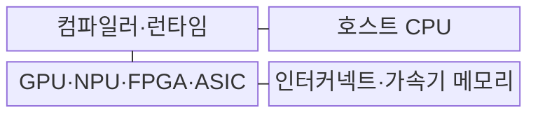
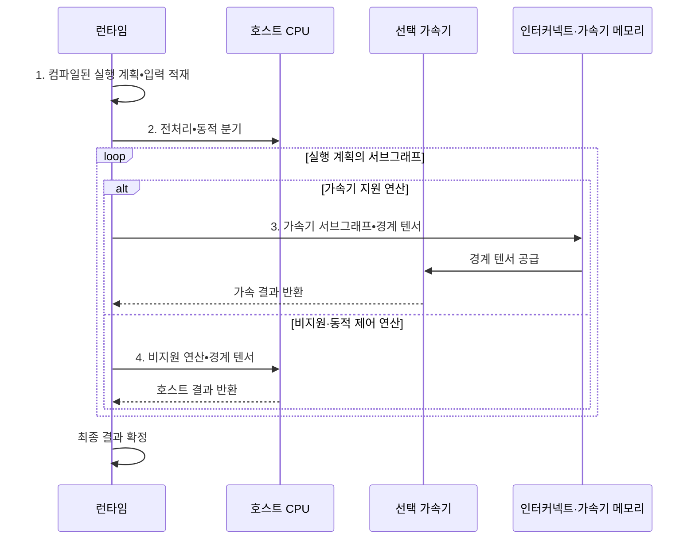

---
sidebar:
  order: 46
  label: "046. AI 가속기 비교: CPU·GPU·NPU·FPGA·ASIC (AI Accelerator Comparison)"
  badge:
    text: "기출 · 85%"
    variant: note
title: "AI 가속기 비교: CPU·GPU·NPU·FPGA·ASIC (AI Accelerator Comparison)"
date: "2026-08-02T20:06:00+09:00"
tags:
  - "notes-hardware"
weight: 46
extra:
  question_no: "046"
  source_status: "기출"
  source_history: "126회, 134회, 137회"
  priority: 85
  priority_note: "부하·변경성·전력·물량별 선택 기준"
---

## Ⅰ. 개요

핵심 용어

- **인공지능 가속기(Artificial Intelligence Accelerator, AI 가속기)**: 신경망의 반복적인 행렬·벡터 연산을 범용 중앙 처리 장치(Central Processing Unit, CPU)보다 효율적으로 처리하는 장치이다.
- **워크로드 특성(Workload Characteristics)**: 연산 종류와 병렬성, 메모리 이동, 변경 주기 및 배포 물량을 포함한 작업의 성질이다.
- **장치 선택 체계(Device-selection Framework)**: 목표 성능과 전력 및 비용 조건을 기준으로 후보 가속기를 비교하는 절차이다.

- 정의/개념: 워크로드 특성에 맞춘 **AI 가속기 선택 체계**
- 배경/필요성: 단일 장치로는 **유연성·성능·전력** 목표 동시 충족 곤란

#### 한줄 요약

- 짐의 크기·노선·운송량에 맞춰 자전거부터 전용 트럭까지 선택하는 일과 같다

## Ⅱ. 특징

핵심 용어

- **실모델 적합성(Workload Fit)**: 실제 모델의 연산자와 정밀도 및 메모리 이동이 후보 장치에서 직접 실행되는 정도이다.
- **실효 성능(Effective Performance)**: 지원 연산과 메모리 병목 및 장치 전환을 포함한 실제 작업에서 측정한 성능이다.
- **수명주기 비용(Lifecycle Cost)**: 설계와 구매부터 전력·운영·교체까지 전체 사용 기간에 드는 비용이다.

- 실효 성능을 결정하는 **지원 연산·메모리 병목**
- 목표 부하에서 비교하는 **지연·처리량·전력**
- 수명주기 비용을 결정하는 **개발비·운영비·물량**

#### 한줄 요약

- 같은 짐과 길에서 속도·연료를 재고 구입비와 운행비까지 합쳐 비교한다

## Ⅲ. 구조 및 구성요소

핵심 용어

- **컴파일러·런타임(Compiler·Runtime)**: 모델을 장치 코드로 변환하고 실행 순서와 버퍼 및 장치 전환을 관리하는 소프트웨어이다.
- **호스트 중앙 처리 장치(Host Central Processing Unit, 호스트 CPU)**: 동적 분기와 전후처리 및 가속기가 지원하지 않는 연산을 실행하는 프로세서이다.
- **인터커넥트(Interconnect)**: CPU와 가속기 및 메모리 사이에서 텐서와 제어 신호를 전달하는 연결이다.
- **그래픽 처리 장치(Graphics Processing Unit, GPU)·신경망 처리 장치(Neural Processing Unit, NPU)·필드 프로그래머블 게이트 배열(Field-Programmable Gate Array, FPGA)·주문형 반도체(Application-Specific Integrated Circuit, ASIC)**: 병렬·전용·재구성·고정 회로 연산을 담당하는 가속기이다.

| 구성요소 | 책임 |
|:---|:---|
| 컴파일러·런타임 | 연산·버퍼·**장치 경계 배치** |
| 호스트 CPU | 분기·전후처리·**폴백 실행** |
| GPU·NPU·FPGA·ASIC | 병렬·전용·**재구성 연산** |
| 인터커넥트·가속기 메모리 | 텐서 **전송·공급** |

#### 한줄 요약

- 런타임이 지원 연산은 가속기에, 동적·비지원 연산은 CPU에 배치한다.

## Ⅳ. 흐름도

핵심 용어

- **실행 계획(Execution Plan)**: 모델 연산의 순서와 각 연산을 실행할 장치를 기록한 런타임 정보이다.
- **가속기 서브그래프(Accelerator Subgraph)**: 선택한 가속기가 연속하여 직접 실행하도록 묶은 지원 연산 구간이다.
- **폴백(Fallback)**: 가속기가 지원하지 않는 연산을 중앙 처리 장치(Central Processing Unit, CPU) 같은 다른 장치에서 대체 실행하는 처리이다.
- **경계 텐서(Boundary Tensor)**: 서로 다른 장치의 실행 구간 사이에서 전달되는 중간 데이터이다.

**동작 원리**

1. **실행 계획•입력**: 코드와 모델 입력
2. **전처리•동적 분기**: CPU 범용 실행 대상
3. **가속기 서브그래프•경계 텐서**: 전용 연산 입력
4. **비지원 연산•경계 텐서**: CPU 폴백 입력

#### 한줄 요약

- 런타임은 지원 연산을 가속기에 배치하고 동적·비지원 연산은 CPU 폴백으로 실행한다

## Ⅴ. 종류 및 비교

핵심 용어

- **중앙 처리 장치(Central Processing Unit, CPU)·그래픽 처리 장치(Graphics Processing Unit, GPU)**: 인공지능(Artificial Intelligence, AI) 작업에서 복잡한 제어에 강한 범용 프로세서와 대규모 데이터 병렬 연산에 강한 가속기이다.
- **신경망 처리 장치(Neural Processing Unit, NPU)·필드 프로그래머블 게이트 배열(Field-Programmable Gate Array, FPGA)**: 저전력 신경망 전용 배열과 제조 후 논리·배선을 재구성할 수 있는 반도체이다.
- **주문형 반도체(Application-Specific Integrated Circuit, ASIC)**: 안정된 특정 연산의 데이터 경로를 고정하여 높은 전력 효율을 얻는 전용 반도체이다.
- **단일 명령 다중 스레드(Single Instruction, Multiple Threads, SIMT)·비반복 엔지니어링(Non-Recurring Engineering, NRE)**: GPU 실행 모델과 ASIC 초기 설계·마스크 제작 비용이다.

| AI 가속기 | CPU | GPU | NPU | FPGA | ASIC |
|:---|:---|:---|:---|:---|:---|
| 적용 기준 | 제어·분기·**소규모 부하** | 학습·**대규모 병렬** | 저전력 **단말 추론** | 회로 변경·**결정적 지연** | 안정된 부하·**대량 배포** |
| 핵심 특징 | 소수 **범용 코어** | SIMT **병렬 코어** | 신경망 **전용 배열** | 재구성 **논리·배선** | 고정 **전용 회로** |
| 한계 | 낮은 병렬 **처리량·전력 효율** | 메모리 대역폭·**전력** | 지원 연산·**폴백** | 자원·주파수·**합성 시간** | 개발 기간·**NRE·재설계 비용** |

#### 한줄 요약

- CPU는 승합차, GPU는 운송대, NPU는 전용차, FPGA는 개조차, ASIC은 양산차에 가깝다

## Ⅵ. 실무 고려사항 및 대책

핵심 용어

- **정점 성능(Peak Performance)**: 모든 연산 자원을 이상적으로 활용할 때 가능한 이론상의 최대 처리량이다.
- **연산자·정밀도 지원 범위(Operator·Precision Coverage)**: 모델의 연산 종류와 수치 형식 가운데 장치가 직접 실행할 수 있는 범위이다.
- **재사용률(Data Reuse Ratio)**: 한 번 전송한 입력이나 가중치를 연산기 가까이에서 반복 사용하는 정도이다.
- **비반복 엔지니어링(Non-Recurring Engineering, NRE)**: 주문형 반도체(Application-Specific Integrated Circuit, ASIC) 설계와 검증 및 마스크 제작에 한 번 발생하는 초기 비용이다.
- **그래픽 처리 장치(Graphics Processing Unit, GPU)**: 데이터 병렬 학습에 사용하는 프로그램 가능 가속기이다.

| 문제 | 대책 | 효과 |
|:---|:---|:---|
| **정점 성능** 만 비교해 실제 부하를 오판 | 동일 조건의 **실모델 적합성** 과 종단 성능 측정 | 공정한 후보 비교 |
| 지원 연산 부족으로 **폴백 증가** | 연산자•정밀도 **지원 범위** 검증 | 실효 **가속 구간** 확인 |
| **인터커넥트•메모리 병목** | 전송량•대역폭•**재사용률** 측정 | 병목 중심 **장치 선택** |
| 도구•NRE•운영비•**종속성 누락** | 전 기간 **수명주기 비용** 산정 | 장기 **경제성** 확보 |

> 대규모 모델 학습은 동일 모델을 여러 GPU에 복제하고 입력 배치를 나누는 데이터 병렬화로 처리량을 높인다.

#### 한줄 요약

- 같은 모델·정확도·배치·전력에서 종단 지연과 수명주기 비용을 측정해 가속기를 선택한다

## Ⅶ. 결론

핵심 용어

- **가변 병렬 학습(Variable Parallel Training)**: 모델과 커널이 바뀌면서도 많은 데이터를 병렬 처리해야 하는 학습 작업이다.
- **저전력 추론(Low-power Inference)**: 제한된 배터리와 열 한도 안에서 모델 예측을 수행하는 실행 조건이다.
- **대량 고정 배포(Fixed High-volume Deployment)**: 기능 변경이 드문 동일 설계를 많은 수량으로 배포하는 조건이다.
- **그래픽 처리 장치(Graphics Processing Unit, GPU)·신경망 처리 장치(Neural Processing Unit, NPU)·주문형 반도체(Application-Specific Integrated Circuit, ASIC)**: 가변 학습·저전력 추론·대량 고정 배포에 각각 적합한 가속기이다.

- **가변 병렬 학습** 은 GPU, **저전력 추론** 은 NPU, 대량 고정은 ASIC

#### 한줄 요약

- 짐의 종류·변경 빈도·연료비·대수를 함께 보고 운송수단을 선택한다
