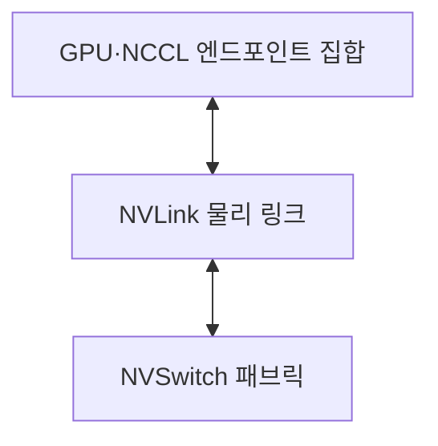
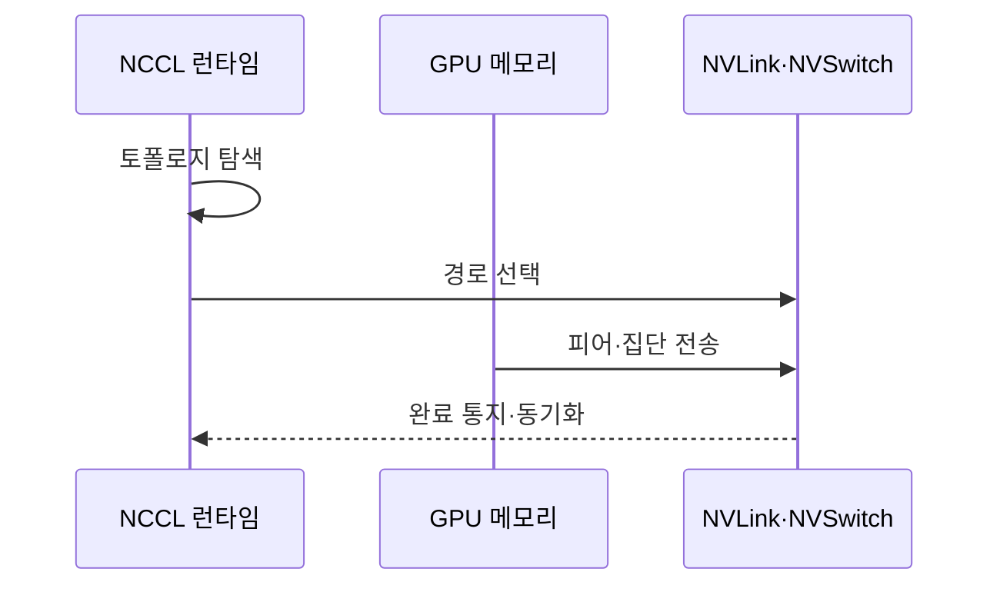

---
sidebar:
  order: 47
  label: "047. NVLink 고속 인터커넥트 (NVLink)"
  badge:
    text: "기출 · 50%"
    variant: note
title: "NVLink 고속 인터커넥트 (NVLink)"
date: "2026-07-27T23:59:59+09:00"
tags:
  - "notes-hardware"
weight: 47
extra:
  question_no: "047"
  source_status: "기출"
  source_history: "138회"
  priority: 50
  priority_note: "다중 GPU 통신 병목과 연결 선택"
---

## 미리 알고가기

- **NVLink**: ‘엔브이링크’로 읽는 NVIDIA의 링크 제품명이며, GPU·CPU 사이 전용 고대역폭 연결
- **NVSwitch**: ‘엔브이스위치’로 읽는 NVIDIA의 스위치 제품명이며, NVLink 엔드포인트를 다대다로 연결
- **주변 구성요소 상호연결 익스프레스(Peripheral Component Interconnect Express, PCIe)**: ‘피시아이 익스프레스’로 읽는 표준 약칭이며, CPU와 범용 장치를 잇는 계층형 연결망
- **엔비디아 집단 통신 라이브러리(NVIDIA Collective Communications Library, NCCL)**: ‘엔씨씨엘’로 읽고 영문 머리글자를 딴 약어이며, GPU 집단 통신 경로·연산 실행
- **피어 메모리 접근(Peer Memory Access)**: 한 GPU가 다른 GPU 메모리에 직접 접근
- **집단 통신(Collective Communication)**: 여러 GPU의 데이터 교환·집계
- **전체 축소(All-Reduce)**: 각 GPU 값을 집계해 모든 GPU에 배포
- **그래픽 처리 장치(Graphics Processing Unit, GPU)**: 모델의 병렬 연산과 텐서 저장을 맡는 프로세서
- **중앙 처리 장치(Central Processing Unit, CPU)**: 작업을 제어하며 PCIe나 NVLink로 GPU와 통신하는 호스트 프로세서
- **모델 병렬화(Model Parallelism)**: 한 모델의 층·텐서를 여러 GPU에 나눠 실행하는 방식
- **엔드포인트(Endpoint)**: 링크에 연결되어 데이터를 송수신하는 GPU·CPU의 통신 종단
- **홉(Hop)**: 데이터가 목적지까지 거치는 링크나 스위치 한 구간
- **토폴로지(Topology)**: GPU·링크·스위치가 서로 연결된 물리적 형태
- **패브릭(Fabric)**: 여러 엔드포인트와 스위치를 묶어 다수 경로를 제공하는 연결망
- **텐서(Tensor)**: 모델 입력·가중치·기울기를 나타내는 다차원 수치 배열
- **런타임(Runtime)**: 연결 상태를 탐색하고 집단 통신 경로·동기화를 관리하는 실행 소프트웨어
- **DGX**: 여러 NVIDIA GPU와 NVLink·NVSwitch를 통합해 인공지능 학습에 쓰는 서버 시스템 제품명

## Ⅰ. 개요

- 정의/개념: NVIDIA 프로세서 간 **전용 고대역폭 인터커넥트**
- 기존 한계: PCIe 공유 경로는 **GPU 간 집단 통신 대역폭**에 한계

### 쉽게 이해하기 (학습용)

- 두 창고 사이에 전용 다리를 놓아 공용 도로를 거치지 않고 짐을 옮기는 것과 같다

## Ⅱ. 특징

- **다중 링크 결합**으로 GPU 쌍의 대역폭 확장
- **NVSwitch 패브릭**으로 다수 GPU의 다대다 연결
- **토폴로지·통신 패턴**이 실제 집단 통신 성능 결정

### 쉽게 이해하기 (학습용)

- 여러 차선을 묶어 짐을 보내고 옆 창고 선반을 직접 쓰는 모습이다

## Ⅲ. 아키텍처 및 구성요소

| 설계 요소 | 설명 |
|:---|:---|
| GPU·NCCL 엔드포인트 집합 | 텐서 저장과 집단 통신 경로 구성 |
| NVLink 물리 링크 | 엔드포인트 사이 데이터 직접 전송 |
| NVSwitch 패브릭 | 여러 링크를 다대다 경로로 연결 |

> 요약: GPU 엔드포인트를 NVLink·NVSwitch로 연결

### 쉽게 이해하기 (학습용)

- 창고·전용 다리·교차로가 이어지고 내비게이션이 경로를 선택한다

## Ⅳ. 원리 및 절차 흐름도

| 절차 | 설명 |
|:---|:---|
| 토폴로지 탐색 | GPU·링크·스위치 연결 상태 확인 |
| 경로 선택 | 통신 패턴에 맞는 직접·스위치 경로 결정 |
| 피어·집단 전송 | 데이터 조각을 NVLink 경로로 교환 |
| 완료 통지·동기화 | 전송 완료 후 버퍼 재사용 허용 |

> 요약: NCCL이 토폴로지에 맞춰 전송·동기화

### 쉽게 이해하기 (학습용)

- 내비게이션이 연결 지도를 읽고 길을 선택한 뒤 짐의 도착을 확인한다

## Ⅴ. 종류 및 비교

| GPU 연결 방식 | 직접 NVLink | NVSwitch | PCIe |
|:---|:---|:---|:---|
| 적용 기준 | 소수 GPU의 **빈번한 피어 통신** | 다수 GPU의 **집단 통신** | 범용 장치·**호스트 연결** |
| 핵심 특징 | GPU 간 **점대점 링크** | 다대다 **스위치 패브릭** | 범용 **계층형 패브릭** |
| 한계 | 링크 수·토폴로지·**세대 호환** | 시스템 비용·**전력·구성 범위** | 공유 대역폭·**스위치 홉** |

### 쉽게 이해하기 (학습용)

- NVLink는 직통 다리, NVSwitch는 전용 교차로, PCIe는 범용 도로에 가깝다

## Ⅵ. 실무 사례

1. DGX 학습은 **NCCL All-Reduce**를 NVLink에 배치

### 쉽게 이해하기 (학습용)

- 여러 작업자의 값을 전용 통로에서 합쳐 모두에게 다시 나눠 준다

## Ⅶ. 결론

- GPU 통신을 위해 피어 수·대역폭을 검토하여 **NVLink** 활용

### 쉽게 이해하기 (학습용)

- 두 창고면 직통 다리, 여러 창고면 전용 교차로를 둔다
