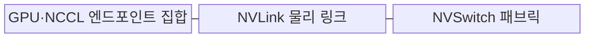
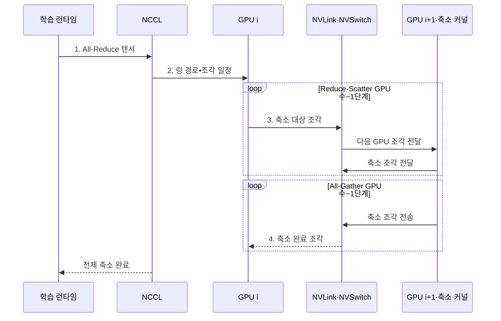

---
sidebar:
  order: 47
  label: "047. NVLink 고속 인터커넥트 (NVLink)"
  badge:
    text: "기출 · 50%"
    variant: note
title: "NVLink 고속 인터커넥트 (NVLink)"
date: "2026-07-31T10:28:00+09:00"
tags:
  - "notes-hardware"
weight: 47
extra:
  question_no: "047"
  source_status: "기출"
  source_history: "138회"
  priority: 50
  priority_note: "다중 GPU 통신 병목과 연결 선택"
---

## 미리 알고가기

- **NVLink**: GPU·CPU 사이에 고대역폭·저지연 연결을 제공하는 NVIDIA의 전용 인터커넥트
- **NVSwitch**: 여러 NVLink 엔드포인트를 다대다로 연결하는 NVIDIA의 전용 스위치
- **주변 구성요소 상호연결 익스프레스(Peripheral Component Interconnect Express, PCIe)**: CPU와 범용 주변장치를 계층형 점대점 링크로 연결하는 표준 인터커넥트
- **엔비디아 집단 통신 라이브러리(NVIDIA Collective Communications Library, NCCL)**: GPU 간 집단 통신의 경로를 선택하고 전송 연산을 실행하는 라이브러리
- **피어 메모리 접근(Peer Memory Access)**: 한 GPU가 다른 GPU 메모리에 직접 접근
- **집단 통신(Collective Communication)**: 여러 GPU의 데이터 교환·집계
- **전체 축소(All-Reduce)**: 각 GPU 값을 집계해 모든 GPU에 배포
- **그래픽 처리 장치(Graphics Processing Unit, GPU)**: 모델의 병렬 연산과 텐서 저장을 맡는 프로세서
- **중앙 처리 장치(Central Processing Unit, CPU)**: 작업을 제어하며 PCIe나 NVLink로 GPU와 통신하는 호스트 프로세서
- **모델 병렬화(Model Parallelism)**: 한 모델의 층·텐서를 여러 GPU에 나눠 실행하는 방식
- **엔드포인트(Endpoint)**: 링크에 연결되어 데이터를 송수신하는 GPU·CPU의 통신 종단
- **홉(Hop)**: 데이터가 목적지까지 거치는 링크나 스위치 한 구간
- **토폴로지(Topology)**: GPU·링크·스위치가 서로 연결된 물리적 형태
- **패브릭(Fabric)**: 여러 엔드포인트와 스위치를 묶어 다수 경로를 제공하는 연결망
- **텐서(Tensor)**: 모델 입력·가중치·기울기를 나타내는 다차원 수치 배열
- **런타임(Runtime)**: 연결 상태를 탐색하고 집단 통신 경로·동기화를 관리하는 실행 소프트웨어
- **DGX**: 여러 NVIDIA GPU와 NVLink·NVSwitch를 통합해 인공지능 학습에 쓰는 서버 시스템 제품명
- **축소-분산·전체-수집(Reduce-Scatter·All-Gather)**: 각 GPU의 값을 합산하면서 결과 조각을 나누어 소유하게 하는 단계와 그 조각을 모든 GPU에 다시 배포하는 단계
- **통신 조각(Communication Chunk)**: 큰 텐서를 링크·집단 통신 파이프라인에 맞게 나눈 전송 단위

> **키워드:** NVLink 고속 인터커넥트 (NVLink)

## Ⅰ. 개요

- 정의/개념: NVIDIA 프로세서 간 **고속 연결망**
- 배경/필요성: PCIe 경유는 GPU 집단 통신의 **대역폭·홉 수 제약**

### 쉽게 이해하기 (학습용)

- GPU 창고 사이에 전용 다리를 놓아 PCIe 교차로를 거치지 않고 상자를 바로 옮기는 장면이다.

## Ⅱ. 특징

- **다중 링크 결합**으로 GPU 쌍의 대역폭 확장
- **NVSwitch 패브릭**으로 다수 GPU의 다대다 연결
- **토폴로지·통신 패턴**에 따라 달라지는 집단 통신 처리량

### 쉽게 이해하기 (학습용)

- 여러 전용 차선을 묶어 화물량을 늘리고 먼 GPU 창고의 선반까지 직접 여는 장면이다.

## Ⅲ. 구조 및 구성요소

| 구성요소 | 책임 |
|:---|:---|
| GPU·NCCL 엔드포인트 집합 | 집단 통신 **요청·경로 구성** |
| NVLink 물리 링크 | 피어 **직접 데이터 전송** |
| NVSwitch 패브릭 | 다대다 **경로 연결·분기** |

### 쉽게 이해하기 (학습용)

- NCCL이 경로를 정하면 NVLink와 NVSwitch가 GPU 사이의 데이터를 직접 전달한다.

## Ⅳ. 흐름도

**동작 원리**

1. **All-Reduce 텐서**: 모든 GPU의 합산•배포 대상
2. **링 경로•조각 일정**: 토폴로지별 경로와 크기
3. **축소 대상 조각**: 피어 전송과 로컬 합산 입력
4. **축소 완료 조각**: 모든 GPU에 배포할 결과

### 쉽게 이해하기 (학습용)

- NCCL은 토폴로지에 맞춰 조각을 순환 합산한 뒤 완성 조각을 모든 GPU에 배포한다

## Ⅴ. 종류 및 비교

| GPU 연결 방식 | 직접 NVLink | NVSwitch | PCIe |
|:---|:---|:---|:---|
| 적용 기준 | 소수 GPU의 **빈번한 피어 통신** | 다수 GPU의 **집단 통신** | 범용 장치·**호스트 연결** |
| 핵심 특징 | GPU 간 **점대점 링크** | 다대다 **스위치 패브릭** | 범용 **계층형 패브릭** |
| 한계 | 링크 수·토폴로지·**세대 호환** | 시스템 비용·**전력·구성 범위** | 공유 대역폭·**스위치 홉** |

### 쉽게 이해하기 (학습용)

- NVLink는 직통 다리, NVSwitch는 전용 교차로, PCIe는 범용 도로에 가깝다

## Ⅵ. 실무 고려사항 및 대책

| 고려사항 | 대책 | 효과 |
|:---|:---|:---|
| GPU 배치와 **물리 토폴로지 불일치** | 링크•홉 기반 **프로세스•샤드 배치** | **원거리 경로** 감소 |
| All-Reduce의 **느린 링크 동기화** | 통신 조각•알고리즘과 **부하 균형** 조정 | **꼬리 지연** 완화 |
| 링크 오류•세대 차이로 **대역폭 축소** | 링크 감시와 **호환 구성 검증** | **장애 조기 식별** |
| 버퍼 재사용•**연산 유휴** | 이벤트 수명 보장과 **통신•연산 중첩** | **정합성•가동률** 향상 |

> DGX 학습은 NCCL All-Reduce를 NVLink·NVSwitch에 배치해 CPU 호스트 메모리·PCIe 경로를 거치지 않고 기울기를 집계한다.

### 쉽게 이해하기 (학습용)

- GPU 배치를 NVLink·NVSwitch 경로에 맞추고 통신 조각을 조정해 All-Reduce의 느린 구간을 줄인다

## Ⅶ. 결론

- 소수 GPU는 **NVLink**, 다수 GPU 전대역 연결은 **NVSwitch** 선택

### 쉽게 이해하기 (학습용)

- 소수 GPU는 NVLink로 직접 연결하고 다수 GPU의 전대역 연결에는 NVSwitch를 적용한다
