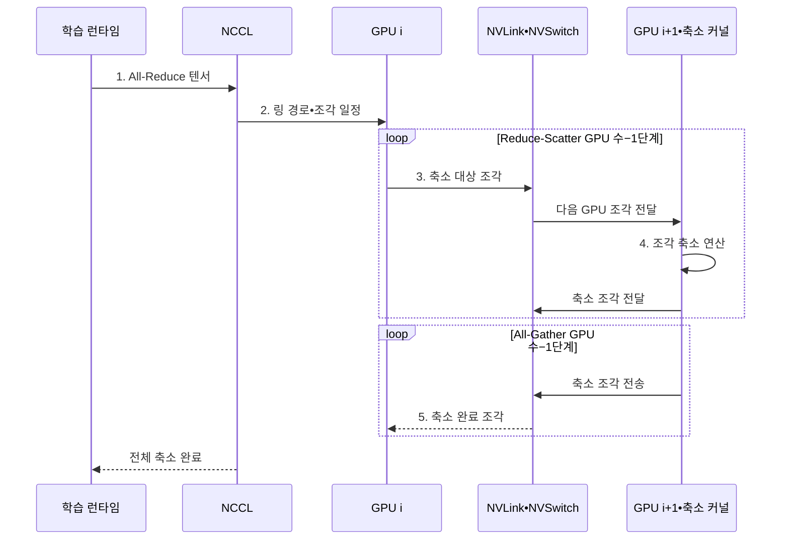

---
sidebar:
  order: 47
  label: "047. NVLink 고속 인터커넥트 (NVLink)"
  badge:
    text: "기출 • 50%"
    variant: note
title: "NVLink 고속 인터커넥트 (NVLink)"
date: "2026-08-05T00:48:09+09:00"
tags:
  - "notes-hardware"
weight: 47
extra:
  question_no: "047"
  source_status: "기출"
  source_history: "138회"
  priority: 50
  priority_note: "다중 GPU 통신 병목과 연결 선택"
---

## Ⅰ. 개요

<details><summary>핵심 용어</summary>

- **엔비디아 NVLink(NVIDIA NVLink, NVLink)**: 엔비디아 그래픽 처리 장치(Graphics Processing Unit, GPU)와 중앙 처리 장치(Central Processing Unit, CPU) 사이에 고대역폭•저지연 데이터 전송을 제공하는 전용 인터커넥트이다.
- **인터커넥트(Interconnect)**: 프로세서와 메모리 및 장치 사이에서 데이터와 제어 신호를 전달하는 연결 체계이다.
- **홉(Hop)**: 데이터가 출발지에서 목적지까지 이동하며 거치는 하나의 링크 또는 스위치 구간이다.

</details>

- 정의/개념: NVIDIA 프로세서 간 **고속 연결망**
- 배경/필요성: PCIe 경유는 GPU 집단 통신의 **대역폭•홉 수 제약**

#### 한줄 요약

- GPU 창고 사이에 전용 다리를 놓아 PCIe 교차로를 거치지 않고 상자를 바로 옮기는 장면이다.

## Ⅱ. 특징

<details><summary>핵심 용어</summary>

- **링크 결합(Link Aggregation)**: 동일한 그래픽 처리 장치(Graphics Processing Unit, GPU) 쌍 사이의 여러 물리 링크를 함께 사용하여 총대역폭을 높이는 방식이다.
- **NVSwitch**: 여러 NVLink 엔드포인트를 다대다 경로로 연결하는 NVIDIA의 전용 스위치이다.
- **토폴로지(Topology)**: GPU와 링크 및 스위치가 서로 연결된 물리적 형태이다.
- **집단 통신(Collective Communication)**: 여러 GPU가 각자의 데이터를 합산•분배•교환하는 다자간 통신이다.

</details>

- GPU 쌍의 대역폭을 확장하는 **다중 링크 결합**
- 다수 GPU를 다대다로 연결하는 **NVSwitch 패브릭**
- 집단 통신 처리량을 좌우하는 **토폴로지•통신 패턴**

#### 한줄 요약

- 여러 전용 차선을 묶어 화물량을 늘리고 먼 GPU 창고의 선반까지 직접 여는 장면이다.

## Ⅲ. 구조 및 구성요소

<details><summary>핵심 용어</summary>

- **엔비디아 집단 통신 라이브러리(NVIDIA Collective Communications Library, NCCL)**: 그래픽 처리 장치(Graphics Processing Unit, GPU) 토폴로지에 맞춰 집단 통신 경로와 전송 연산을 실행하는 라이브러리이다.
- **엔드포인트(Endpoint)**: 링크에 연결되어 데이터를 송수신하는 GPU나 CPU의 통신 종단이다.
- **패브릭(Fabric)**: 여러 엔드포인트와 스위치를 묶어 다수의 통신 경로를 제공하는 연결망이다.

</details>

```text
[GPU•NCCL 엔드포인트 집합] -- [NVLink 물리 링크] -- [NVSwitch 패브릭]
```

선의 의미: 통신 엔드포인트가 NVLink 물리 링크를 통해 NVSwitch의 다대다 패브릭에 결합된 정적 연결망이다.

| 구성요소 | 책임 |
|:---|:---|
| GPU•NCCL 엔드포인트 집합 | 집단 통신 **요청•경로 구성** |
| NVLink 물리 링크 | 피어 **직접 데이터 전송** |
| NVSwitch 패브릭 | 다대다 **경로 연결•분기** |

#### 한줄 요약

- NCCL이 경로를 정하면 NVLink와 NVSwitch가 GPU 사이의 데이터를 직접 전달한다.

## Ⅳ. 흐름도

<details><summary>핵심 용어</summary>

- **전체 축소(All-Reduce)**: 각 그래픽 처리 장치(Graphics Processing Unit, GPU)의 값을 하나로 집계한 뒤 완성된 결과를 모든 GPU에 배포하는 집단 통신이다.
- **축소-분산(Reduce-Scatter)**: 값을 합산하면서 최종 결과의 서로 다른 조각을 각 GPU가 나누어 갖는 단계이다.
- **전체-수집(All-Gather)**: 각 GPU가 가진 결과 조각을 서로 교환하여 모든 GPU가 전체 결과를 얻는 단계이다.
- **통신 조각(Communication Chunk)**: 큰 텐서를 집단 통신 파이프라인과 링크 특성에 맞게 나눈 전송 단위이다.

</details>



**동작 원리**

1. **All-Reduce 텐서**: 모든 GPU의 합산•배포 대상
2. **링 경로•조각 일정**: 토폴로지별 경로와 크기
3. **축소 대상 조각**: 피어 전송과 로컬 합산 입력
4. **조각 축소 연산**: 수신 조각과 로컬 조각을 합산
5. **축소 완료 조각**: 모든 GPU에 배포할 결과

#### 한줄 요약

- NCCL은 토폴로지에 맞춰 조각을 순환 합산한 뒤 완성 조각을 모든 GPU에 배포한다

## Ⅴ. 종류 및 비교

<details><summary>핵심 용어</summary>

- **직접 NVLink(Direct NVLink)**: 소수 GPU를 점대점 링크로 직접 연결하여 피어 통신을 제공하는 구성이다.
- **NVSwitch 패브릭(NVSwitch Fabric)**: 스위치를 통해 다수 GPU에 다대다 NVLink 경로를 제공하는 구성이다.
- **주변 구성요소 상호연결 익스프레스(PCI Express, PCIe)**: 중앙 처리 장치(Central Processing Unit, CPU)와 범용 주변장치를 계층형 점대점 링크로 연결하는 표준 인터커넥트이다.

</details>

| GPU 연결 방식 | 직접 NVLink | NVSwitch | PCIe |
|:---|:---|:---|:---|
| 적용 기준 | 소수 GPU의 **빈번한 피어 통신** | 다수 GPU의 **집단 통신** | 범용 장치•**호스트 연결** |
| 핵심 특징 | GPU 간 **점대점 링크** | 다대다 **스위치 패브릭** | 범용 **계층형 패브릭** |
| 한계 | 링크 수•토폴로지•**세대 호환** | 시스템 비용•**전력•구성 범위** | 공유 대역폭•**스위치 홉** |

#### 한줄 요약

- NVLink는 직통 다리, NVSwitch는 전용 교차로, PCIe는 범용 도로에 가깝다

## Ⅵ. 실무 고려사항 및 대책

<details><summary>핵심 용어</summary>

- **프로세스•샤드 배치(Process•Shard Placement)**: 통신량이 많은 작업과 모델 조각을 가까운 그래픽 처리 장치(Graphics Processing Unit, GPU)와 링크에 배치하는 작업이다.
- **꼬리 지연(Tail Latency)**: 전체 통신 완료를 결정하는 가장 늦은 조각이나 경로의 지연이다.
- **통신•연산 중첩(Communication-computation Overlap)**: GPU 계산과 데이터 교환을 동시에 진행하여 통신 대기를 숨기는 기법이다.
- **링크 감시(Link Monitoring)**: 링크 오류와 협상 속도 및 대역폭 저하를 지속적으로 측정하는 운영 활동이다.
- **전체 축소(All-Reduce)**: 여러 그래픽 처리 장치(Graphics Processing Unit, GPU)의 값을 합산하고 결과를 모두에게 배포하는 집단 통신이다.
- **엔비디아 집단 통신 라이브러리(NVIDIA Collective Communications Library, NCCL)•엔비디아 DGX(NVIDIA DGX, DGX)**: GPU 집단 통신 라이브러리와 다중 GPU 시스템이다.
- **중앙 처리 장치(Central Processing Unit, CPU)•피시아이 익스프레스(Peripheral Component Interconnect Express, PCIe)**: 호스트 프로세서와 범용 장치 연결 경로이다.

</details>

| 문제 | 대책 | 효과 |
|:---|:---|:---|
| GPU 배치와 **물리 토폴로지 불일치** | 링크•홉 기반 **프로세스•샤드 배치** | **원거리 경로** 감소 |
| All-Reduce의 **느린 링크 동기화** | 통신 조각•알고리즘과 **부하 균형** 조정 | **꼬리 지연** 완화 |
| 링크 오류•세대 차이로 **대역폭 축소** | 링크 감시와 **호환 구성 검증** | **장애 조기 식별** |
| 버퍼 재사용•**연산 유휴** | 이벤트 수명 보장과 **통신•연산 중첩** | **정합성•가동률** 향상 |

> DGX 학습은 NCCL All-Reduce를 NVLink•NVSwitch에 배치해 CPU 호스트 메모리•PCIe 경로를 거치지 않고 기울기를 집계한다.

#### 한줄 요약

- GPU 배치를 NVLink•NVSwitch 경로에 맞추고 통신 조각을 조정해 All-Reduce의 느린 구간을 줄인다

## Ⅶ. 결론

<details><summary>핵심 용어</summary>

- **피어 통신(Peer Communication)**: 한 그래픽 처리 장치(Graphics Processing Unit, GPU)가 호스트 메모리를 경유하지 않고 다른 GPU와 직접 데이터를 교환하는 통신이다.
- **전대역 연결(Full-bandwidth Connectivity)**: 다수 엔드포인트 쌍이 동시에 통신해도 충분한 경로와 대역폭을 제공하는 연결 조건이다.
- **GPU 규모(GPU Scale)**: 하나의 시스템에서 함께 연결하고 집단 통신에 참여시키는 GPU의 수이다.

</details>

- 소수 GPU는 **NVLink**, 다수 GPU 전대역 연결은 **NVSwitch** 선택

#### 한줄 요약

- 소수 GPU는 NVLink로 직접 연결하고 다수 GPU의 전대역 연결에는 NVSwitch를 적용한다
