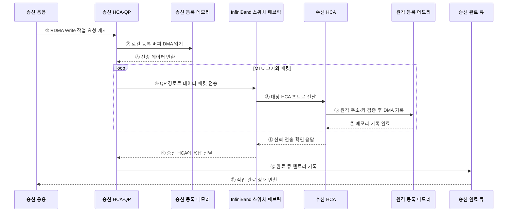

---
sidebar:
  order: 48
  label: "048. InfiniBand (InfiniBand)"
  badge:
    text: "기출 · 50%"
    variant: note
title: "InfiniBand (InfiniBand)"
date: "2026-07-28T12:59:05+09:00"
tags:
  - "notes-hardware"
weight: 48
extra:
  question_no: "048"
  source_status: "기출"
  source_history: "138회"
  priority: 50
  priority_note: "RDMA·집단 통신의 단일 기출 핵심"
---

## 미리 알고가기

- **InfiniBand**: RDMA와 저지연 스위칭을 제공하는 고성능 컴퓨팅용 네트워크 패브릭
- **원격 직접 메모리 접근(Remote Direct Memory Access, RDMA)**: 사전 등록한 원격 메모리에 상대 CPU의 데이터 복사 없이 직접 접근하는 통신 방식
- **호스트 채널 어댑터(Host Channel Adapter, HCA)**: 호스트 메모리와 InfiniBand 패브릭 사이에서 RDMA 전송을 처리하는 어댑터
- **메모리 등록(Memory Registration)**: 장치 접근용 키와 주소 범위를 HCA에 등록
- **큐 페어(Queue Pair, QP)**: 송신·수신 작업 큐로 구성된 통신 종단점
- **완료 큐(Completion Queue, CQ)**: 작업 완료 상태를 응용에 전달하는 큐
- **서브넷 관리자(Subnet Manager)**: 주소·경로·파티션·포트 상태를 설정하는 관리자
- **크레딧 기반 흐름 제어(Credit-Based Flow Control)**: 수신 버퍼 여유만큼 전송해 버퍼 초과 손실을 방지하는 제어
- **메시지 전달 인터페이스(Message Passing Interface, MPI)**: 분산 노드의 메시지·집단 통신 프로그래밍 표준
- **중앙 처리 장치(Central Processing Unit, CPU)**: 응용과 운영체제를 실행하며 RDMA가 데이터 복사 개입을 줄이는 호스트 프로세서
- **직접 메모리 접근(Direct Memory Access, DMA)**: HCA가 CPU 복사 없이 호스트 메모리와 장치 사이 데이터를 전송하는 방식
- **이더넷 기반 통합 원격 직접 메모리 접근(RDMA over Converged Ethernet, RoCE)**: 이더넷에서 RDMA Verbs와 네트워크 어댑터로 원격 메모리에 접근하는 방식
- **전송 제어 프로토콜/인터넷 프로토콜(Transmission Control Protocol/Internet Protocol, TCP/IP)**: 신뢰 전송과 주소·라우팅을 제공하는 범용 인터넷 프로토콜 모음
- **원격 직접 메모리 접근 네트워크 인터페이스 카드(RDMA Network Interface Card, RNIC)**: 이더넷에서 RDMA 작업과 메모리 접근을 처리하는 어댑터
- **RDMA Verbs**: 메모리 등록·큐 생성·작업 게시·완료 회수를 응용에 제공하는 표준 동작 인터페이스
- **고성능 컴퓨팅(High-Performance Computing, HPC)**: 여러 계산 노드로 대규모 과학·공학 연산을 병렬 처리하는 컴퓨팅
- **인공지능(Artificial Intelligence, AI)**: 학습한 모델로 분류·예측하며 분산 학습에서 GPU 집단 통신을 사용하는 기술
- **우선순위 기반 흐름 제어(Priority-based Flow Control, PFC)**: 특정 이더넷 우선순위 트래픽의 손실을 줄이도록 송신을 일시 정지하는 제어
- **명시적 혼잡 알림(Explicit Congestion Notification, ECN)**: 스위치가 패킷 표시로 송신 측에 혼잡을 알려 전송률을 낮추게 하는 기능
- **GPUDirect RDMA**: NVIDIA GPU 메모리와 원격 장치가 호스트 CPU 복사 없이 직접 데이터를 교환하는 기술명
- **핫스폿(Hotspot)**: 통신 경로·스위치 포트에 트래픽이 몰려 지연과 대기가 커지는 병목 지점
- **작업 요청(Work Request)**: 응용이 QP에 게시하는 송수신·RDMA 읽기·쓰기 명령으로 로컬 버퍼, 원격 주소·키와 길이를 포함하는 항목

## Ⅰ. 개요

- 정의/개념: HCA·스위치로 **RDMA 저지연 전용망** 구성
- 기존 한계: 커널·CPU 경유 통신은 **복사·문맥 전환 지연** 발생

### 쉽게 이해하기 (학습용)

- 전용 배달원이 창구를 거치지 않고 등록된 우편함 사이를 오간다

## Ⅱ. 특징

- **등록 메모리·HCA**로 원격 CPU·커널 경로 우회
- **크레딧 흐름 제어**로 무손실 링크 전송
- **혼잡·토폴로지**가 집단 통신 지연 결정

### 쉽게 이해하기 (학습용)

- 직행 배송은 빠르지만 전용 도로와 관제센터를 따로 운영해야 한다

## Ⅲ. 아키텍처 및 구성요소

### 도표안 A. InfiniBand RDMA 패브릭 정적 구조

| 설계 요소 | 입력·상태 | 역할 |
|:---|:---|:---|
| HCA·QP 엔드포인트 집합 | 등록 버퍼·작업 요청·QP 상태 | DMA 송수신·완료 처리 |
| 스위치 패브릭 | 패킷·크레딧·포트 상태 | 전달·흐름 제어·경로 선택 |
| 서브넷 관리자 | 토폴로지·파티션·포트 정보 | 주소·경로·접근 경계 설정 |

> 요약: 관리자가 경로를 정하고 HCA가 전송한다

### 도표안 B. RDMA Write 전송·완료 시퀀스

### 동작 원리

1. **① RDMA Write 작업 요청 게시**: 송신 응용은 사전 등록한 로컬 버퍼, 원격 주소·키, 길이를 QP의 송신 큐에 게시한다.
2. **② 로컬 등록 버퍼 DMA 읽기**: 송신 HCA는 등록 키와 범위를 확인하고 CPU 복사 없이 호스트 메모리의 원본을 읽는다.
3. **③ 전송 데이터 반환**: 등록 메모리는 HCA의 DMA 읽기에 전송 데이터를 제공한다.
4. **④ QP 경로로 데이터 패킷 전송**: HCA는 데이터를 패브릭의 최대 전송 단위에 맞게 나누고 QP의 경로·순서 정보와 함께 보낸다.
5. **⑤ 대상 HCA 포트로 전달**: 스위치 패브릭은 서브넷 관리자가 설정한 경로와 포트 크레딧에 따라 패킷을 수신 HCA로 전달한다.
6. **⑥ 원격 주소·키 검증 후 DMA 기록**: 수신 HCA는 원격 키가 허용한 주소·권한·길이를 확인하고 대상 메모리에 직접 쓴다.
7. **⑦ 메모리 기록 완료**: 원격 등록 메모리는 해당 패킷 데이터의 DMA 기록이 끝났음을 수신 HCA에 알린다.
8. **⑧ 신뢰 전송 확인 응답**: 요청 범위의 기록이 완료되면 수신 HCA는 패브릭을 통해 송신 측으로 확인 응답을 보낸다.
9. **⑨ 송신 HCA에 응답 전달**: 스위치는 확인 응답을 원래 QP가 있는 송신 HCA로 라우팅한다.
10. **⑩ 완료 큐 엔트리 기록**: 송신 HCA는 작업 성공·오류와 전송 길이를 완료 큐에 기록한다.
11. **⑪ 작업 완료 상태 반환**: 응용은 CQ 폴링 또는 이벤트로 완료를 회수하고 로컬 버퍼 수명을 안전하게 종료한다.

### 쉽게 이해하기 (학습용)

- 양쪽 배달원과 전용 도로를 관제센터가 주소·경로로 묶는다

## Ⅳ. 종류 및 비교

| 원격 통신 방식 | InfiniBand | RoCE | TCP/IP |
|:---|:---|:---|:---|
| 적용 기준 | HPC·AI **집단 통신** | 기존 이더넷 기반 **RDMA** | 범용 연결·**호환성** |
| 핵심 특징 | 전용 스위치·**HCA·Verbs** | 이더넷·**RNIC·Verbs** | 이더넷·IP·**커널 소켓** |
| 한계 | 전용 장비·**운영 비용** | PFC·ECN **조정 복잡도** | CPU·커널 **경로 오버헤드** |

> 요약: 전용망은 InfiniBand, 이더넷은 RoCE가 적합하다

### 쉽게 이해하기 (학습용)

- 전용 도로는 InfiniBand, 기존 도로의 직행 배송은 RoCE가 맞다

## Ⅴ. 실무 고려사항 및 대응 방안

| 운영 위험 | 대응 | 기대 효과 |
|:---|:---|:---|
| 등록 키·버퍼 수명 오류로 잘못된 원격 접근 | 최소 범위 등록과 키 폐기·소유권 동기화 검증 | 메모리 보호 강화 |
| 링크·원격 장애로 QP가 오류 상태에 고착 | 타임아웃·오류 분류와 QP·경로 재생성 절차 적용 | 통신 복구성 향상 |
| 집단 통신 경로가 특정 스위치·포트에 집중 | 토폴로지 인지 배치와 다중 경로·라우팅 조정 | 핫스폿 완화 |
| 크레딧 부족이 상류까지 전파되어 정체 | 포트 크레딧·대기 시간·집단 통신 지연 공동 감시 | 혼잡 원인 식별 |

> 분산 AI 학습은 GPUDirect RDMA로 GPU 메모리와 원격 HCA가 직접 데이터를 교환해 CPU 복사와 집단 통신 대기를 줄인다.

### 쉽게 이해하기 (학습용)

- 작업 큐에 배송 요청을 놓으면 HCA가 직접 옮기고 완료표나 오류를 남긴다.
- GPUDirect RDMA로 GPU 메모리 사이를 직접 전송하여 CPU 복사와 학습 통신 대기를 줄인다

## Ⅵ. 결론

- 저지연 통신을 위해 병목·망 비용을 검토하여 **InfiniBand** 활용

### 쉽게 이해하기 (학습용)

- 배송이 공장 계산보다 오래 걸릴 때 전용 배달망이 이롭다
