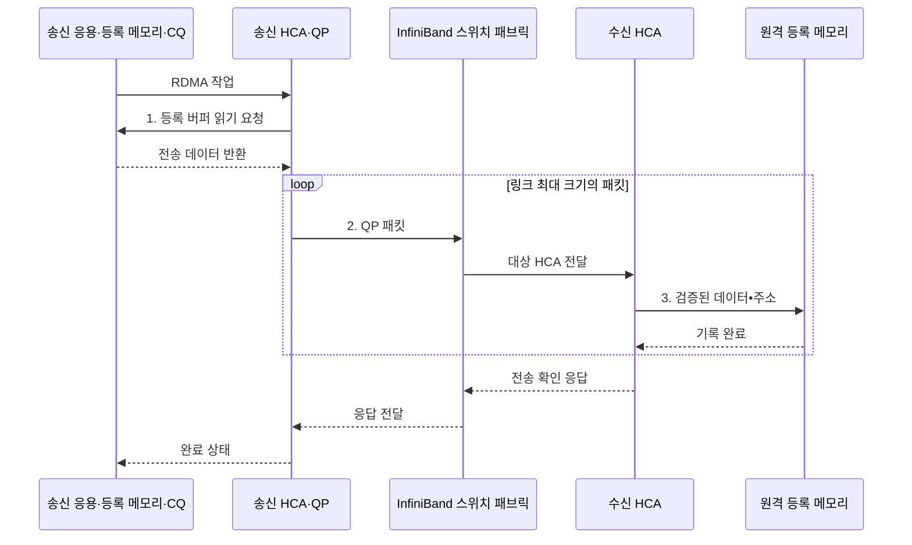

---
sidebar:
  order: 48
  label: "048. InfiniBand (InfiniBand)"
  badge:
    text: "기출 · 50%"
    variant: note
title: "InfiniBand (InfiniBand)"
date: "2026-08-02T11:08:00+09:00"
tags:
  - "notes-hardware"
weight: 48
extra:
  question_no: "048"
  source_status: "기출"
  source_history: "138회"
  priority: 50
  priority_note: "RDMA·집단 통신의 단일 기출 핵심"
---

## Ⅰ. 개요

핵심 용어

- **InfiniBand**: RDMA와 저지연 스위칭을 제공하는 고성능 컴퓨팅용 네트워크 패브릭이다.
- **원격 직접 메모리 접근(Remote Direct Memory Access, RDMA)**: 사전 등록한 원격 메모리에 상대 CPU의 복사 개입 없이 직접 접근하는 통신 방식이다.
- **커널 우회(Kernel Bypass)**: 통신 데이터 경로에서 운영체제 커널의 반복적인 처리와 문맥 전환을 줄이는 방식이다.

- 정의/개념: HCA·스위치로 **RDMA 저지연 전용망** 구성
- 배경/필요성: 커널·CPU 경유 시 **복사·전환 지연 증가**

### 쉽게 이해하기 (학습용)

- 전용 배달원이 창구를 거치지 않고 등록된 우편함 사이를 오간다

## Ⅱ. 특징

핵심 용어

- **메모리 등록(Memory Registration)**: HCA가 접근할 메모리 주소 범위와 권한 키를 미리 등록하는 절차이다.
- **호스트 채널 어댑터(Host Channel Adapter, HCA)**: 호스트 메모리와 InfiniBand 패브릭 사이에서 RDMA 전송을 처리하는 어댑터이다.
- **크레딧 기반 흐름 제어(Credit-based Flow Control)**: 수신 버퍼의 여유만큼만 전송하여 버퍼 초과 손실을 방지하는 제어 방식이다.
- **집단 통신(Collective Communication)**: 여러 계산 노드가 데이터를 합산·분배·교환하는 다자간 통신이다.

- **등록 메모리·HCA**로 원격 CPU·커널을 거치지 않고 전송
- **크레딧 흐름 제어**로 무손실 링크 전송
- **혼잡 증가·비효율 토폴로지**에서 집단 통신 처리량 저하

### 쉽게 이해하기 (학습용)

- 직행 배송은 빠르지만 전용 도로와 관제센터를 따로 운영해야 한다

## Ⅲ. 구조 및 구성요소

핵심 용어

- **큐 페어(Queue Pair, QP)**: 송신 큐와 수신 큐로 구성되어 RDMA 작업을 게시하는 통신 종단점이다.
- **완료 큐(Completion Queue, CQ)**: 게시한 RDMA 작업의 성공이나 오류 완료 상태를 응용에 전달하는 큐이다.
- **서브넷 관리자(Subnet Manager)**: InfiniBand의 주소와 경로, 파티션 및 포트 상태를 설정하는 관리자이다.

| 구성요소 | 책임 |
|:---|:---|
| HCA·QP 엔드포인트 집합 | DMA 송수신·**완료 처리** |
| 스위치 패브릭 | 전달·흐름 제어·**경로 선택** |
| 서브넷 관리자 | 주소·경로·**접근 경계 설정** |

### 쉽게 이해하기 (학습용)

- 서브넷 관리자가 경로를 정하고 HCA와 스위치가 등록 메모리 사이를 직접 전송한다.

## Ⅳ. 흐름도

핵심 용어

- **작업 요청(Work Request)**: 응용이 QP에 게시하는 송수신 또는 RDMA 읽기·쓰기 명령이다.
- **등록 키(Registration Key)**: HCA가 원격 메모리의 주소 범위와 접근 권한을 검증하는 값이다.
- **직접 메모리 접근(Direct Memory Access, DMA)**: HCA가 CPU 복사 없이 호스트 메모리와 장치 사이에서 데이터를 전송하는 방식이다.

**동작 원리**

1. **등록 버퍼 읽기 요청**: HCA의 CPU 복사 없는 DMA
2. **QP 패킷**: 경로와 크레딧을 포함한 전송 단위
3. **검증된 데이터•주소**: 키 확인을 마친 DMA 쓰기 입력

### 쉽게 이해하기 (학습용)

- 송신 HCA가 등록 버퍼를 읽어 패브릭으로 보내면 수신 HCA가 키를 검증해 원격 메모리에 직접 기록한다

## Ⅴ. 종류 및 비교

핵심 용어

- **RoCE(RDMA over Converged Ethernet)**: 이더넷에서 RDMA Verbs와 네트워크 어댑터로 원격 메모리에 접근하는 방식이다.
- **RDMA Verbs**: 메모리 등록과 큐 생성, 작업 게시 및 완료 회수를 응용에 제공하는 표준 동작 인터페이스이다.
- **TCP/IP**: 신뢰 전송과 주소 및 라우팅을 제공하는 범용 인터넷 프로토콜 모음이다.

| 원격 통신 방식 | InfiniBand | RoCE | TCP/IP |
|:---|:---|:---|:---|
| 적용 기준 | HPC·AI **집단 통신** | 기존 이더넷 기반 **RDMA** | 범용 연결·**호환성** |
| 핵심 특징 | 전용 스위치·**HCA·Verbs** | 이더넷·**RNIC·Verbs** | 이더넷·IP·**커널 소켓** |
| 한계 | 전용 장비·**운영 비용** | PFC·ECN **조정 복잡도** | CPU·커널 **경로 오버헤드** |

> 요약: 전용망은 InfiniBand, 이더넷은 RoCE가 적합하다

### 쉽게 이해하기 (학습용)

- 전용 도로는 InfiniBand, 기존 도로의 직행 배송은 RoCE가 맞다

## Ⅵ. 실무 고려사항 및 대책

핵심 용어

- **키 폐기(Key Revocation)**: 등록 메모리의 사용이 끝난 뒤 기존 접근 권한이 다시 쓰이지 못하도록 무효화하는 절차이다.
- **QP 오류 상태(QP Error State)**: 전송 실패나 시간 초과 후 해당 큐 페어가 정상 작업을 수행할 수 없는 상태이다.
- **핫스폿(Hotspot)**: 특정 통신 경로나 스위치 포트에 트래픽이 집중되어 대기와 지연이 커지는 병목 지점이다.
- **상류 전파(Upstream Propagation)**: 하류 버퍼의 크레딧 부족이 앞선 링크들의 송신 정지와 대기로 연쇄 확산되는 현상이다.

| 문제 | 대책 | 효과 |
|:---|:---|:---|
| 등록 키•버퍼 수명 오류로 **오접근** | 최소 범위 등록과 **키 폐기•소유권 검증** | **메모리 보호** 강화 |
| 장애로 **QP 오류 상태 고착** | 타임아웃 분류와 **QP•경로 재생성** | **통신 복구성** 향상 |
| 경로가 특정 포트에 **집중** | 토폴로지 배치와 **다중 경로** 조정 | **핫스폿** 완화 |
| **크레딧 부족**의 상류 전파 | 크레딧•대기•**집단 통신 지연** 감시 | **혼잡 원인** 식별 |

> 분산 AI 학습은 GPUDirect RDMA로 GPU 메모리와 원격 HCA가 직접 데이터를 교환해 CPU 복사와 집단 통신 대기를 줄인다.

### 쉽게 이해하기 (학습용)

- GPUDirect RDMA는 GPU 메모리와 원격 HCA를 직접 연결해 CPU 복사와 집단 통신 대기를 줄인다

## Ⅶ. 결론

핵심 용어

- **고성능 컴퓨팅(High-performance Computing, HPC)**: 여러 계산 노드로 대규모 과학·공학 연산을 병렬 처리하는 컴퓨팅이다.
- **전용 패브릭(Dedicated Fabric)**: 특정 고성능 통신을 위해 전용 어댑터와 스위치 및 관리 체계를 사용하는 연결망이다.
- **기존 이더넷(Existing Ethernet)**: 범용 네트워크 인프라를 유지하면서 RoCE 등의 기능을 추가해 사용하는 환경이다.

- **전용 HPC•AI 망**은 InfiniBand, **기존 이더넷**은 RoCE 선택

### 쉽게 이해하기 (학습용)

- 배송이 공장 계산보다 오래 걸릴 때 전용 배달망이 이롭다
