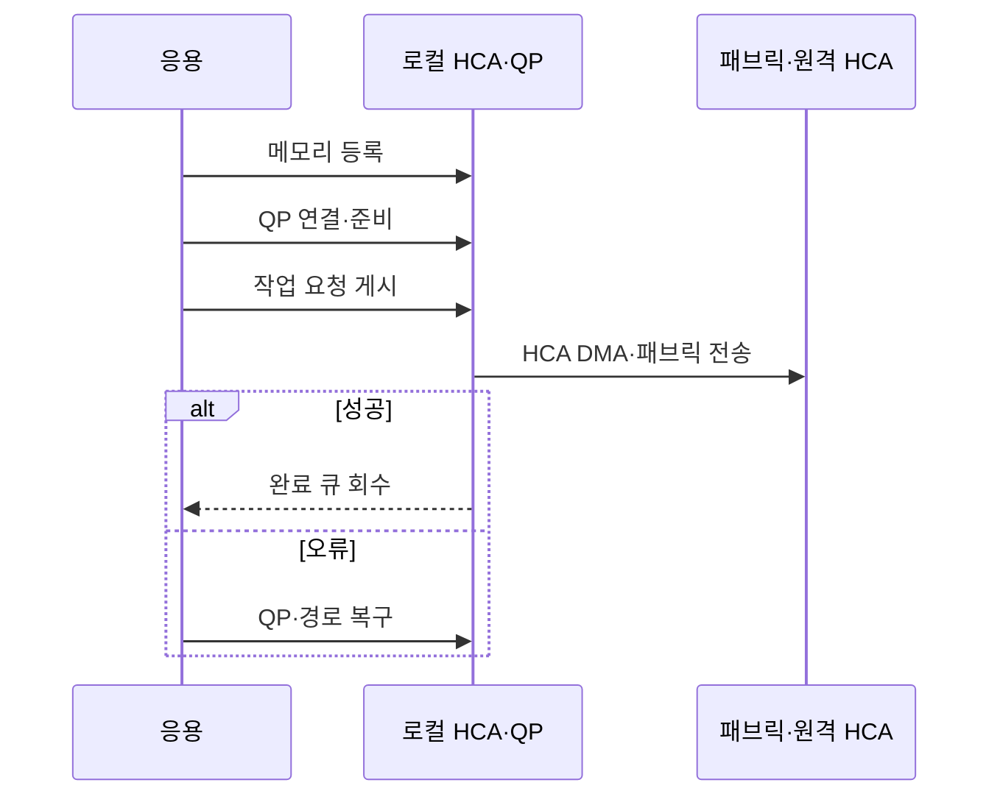

---
sidebar:
  order: 48
  label: "048. InfiniBand (InfiniBand)"
  badge:
    text: "기출 · 50%"
    variant: note
title: "InfiniBand (InfiniBand)"
date: "2026-07-27T23:59:59+09:00"
tags:
  - "notes-hardware"
weight: 48
extra:
  question_no: "048"
  source_status: "기출"
  source_history: "138회"
  priority: 50
  priority_note: "RDMA·집단 통신의 단일 기출 핵심"
---

## 미리 알고가기

- **InfiniBand**: ‘인피니밴드’로 읽는 기술명이며, RDMA와 저지연 스위칭을 제공하는 전용 패브릭
- **원격 직접 메모리 접근(Remote Direct Memory Access, RDMA)**: ‘알디엠에이’로 읽고 영문 머리글자를 딴 약어이며, 등록 뒤 원격 CPU를 거치지 않고 메모리에 접근
- **호스트 채널 어댑터(Host Channel Adapter, HCA)**: ‘에이치씨에이’로 읽고 영문 머리글자를 딴 약어이며, 호스트 메모리와 패브릭 사이 RDMA 처리
- **메모리 등록(Memory Registration)**: 장치 접근용 키와 주소 범위를 HCA에 등록
- **큐 페어(Queue Pair, QP)**: 송신·수신 작업 큐로 구성된 통신 종단점
- **완료 큐(Completion Queue, CQ)**: 작업 완료 상태를 응용에 전달하는 큐
- **서브넷 관리자(Subnet Manager)**: 주소·경로·파티션·포트 상태를 설정하는 관리자
- **크레딧 기반 흐름 제어(Credit-Based Flow Control)**: 수신 버퍼 여유만큼 전송해 버퍼 초과 손실을 방지하는 제어
- **메시지 전달 인터페이스(Message Passing Interface, MPI)**: 분산 노드의 메시지·집단 통신 프로그래밍 표준
- **중앙 처리 장치(Central Processing Unit, CPU)**: 응용과 운영체제를 실행하며 RDMA가 데이터 복사 개입을 줄이는 호스트 프로세서
- **직접 메모리 접근(Direct Memory Access, DMA)**: HCA가 CPU 복사 없이 호스트 메모리와 장치 사이 데이터를 전송하는 방식
- **이더넷 기반 통합 원격 직접 메모리 접근(RDMA over Converged Ethernet, RoCE)**: 이더넷에서 RDMA Verbs와 네트워크 어댑터로 원격 메모리에 접근하는 방식
- **전송 제어 프로토콜/인터넷 프로토콜(Transmission Control Protocol/Internet Protocol, TCP/IP)**: 신뢰 전송과 주소·라우팅을 제공하는 범용 인터넷 프로토콜 모음
- **원격 직접 메모리 접근 네트워크 인터페이스 카드(RDMA Network Interface Card, RNIC)**: 이더넷에서 RDMA 작업과 메모리 접근을 처리하는 어댑터
- **RDMA Verbs**: 메모리 등록·큐 생성·작업 게시·완료 회수를 응용에 제공하는 표준 동작 인터페이스
- **고성능 컴퓨팅(High-Performance Computing, HPC)**: 여러 계산 노드로 대규모 과학·공학 연산을 병렬 처리하는 컴퓨팅
- **인공지능(Artificial Intelligence, AI)**: 학습한 모델로 분류·예측하며 분산 학습에서 GPU 집단 통신을 사용하는 기술
- **우선순위 기반 흐름 제어(Priority-based Flow Control, PFC)**: 특정 이더넷 우선순위 트래픽의 손실을 줄이도록 송신을 일시 정지하는 제어
- **명시적 혼잡 알림(Explicit Congestion Notification, ECN)**: 스위치가 패킷 표시로 송신 측에 혼잡을 알려 전송률을 낮추게 하는 기능
- **GPUDirect RDMA**: NVIDIA GPU 메모리와 원격 장치가 호스트 CPU 복사 없이 직접 데이터를 교환하는 기술명
- **핫스폿(Hotspot)**: 통신 경로·스위치 포트에 트래픽이 몰려 지연과 대기가 커지는 병목 지점

## Ⅰ. 개요

- 정의/개념: HCA·스위치로 **RDMA 저지연 전용망** 구성
- 기존 한계: 커널·CPU 경유 통신은 **복사·문맥 전환 지연** 발생

### 쉽게 이해하기 (학습용)

- 전용 배달원이 창구를 거치지 않고 등록된 우편함 사이를 오간다

## Ⅱ. 특징

- **등록 메모리·HCA**로 원격 CPU·커널 경로 우회
- **크레딧 흐름 제어**로 무손실 링크 전송
- **혼잡·토폴로지**가 집단 통신 지연 결정

### 쉽게 이해하기 (학습용)

- 직행 배송은 빠르지만 전용 도로와 관제센터를 따로 운영해야 한다

## Ⅲ. 아키텍처 및 구성요소

| 설계 요소 | 설명 |
|:---|:---|
| HCA·QP 엔드포인트 집합 | 등록 버퍼의 작업 게시·송수신·완료 처리 |
| 스위치 패브릭 | 패킷 전달·흐름 제어·경로 선택 |
| 서브넷 관리자 | 주소·경로·파티션·포트 상태 설정 |

> 요약: 관리자가 경로를 정하고 HCA가 전송한다

### 쉽게 이해하기 (학습용)

- 양쪽 배달원과 전용 도로를 관제센터가 주소·경로로 묶는다

## Ⅳ. 원리 및 절차 흐름도

| 절차 | 설명 |
|:---|:---|
| 메모리 등록 | 주소 범위와 접근 권한을 HCA에 등록 |
| QP 연결·준비 | QP를 초기화하고 통신 가능 상태로 전환 |
| 작업 요청 게시 | QP 작업 큐에 RDMA 요청 등록 |
| HCA DMA·패브릭 전송 | HCA가 DMA 후 패브릭으로 패킷 전송 |
| 완료 큐 회수 | 완료 큐 항목을 응용이 회수 |
| QP·경로 복구 | QP·경로 상태를 복구하고 작업 재게시 |

> 요약: 메모리·QP 준비 뒤 HCA가 전송하고 완료·오류를 처리한다

### 쉽게 이해하기 (학습용)

- 우편함과 배달 목록을 등록하고 배송 뒤 완료표나 오류를 확인한다

## Ⅴ. 종류 및 비교

| 원격 통신 방식 | InfiniBand | RoCE | TCP/IP |
|:---|:---|:---|:---|
| 적용 기준 | HPC·AI **집단 통신** | 기존 이더넷 기반 **RDMA** | 범용 연결·**호환성** |
| 핵심 특징 | 전용 스위치·**HCA·Verbs** | 이더넷·**RNIC·Verbs** | 이더넷·IP·**커널 소켓** |
| 한계 | 전용 장비·**운영 비용** | PFC·ECN **조정 복잡도** | CPU·커널 **경로 오버헤드** |

> 요약: 전용망은 InfiniBand, 이더넷은 RoCE가 적합하다

### 쉽게 이해하기 (학습용)

- 전용 도로는 InfiniBand, 기존 도로의 직행 배송은 RoCE가 맞다

## Ⅵ. 실무 사례

1. 분산 AI 학습은 **GPU 집단 통신 시간** 단축
2. HPC MPI는 **다중 경로**로 통신 병목 완화

### 쉽게 이해하기 (학습용)

- GPU 창고끼리 바로 보내 계산조의 대기를 줄인다
- 막힌 길을 분산하고 혼잡 지표로 병목 구간을 찾는다

## Ⅶ. 결론

- **통신 병목 비용**이 전용망 비용보다 크면 InfiniBand 선택

### 쉽게 이해하기 (학습용)

- 배송이 공장 계산보다 오래 걸릴 때 전용 배달망이 이롭다
