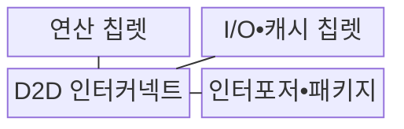
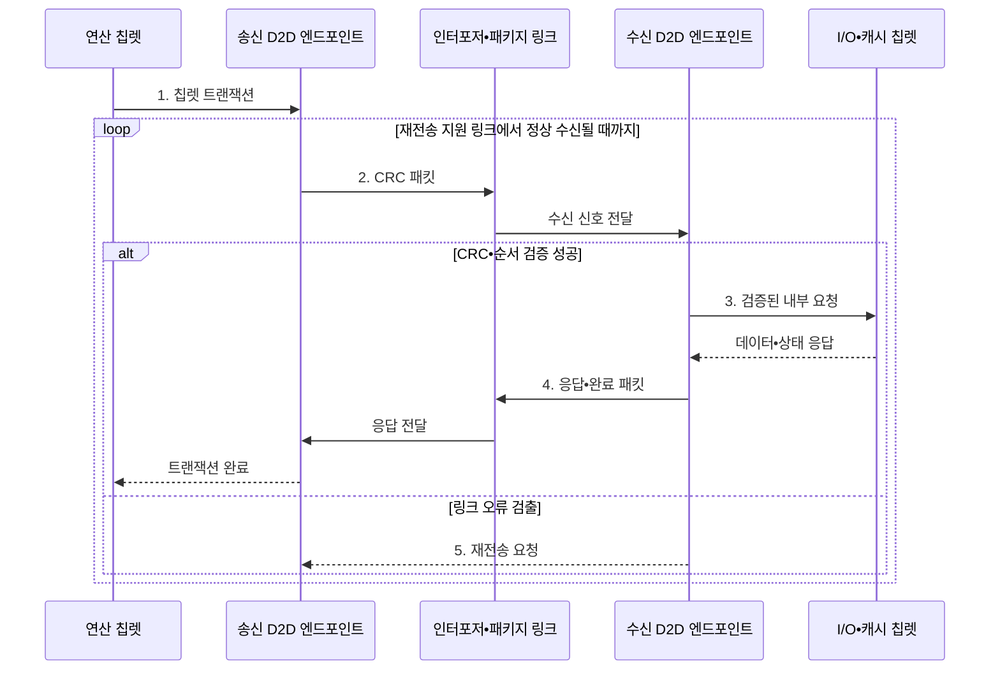

---
sidebar:
  order: 49
  label: "049. 칩렛 (Chiplet)"
  badge:
    text: "기출 • 50%"
    variant: note
title: "칩렛 (Chiplet)"
date: "2026-08-04T12:09:00+09:00"
tags:
  - "notes-hardware"
weight: 49
extra:
  question_no: "049"
  source_status: "기출"
  source_history: "131회"
  priority: 50
  priority_note: "칩렛•KGD•D2D의 단일 기출 핵심"
---

## Ⅰ. 개요

핵심 용어

- **칩렛(Chiplet)**: 특정 기능을 맡는 작은 다이들을 하나의 패키지에서 연결하여 시스템을 구성하는 단위이다.
- **다이 간 연결(Die-to-Die, D2D)**: 같은 패키지의 칩렛 사이에서 데이터와 제어 및 클록 신호를 전달하는 인터페이스이다.
- **수율(Yield)**: 제조한 다이나 패키지 가운데 요구 기능과 품질 기준을 통과한 비율이다.

- 정의/개념: 기능별 **소형 다이를 D2D로 연결**해 하나의 패키지 시스템으로 구성하는 반도체 통합 방식
- 배경/필요성: 대형 단일 다이는 면적 증가로 **수율 저하•폐기 비용 증가**

#### 한줄 요약

- 큰 칩 하나 대신 검증한 작은 방들을 복도로 이어 한 건물처럼 쓰는 방식이다

## Ⅱ. 특징

핵심 용어

- **정상 다이(Known Good Die, KGD)**: 패키지 조립 전에 전기적 기능 검사를 통과하여 정상임을 확인한 다이이다.
- **이종 집적(Heterogeneous Integration)**: 기능에 맞게 서로 다른 제조 공정으로 만든 다이를 하나의 패키지에 결합하는 방식이다.
- **패키지 조립 수율(Package Assembly Yield)**: 칩렛과 배선 및 기판을 조립한 전체 패키지 가운데 정상 동작하는 제품의 비율이다.
- **다이 간 연결 비용(Die-to-Die Interconnect Cost, D2D 연결 비용)**: 다이 간 데이터 전달에서 발생하는 지연과 전력 및 패키지 배선 비용이다.

- 수율•불량 폐기 비용을 개선하는 **소형 KGD 조합**
- 기능별 공정을 최적화하는 **이종 공정 혼용**
- 지연•전력 증가를 만드는 **D2D 연결** 및 수율 위험을 만드는 **패키지 조립**

#### 한줄 요약

- 검증한 방을 재사용할 수 있지만 복도와 냉방까지 함께 설계해야 한다

## Ⅲ. 구조 및 구성요소

핵심 용어

- **연산 칩렛(Compute Chiplet)**: 중앙 처리 장치(Central Processing Unit, CPU)나 그래픽 처리 장치(Graphics Processing Unit, GPU) 코어를 포함하여 범용 또는 병렬 연산을 수행하는 다이이다.
- **입출력•캐시 칩렛(Input/Output•Cache Chiplet, I/O•캐시 칩렛)**: 메모리와 외부 장치 인터페이스 및 공유 캐시를 담당하는 다이이다.
- **인터포저(Interposer)**: 여러 칩렛을 미세 배선으로 연결하고 패키지 기판에 결합하는 중간 기판이다.
- **전력망(Power Delivery Network)**: 패키지와 다이의 각 회로에 안정적인 전압과 전류를 공급하는 배선 구조이다.

| 구성요소 | 책임 |
|:---|:---|
| 연산 칩렛 | CPU•GPU **연산 수행** |
| I/O•캐시 칩렛 | 메모리•I/O **제어•캐시** |
| D2D 인터커넥트 | 다이 간 **트랜잭션 전달** |
| 인터포저•패키지 | 배선•전력•**방열 제공** |

#### 한줄 요약

- 기능별 칩렛을 D2D와 패키지 배선으로 연결해 하나의 시스템처럼 동작시킨다.

## Ⅳ. 흐름도

핵심 용어

- **칩렛 트랜잭션(Chiplet Transaction)**: 한 칩렛이 다른 칩렛의 기능이나 데이터에 접근하기 위해 보내는 요청과 응답이다.
- **순환 중복 검사(Cyclic Redundancy Check, CRC)**: 송수신 데이터에서 계산한 검사값을 비교하여 전송 비트 오류를 검출하는 기법이다.
- **재전송(Retransmission)**: 오류가 검출된 패킷을 송신 측이 다시 보내어 링크 신뢰성을 확보하는 절차이다.
- **I/O**: Input/Output, 메모리와 외부 장치 사이의 입출력

**동작 원리**

1. **칩렛 트랜잭션**: 원격 기능 요청
2. **CRC 패킷**: 오류 검출 정보를 포함한 전송 단위
3. **검증된 내부 요청**: 패킷에서 복원한 원래 요청
4. **응답•완료 패킷**: 처리 결과의 역방향 전송 단위
5. **재전송 요청**: CRC•순서 오류가 난 패킷 지정

#### 한줄 요약

- D2D 엔드포인트는 칩렛 요청을 패킷으로 보내고 CRC 오류가 나면 지원 링크에서 재전송한다

## Ⅴ. 종류 및 비교

핵심 용어

- **단일 시스템온칩(Single System on Chip, Single SoC)**: 프로세서와 메모리 제어 및 입출력 기능을 하나의 다이에 통합한 칩이다.
- **온다이 지연(On-die Latency)**: 동일한 다이 내부의 회로 사이에서 신호가 이동하고 응답하는 데 걸리는 시간이다.
- **레티클 한계(Reticle Limit)**: 한 번의 노광으로 웨이퍼에 전사할 수 있는 최대 다이 면적이다.

| 반도체 통합 방식 | 칩렛 | 단일 SoC |
|:---|:---|:---|
| 적용 기준 | 이종 공정•**재사용•수율** | 온다이 지연•**단일 설계** |
| 핵심 특징 | 검증 다이의 **패키지 연결** | 기능의 **단일 다이 통합** |
| 한계 | D2D 지연•**패키지 수율** | 대형 다이 **수율•재설계** |

> 요약: 칩렛은 수율•재사용 대신 연결 비용이 증가한다

#### 한줄 요약

- 칩렛은 검증한 방을 바꿔 끼우지만 복도와 냉방 비용이 더 든다

## Ⅵ. 실무 고려사항 및 대책

핵심 용어

- **번인 시험(Burn-in Test)**: 고온이나 높은 전압에서 일정 시간 동작시켜 초기 잠복 결함을 조기에 드러내는 시험이다.
- **링크 오류율(Link Error Rate)**: 전체 다이 간 연결(Die-to-Die, D2D) 전송 가운데 오류가 검출된 데이터나 패킷의 비율이다.
- **열 배치(Thermal Placement)**: 발열이 큰 칩렛의 위치와 냉각 경로를 조정하여 온도 집중을 줄이는 설계이다.
- **D2D 프로파일(D2D Profile)**: 링크 속도와 레인 및 지원 기능처럼 상호 연결에 필요한 공통 설정 집합이다.
- **정상 다이(Known Good Die, KGD)**: 패키지 조립 전 기능 검사를 통과한 다이이다.
- **중앙 처리 장치(Central Processing Unit, CPU)•입출력(Input/Output, I/O) 다이**: 연산 코어와 외부 연결•공유 캐시 기능을 담당하는 칩렛이다.

| 문제 | 대책 | 효과 |
|:---|:---|:---|
| KGD 시험이 실제 패키지 조건 결함을 놓침 | 다이 단독•조립 후•**번인 시험** 결합 | **잠복 불량** 감소 |
| D2D 오류•직렬화 지연이 온다이 이점 상쇄 | 링크 오류율•대역폭•왕복 지연 검증과 **재시도** 적용 | **연결 신뢰성** 확보 |
| 조립 수율 저하와 칩렛 간 열 집중 | 패키지 수율 추적•**열 배치•전력망** 공동 설계 | **비용•지속 성능** 개선 |
| 공급사•세대별 인터페이스 호환 실패 | 표준 **D2D 프로파일•버전 협상** 과 공급망 검증 | **재사용•교체 가능성** 향상 |

> 서버 CPU는 동일한 코어 칩렛 수를 제품 등급별로 조절하고 공통 I/O 다이를 재사용해 제품군과 수율을 함께 관리한다.

#### 한줄 요약

- 서버 CPU는 검증한 코어 칩렛 수를 제품별로 조절하고 공통 I/O 다이를 재사용한다

## Ⅶ. 결론

핵심 용어

- **재사용 이득(Reuse Benefit)**: 검증한 칩렛을 여러 제품에서 반복 사용하여 설계 기간과 비용을 줄이는 효과이다.
- **폐기 비용(Scrap Cost)**: 제조 결함 때문에 다이나 조립된 패키지를 사용할 수 없어 발생하는 손실이다.
- **패키지 비용(Packaging Cost)**: 칩렛 조립과 미세 배선, 전력 공급 및 냉각 구조를 구현하는 데 드는 비용이다.

- D2D•패키지 비용보다 큰 **수율•재사용 이득** 확보 시 **칩렛 선택**

#### 한줄 요약

- 방을 나눈 이득이 복도와 냉방 공사비보다 클 때 칩렛이 유리하다
