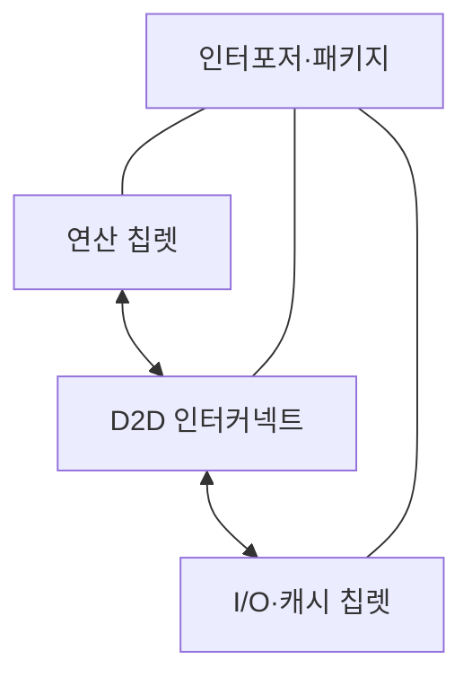
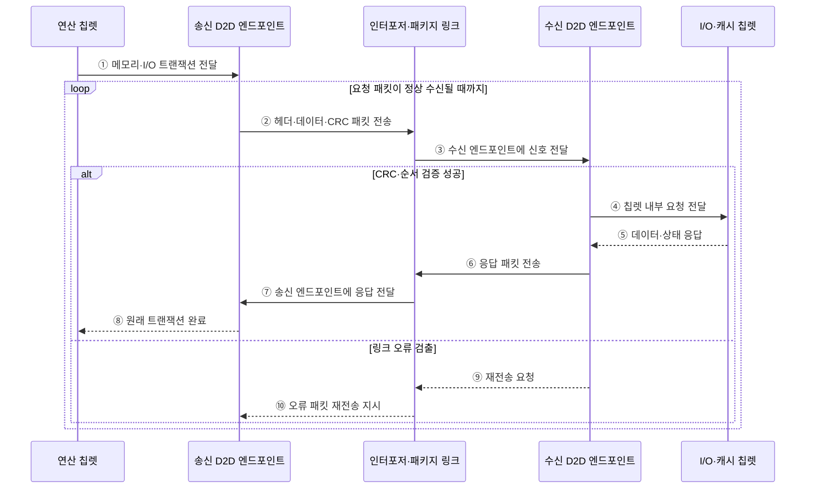

---
sidebar:
  order: 49
  label: "049. 칩렛 (Chiplet)"
  badge:
    text: "기출 · 50%"
    variant: note
title: "칩렛 (Chiplet)"
date: "2026-07-28T12:59:53+09:00"
tags:
  - "notes-hardware"
weight: 49
extra:
  question_no: "049"
  source_status: "기출"
  source_history: "131회"
  priority: 50
  priority_note: "칩렛·KGD·D2D의 단일 기출 핵심"
---

## 미리 알고가기

- **칩렛(Chiplet)**: 기능별 소형 다이를 패키지에서 연결한 구조
- **다이 간 연결(Die-to-Die, D2D)**: 같은 패키지의 칩렛 사이에서 데이터·제어·클록 신호를 전달하는 인터페이스
- **정상 다이(Known Good Die, KGD)**: 패키지 조립 전에 전기적 기능 검사를 통과한 다이
- **레티클 한계(Reticle Limit)**: 한 번의 노광으로 만드는 최대 다이 면적
- **인터포저(Interposer)**: 칩렛을 미세 배선으로 잇는 중간 기판
- **이종 집적(Heterogeneous Integration)**: 서로 다른 공정의 다이를 함께 결합
- **단일 시스템 온 칩(Single System on Chip, Single SoC)**: 프로세서·메모리 제어·입출력 등의 기능을 하나의 다이에 통합한 칩
- **다이(Die)**: 웨이퍼에서 잘라 패키지에 넣는 개별 반도체 회로 조각
- **수율(Yield)**: 제조한 다이·패키지 중 기능과 품질 기준을 통과한 비율
- **노광(Lithography)**: 빛으로 웨이퍼에 회로 패턴을 전사하는 반도체 공정
- **중앙 처리 장치(Central Processing Unit, CPU)**: 범용 명령어 실행과 시스템 제어를 담당하는 프로세서 칩렛
- **그래픽 처리 장치(Graphics Processing Unit, GPU)**: 병렬 코어로 그래픽·행렬 연산을 처리하는 가속기 칩렛
- **입출력(Input/Output, I/O)**: 칩과 외부 장치 사이의 명령·데이터 전달을 담당하는 인터페이스 칩렛
- **인공지능(Artificial Intelligence, AI)**: 학습·추론 모델의 반복 텐서 연산을 전용 가속기 칩렛에서 처리하는 워크로드
- **온다이 지연(On-die Latency)**: 같은 다이 안의 회로 사이를 신호가 이동할 때 걸리는 시간
- **전력망(Power Delivery Network)**: 패키지와 다이의 각 회로에 전압·전류를 공급하는 배선 구조
- **링크 트레이닝(Link Training)**: D2D 통신 전에 양쪽 수신 타이밍·레인·전압을 맞추고 정상 연결 여부를 확인하는 초기화 절차
- **순환 중복 검사(Cyclic Redundancy Check, CRC)**: 전송 데이터에서 계산한 검사값을 비교해 링크 오류를 검출하는 기법
- **번인 시험(Burn-in Test)**: 고온·전압 조건에서 일정 시간 동작시켜 초기 잠복 결함을 조기에 드러내는 시험

## Ⅰ. 개요

- 정의/개념: 기능별 **소형 다이를 D2D로 연결**한 반도체
- 기존 한계: 대형 단일 다이는 **수율 저하·불량 폐기 비용** 증가

### 쉽게 이해하기 (학습용)

- 큰 칩 하나 대신 검증한 작은 방들을 복도로 이어 한 건물처럼 쓰는 방식이다

## Ⅱ. 특징

- **소형 KGD 조합**으로 수율·불량 폐기 비용 개선
- **이종 공정 혼용**으로 기능별 공정 최적화
- **D2D·패키지 비용**이 지연·전력·수율 결정

### 쉽게 이해하기 (학습용)

- 검증한 방을 재사용할 수 있지만 복도와 냉방까지 함께 설계해야 한다

## Ⅲ. 아키텍처 및 구성요소

### 도표안 A. 칩렛 패키지 정적 구조

| 설계 요소 | 입력·상태 | 역할 |
|:---|:---|:---|
| 연산 칩렛 | 명령·데이터·전력 상태 | CPU·GPU 연산 수행 |
| I/O·캐시 칩렛 | 메모리·외부 I/O 요청 | 제어·공유 캐시 제공 |
| D2D 인터커넥트 | 다이 간 트랜잭션·링크 상태 | 데이터·제어 신호 전달 |
| 인터포저·패키지 | 칩렛 배치·열·전력 상태 | 미세 배선·전력·방열 제공 |

> 요약: 연산·I/O 칩렛을 D2D와 패키지로 통합한다

### 도표안 B. D2D 요청·응답·오류 재전송 시퀀스

### 동작 원리

1. **① 메모리·I/O 트랜잭션 전달**: 연산 칩렛은 다른 다이에 있는 공유 캐시·메모리 제어기·I/O 기능에 요청을 보낸다.
2. **② 헤더·데이터·CRC 패킷 전송**: 송신 엔드포인트는 온다이 요청을 D2D 프로토콜 패킷으로 만들고 오류 검출 CRC와 함께 링크에 싣는다.
3. **③ 수신 엔드포인트에 신호 전달**: 인터포저나 패키지 기판의 미세 배선은 직렬·병렬 레인 신호를 대상 칩렛으로 운반한다.
4. **④ 칩렛 내부 요청 전달**: CRC와 순서가 유효하면 수신 엔드포인트는 패킷을 원래 트랜잭션으로 복원해 I/O·캐시 칩렛에 전달한다.
5. **⑤ 데이터·상태 응답**: 대상 칩렛은 메모리 읽기 데이터나 I/O 처리 상태를 D2D 엔드포인트에 반환한다.
6. **⑥ 응답 패킷 전송**: 수신 측 엔드포인트는 응답도 D2D 패킷으로 만들고 반대 방향 링크에 전송한다.
7. **⑦ 송신 엔드포인트에 응답 전달**: 패키지 링크는 응답을 요청을 시작한 연산 칩렛의 D2D 엔드포인트로 운반한다.
8. **⑧ 원래 트랜잭션 완료**: 송신 엔드포인트는 응답을 온다이 형식으로 복원해 연산 칩렛 요청을 완료한다.
9. **⑨ 재전송 요청**: CRC·순서 오류가 검출되면 잘못된 데이터를 대상 칩렛에 전달하지 않고 링크에 재전송을 요구한다.
10. **⑩ 오류 패킷 재전송 지시**: 오류 통지가 송신 엔드포인트에 도착하면 저장해 둔 패킷을 다시 보내 신뢰성을 유지한다.

### 쉽게 이해하기 (학습용)

- 연산·메모리·입출력 칩렛을 패키지 내부 D2D 인터페이스로 연결한 구조다

## Ⅳ. 종류 및 비교

| 반도체 통합 방식 | 칩렛 | 단일 SoC |
|:---|:---|:---|
| 적용 기준 | 이종 공정·**재사용·수율** | 온다이 지연·**단일 설계** |
| 핵심 특징 | 검증 다이의 **패키지 연결** | 기능의 **단일 다이 통합** |
| 한계 | D2D 지연·**패키지 수율** | 대형 다이 **수율·재설계** |
| 주요 위험 | D2D 지연·전력·패키지 열 | 레티클 한계·대형 다이 수율 |

> 요약: 칩렛은 수율·재사용 대신 연결 비용이 증가한다

### 쉽게 이해하기 (학습용)

- 칩렛은 검증한 방을 바꿔 끼우지만 복도와 냉방 비용이 더 든다

## Ⅴ. 실무 고려사항 및 대응 방안

| 운영 위험 | 대응 | 기대 효과 |
|:---|:---|:---|
| KGD 시험이 실제 패키지 조건 결함을 놓침 | 다이 단독·조립 후·번인 단계 시험 결합 | 잠복 불량 감소 |
| D2D 오류·직렬화 지연이 온다이 이점 상쇄 | 링크 오류율·대역폭·왕복 지연 검증과 재시도 적용 | 연결 신뢰성 확보 |
| 조립 수율 저하와 칩렛 간 열 집중 | 패키지 수율 추적·열 배치·전력망 공동 설계 | 비용·지속 성능 개선 |
| 공급사·세대별 인터페이스 호환 실패 | 표준 D2D 프로파일·버전 협상과 공급망 검증 | 재사용·교체 가능성 향상 |

> 서버 CPU는 동일한 코어 칩렛 수를 제품 등급별로 조절하고 공통 I/O 다이를 재사용해 제품군과 수율을 함께 관리한다.

### 쉽게 이해하기 (학습용)

- 정상 방만 조립하고 복도나 냉방 문제가 생기면 설계부터 고쳐 다시 검사한다.
- 서버 CPU는 필요한 코어 수만큼 연산방을 늘려 제품군을 만든다

## Ⅵ. 결론

- 반도체 확장을 위해 수율·연결 비용을 검토하여 **칩렛** 활용

### 쉽게 이해하기 (학습용)

- 방을 나눈 이득이 복도와 냉방 공사비보다 클 때 칩렛이 유리하다
