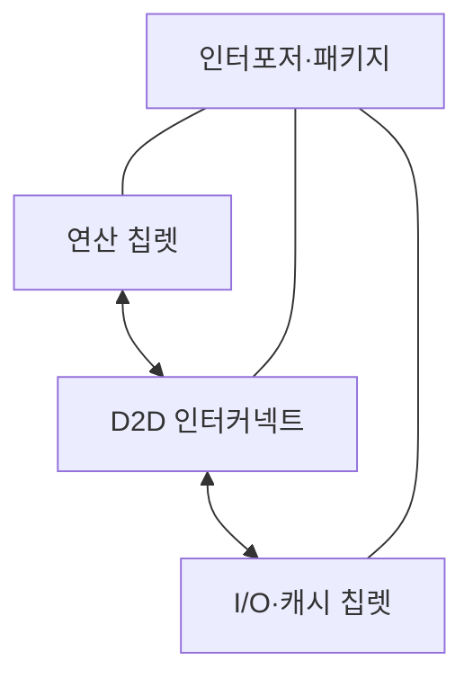
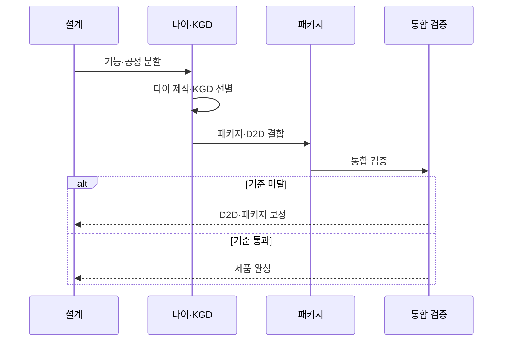

---
sidebar:
  order: 49
  label: "049. 칩렛 (Chiplet)"
  badge:
    text: "기출 · 50%"
    variant: note
title: "칩렛 (Chiplet)"
date: "2026-07-27T23:59:59+09:00"
tags:
  - "notes-hardware"
weight: 49
extra:
  question_no: "049"
  source_status: "기출"
  source_history: "131회"
  priority: 50
  priority_note: "칩렛·KGD·D2D의 단일 기출 핵심"
---

## 미리 알고가기

- **칩렛(Chiplet)**: 기능별 소형 다이를 패키지에서 연결한 구조
- **다이 간 연결(Die-to-Die, D2D)**: ‘디투디’로 읽고 두 다이 사이를 숫자 2로 축약한 표기이며, 칩렛 간 데이터·제어 신호를 전달
- **정상 다이(Known Good Die, KGD)**: ‘케이지디’로 읽고 영문 머리글자를 딴 약어이며, 조립 전 기능 검사를 통과한 다이
- **레티클 한계(Reticle Limit)**: 한 번의 노광으로 만드는 최대 다이 면적
- **인터포저(Interposer)**: 칩렛을 미세 배선으로 잇는 중간 기판
- **이종 집적(Heterogeneous Integration)**: 서로 다른 공정의 다이를 함께 결합
- **단일 시스템 온 칩(Single System on Chip, Single SoC)**: ‘싱글 에스오시’로 읽고 영문 머리글자를 딴 약어이며, 여러 기능을 하나의 다이에 통합한 칩
- **다이(Die)**: 웨이퍼에서 잘라 패키지에 넣는 개별 반도체 회로 조각
- **수율(Yield)**: 제조한 다이·패키지 중 기능과 품질 기준을 통과한 비율
- **노광(Lithography)**: 빛으로 웨이퍼에 회로 패턴을 전사하는 반도체 공정
- **중앙 처리 장치(Central Processing Unit, CPU)**: ‘시피유’로 읽고 영문 머리글자를 딴 약어이며, 범용 명령·시스템 제어를 담당
- **그래픽 처리 장치(Graphics Processing Unit, GPU)**: ‘지피유’로 읽고 영문 머리글자를 딴 약어이며, 병렬 코어로 그래픽·행렬 연산을 처리
- **입출력(Input/Output, I/O)**: ‘아이오’로 읽고 입력과 출력 사이를 빗금으로 구분한 표기이며, 칩과 외부 장치 사이의 데이터 전달을 담당
- **인공지능(Artificial Intelligence, AI)**: ‘에이아이’로 읽고 영문 머리글자를 딴 약어이며, 학습 모델의 반복 텐서 연산을 칩렛 가속기로 처리
- **온다이 지연(On-die Latency)**: 같은 다이 안의 회로 사이를 신호가 이동할 때 걸리는 시간
- **전력망(Power Delivery Network)**: 패키지와 다이의 각 회로에 전압·전류를 공급하는 배선 구조

## Ⅰ. 개요

- 정의/개념: 기능별 **소형 다이를 D2D로 연결**한 반도체
- 기존 한계: 대형 단일 다이는 **수율 저하·불량 폐기 비용** 증가

### 쉽게 이해하기 (학습용)

- 큰 칩 하나 대신 검증한 작은 방들을 복도로 이어 한 건물처럼 쓰는 방식이다

## Ⅱ. 특징

- **소형 KGD 조합**으로 수율·불량 폐기 비용 개선
- **이종 공정 혼용**으로 기능별 공정 최적화
- **D2D·패키지 비용**이 지연·전력·수율 결정

### 쉽게 이해하기 (학습용)

- 검증한 방을 재사용할 수 있지만 복도와 냉방까지 함께 설계해야 한다

## Ⅲ. 아키텍처 및 구성요소

| 설계 요소 | 설명 |
|:---|:---|
| 연산 칩렛 | CPU·GPU 코어의 고성능 연산 |
| I/O·캐시 칩렛 | 메모리·외부 I/O 제어와 공유 캐시 |
| D2D 인터커넥트 | 다이 간 데이터·제어 신호 전달 |
| 인터포저·패키지 | 칩렛 배치·미세 배선·전력·열 관리 |

> 요약: 연산·I/O 칩렛을 D2D와 패키지로 통합한다

### 쉽게 이해하기 (학습용)

- 연산방과 창고를 복도로 잇고 한 건물 안에 배치한 구조다

## Ⅳ. 원리 및 절차 흐름도

| 절차 | 설명 |
|:---|:---|
| 기능·공정 분할 | 성능·수율·비용 기준의 다이 경계 설정 |
| 다이 제작·KGD 선별 | 선택 공정으로 제작하고 정상 다이 선별 |
| 패키지·D2D 결합 | KGD 배치 후 D2D·전력망 연결 |
| 통합 검증 | 대역폭·전력·열·조립 수율 확인 |
| D2D·패키지 보정 | 경계·배선·냉각 설계 수정 |
| 제품 완성 | 통합 기준을 통과한 패키지 출하 |

> 요약: KGD 결합 뒤 D2D·패키지 기준을 검증한다

### 쉽게 이해하기 (학습용)

- 정상 방만 조립하고 복도나 냉방 문제가 생기면 설계부터 고쳐 다시 검사한다

## Ⅴ. 종류 및 비교

| 반도체 통합 방식 | 칩렛 | 단일 SoC |
|:---|:---|:---|
| 적용 기준 | 이종 공정·**재사용·수율** | 온다이 지연·**단일 설계** |
| 핵심 특징 | 검증 다이의 **패키지 연결** | 기능의 **단일 다이 통합** |
| 한계 | D2D 지연·**패키지 수율** | 대형 다이 **수율·재설계** |
| 주요 위험 | D2D 지연·전력·패키지 열 | 레티클 한계·대형 다이 수율 |

> 요약: 칩렛은 수율·재사용 대신 연결 비용이 증가한다

### 쉽게 이해하기 (학습용)

- 칩렛은 검증한 방을 바꿔 끼우지만 복도와 냉방 비용이 더 든다

## Ⅵ. 실무 사례

1. 서버 CPU는 **코어 칩렛·I/O 다이** 조합

### 쉽게 이해하기 (학습용)

- 서버 CPU는 필요한 코어 수만큼 연산방을 늘려 제품군을 만든다

## Ⅶ. 결론

- 반도체 확장을 위해 수율·연결 비용을 검토하여 **칩렛** 활용

### 쉽게 이해하기 (학습용)

- 방을 나눈 이득이 복도와 냉방 공사비보다 클 때 칩렛이 유리하다
