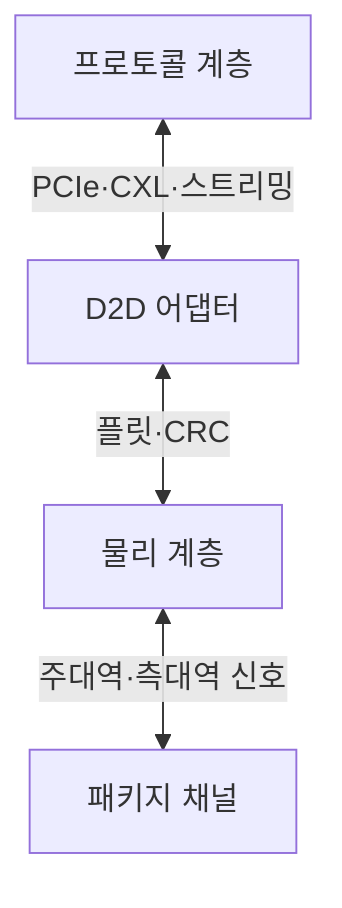
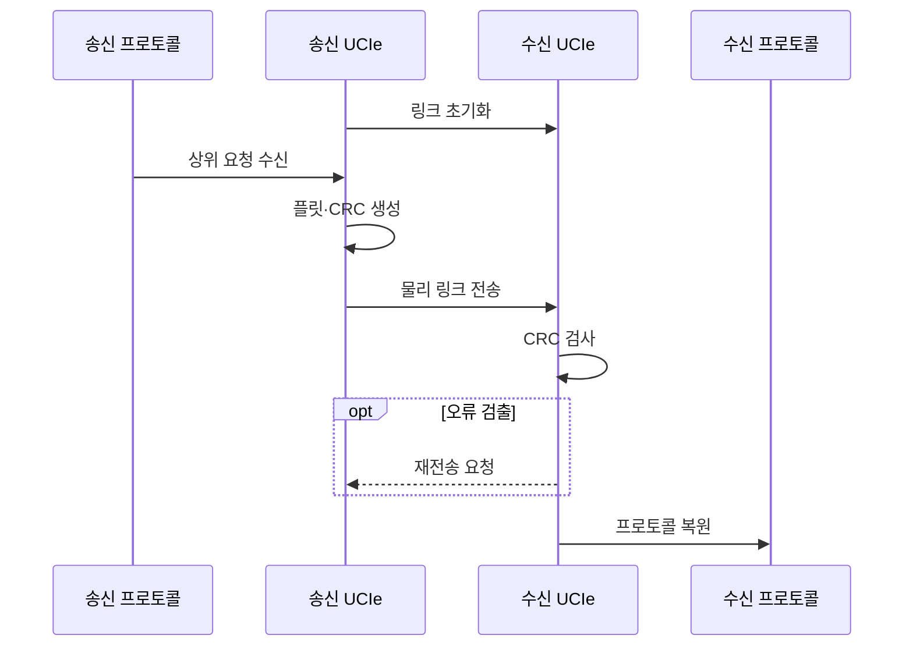

---
sidebar:
  order: 50
  label: "050. UCIe 칩렛 인터커넥트 (Universal Chiplet Interconnect Express)"
  badge:
    text: "미출제 · 50%"
    variant: note
title: "UCIe 칩렛 인터커넥트 (Universal Chiplet Interconnect Express)"
date: "2026-07-25T10:04:00+09:00"
tags:
  - "notes-hardware"
weight: 50
extra:
  question_no: "050"
  source_status: "미출제"
  source_history: ""
  priority: 50
  priority_note: "칩렛 계층·상호운용 검증 비교"
---

## 미리 알고가기

- **칩렛(Chiplet)**: 특정 기능을 맡아 패키지에서 결합하는 다이
- **범용 칩렛 상호연결 익스프레스(Universal Chiplet Interconnect Express, UCIe)**: 서로 다른 칩렛을 물리·프로토콜 계층에서 연결하는 표준 D2D 인터페이스
- **다이 간 연결(Die-to-Die, D2D)**: 하나의 패키지 안에서 서로 다른 다이를 직접 연결하는 인터페이스
- **프로토콜 계층(Protocol Layer)**: 상위 트랜잭션의 의미와 형식 제공
- **D2D 어댑터(D2D Adapter)**: 플릿·오류·링크 상태 관리
- **물리 계층(Physical Layer, PHY)**: 패키지 배선을 통해 전기 신호를 송수신하고 링크 타이밍을 맞추는 계층
- **주변 구성요소 상호연결 익스프레스(Peripheral Component Interconnect Express, PCIe)**: 칩렛 사이에서 장치 입출력 트랜잭션을 전달하는 상위 프로토콜
- **컴퓨트 익스프레스 링크(Compute Express Link, CXL)**: 칩렛 사이에서 캐시·메모리 일관성 트랜잭션을 전달하는 상위 프로토콜
- **플릿(Flit)**: 어댑터가 전송하는 고정 형식 단위
- **순환 중복 검사(Cyclic Redundancy Check, CRC)**: 전송 플릿의 비트 오류를 검출하는 오류 검출 코드
- **주대역·측대역(Mainband·Sideband)**: 데이터 경로와 관리 신호 경로
- **링크 훈련(Link Training)**: 양단 역량·레인 상태를 맞추는 과정
- **비트 오류율(Bit Error Rate, BER)**: 전체 전송 비트 중 오류가 발생한 비트의 비율
- **스트리밍 프로토콜(Streaming Protocol)**: 주소 기반 요청 대신 연속 데이터 흐름을 순서대로 전달하는 상위 전송 방식
- **레인(Lane)**: 한 방향의 고속 직렬 데이터를 전달하는 차동 신호 경로
- **마이크로범프(Microbump)**: 칩렛과 인터포저 사이를 매우 짧은 거리로 전기 연결하는 미세 접점
- **트랜잭션(Transaction)**: 읽기·쓰기 요청과 응답처럼 프로토콜이 보장하는 하나의 통신 작업
- **독자 D2D 링크(Proprietary D2D Link)**: 특정 공급자가 제품에 맞춰 물리·어댑터·프로토콜을 자체 정의한 다이 간 연결
- **적합성(Conformance)**: 구현이 UCIe 규격의 필수 동작·전기 조건을 따르는지 확인한 상태
- **상호운용성(Interoperability)**: 서로 다른 공급자의 칩렛이 실제 조합에서 올바르게 통신하는 성질
- **신호 품질(Signal Integrity)**: 패키지 채널에서 파형이 왜곡·잡음 한도 안에 있어 비트 오류율을 만족하는 상태
- **멀티벤더(Multi-vendor)**: 서로 다른 공급자가 만든 칩렛·도구를 한 시스템에서 함께 사용하는 구성

## Ⅰ. 개요

- 정의/개념: 칩렛 간 PHY·어댑터·프로토콜 표준이다
- **배경/필요성**: 독자 링크의 공급자 종속 비용을 줄인다

### 쉽게 이해하기 (학습용)

- 다른 회사의 블록도 같은 홈과 나사를 쓰게 만든 조립 규격과 같다

## Ⅱ. 특징

- 계층 분리는 프로토콜·패키지 교체 비용을 줄인다
- 플릿 CRC·재시도는 링크 오류의 데이터 손상을 막는다

### 쉽게 이해하기 (학습용)

- 나사 모양과 조립 순서를 나누면 부품과 조립판을 따로 바꿀 수 있다

## Ⅲ. 아키텍처 및 구성요소

| 설계 요소 | 설명 |
|:---|:---|
| 프로토콜 계층 | PCIe·CXL·스트리밍 트랜잭션 제공 |
| D2D 어댑터 | 플릿화·CRC·재시도·링크 상태 관리 |
| 물리 계층 | 주대역·측대역 신호와 링크 훈련 담당 |
| 패키지 채널 | 두 다이 범프·배선의 전기 경로 |

> 요약: 프로토콜을 플릿과 전기 신호로 변환한다

### 쉽게 이해하기 (학습용)

- 주문서는 포장 규격과 전선을 차례로 거쳐 다른 블록으로 간다

## Ⅳ. 원리 및 절차 흐름도

| 절차 | 설명 |
|:---|:---|
| 링크 초기화 | 측대역으로 역량·레인 상태 합의 |
| 상위 요청 수신 | PCIe·CXL·스트리밍 요청 전달 |
| 플릿·CRC 생성 | 요청을 플릿화하고 오류 코드 부착 |
| 물리 링크 전송 | PHY가 패키지 레인으로 신호 송신 |
| CRC 검사 | 수신 플릿의 전송 오류 판정 |
| 재전송 요청 | 오류 플릿의 링크 재시도 지시 |
| 프로토콜 복원 | 플릿을 상위 트랜잭션으로 전달 |

> 요약: 링크를 맞춘 뒤 플릿을 전송·검사·복원한다

### 쉽게 이해하기 (학습용)

- 양쪽 통로를 맞춘 뒤 주문서를 봉투에 담아 보내고 오류면 다시 보낸다

## Ⅴ. 종류 및 비교

| 판단 기준 | UCIe | 독자 D2D 링크 |
|:---|:---|:---|
| 핵심 특징 | 표준 PHY·어댑터·프로토콜 | 공급자 정의 전용 계층 |
| 재사용 경계 | 규격 적합 구현 간 칩렛 조합 | 검증된 특정 다이 조합 |
| 최적화 자유도 | 표준 경계 안에서 구현 최적화 | 전 계층 공동 최적화 |
| 적용 기준 | 생태계·칩렛 재사용 우선 | 단일 제품의 전용 성능 우선 |
| 주요 위험 | 조합별 상호운용·신호 품질 | 공급자 종속·재개발 비용 |

> 요약: 재사용은 UCIe, 전용 성능은 독자 D2D가 맞다

### 쉽게 이해하기 (학습용)

- 표준 나사는 부품 교체가 쉽고 전용 나사는 한 제품에 꼭 맞게 깎을 수 있다

## Ⅵ. 실무 사례

1. 멀티벤더 패키지는 조합별 BER·지연을 검증한다

### 쉽게 이해하기 (학습용)

- 규격 부품도 실제 조립해 신호 오류와 응답 시간을 확인한다

## Ⅶ. 결론

- 멀티벤더 칩렛은 상호운용 검증 후 UCIe를 채택한다

### 쉽게 이해하기 (학습용)

- 표준 준수 여부와 실제 다이 간 상호운용성을 검증한 조합만 제품에 적용한다
