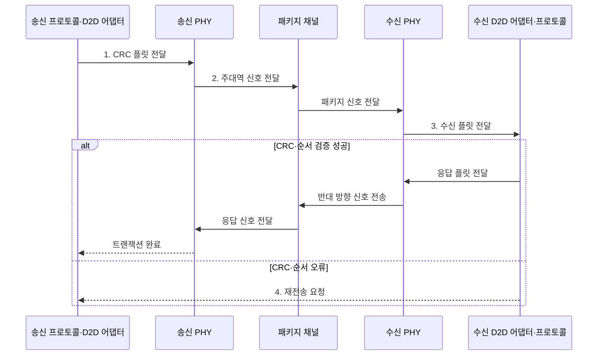

---
sidebar:
  order: 50
  label: "050. UCIe 칩렛 인터커넥트 (Universal Chiplet Interconnect Express)"
  badge:
    text: "미출 · 50%"
    variant: note
title: "UCIe 칩렛 인터커넥트 (Universal Chiplet Interconnect Express)"
date: "2026-07-30T21:35:00+09:00"
tags:
  - "notes-hardware"
weight: 50
extra:
  question_no: "050"
  source_status: "미출"
  source_history: ""
  priority: 50
  priority_note: "칩렛 계층·상호운용 검증 비교"
---

## 미리 알고가기

- **칩렛(Chiplet)**: 특정 기능을 맡아 패키지에서 결합하는 다이
- **범용 칩렛 상호연결 익스프레스(Universal Chiplet Interconnect Express, UCIe)**: 서로 다른 칩렛을 물리·프로토콜 계층에서 연결하는 표준 D2D 인터페이스
- **다이 간 연결(Die-to-Die, D2D)**: 하나의 패키지 안에서 서로 다른 다이를 직접 연결하는 인터페이스
- **프로토콜 계층(Protocol Layer)**: 상위 트랜잭션의 의미와 형식 제공
- **D2D 어댑터(D2D Adapter)**: 플릿·오류·링크 상태 관리
- **물리 계층(Physical Layer, PHY)**: 패키지 배선을 통해 전기 신호를 송수신하고 링크 타이밍을 맞추는 계층
- **주변 구성요소 상호연결 익스프레스(Peripheral Component Interconnect Express, PCIe)**: 칩렛 사이에서 장치 입출력 트랜잭션을 전달하는 상위 프로토콜
- **컴퓨트 익스프레스 링크(Compute Express Link, CXL)**: 칩렛 사이에서 캐시·메모리 일관성 트랜잭션을 전달하는 상위 프로토콜
- **플릿(Flit)**: 어댑터가 전송하는 고정 형식 단위
- **순환 중복 검사(Cyclic Redundancy Check, CRC)**: 전송 플릿의 비트 오류를 검출하는 오류 검출 코드
- **주대역·측대역(Mainband·Sideband)**: 데이터 경로와 관리 신호 경로
- **비트 오류율(Bit Error Rate, BER)**: 전체 전송 비트 중 오류가 발생한 비트의 비율
- **스트리밍 프로토콜(Streaming Protocol)**: 주소 기반 요청 대신 연속 데이터 흐름을 순서대로 전달하는 상위 전송 방식
- **레인(Lane)**: 한 방향의 고속 직렬 데이터를 전달하는 차동 신호 경로
- **트랜잭션(Transaction)**: 읽기·쓰기 요청과 응답처럼 프로토콜이 보장하는 하나의 통신 작업
- **독자 D2D 링크(Proprietary D2D Link)**: 특정 공급자가 제품에 맞춰 물리·어댑터·프로토콜을 자체 정의한 다이 간 연결
- **적합성(Conformance)**: 구현이 UCIe 규격의 필수 동작·전기 조건을 따르는지 확인한 상태
- **상호운용성(Interoperability)**: 서로 다른 공급자의 칩렛이 실제 조합에서 올바르게 통신하는 성질
- **신호 품질(Signal Integrity)**: 패키지 채널에서 파형이 왜곡·잡음 한도 안에 있어 비트 오류율을 만족하는 상태
- **멀티벤더(Multi-vendor)**: 서로 다른 공급자가 만든 칩렛·도구를 한 시스템에서 함께 사용하는 구성
- **신호 눈 마진(Eye Margin)**: 반복 수신 파형의 열린 영역에서 판정 시점·전압이 오류 한계까지 얼마나 여유를 갖는지 나타내는 신호 품질 지표

> **키워드:** UCIe 칩렛 인터커넥트 (Universal Chiplet Interconnect Express)

## Ⅰ. 개요

- 정의/개념: 칩렛 간 **PHY·어댑터** 계층을 규정하는 **D2D 표준**
- 배경/필요성: 독자 D2D의 **통합 비용·공급자 종속** 완화

### 쉽게 이해하기 (학습용)

- 다른 회사의 블록도 같은 홈과 나사를 쓰게 만든 조립 규격과 같다

## Ⅱ. 특징

- **계층 분리**로 PCIe•CXL•스트리밍 상위 프로토콜 수용
- **플릿 CRC·재시도**로 링크 오류의 데이터 손상 방지
- **적합성·상호운용성** 시험으로 멀티벤더 결합 검증

### 쉽게 이해하기 (학습용)

- 나사 모양과 조립 순서를 나누면 부품과 조립판을 따로 바꿀 수 있다

## Ⅲ. 구조 및 구성요소

| 구성요소 | 책임 |
|:---|:---|
| 프로토콜 계층 | 상위 **트랜잭션 제공** |
| D2D 어댑터 | 플릿화·CRC·**재시도** |
| 물리 계층 | 주대역·측대역 **신호 송수신** |
| 패키지 채널 | 다이 간 **전기 경로 제공** |

### 쉽게 이해하기 (학습용)

- 프로토콜 요청을 어댑터 플릿과 PHY 신호로 바꿔 패키지 채널에 전달한다.

## Ⅳ. 흐름도

**동작 원리**

1. **CRC 플릿 전달**: 상위 요청의 플릿 변환·CRC 부가
2. **주대역 신호 전달**: 레인 직렬화로 패키지 채널 전송
3. **수신 플릿 전달**: 신호 정렬·플릿 경계 복원 후 CRC 검증
4. **재전송 요청**: CRC·순서 오류가 난 플릿의 재전송 지시

### 쉽게 이해하기 (학습용)

- UCIe는 상위 요청을 CRC 플릿과 전기 신호로 바꿔 보내고 오류 플릿만 재전송한다

## Ⅴ. 종류 및 비교

| D2D 인터페이스 | UCIe | 독자 D2D 링크 |
|:---|:---|:---|
| 적용 기준 | 생태계·칩렛 재사용 우선 | 단일 제품의 전용 성능 우선 |
| 핵심 특징 | 표준 **PHY·어댑터·프로토콜** | 공급자 정의 **전용 계층** |
| 한계 | 조합별 **상호운용·신호 품질** | 공급자 종속·**재개발 비용** |

> 요약: 칩렛 재사용은 **UCIe**, 전용 최적화는 **독자 D2D** 선택

### 쉽게 이해하기 (학습용)

- 표준 나사는 부품 교체가 쉽고 전용 나사는 한 제품에 꼭 맞게 깎을 수 있다

## Ⅵ. 실무 고려사항 및 대책

| 고려사항 | 대책 | 효과 |
|:---|:---|:---|
| 레인·속도 협상 실패로 링크 미기동 | **측대역 로그** 분석·레인 감축·속도 하향 | **링크 기동** 복구 |
| 높은 BER과 재시도로 유효 대역폭 저하 | 온도별 **BER·재시도율**과 신호 눈 마진 감시 | **신호 품질** 조기 진단 |
| 규격 적합 구현끼리 실제 조합 실패 | 공급사 조합별 **오류 주입·전기 시험** | **상호운용성** 검증 |
| 패키지 열·전력 변화로 타이밍 마진 축소 | **열·전력 해석**과 실사용 부하 링크 시험 | **타이밍 마진** 유지 |

> 요약: 실제 칩렛 조합의 **BER·재시도율** 기반 **상호운용성** 검증

### 쉽게 이해하기 (학습용)

- 규격 적합 칩렛도 실제 조합에서 BER·재시도율·대역폭·지연을 검증해야 한다

## Ⅶ. 결론

- **멀티벤더•재사용**은 UCIe, **전용 성능**은 독자 D2D 선택

### 쉽게 이해하기 (학습용)

- 여러 회사 칩렛을 섞으면 UCIe를, 한 제품 성능을 극대화하면 전용 D2D를 고른다
