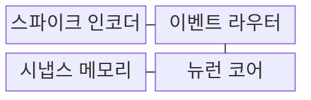
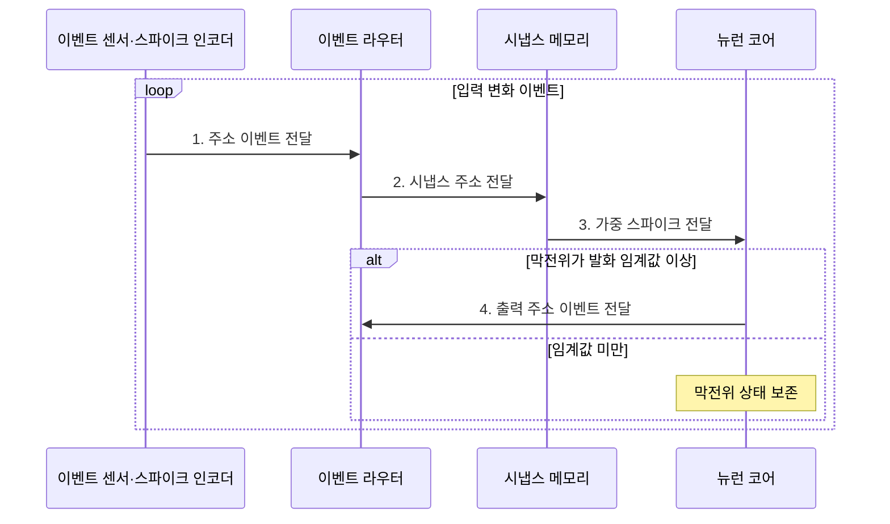

---
sidebar:
  order: 51
  label: "051. 뉴로모픽 컴퓨팅 (Neuromorphic Computing)"
  badge:
    text: "기출 · 70%"
    variant: note
title: "뉴로모픽 컴퓨팅 (Neuromorphic Computing)"
date: "2026-08-02T11:11:00+09:00"
tags:
  - "notes-hardware"
weight: 51
extra:
  question_no: "051"
  source_status: "기출"
  source_history: "128회, 138회"
  priority: 70
  priority_note: "희소 이벤트·SNN 정확도 선택"
---

## Ⅰ. 개요

핵심 용어

- **뉴로모픽 컴퓨팅(Neuromorphic Computing)**: 뇌의 뉴런과 시냅스 및 이벤트 전달을 모사해 입력 변화가 있을 때만 연산하는 구조이다.
- **스파이크(Spike)**: 뉴런 사이에서 정보의 발생 시점과 빈도를 전달하는 짧은 이산 이벤트이다.
- **이벤트 기반 처리(Event-driven Processing)**: 입력 변화가 발생한 시점에만 관련 연산과 통신을 활성화하는 방식이다.

- 정의/개념: 입력 변화를 **스파이크**로 처리하는 **이벤트 기반 구조**
- 배경/필요성: 조밀 텐서 연산은 무변화 구간에도 **전력 소모 지속**

### 쉽게 이해하기 (학습용)

- 뉴로모픽은 평소 쉬다가 입력 변화라는 문 두드림에만 반응하는 초인종과 같다

## Ⅱ. 특징

핵심 용어

- **스파이킹 신경망(Spiking Neural Network, SNN)**: 이산 스파이크의 시점과 빈도로 정보를 표현하고 전달하는 신경망이다.
- **희소 이벤트(Sparse Event)**: 전체 입력 중 일부 위치와 시점에서만 드물게 발생하여 처리할 연산량을 줄이는 변화이다.
- **근접 메모리 연산(Near-memory Computing)**: 가중치를 연산기 가까이에 저장하여 메모리 왕복과 이동 전력을 줄이는 구조이다.

- **스파이크 시점·빈도**로 값과 시간 정보 표현
- **이벤트 기반 연산**으로 무변화 구간 연산 생략
- **메모리 근접 시냅스**로 데이터 이동 전력 절감

### 쉽게 이해하기 (학습용)

- 종을 친 횟수뿐 아니라 언제 쳤는지도 메시지의 일부가 된다

## Ⅲ. 구조 및 구성요소

핵심 용어

- **스파이크 인코더(Spike Encoder)**: 센서의 입력 변화를 스파이크의 주소와 시점 및 빈도로 변환하는 회로이다.
- **이벤트 라우터(Event Router)**: 주소 이벤트를 해석하여 연결된 시냅스와 뉴런 코어로 전달하는 구성요소이다.
- **시냅스 메모리(Synaptic Memory)**: 뉴런 사이의 연결 정보와 가중치를 연산기 가까이에 저장하는 메모리이다.
- **뉴런 코어(Neuron Core)**: 입력 가중치를 막전위에 누적하고 임계값을 넘으면 출력 스파이크를 생성하는 연산기이다.

| 구성요소 | 책임 |
|:---|:---|
| 스파이크 인코더 | 변화의 **시점·빈도 변환** |
| 이벤트 라우터 | 주소 이벤트의 **목적지 전달** |
| 시냅스 메모리 | 연결·가중치 **근접 제공** |
| 뉴런 코어 | 막전위 누적·**스파이크 발화** |

### 쉽게 이해하기 (학습용)

- 인코더가 변화를 스파이크로 바꾸면 라우터와 시냅스가 뉴런 코어에 전달한다.

## Ⅳ. 흐름도

핵심 용어

- **주소 이벤트(Address Event)**: 발화한 뉴런의 주소와 시점을 담아 목적지 시냅스로 전달하는 메시지이다.
- **막전위(Membrane Potential)**: 뉴런이 들어온 가중 스파이크를 시간에 따라 누적하여 유지하는 내부 상태이다.
- **발화 임계값(Firing Threshold)**: 누적된 막전위가 출력 스파이크를 만들지 결정하는 기준값이다.

**동작 원리**

1. **주소 이벤트 전달**: 변화 위치·시점을 목적지 주소로 변환
2. **시냅스 주소 전달**: 주소에 연결된 뉴런·가중치 조회
3. **가중 스파이크 전달**: 가중치를 막전위에 누적해 임계값 판정
4. **출력 주소 이벤트 전달**: 발화 후 막전위를 초기화하고 다음 뉴런 지정

### 쉽게 이해하기 (학습용)

- 입력 이벤트의 가중치를 막전위에 누적하고 임계값을 넘을 때만 다음 스파이크를 보낸다

## Ⅴ. 종류 및 비교

핵심 용어

- **폰 노이만 구조(Von Neumann Architecture)**: 명령과 데이터를 메모리에서 연산기로 가져와 순차적으로 처리하는 구조이다.
- **조밀 텐서(Dense Tensor)**: 대부분의 원소가 유효한 값을 가져 주기적인 전체 연산에 적합한 다차원 배열이다.
- **비동기 연산(Asynchronous Computation)**: 모든 회로를 공통 클록에 맞추지 않고 이벤트 도착에 따라 개별적으로 진행하는 연산이다.

| AI 처리 구조 | 뉴로모픽 컴퓨팅 | 폰 노이만 AI 처리 |
|:---|:---|:---|
| 적용 기준 | 희소 센서·**상시 저전력 반응** | 조밀 데이터·**범용 모델 처리** |
| 핵심 특징 | 희소 스파이크의 **비동기 근접 연산** | 조밀 텐서의 **명령·클럭 연산** |
| 한계 | 조밀 이벤트·**SNN 학습·정확도 검증** | 메모리 대역폭·**이동 전력** |

> 요약: **희소 이벤트**는 뉴로모픽, **조밀 텐서**는 폰 노이만 선택

### 쉽게 이해하기 (학습용)

- 변화 때만 출동하면 뉴로모픽, 모든 구역을 계속 돌면 폰 노이만과 같다

## Ⅵ. 실무 고려사항 및 대책

핵심 용어

- **이벤트율(Event Rate)**: 단위 시간 동안 센서나 뉴런에서 발생하여 라우터로 들어오는 이벤트의 수이다.
- **타임스탬프(Timestamp)**: 비동기 이벤트가 발생한 시간이나 순서를 복원하기 위해 함께 기록하는 시간 정보이다.
- **종단 검증(End-to-end Validation)**: 입력 변환부터 SNN 출력까지 전체 경로의 정확도와 지연 및 전력을 측정하는 검증이다.
- **희소율(Sparsity Ratio)**: 전체 가능한 입력이나 연산 가운데 실제 이벤트가 발생하지 않아 생략할 수 있는 비율이다.

| 문제 | 대책 | 효과 |
|:---|:---|:---|
| 장면 변화로 이벤트가 폭주해 라우터 포화 | **이벤트율·큐 깊이** 감시와 임계값 조정 | **처리량·전력** 변동 억제 |
| 비동기 전달의 순서 변화·유실 | **타임스탬프·버퍼**와 유실 재현 시험 | **시간 정보** 보존 |
| 변환·양자화 후 SNN 정확도 저하 | 실제 이벤트로 **종단 정확도·지연** 재검증 | **SNN 품질** 판정 |
| 조밀 입력에서 이벤트 처리 오버헤드 증가 | **희소율·에너지**를 폰 노이만 방식과 비교 | **적용 구조** 판별 |

> 요약: **이벤트 카메라**의 변화 픽셀 전송으로 처리량·전력 절감

### 쉽게 이해하기 (학습용)

- 알림이 몰리면 큐를 조절하고 조밀 입력이면 폰 노이만과 비교해 처리 구조를 바꾼다

## Ⅶ. 결론

핵심 용어

- **상시 저전력 반응(Always-on Low-power Response)**: 장치를 계속 켜 두면서 드문 입력 변화에 작은 에너지로 즉시 반응하는 조건이다.
- **이벤트 카메라(Event Camera)**: 프레임 전체가 아니라 밝기가 변한 픽셀의 위치와 시점만 이벤트로 출력하는 센서이다.
- **메모리 이동 전력(Data-movement Power)**: 연산기와 메모리 사이에서 데이터가 이동할 때 배선과 인터페이스에서 소비되는 전력이다.

- **희소 이벤트•상시 저전력**은 뉴로모픽, **조밀 입력**은 폰 노이만

### 쉽게 이해하기 (학습용)

- 알림이 드물고 모델 판단이 유지될 때만 초인종 방식이 유리하다
