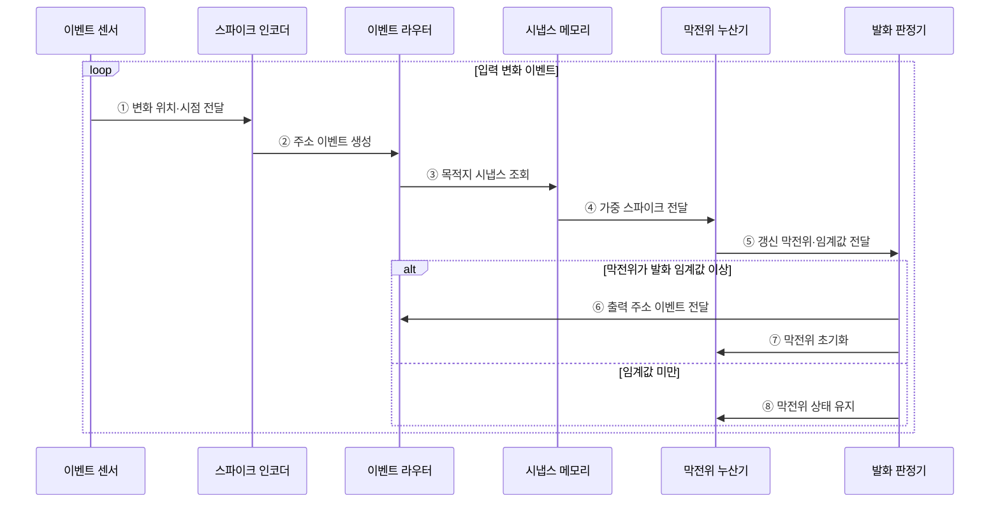

---
sidebar:
  order: 51
  label: "051. 뉴로모픽 컴퓨팅 (Neuromorphic Computing)"
  badge:
    text: "기출 · 70%"
    variant: note
title: "뉴로모픽 컴퓨팅 (Neuromorphic Computing)"
date: "2026-07-28T13:00:51+09:00"
tags:
  - "notes-hardware"
weight: 51
extra:
  question_no: "051"
  source_status: "기출"
  source_history: "128회, 138회"
  priority: 70
  priority_note: "희소 이벤트·SNN 정확도 선택"
---

## 미리 알고가기

- **뉴로모픽 컴퓨팅(Neuromorphic Computing)**: 뇌의 뉴런·시냅스와 이벤트 전달을 모사해 입력 변화 때만 연산하는 구조
- **스파이크(Spike)**: 뉴런 사이를 오가는 짧은 이산 이벤트
- **스파이킹 신경망(Spiking Neural Network, SNN)**: 이산 스파이크의 발생 시점과 빈도로 정보를 표현하고 전달하는 신경망
- **이벤트 기반 처리(Event-driven Processing)**: 입력 변화 때만 연산·통신 활성화
- **시냅스 메모리(Synaptic Memory)**: 뉴런 연결과 가중치를 저장하는 근접 메모리
- **막전위(Membrane Potential)**: 뉴런이 입력을 누적하는 내부 상태
- **발화 임계값(Firing Threshold)**: 출력 스파이크를 만드는 누적 기준
- **비동기 라우팅(Asynchronous Routing)**: 공통 클럭 없이 이벤트를 목적지로 전달
- **폰 노이만 구조(Von Neumann Architecture)**: 명령·데이터를 메모리와 연산기 사이 이동
- **이벤트 카메라(Event Camera)**: 밝기가 변한 픽셀만 이벤트로 출력
- **인공지능(Artificial Intelligence, AI)**: 뉴로모픽 구조에서 스파이킹 신경망으로 분류·예측을 수행하는 응용 분야
- **희소 이벤트(Sparse Event)**: 전체 입력 중 일부 위치·시점에서만 드물게 발생해 이벤트 기반 처리의 연산량을 줄이는 변화
- **근접 메모리 연산(Near-memory Computing)**: 가중치를 연산기 가까이에 두어 메모리 왕복을 줄이는 구조
- **주소 이벤트(Address Event)**: 발생한 뉴런의 주소와 시점을 담아 라우터가 목적지 시냅스로 전달하는 메시지
- **조밀 텐서(Dense Tensor)**: 대부분의 원소가 0이 아닌 다차원 배열로 주기적 전체 연산에 적합한 데이터
- **클록(Clock)**: 회로의 연산·상태 갱신 시점을 맞추는 주기 신호
- **메모리 대역폭(Memory Bandwidth)**: 메모리가 단위 시간에 공급·수신할 수 있는 데이터 양

## Ⅰ. 개요

- 정의/개념: 입력 변화를 **희소 스파이크 이벤트**로 처리하는 구조
- 기존 한계: 주기적 조밀 연산은 **무변화 구간 전력**까지 소모

### 쉽게 이해하기 (학습용)

- 평소에는 쉬다가 문을 두드리는 순간에만 반응하는 초인종과 같다

## Ⅱ. 특징

- **스파이크 시점·빈도**로 값과 시간 정보 표현
- **이벤트 기반 연산**으로 무변화 구간 연산 생략
- **메모리 근접 시냅스**로 데이터 이동 전력 절감

### 쉽게 이해하기 (학습용)

- 종을 친 횟수뿐 아니라 언제 쳤는지도 메시지의 일부가 된다

## Ⅲ. 아키텍처 및 구성요소

### 도표안 A. 뉴로모픽 정적 구조

| 설계 요소 | 입력·상태 | 역할 |
|:---|:---|:---|
| 스파이크 인코더 | 센서 변화·시간 | 시점·빈도 이벤트 변환 |
| 이벤트 라우터 | 주소 이벤트·경로 상태 | 목적지 뉴런 전달 |
| 시냅스 메모리 | 연결·가중치 | 근접 가중 이벤트 제공 |
| 뉴런 코어 | 가중 입력·막전위·임계값 | 상태 누적·스파이크 발화 |

> 요약: 라우터가 보내면 시냅스가 뉴런 입력을 가중한다

### 도표안 B. 스파이크 라우팅·막전위 발화 시퀀스

### 동작 원리

1. **① 변화 위치·시점 전달**: 이벤트 카메라 등의 센서는 전체 프레임 대신 밝기나 상태가 바뀐 위치와 발생 시점만 인코더에 보낸다.
2. **② 주소 이벤트 생성**: 스파이크 인코더는 센서 변화를 발생 뉴런·픽셀의 주소와 타임스탬프가 담긴 이산 이벤트로 바꾼다.
3. **③ 목적지 시냅스 조회**: 비동기 라우터는 주소 이벤트의 연결 정보를 이용해 활성화할 시냅스와 목적지 뉴런을 찾는다.
4. **④ 가중 스파이크 전달**: 시냅스 메모리는 저장된 연결 가중치를 이벤트에 적용해 해당 뉴런의 막전위 누산기에 전달한다.
5. **⑤ 갱신 막전위·임계값 전달**: 누산기는 이전 막전위에 가중 입력과 시간 감쇠를 반영하고 발화 판정기에 현재 상태를 보낸다.
6. **⑥ 출력 주소 이벤트 전달**: 막전위가 임계값에 도달하면 판정기는 새 스파이크를 라우터로 보내 다음 뉴런들에 전파한다.
7. **⑦ 막전위 초기화**: 발화한 뉴런은 모델 규칙에 따라 막전위를 초기화하거나 일정 값을 차감해 다음 이벤트를 받을 준비를 한다.
8. **⑧ 막전위 상태 유지**: 임계값에 못 미치면 출력 통신 없이 내부 상태만 보존해 무변화 구간의 연산·전력을 줄인다.

### 쉽게 이해하기 (학습용)

- 초인종 번호를 보고 담당자에게 보내면 기억한 중요도만큼 반응이 쌓인다

## Ⅳ. 종류 및 비교

| AI 처리 구조 | 뉴로모픽 컴퓨팅 | 폰 노이만 AI 처리 |
|:---|:---|:---|
| 적용 기준 | 희소 센서·**상시 저전력 반응** | 조밀 데이터·**범용 모델 처리** |
| 핵심 특징 | 희소 스파이크의 **비동기 근접 연산** | 조밀 텐서의 **명령·클럭 연산** |
| 한계 | 조밀 이벤트·**SNN 정확도 저하** | 메모리 대역폭·**이동 전력** |

> 요약: 희소 반응은 뉴로모픽, 조밀 처리는 폰 노이만이다

### 쉽게 이해하기 (학습용)

- 변화 때만 출동하면 뉴로모픽, 모든 구역을 계속 돌면 폰 노이만과 같다

## Ⅴ. 실무 고려사항 및 대응 방안

| 운영 위험 | 대응 | 기대 효과 |
|:---|:---|:---|
| 장면 변화로 이벤트가 폭주해 라우터 포화 | 이벤트율·큐 깊이 감시와 임계값·억제 조정 | 처리량·전력 안정화 |
| 비동기 전달의 순서 변화·유실 | 타임스탬프·버퍼·유실 계수와 재현 시험 적용 | 시간 의미 보존 |
| 변환·양자화 후 SNN 정확도 저하 | 실제 이벤트 데이터로 종단 정확도·지연 재검증 | 모델 품질 확보 |
| 조밀 입력에서 이벤트 처리 오버헤드가 증가 | 희소율·에너지·정확도를 폰 노이만 방식과 비교 | 적용 조건 판별 |

> 이벤트 카메라는 변화한 픽셀만 스파이크로 전송해 상시 동작 감지의 처리량과 전력을 줄인다.

### 쉽게 이해하기 (학습용)

- 변화 알림의 중요도를 쌓다가 기준을 넘으면 다음 담당자에게 알린다.
- 이벤트 카메라는 전체 프레임 대신 밝기가 변한 픽셀의 이벤트만 전달해 처리량과 전력 소모를 줄인다

## Ⅵ. 결론

- 희소 처리 효율을 위해 정확도·전력을 검토하여 **뉴로모픽** 활용

### 쉽게 이해하기 (학습용)

- 알림이 드물고 모델 판단이 유지될 때만 초인종 방식이 유리하다
