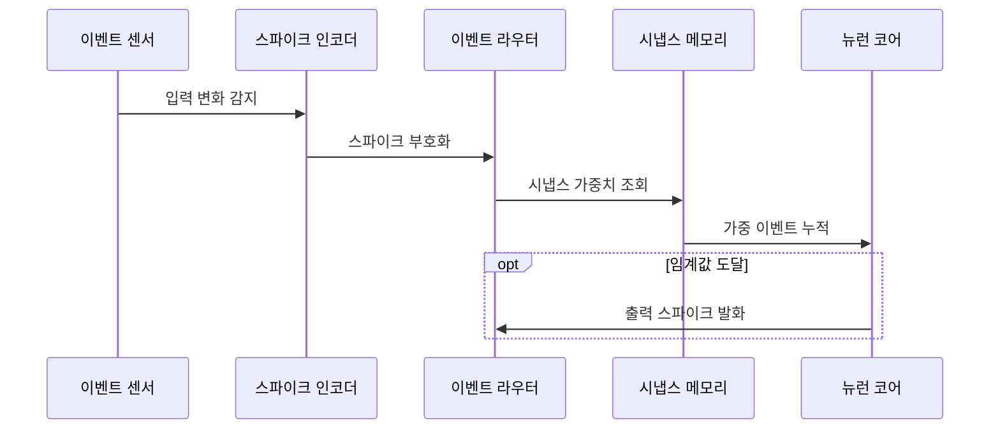

---
sidebar:
  order: 51
  label: "051. 뉴로모픽 컴퓨팅 (Neuromorphic Computing)"
  badge:
    text: "기출 · 70%"
    variant: note
title: "뉴로모픽 컴퓨팅 (Neuromorphic Computing)"
date: "2026-07-27T23:59:59+09:00"
tags:
  - "notes-hardware"
weight: 51
extra:
  question_no: "051"
  source_status: "기출"
  source_history: "128회, 138회"
  priority: 70
  priority_note: "희소 이벤트·SNN 정확도 선택"
---

## 미리 알고가기

- **뉴로모픽 컴퓨팅(Neuromorphic Computing)**: 뇌의 뉴런·시냅스와 이벤트 전달을 모사해 입력 변화 때만 연산하는 구조
- **스파이크(Spike)**: 뉴런 사이를 오가는 짧은 이산 이벤트
- **스파이킹 신경망(Spiking Neural Network, SNN)**: ‘에스엔엔’으로 읽고 영문 머리글자를 딴 약어이며, 스파이크 시점·빈도로 정보를 표현
- **이벤트 기반 처리(Event-driven Processing)**: 입력 변화 때만 연산·통신 활성화
- **시냅스 메모리(Synaptic Memory)**: 뉴런 연결과 가중치를 저장하는 근접 메모리
- **막전위(Membrane Potential)**: 뉴런이 입력을 누적하는 내부 상태
- **발화 임계값(Firing Threshold)**: 출력 스파이크를 만드는 누적 기준
- **비동기 라우팅(Asynchronous Routing)**: 공통 클럭 없이 이벤트를 목적지로 전달
- **폰 노이만 구조(Von Neumann Architecture)**: 명령·데이터를 메모리와 연산기 사이 이동
- **이벤트 카메라(Event Camera)**: 밝기가 변한 픽셀만 이벤트로 출력
- **인공지능(Artificial Intelligence, AI)**: ‘에이아이’로 읽고 영문 머리글자를 딴 약어이며, 뉴로모픽 구조에서는 SNN으로 분류·예측을 수행
- **희소 이벤트(Sparse Event)**: 전체 입력 중 일부 위치·시점에서만 드물게 발생해 이벤트 기반 처리의 연산량을 줄이는 변화
- **근접 메모리 연산(Near-memory Computing)**: 가중치를 연산기 가까이에 두어 메모리 왕복을 줄이는 구조
- **주소 이벤트(Address Event)**: 발생한 뉴런의 주소와 시점을 담아 라우터가 목적지 시냅스로 전달하는 메시지
- **조밀 텐서(Dense Tensor)**: 대부분의 원소가 0이 아닌 다차원 배열로 주기적 전체 연산에 적합한 데이터
- **클록(Clock)**: 회로의 연산·상태 갱신 시점을 맞추는 주기 신호
- **메모리 대역폭(Memory Bandwidth)**: 메모리가 단위 시간에 공급·수신할 수 있는 데이터 양

## Ⅰ. 개요

- **정의/개념**: 입력 변화를 **희소 스파이크 이벤트**로 처리하는 구조
- **기존 한계**: 주기적 조밀 연산은 **무변화 구간 전력**까지 소모

### 쉽게 이해하기 (학습용)

- 평소에는 쉬다가 문을 두드리는 순간에만 반응하는 초인종과 같다

## Ⅱ. 특징

- **스파이크 시점·빈도**로 값과 시간 정보 표현
- **이벤트 기반 연산**으로 무변화 구간 연산 생략
- **메모리 근접 시냅스**로 데이터 이동 전력 절감

### 쉽게 이해하기 (학습용)

- 종을 친 횟수뿐 아니라 언제 쳤는지도 메시지의 일부가 된다

## Ⅲ. 아키텍처 및 구성요소

| 설계 요소 | 설명 |
|:---|:---|
| 스파이크 인코더 | 센서 값을 시점·빈도 기반 이벤트로 변환 |
| 이벤트 라우터 | 스파이크를 목적지 뉴런 주소로 전달 |
| 시냅스 메모리 | 연결 정보·가중치를 뉴런 가까이에 저장 |
| 뉴런 코어 | 가중 입력을 누적해 임계값에서 발화 |

> 요약: 라우터가 보내면 시냅스가 뉴런 입력을 가중한다

### 쉽게 이해하기 (학습용)

- 초인종 번호를 보고 담당자에게 보내면 기억한 중요도만큼 반응이 쌓인다

## Ⅳ. 원리 및 절차 흐름도

| 절차 | 설명 |
|:---|:---|
| 입력 변화 감지 | 센서가 변한 값만 인코더에 전달 |
| 스파이크 부호화 | 변화량을 스파이크 시점·빈도로 표현 |
| 시냅스 가중치 조회 | 목적지 연결·가중치 선택 |
| 가중 이벤트 누적 | 가중 입력을 뉴런 막전위에 합산 |
| 출력 스파이크 발화 | 임계값 도달 시 다음 뉴런으로 전송 |

> 요약: 변화를 가중 누적하고 임계값에서 발화한다

### 쉽게 이해하기 (학습용)

- 변화 알림의 중요도를 쌓다가 기준을 넘으면 다음 담당자에게 알린다

## Ⅴ. 종류 및 비교

| AI 처리 구조 | 뉴로모픽 컴퓨팅 | 폰 노이만 AI 처리 |
|:---|:---|:---|
| 적용 기준 | 희소 센서·**상시 저전력 반응** | 조밀 데이터·**범용 모델 처리** |
| 핵심 특징 | 희소 스파이크의 **비동기 근접 연산** | 조밀 텐서의 **명령·클럭 연산** |
| 한계 | 조밀 이벤트·**SNN 정확도 저하** | 메모리 대역폭·**이동 전력** |

> 요약: 희소 반응은 뉴로모픽, 조밀 처리는 폰 노이만이다

### 쉽게 이해하기 (학습용)

- 변화 때만 출동하면 뉴로모픽, 모든 구역을 계속 돌면 폰 노이만과 같다

## Ⅵ. 실무 사례

1. 이벤트 카메라는 **변화 픽셀만 전송**해 동작 감지

### 쉽게 이해하기 (학습용)

- 화면 전체를 반복 촬영하지 않고 밝기가 달라진 위치만 경비원에게 알린다

## Ⅶ. 결론

- **희소 이벤트 처리**에서 정확도가 유지되면 뉴로모픽 선택

### 쉽게 이해하기 (학습용)

- 알림이 드물고 모델 판단이 유지될 때만 초인종 방식이 유리하다
