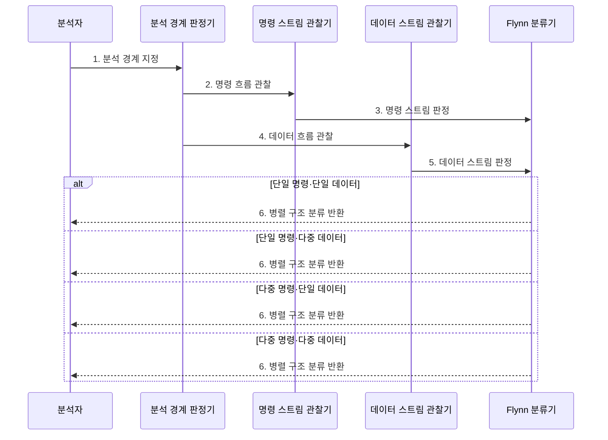

---
sidebar:
  order: 52
  label: "052. 병렬 컴퓨터 분류: Flynn 분류 (Flynn's Taxonomy)"
  badge:
    text: "기출 · 70%"
    variant: note
title: "병렬 컴퓨터 분류: Flynn 분류 (Flynn's Taxonomy)"
date: "2026-07-28T13:01:17+09:00"
tags:
  - "notes-hardware"
weight: 52
extra:
  question_no: "052"
  source_status: "기출"
  source_history: "131회, 134회"
  priority: 70
  priority_note: "명령·데이터 스트림 2×2 분류"
---

## 미리 알고가기

- **플린 분류(Flynn's Taxonomy)**: 명령·데이터 스트림 수의 2×2 분류
- **2×2 분류 행렬**: 2×2는 '이 곱하기 이'로 읽고 두 분류 축에 각각 두 경우가 있어 쓰며, 명령·데이터 스트림 수의 조합으로 본문의 네 구조를 구분하는 표임
- **명령 스트림(Instruction Stream)**: 독립 제어 장치가 내보내는 명령 흐름
- **데이터 스트림(Data Stream)**: 동시에 연산되는 독립 데이터 흐름
- **단일 명령 단일 데이터(Single Instruction Single Data, SISD)**: 하나의 명령 스트림이 하나의 데이터 스트림을 처리하는 순차 구조
- **단일 명령 다중 데이터(Single Instruction Multiple Data, SIMD)**: 하나의 명령 스트림이 여러 데이터 스트림을 동시에 처리하는 병렬 구조
- **다중 명령 단일 데이터(Multiple Instruction Single Data, MISD)**: 여러 명령 스트림이 하나의 데이터 스트림을 처리하는 병렬 구조
- **다중 명령 다중 데이터(Multiple Instruction Multiple Data, MIMD)**: 여러 명령 스트림이 서로 다른 데이터 스트림을 독립적으로 처리하는 병렬 구조
- **데이터 병렬성(Data Parallelism)**: 같은 연산을 여러 데이터에 적용
- **작업 병렬성(Task Parallelism)**: 서로 다른 작업을 독립 실행
- **분석 경계(Analysis Boundary)**: 코어·칩·노드 중 분류할 계층
- **코어·칩·노드(Core·Chip·Node)**: 코어는 독립 명령 실행 단위, 칩은 여러 코어를 담은 반도체, 노드는 메모리와 운영체제를 갖춘 한 컴퓨터
- **스칼라 처리(Scalar Processing)**: 한 명령이 한 번에 데이터 값 하나를 처리하는 방식
- **벡터 처리(Vector Processing)**: 한 명령이 고정 폭의 여러 데이터 원소를 동시에 처리하는 방식
- **그래픽 처리 장치(Graphics Processing Unit, GPU)**: 다수 스레드로 데이터 병렬 연산을 수행하는 SIMD·SIMT 계열 프로세서
- **워프(Warp)**: NVIDIA GPU에서 공통 명령을 함께 실행하는 스레드 묶음
- **멀티코어(Multicore)**: 한 칩에 독립 명령 흐름을 실행하는 여러 코어를 통합한 구조
- **클러스터(Cluster)**: 여러 컴퓨터 노드를 네트워크로 연결해 작업을 분산하는 시스템

## Ⅰ. 개요

- 정의/개념: **명령·데이터 스트림 수**로 병렬 구조를 분류
- 배경/필요성: 처리기 수 기준의 **병렬성 구분 한계** 보완

### 쉽게 이해하기 (학습용)

- 동시에 쓰는 레시피와 재료 묶음 수로 주방을 네 갈래로 나눈다

## Ⅱ. 특징

- **독립 명령 스트림 수**로 제어 흐름 구분
- **독립 데이터 스트림 수**로 동시 처리 범위 구분
- **분석 경계 고정**으로 코어·칩·노드 분류 혼선 방지

### 쉽게 이해하기 (학습용)

- 조리대가 많아도 같은 레시피를 따르면 명령 흐름은 하나로 센다

## Ⅲ. 구조 및 구성요소

| 구성요소 | 책임 |
|:---|:---|
| 분석 경계 | 코어·칩·노드 **범위 고정** |
| 명령 스트림 수 | 독립 **제어 흐름 판정** |
| 데이터 스트림 수 | 동시 **데이터 흐름 판정** |
| 2×2 분류 행렬 | 네 병렬 **구조 결정** |

### 쉽게 이해하기 (학습용)

- 분석 범위를 정한 뒤 명령과 데이터 흐름 수를 조합해 네 구조로 분류한다.

## Ⅳ. 흐름도

**동작 원리**

- **1. 분석 경계 지정**: 분류 범위 확정
- **2. 명령 흐름 관찰**: 제어 단위 확인
- **3. 명령 스트림 판정**: 단일·다중 결정
- **4. 데이터 흐름 관찰**: 처리 단위 확인
- **5. 데이터 스트림 판정**: 단일·다중 결정
- **6. 병렬 구조 분류 반환**: 두 판정 조합

### 쉽게 이해하기 (학습용)

- 어느 주방을 볼지 정하고 레시피와 재료 묶음 수를 조합표에 넣는다

## Ⅴ. 종류 및 비교

| Flynn 분류 | SISD | SIMD | MISD | MIMD |
|:---|:---|:---|:---|:---|
| 적용 기준 | 순차 스칼라 | 동일 연산·다중 데이터 | 동일 입력·다중 처리 | 독립 작업·데이터 |
| 핵심 특징 | 단일 명령·**단일 데이터** | 단일 명령·**다중 데이터** | 다중 명령·**단일 데이터** | 다중 명령·**다중 데이터** |
| 한계 | 병렬 처리량 부족 | 분기·레인 미활용 | 적용 사례 제한 | 동기화·통신 비용 |

> 요약: 동일 연산은 SIMD, 독립 작업은 MIMD가 맞다

### 쉽게 이해하기 (학습용)

- 레시피 하나로 여러 재료를 다루면 SIMD, 각자 주문을 맡으면 MIMD이다

## Ⅵ. 실무 고려사항 및 대책

| 고려사항 | 대책 | 효과 |
|:---|:---|:---|
| 코어·칩·노드 경계를 섞어 분류 | 비교 대상마다 분석 경계를 먼저 명시 | 분류 일관성 확보 |
| GPU SIMT를 하드웨어 SIMD와 동일시 | 명령 발행 단위와 스레드 상태를 구분해 기술 | 실행 모델 오해 방지 |
| 이기종 시스템 전체를 단일 범주로 단순화 | CPU·GPU·노드 계층별로 각각 분류 | 혼합 병렬성 정확한 표현 |

> GPU 워프 내부의 공통 명령·다중 데이터 실행은 SIMD 관점으로, 독립 명령 흐름을 가진 여러 GPU·노드는 MIMD 관점으로 분류하되 분석 경계를 함께 밝힌다.

### 쉽게 이해하기 (학습용)

- 한 조리대는 같은 레시피를 따르지만 여러 주방은 각자 다른 주문을 처리한다

## Ⅶ. 결론

- **분석 경계·스트림 수**로 병렬 구조를 분류한다.

### 쉽게 이해하기 (학습용)

- 먼저 어느 주방을 볼지 정해야 레시피와 재료 수를 올바르게 셀 수 있다
