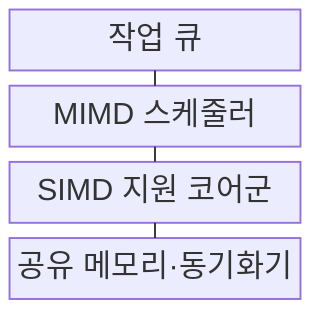
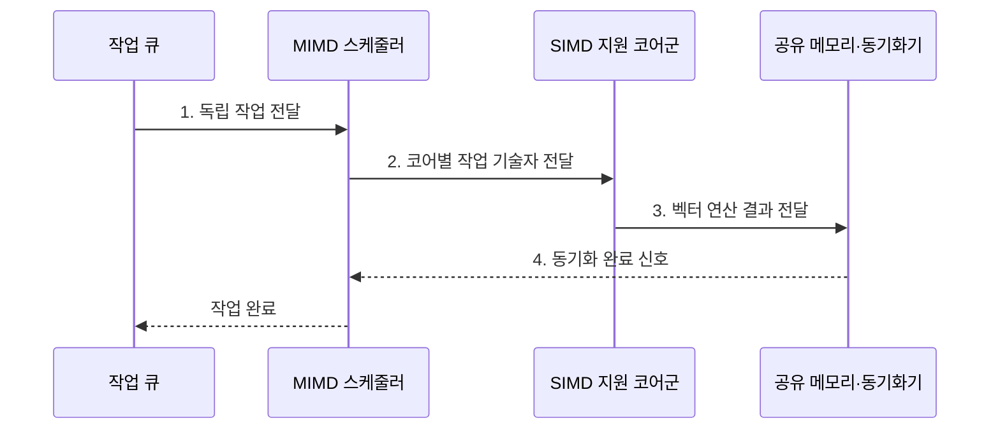

---
sidebar:
  order: 53
  label: "053. SIMD·MIMD 프로세서 (SIMD MIMD)"
  badge:
    text: "기출 · 70%"
    variant: note
title: "SIMD·MIMD 프로세서 (SIMD MIMD)"
date: "2026-07-30T21:35:00+09:00"
tags:
  - "notes-hardware"
weight: 53
extra:
  question_no: "053"
  source_status: "기출"
  source_history: "131회, 134회"
  priority: 70
  priority_note: "데이터 병렬과 작업 병렬의 선택 기준"
---

## 미리 알고가기

- **단일 명령 다중 데이터(Single Instruction Multiple Data, SIMD)**: 하나의 명령을 여러 데이터 원소에 동시에 적용하는 병렬 처리 방식
- **다중 명령 다중 데이터(Multiple Instruction Multiple Data, MIMD)**: 여러 독립 명령 흐름이 서로 다른 데이터를 동시에 처리하는 병렬 구조
- **데이터 병렬성(Data Parallelism)**: 같은 연산을 여러 데이터에 동시 적용
- **작업 병렬성(Task Parallelism)**: 독립 작업을 서로 다른 코어에서 실행
- **연산 레인(Execution Lane)**: SIMD 명령 하나의 데이터 원소 처리
- **분기 발산(Branch Divergence)**: 마스크 분기에서 일부 연산 레인이 비활성화되는 현상
- **동기화 비용(Synchronization Cost)**: 락·배리어·메시지 대기 시간
- **활성 마스크(Active Mask)**: SIMD 레인 중 현재 명령을 실행할 레인만 표시하는 비트 집합
- **락·배리어(Lock·Barrier)**: 락은 공유 자원의 동시 접근을 제한하고 배리어는 모든 작업이 특정 지점에 도달할 때까지 기다리게 함
- **인터커넥트(Interconnect)**: 코어·메모리 사이의 데이터와 동기화 메시지를 전달하는 연결망
- **조밀 벡터·행렬(Dense Vector·Matrix)**: 대부분의 원소가 0이 아니며 같은 연산을 연속 원소에 반복하기 쉬운 데이터
- **비정형 분기(Irregular Branch)**: 입력마다 실행 경로·작업량이 달라 공통 명령으로 묶이지 않는 제어 흐름
- **부하 불균형(Load Imbalance)**: 코어별 작업량이 달라 일부 코어가 끝난 뒤 다른 코어를 기다리는 상태
- **작업 큐(Work Queue)**: 독립 실행할 작업과 입력 범위를 대기 순서대로 보관해 여러 코어에 배분하는 자료구조
- **동적 스케줄링(Dynamic Scheduling)**: 실행 중 작업 완료와 부하 상태를 보고 남은 작업을 유휴 코어에 다시 배치하는 방식

> **키워드:** SIMD·MIMD 프로세서 (SIMD MIMD)

## Ⅰ. 개요

- 정의/개념: **공통·독립 명령 흐름**으로 데이터 처리를 구분하는 **병렬 구조**
- 배경/필요성: 단일 실행 방식은 규칙·비정형 작업의 **혼합 병렬화 제약**

### 쉽게 이해하기 (학습용)

- 한 감독이 같은 동작을 여러 사람에게 시키거나 각자가 다른 일을 맡는 차이다

## Ⅱ. 특징

- **SIMD 공통 명령**으로 제어·해석 비용 절감
- **MIMD 독립 명령**으로 상이한 작업 동시 실행
- **계층형 병렬성**으로 코어 간 작업·코어 내 데이터 병렬 결합

### 쉽게 이해하기 (학습용)

- 한 감독을 공유하면 작업대를 늘리기 쉽고 독립 감독은 다른 주문을 함께 진행한다

## Ⅲ. 구조 및 구성요소

| 구성요소 | 책임 |
|:---|:---|
| 작업 큐 | 독립 작업·입력 범위 **대기 보관** |
| MIMD 스케줄러 | 작업을 코어별로 **독립 배치** |
| SIMD 지원 코어군 | 공통 명령의 **다중 데이터 처리** |
| 공유 메모리·동기화기 | 코어 간 데이터 교환·**배리어 판정** |

### 쉽게 이해하기 (학습용)

- MIMD 코어가 서로 다른 작업을 맡고 각 코어의 규칙 구간은 SIMD 레인이 처리한다.

## Ⅳ. 흐름도

**동작 원리**

1. **독립 작업 전달**: 작업 큐가 서로 다른 제어 흐름을 제출
2. **코어별 작업 기술자 전달**: MIMD 스케줄러가 독립 작업을 코어에 할당
3. **벡터 연산 결과 전달**: 각 코어가 공통 명령을 여러 데이터 레인에 적용
4. **동기화 완료 신호**: 모든 코어의 배리어 도착 후 후속 작업 해제

### 쉽게 이해하기 (학습용)

- MIMD 코어는 서로 다른 작업을 실행하고 각 코어의 규칙 구간은 SIMD 레인으로 병렬 처리한다

## Ⅴ. 종류 및 비교

| 병렬 실행 구조 | SIMD | MIMD |
|:---|:---|:---|
| 적용 기준 | 조밀 **벡터·행렬·영상** | 서비스·그래프·**비정형 분기** |
| 핵심 특징 | 공통 명령의 **다중 데이터 처리** | 독립 명령의 **다중 작업 처리** |
| 한계 | 분기 발산·**비연속 메모리** | 동기화·통신·**부하 불균형** |

> 요약: 규칙 연산에는 **SIMD**, 독립 작업에는 **MIMD** 선택

### 쉽게 이해하기 (학습용)

- SIMD는 같은 틀의 프레스, MIMD는 주문별 독립 작업장에 가깝다

## Ⅵ. 실무 고려사항 및 대책

| 고려사항 | 대책 | 효과 |
|:---|:---|:---|
| SIMD 분기 발산으로 레인 비활성 증가 | 같은 경로 데이터를 묶고 **활성 마스크** 측정 | **레인 활용률** 향상 |
| 비연속 주소로 벡터 메모리 요청 증가 | 자료 배치·루프 순서를 **연속 접근**에 정렬 | **메모리 대역폭** 활용률 향상 |
| MIMD 동기화·부하 불균형으로 코어 대기 | 작업 세분화·**동적 스케줄링** 적용 | **코어 대기 시간** 감소 |
| SIMD·MIMD 경계의 변환·복사 비용 | 규칙 구간 확대·**경계 데이터 형식** 통일 | **혼합 실행 오버헤드** 감소 |

> 요약: 영상 타일은 **MIMD**, 연속 픽셀은 **SIMD** 병렬 처리

### 쉽게 이해하기 (학습용)

- 영상 타일은 MIMD 코어에 나누고 각 타일의 연속 픽셀은 SIMD 레인으로 처리한다

## Ⅶ. 결론

- **동일 연산**은 SIMD, **독립 제어**는 MIMD 선택

### 쉽게 이해하기 (학습용)

- 같은 동작이 반복되면 한 구령을, 일이 제각각이면 독립 지시를 선택한다
