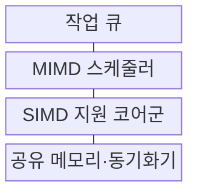
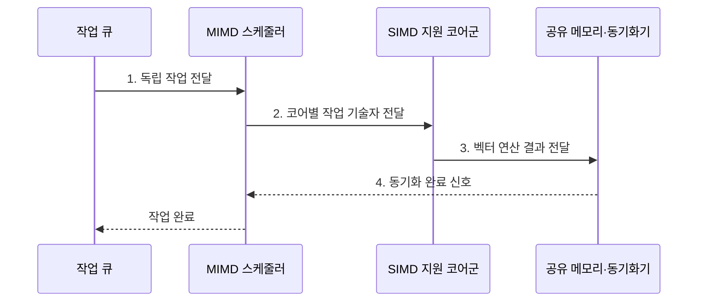

---
sidebar:
  order: 53
  label: "053. SIMD·MIMD 프로세서 (SIMD MIMD)"
  badge:
    text: "기출 · 70%"
    variant: note
title: "SIMD·MIMD 프로세서 (SIMD MIMD)"
date: "2026-08-02T11:13:00+09:00"
tags:
  - "notes-hardware"
weight: 53
extra:
  question_no: "053"
  source_status: "기출"
  source_history: "131회, 134회"
  priority: 70
  priority_note: "데이터 병렬과 작업 병렬의 선택 기준"
---

## Ⅰ. 개요

핵심 용어

- **단일 명령 다중 데이터(Single Instruction Multiple Data, SIMD)**: 하나의 명령을 여러 데이터 원소에 동시에 적용하는 병렬 처리 방식이다.
- **다중 명령 다중 데이터(Multiple Instruction Multiple Data, MIMD)**: 여러 독립 명령 흐름이 서로 다른 데이터를 동시에 처리하는 병렬 구조이다.
- **병렬 구조(Parallel Architecture)**: 여러 연산 자원이 명령과 데이터를 나누어 동시에 처리하도록 구성한 하드웨어 구조이다.

- 정의/개념: **SIMD와 MIMD**는 각각 하나의 공통 명령으로 여러 데이터를 처리하거나 독립 명령 흐름으로 서로 다른 데이터를 처리하는 **병렬 실행 구조**
- 배경/필요성: 단일 실행 방식은 규칙·비정형 작업의 **혼합 병렬화 제약**

#### 한줄 요약

- 한 감독이 같은 동작을 여러 사람에게 시키거나 각자가 다른 일을 맡는 차이다

## Ⅱ. 특징

핵심 용어

- **공통 명령(Common Instruction)**: 하나의 제어 장치가 여러 연산 레인에 동시에 발행하는 동일한 연산 지시이다.
- **독립 명령 흐름(Independent Instruction Flow)**: 각 코어가 다른 작업 순서와 분기를 별도로 실행하는 제어 흐름이다.
- **계층형 병렬성(Hierarchical Parallelism)**: 코어 사이의 작업 병렬성과 코어 내부의 데이터 병렬성을 함께 사용하는 구조이다.

- **SIMD 공통 명령**으로 제어·해석 비용 절감
- **MIMD 독립 명령**으로 상이한 작업 동시 실행
- **계층형 병렬성**으로 코어 간 작업·코어 내 데이터 병렬 결합

#### 한줄 요약

- 한 감독을 공유하면 작업대를 늘리기 쉽고 독립 감독은 다른 주문을 함께 진행한다

## Ⅲ. 구조 및 구성요소

핵심 용어

- **작업 큐(Work Queue)**: 독립적으로 실행할 작업과 입력 범위를 대기 순서대로 보관하여 여러 코어에 배분하는 자료구조이다.
- **MIMD 스케줄러(MIMD Scheduler)**: 서로 다른 작업을 실행 가능한 코어에 독립적으로 할당하는 구성요소이다.
- **연산 레인(Execution Lane)**: SIMD 명령 하나가 담당하는 데이터 원소를 처리하는 병렬 연산 통로이다.
- **배리어(Barrier)**: 참여한 모든 작업이 특정 지점에 도달할 때까지 후속 실행을 막는 동기화 기법이다.

| 구성요소 | 책임 |
|:---|:---|
| 작업 큐 | 독립 작업·입력 범위 **대기 보관** |
| MIMD 스케줄러 | 작업을 코어별로 **독립 배치** |
| SIMD 지원 코어군 | 공통 명령의 **다중 데이터 처리** |
| 공유 메모리·동기화기 | 코어 간 데이터 교환·**배리어 판정** |

#### 한줄 요약

- MIMD 코어가 서로 다른 작업을 맡고 각 코어의 규칙 구간은 SIMD 레인이 처리한다.

## Ⅳ. 흐름도

핵심 용어

- **작업 기술자(Work Descriptor)**: 실행할 함수와 데이터 범위 및 의존성을 기록하여 코어에 전달하는 정보이다.
- **벡터 연산(Vector Operation)**: 하나의 명령으로 여러 데이터 원소에 같은 계산을 수행하는 연산이다.
- **동기화 완료(Synchronization Completion)**: 모든 참여 코어가 필요한 결과를 기록하고 대기 조건을 충족한 상태이다.

**동작 원리**

1. **독립 작업 전달**: 작업 큐가 서로 다른 제어 흐름을 제출
2. **코어별 작업 기술자 전달**: MIMD 스케줄러가 독립 작업을 코어에 할당
3. **벡터 연산 결과 전달**: 각 코어가 공통 명령을 여러 데이터 레인에 적용
4. **동기화 완료 신호**: 모든 코어의 배리어 도착 후 후속 작업 해제

#### 한줄 요약

- MIMD 코어는 서로 다른 작업을 실행하고 각 코어의 규칙 구간은 SIMD 레인으로 병렬 처리한다

## Ⅴ. 종류 및 비교

핵심 용어

- **조밀 벡터·행렬(Dense Vector·Matrix)**: 대부분의 원소가 유효하여 같은 연산을 연속 원소에 반복하기 쉬운 데이터이다.
- **비정형 분기(Irregular Branch)**: 입력마다 실행 경로와 작업량이 달라 공통 명령으로 묶기 어려운 제어 흐름이다.
- **동기화 비용(Synchronization Cost)**: 락과 배리어 및 메시지를 기다리느라 실제 연산을 수행하지 못하는 시간이다.

| 병렬 실행 구조 | SIMD | MIMD |
|:---|:---|:---|
| 적용 기준 | 조밀 **벡터·행렬·영상** | 서비스·그래프·**비정형 분기** |
| 핵심 특징 | 공통 명령의 **다중 데이터 처리** | 독립 명령의 **다중 작업 처리** |
| 한계 | 분기 발산·**비연속 메모리** | 동기화·통신·**부하 불균형** |

> 요약: 규칙 연산에는 **SIMD**, 독립 작업에는 **MIMD** 선택

#### 한줄 요약

- SIMD는 같은 틀의 프레스, MIMD는 주문별 독립 작업장에 가깝다

## Ⅵ. 실무 고려사항 및 대책

핵심 용어

- **분기 발산(Branch Divergence)**: 같은 SIMD 묶음의 데이터가 다른 경로를 선택하여 일부 연산 레인이 비활성화되는 현상이다.
- **활성 마스크(Active Mask)**: SIMD 레인 가운데 현재 명령을 실제로 실행할 레인만 표시하는 비트 집합이다.
- **부하 불균형(Load Imbalance)**: 코어별 작업량이 달라 일부 코어가 작업을 끝낸 뒤 다른 코어를 기다리는 상태이다.
- **동적 스케줄링(Dynamic Scheduling)**: 실행 중의 완료와 부하 상태를 보고 남은 작업을 유휴 코어에 다시 배치하는 방식이다.

| 문제 | 대책 | 효과 |
|:---|:---|:---|
| SIMD 분기 발산으로 레인 비활성 증가 | 같은 경로 데이터를 묶고 **활성 마스크** 측정 | **레인 활용률** 향상 |
| 비연속 주소로 벡터 메모리 요청 증가 | 자료 배치·루프 순서를 **연속 접근**에 정렬 | **메모리 대역폭** 활용률 향상 |
| MIMD 동기화·부하 불균형으로 코어 대기 | 작업 세분화·**동적 스케줄링** 적용 | **코어 대기 시간** 감소 |
| SIMD·MIMD 경계의 변환·복사 비용 | 규칙 구간 확대·**경계 데이터 형식** 통일 | **혼합 실행 오버헤드** 감소 |

> 요약: 영상 타일은 **MIMD**, 연속 픽셀은 **SIMD** 병렬 처리

#### 한줄 요약

- 영상 타일은 MIMD 코어에 나누고 각 타일의 연속 픽셀은 SIMD 레인으로 처리한다

## Ⅶ. 결론

핵심 용어

- **동일 연산(Uniform Operation)**: 여러 데이터 원소에 같은 계산 순서와 제어 흐름을 반복 적용하는 작업이다.
- **독립 제어(Independent Control)**: 각 코어나 작업이 다른 명령 순서와 분기를 별도로 결정하는 실행 방식이다.
- **혼합 실행(Hybrid Execution)**: 비정형 작업은 MIMD로 나누고 규칙적인 내부 구간은 SIMD로 처리하는 방식이다.

- **동일 연산**은 SIMD, **독립 제어**는 MIMD 선택

#### 한줄 요약

- 같은 동작이 반복되면 한 구령을, 일이 제각각이면 독립 지시를 선택한다
