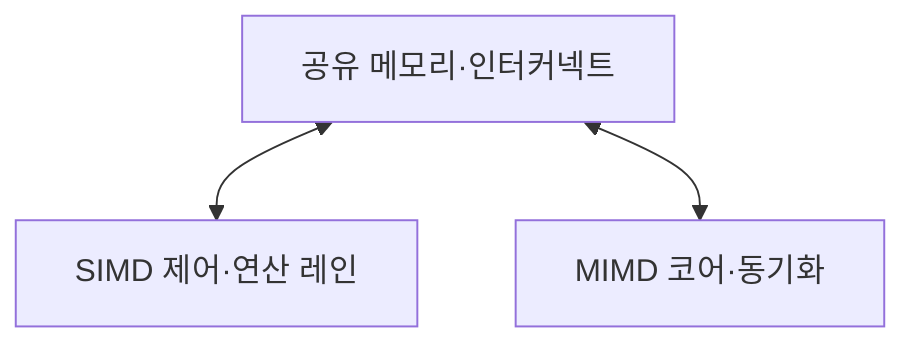

---
sidebar:
  order: 53
  label: "053. SIMD·MIMD 프로세서 (SIMD MIMD)"
  badge:
    text: "기출 · 70%"
    variant: note
title: "SIMD·MIMD 프로세서 (SIMD MIMD)"
date: "2026-07-28T13:01:35+09:00"
tags:
  - "notes-hardware"
weight: 53
extra:
  question_no: "053"
  source_status: "기출"
  source_history: "131회, 134회"
  priority: 70
  priority_note: "데이터 병렬과 작업 병렬의 선택 기준"
---

## 미리 알고가기

- **단일 명령 다중 데이터(Single Instruction Multiple Data, SIMD)**: 하나의 명령을 여러 데이터 원소에 동시에 적용하는 병렬 처리 방식
- **다중 명령 다중 데이터(Multiple Instruction Multiple Data, MIMD)**: 여러 독립 명령 흐름이 서로 다른 데이터를 동시에 처리하는 병렬 구조
- **데이터 병렬성(Data Parallelism)**: 같은 연산을 여러 데이터에 동시 적용
- **작업 병렬성(Task Parallelism)**: 독립 작업을 서로 다른 코어에서 실행
- **연산 레인(Execution Lane)**: SIMD 명령 하나의 데이터 원소 처리
- **분기 발산(Branch Divergence)**: 마스크 분기에서 일부 연산 레인이 비활성화되는 현상
- **동기화 비용(Synchronization Cost)**: 락·배리어·메시지 대기 시간
- **플린 분류(Flynn's Taxonomy)**: 동시에 실행하는 명령·데이터 스트림 수로 컴퓨터 구조를 네 유형으로 나누는 분류
- **활성 마스크(Active Mask)**: SIMD 레인 중 현재 명령을 실행할 레인만 표시하는 비트 집합
- **락·배리어(Lock·Barrier)**: 락은 공유 자원의 동시 접근을 제한하고 배리어는 모든 작업이 특정 지점에 도달할 때까지 기다리게 함
- **인터커넥트(Interconnect)**: 코어·메모리 사이의 데이터와 동기화 메시지를 전달하는 연결망
- **조밀 벡터·행렬(Dense Vector·Matrix)**: 대부분의 원소가 0이 아니며 같은 연산을 연속 원소에 반복하기 쉬운 데이터
- **비정형 분기(Irregular Branch)**: 입력마다 실행 경로·작업량이 달라 공통 명령으로 묶이지 않는 제어 흐름
- **부하 불균형(Load Imbalance)**: 코어별 작업량이 달라 일부 코어가 끝난 뒤 다른 코어를 기다리는 상태

## Ⅰ. 개요

- 정의/개념: **공통·독립 명령 흐름**으로 구분한 병렬 구조
- 기존 한계: 단일 실행 방식은 **규칙·비정형 작업 혼재**에 비효율

### 쉽게 이해하기 (학습용)

- 한 감독이 같은 동작을 여러 사람에게 시키거나 각자가 다른 일을 맡는 차이다

## Ⅱ. 특징

- **SIMD 공통 명령**으로 제어·해석 비용 절감
- **MIMD 독립 명령**으로 상이한 작업 동시 실행
- 분기 발산과 **동기화·부하 불균형**이 각각 성능 제한

### 쉽게 이해하기 (학습용)

- 한 감독을 공유하면 작업대를 늘리기 쉽고 독립 감독은 다른 주문을 함께 진행한다

## Ⅲ. 아키텍처 및 구성요소

| 설계 요소 | 입력·상태 | 역할 |
|:---|:---|:---|
| 공유 메모리·인터커넥트 | 레인·코어 요청·대역폭 상태 | 데이터 공급·교환 |
| SIMD 제어·연산 레인 | 공통 명령·활성 마스크·원소 | 다중 데이터 동시 처리 |
| MIMD 코어·동기화 | 독립 명령·작업·락 상태 | 다중 작업 실행·조정 |

> 요약: SIMD 레인과 MIMD 코어가 메모리 경로를 공유한다

### 쉽게 이해하기 (학습용)

- 공유 메모리가 SIMD 벡터 유닛과 MIMD 코어에 데이터를 공급하고 동기화 장치가 접근 충돌을 제어한다

## Ⅳ. 운영 고려사항

| 운영 위험 | 대응 | 기대 효과 |
|:---|:---|:---|
| SIMD 분기 발산으로 레인 비활성 증가 | 같은 경로 데이터를 묶고 마스크 활용률 측정 | 레인 효율 향상 |
| 비연속 주소로 벡터 메모리 요청 증가 | 자료 배치·루프 순서를 연속 접근에 맞춤 | 대역폭 효율 개선 |
| MIMD 동기화·부하 불균형으로 코어 대기 | 작업 세분화·동적 스케줄링과 대기 시간 감시 | 병렬 효율 향상 |
| SIMD·MIMD 경계의 변환·복사 비용 | 규칙 구간을 크게 묶고 경계 데이터 형식 통일 | 혼합 실행 오버헤드 감소 |

### 쉽게 이해하기 (학습용)

- 같은 부품은 프레스 레인에, 다른 주문은 독립 작업대에 나눈다

## Ⅴ. 종류 및 비교

| 병렬 실행 구조 | SIMD | MIMD |
|:---|:---|:---|
| 적용 기준 | 조밀 **벡터·행렬·영상** | 서비스·그래프·**비정형 분기** |
| 핵심 특징 | 공통 명령의 **다중 데이터 처리** | 독립 명령의 **다중 작업 처리** |
| 한계 | 분기 발산·**비연속 메모리** | 동기화·통신·**부하 불균형** |

> 요약: 규칙 연산은 SIMD, 독립 작업은 MIMD가 맞다

### 쉽게 이해하기 (학습용)

- SIMD는 같은 틀의 프레스, MIMD는 주문별 독립 작업장에 가깝다

## Ⅵ. 실무 사례

1. 영상 필터는 **연속 픽셀**을 SIMD 레인에 배치

### 쉽게 이해하기 (학습용)

- 같은 보정식을 여러 픽셀에 한꺼번에 적용해 사진을 바꾼다

## Ⅶ. 결론

- 병렬 실행을 위해 연산 동일성·독립성을 검토하여 **SIMD·MIMD** 활용

### 쉽게 이해하기 (학습용)

- 같은 동작이 반복되면 한 구령을, 일이 제각각이면 독립 지시를 선택한다
