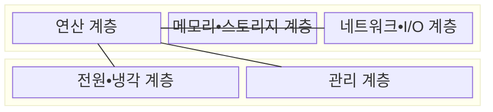
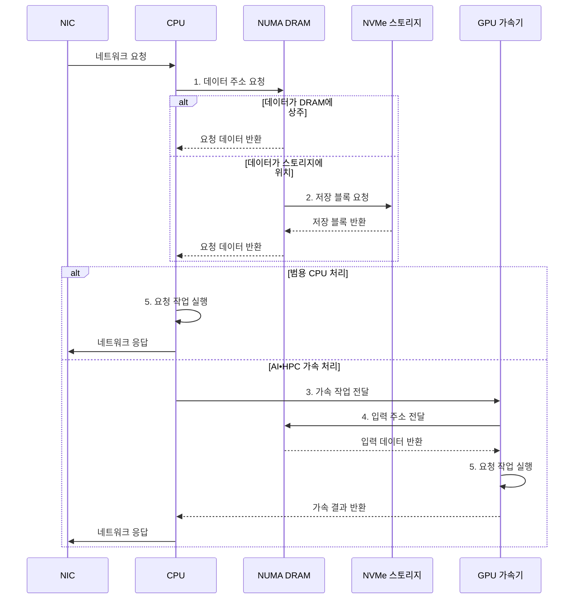

---
sidebar:
  order: 54
  label: "054. 데이터 센터 서버 아키텍처 (Data Center Server Architecture)"
  badge:
    text: "미출 • 50%"
    variant: note
title: "데이터 센터 서버 아키텍처 (Data Center Server Architecture)"
date: "2026-08-04T14:09:12+09:00"
tags:
  - "notes-hardware"
weight: 54
extra:
  question_no: "054"
  source_status: "미출"
  source_history: ""
  priority: 50
  priority_note: "서버 자원•장애 범위•랙 한도의 균형"
---

## Ⅰ. 개요

핵심 용어

- **CPU**: Central Processing Unit, 범용 명령을 실행하는 중앙 처리 장치
- **서버 노드(Server Node)**: CPU•메모리•스토리지•네트워크를 묶은 운영 단위
- **서버 아키텍처(Server Architecture)**: 연산과 저장 및 입출력 자원을 연결하고 전력•냉각•관리를 함께 제공하는 구조이다.
- **장애 범위(Failure Domain)**: 하나의 하드웨어나 전원 고장이 동시에 영향을 미치는 노드•섀시•랙의 범위이다.

- 정의/개념: 연산•메모리•스토리지•네트워크 자원을 전원•냉각•관리 계층과 연결해 워크로드를 처리하는 **데이터센터 서버 아키텍처** 기반 **서버 운영 구조**
- 배경/필요성: 개별 자원 증설만으로는 종단 **병목•장애 범위** 해소 불가

#### 한줄 요약

- 병원이 환자 유형에 맞춰 진료실•기록실•연락망•비상전원을 한 병동에 배치하는 것과 같다

## Ⅱ. 특징

핵심 용어

- **종단 병목(End-to-end Bottleneck)**: 요청 경로에서 처리량이 가장 낮아 전체 성능을 제한하는 자원이나 구간이다.
- **랙 전력 밀도(Rack Power Density)**: 하나의 랙에 공급하고 냉각할 수 있는 전력 용량과 실제 장비 소비 전력의 수준이다.
- **GPU**: Graphics Processing Unit, 대규모 병렬 연산 처리 장치
- **열 스로틀링(Thermal Throttling)**: 온도 한도를 위해 CPU•GPU 처리량을 낮추는 제어
- **관리망(Management Network)**: 서비스 데이터망과 분리하여 서버 전원•콘솔•펌웨어의 원격 관리에 사용하는 네트워크이다.

- 연산•메모리•**I/O 자원 균형 붕괴** 시 최저 처리량 자원이 종단 병목
- **전력•냉각 한도** 초과 시 스로틀링•중단 발생
- **관리망•장애 범위 분리** 로 원격 복구와 가용성 확보

#### 한줄 요약

- 진료실만 늘려도 기록실이나 전력이 막히면 환자를 더 받을 수 없다

## Ⅲ. 구조 및 구성요소

핵심 용어

- **연산 계층(Compute Layer)**: CPU•GPU로 범용 및 가속 연산을 수행하는 자원 계층
- **메모리•스토리지 계층(Memory•Storage Layer)**: 실행 데이터와 영구 데이터를 저장하고 연산기에 공급하는 계층이다.
- **I/O**: Input/Output, 호스트와 장치 사이의 입출력
- **네트워크•I/O 계층**: 서비스•클러스터•주변장치 데이터를 전송하는 계층
- **베이스보드 관리 제어기(Baseboard Management Controller, BMC)**: 운영체제와 독립적으로 전원과 온도 및 센서를 감시하고 원격 제어하는 장치이다.

| 구성요소 | 책임 |
|:---|:---|
| 연산 계층 | 범용•가속 **연산 처리** |
| 메모리•스토리지 계층 | 데이터 **저장•공급** |
| 네트워크•I/O 계층 | 서비스•장치 **데이터 전송** |
| 전원•냉각 계층 | 열•전력 **한도 유지** |
| 관리 계층 | 원격 **감시•복구** |

#### 한줄 요약

- 연산•저장•전송 자원을 전원•냉각과 관리 계층이 지탱하는 구조다.

## Ⅳ. 흐름도

핵심 용어

- **비균일 메모리 접근(Non-uniform Memory Access, NUMA)**: 프로세서 소켓과 메모리의 물리 위치에 따라 접근 지연과 대역폭이 달라지는 구조이다.
- **비휘발성 메모리 익스프레스(Non-volatile Memory Express, NVMe)**: 주변장치 상호연결 익스프레스(Peripheral Component Interconnect Express, PCIe) 기반 솔리드 스테이트 드라이브(Solid-state Drive, SSD)를 위한 병렬 명령 큐와 인터페이스 규격이다.
- **가속 작업(Accelerated Workload)**: 중앙처리장치(Central Processing Unit, CPU)가 준비한 대규모 병렬 계산을 그래픽 처리장치(Graphics Processing Unit, GPU) 같은 전용 장치에 맡겨 실행하는 작업이다.
- **네트워크 인터페이스 카드(Network Interface Card, NIC)**: 서버와 데이터센터 네트워크 사이에서 패킷 송수신을 담당하는 장치이다.
- **동적 임의 접근 메모리(Dynamic Random Access Memory, DRAM)**: 실행 중인 데이터를 휘발성 셀에 저장하여 프로세서에 제공하는 주 메모리이다.
- **AI**: Artificial Intelligence, 학습 모델 기반 지능형 처리 기술
- **HPC**: High-Performance Computing, 대규모 과학•공학 병렬 계산

**동작 원리**

1. **데이터 주소 요청**: NUMA 위치와 DRAM 상주 여부 판정
2. **저장 블록 요청**: DRAM 미상주 데이터를 NVMe에서 적재
3. **가속 작업 전달**: AI•HPC 연산을 GPU에 배치
4. **입력 주소 전달**: GPU가 메모리 입력을 조회
5. **요청 작업 실행**: CPU 범용 처리 또는 GPU 병렬 연산

#### 한줄 요약

- NIC 요청은 CPU•NUMA 메모리를 거치고, 필요하면 NVMe나 GPU를 사용한 뒤 NIC로 결과를 보낸다

## Ⅴ. 종류 및 비교

핵심 용어

- **범용 데이터센터 서버(General-purpose Data-center Server)**: 웹 서비스와 가상화를 위해 중앙처리장치(Central Processing Unit, CPU)•메모리•입출력(Input/Output, I/O)의 균형을 중시하는 서버이다.
- **HBM**: High Bandwidth Memory, 가속기에 고대역폭을 제공하는 적층 메모리
- **AI•HPC 가속 서버**: GPU•HBM•고속 연결에 자원을 집중한 병렬 연산 서버
- **가상화(Virtualization)**: 한 물리 서버의 CPU와 메모리 및 장치를 여러 격리된 가상 머신에 나누어 제공하는 기술이다.

| 서버 구조 | 범용 데이터센터 서버 | AI•HPC 가속 서버 |
|:---|:---|:---|
| 적용 기준 | **가상화•웹 서비스** | **AI•HPC 연산** |
| 핵심 특징 | CPU•메모리•**I/O 균형** | GPU•HBM•**고속 연결 집중** |
| 한계 | 자원별 **처리량 불균형** | 가속기 유휴•**전력•냉각 한도** |

> 요약: 범용은 **자원 균형**, 가속 서버는 **병렬 연산** 우선

#### 한줄 요약

- 범용 서버는 일반 병동, 가속 서버는 전력•장비를 집중한 전문 병동에 가깝다

## Ⅵ. 실무 고려사항 및 대책

핵심 용어

- **비균일 메모리 접근 친화도(Non-uniform Memory Access Affinity, NUMA Affinity)**: 작업과 메모리 및 입출력(Input/Output, I/O) 장치를 가까운 프로세서 소켓에 함께 배치하는 설정이다.
- **PCI 익스프레스 루트 포트(Peripheral Component Interconnect Express Root Port, PCIe Root Port)**: 중앙처리장치(Central Processing Unit, CPU)나 칩셋에서 PCIe 장치 트리로 트랜잭션이 출발하는 연결 지점이다.
- **전력 상한(Power Cap)**: 서버나 랙이 설정한 소비 전력을 넘지 않도록 장치 성능과 전력을 제한하는 값이다.
- **펌웨어 서명(Firmware Signature)**: 승인된 발행자가 만든 펌웨어인지 암호학적으로 검증하는 전자 서명이다.
- **비휘발성 메모리 익스프레스(Non-volatile Memory Express, NVMe)**: PCIe 기반 저장장치를 위한 병렬 명령 큐와 인터페이스 규격이다.
- **베이스보드 관리 제어기(Baseboard Management Controller, BMC)**: 운영체제와 독립적으로 서버 전원과 센서를 원격 관리하는 제어기이다.
- **가상 중앙처리장치(Virtual Central Processing Unit, vCPU)•가상 머신(Virtual Machine, VM)•네트워크 인터페이스 카드(Network Interface Card, NIC)**: 가상화 자원 배치와 물리 네트워크 연결을 구성하는 실행 단위와 장치이다.

| 문제 | 대책 | 효과 |
|:---|:---|:---|
| CPU•메모리•PCIe 장치의 NUMA 위치 불일치 | 워크로드•장치 **NUMA 친화도** 공동 조정 | **데이터 경로 지연** 감소 |
| 가속기•NVMe 집중으로 PCIe 대역폭 포화 | **루트 포트•스위치 토폴로지** 처리량 검증 | **I/O 병목** 완화 |
| 랙 전력•냉각 한도 초과로 스로틀링•중단 | **전력 상한•냉각 여유** 감시와 배치 분산 | **지속 성능•가용성** 확보 |
| BMC 침해 또는 전원•랙 상관 장애 | **관리망 격리•펌웨어 서명** 과 장애 범위 분산 | **관리 보안•복원력** 향상 |

> 요약: **vCPU•NUMA 위치** 와 **물리 코어 비율** 공동 조정

#### 한줄 요약

- 가상화 서버는 vCPU뿐 아니라 VM 메모리•NIC•스토리지의 NUMA 위치와 물리 코어 비율을 함께 맞춘다

## Ⅶ. 결론

핵심 용어

- **자원 균형(Resource Balance)**: 연산과 메모리 및 입출력(Input/Output, I/O) 중 한 자원이 전체 처리량을 과도하게 제한하지 않는 구성이다.
- **가속 서버(Accelerated Server)**: 특정 병렬 워크로드를 위해 그래픽 처리장치(Graphics Processing Unit, GPU) 등 가속기와 전력•냉각 자원을 집중한 서버이다.
- **지속 성능(Sustained Performance)**: 장시간 부하에서 전력과 열 한도를 지키면서 유지할 수 있는 실제 처리 성능이다.

- 가상화•웹 워크로드에는 **범용 서버**, AI•HPC 워크로드에는 **가속 서버** 선택

#### 한줄 요약

- 가상화•웹은 균형 병동을, AI•HPC는 전력과 냉각을 갖춘 가속 병동을 고른다
