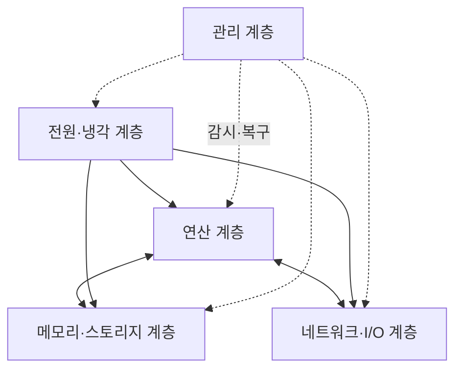
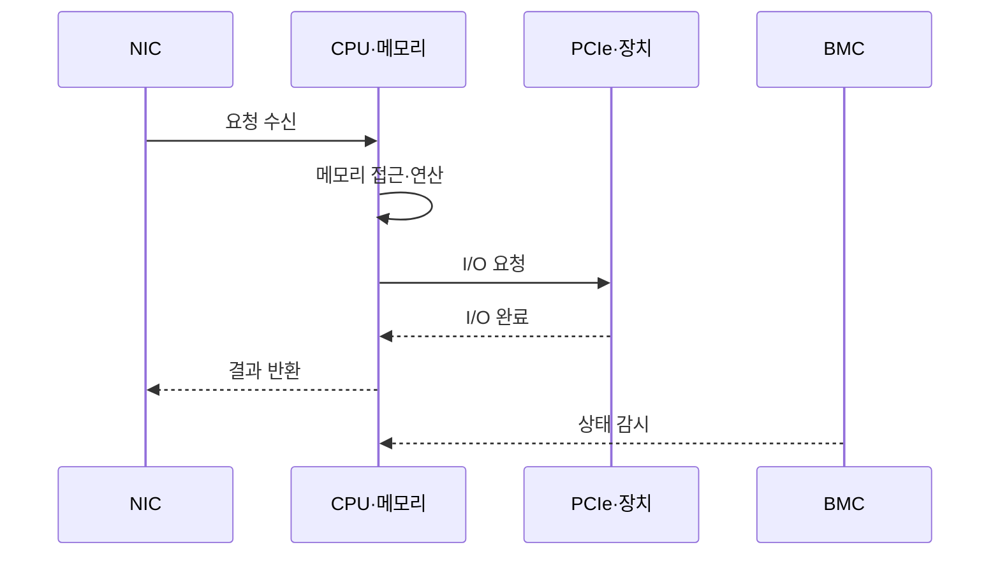

---
sidebar:
  order: 54
  label: "054. 데이터 센터 서버 아키텍처 (Data Center Server Architecture)"
  badge:
    text: "미출제 · 50%"
    variant: note
title: "데이터 센터 서버 아키텍처 (Data Center Server Architecture)"
date: "2026-07-25T10:12:00+09:00"
tags:
  - "notes-hardware"
weight: 54
extra:
  question_no: "054"
  source_status: "미출제"
  source_history: ""
  priority: 50
  priority_note: "서버 자원·장애 범위·랙 한도의 균형"
---

## 미리 알고가기

- **서버 노드(Server Node)**: CPU·메모리·스토리지·NIC를 한 운영 단위로 관리하는 서버
- **비균일 메모리 접근(Non-Uniform Memory Access, NUMA)**: ‘누마’로 읽고 영문 머리글자를 단어처럼 만든 약어이며, CPU별 근접 메모리의 접근 지연 차이를 나타내는 구조
- **주변 구성요소 상호연결 익스프레스(Peripheral Component Interconnect Express, PCIe)**: ‘피시에이아이 익스프레스’로 읽고 영문 머리글자와 express의 e를 결합한 약어이며, CPU·가속기·NVMe를 연결
- **비휘발성 메모리 익스프레스(Non-Volatile Memory Express, NVMe)**: ‘엔브이엠 익스프레스’로 읽고 영문 머리글자와 express의 e를 결합한 약어이며, PCIe 기반 스토리지 명령 규격
- **네트워크 인터페이스 카드(Network Interface Card, NIC)**: ‘닉’으로 읽고 영문 머리글자를 단어처럼 만든 약어이며, 서비스·클러스터 트래픽을 송수신
- **베이스보드 관리 제어기(Baseboard Management Controller, BMC)**: ‘비엠시’로 읽고 영문 머리글자를 딴 약어이며, 운영체제 밖에서 전원·센서를 관리
- **장애 범위(Failure Domain)**: 한 고장이 영향을 미치는 노드·섀시·랙 범위
- **랙 전력 밀도(Rack Power Density)**: 랙당 전력·냉각 용량의 수용 한계
- **중앙 처리 장치(Central Processing Unit, CPU)**: ‘시피유’로 읽고 영문 머리글자를 딴 약어이며, 범용 명령 실행과 서버 제어를 담당
- **입출력(Input/Output, I/O)**: ‘아이오’로 읽고 입력과 출력을 빗금으로 구분한 표기이며, 서버와 장치 사이의 명령·데이터를 전달
- **동적 임의 접근 메모리(Dynamic Random-Access Memory, DRAM)**: ‘디램’으로 읽고 영문 머리글자를 단어처럼 만든 약어이며, 실행 중인 작업 데이터·상태를 보관
- **그래픽 처리 장치(Graphics Processing Unit, GPU)**: ‘지피유’로 읽고 영문 머리글자를 딴 약어이며, 병렬 코어로 인공지능·과학 연산을 처리
- **고대역폭 메모리(High Bandwidth Memory, HBM)**: ‘에이치비엠’으로 읽고 영문 머리글자를 딴 약어이며, GPU 가까이에서 데이터를 병렬 공급
- **인공지능(Artificial Intelligence, AI)**: ‘에이아이’로 읽고 영문 머리글자를 딴 약어이며, 가속 서버의 학습·추론 작업 대상
- **고성능 컴퓨팅(High-Performance Computing, HPC)**: ‘에이치피시’로 읽고 영문 머리글자를 딴 약어이며, 여러 노드·가속기로 과학 계산을 병렬 처리
- **가상 중앙 처리 장치(Virtual Central Processing Unit, vCPU)**: ‘브이시피유’로 읽고 virtual의 v를 CPU 앞에 붙인 약어이며, 가상 머신에 할당한 실행 자원 단위
- **가상화(Virtualization)**: 한 물리 서버의 CPU·메모리·장치를 여러 격리된 가상 머신에 나눠 제공하는 기술
- **펌웨어(Firmware)**: BMC·장치에 내장되어 전원·초기화·하드웨어 제어를 수행하는 소프트웨어
- **처리량·지연·가용성**: 처리량은 단위 시간당 완료량, 지연은 요청 완료 시간, 가용성은 서비스가 정상 제공되는 시간 비율

## Ⅰ. 개요

- 정의/개념: 서버의 연산·메모리·I/O·관리 구조다
- **배경/필요성**: 자원 병목을 줄여 처리량을 보장한다

### 쉽게 이해하기 (학습용)

- 병원이 환자 유형에 맞춰 진료실·기록실·연락망·비상전원을 한 병동에 배치하는 것과 같다

## Ⅱ. 특징

- 처리량은 가장 느린 자원에 묶여 증설 효과가 제한된다
- 전력·냉각 한도를 넘으면 장비 중단으로 서비스가 실패한다

### 쉽게 이해하기 (학습용)

- 진료실만 늘려도 기록실이나 전력이 막히면 환자를 더 받을 수 없다

## Ⅲ. 아키텍처 및 구성요소

| 설계 요소 | 설명 |
|:---|:---|
| 연산 계층 | CPU·가속기의 명령·병렬 연산 처리 |
| 메모리·스토리지 계층 | DRAM·NVMe의 작업 데이터·상태 보관 |
| 네트워크·I/O 계층 | NIC·PCIe의 요청·노드 간 데이터 전송 |
| 전원·냉각 계층 | 이중 전원·냉각의 열·전력 한도 유지 |
| 관리 계층 | BMC의 센서·전원·펌웨어 원격 관리 |

> 요약: 관리 계층이 자원 경로와 전력·냉각을 통제한다

### 쉽게 이해하기 (학습용)

- 진료실·기록실·연락망에 비상전원이 공급되고 당직실이 상태를 살핀다

## Ⅳ. 원리 및 절차 흐름도

| 절차 | 설명 |
|:---|:---|
| 요청 수신 | NIC가 서비스 요청을 CPU에 전달 |
| 메모리 접근·연산 | CPU가 데이터와 명령을 처리 |
| I/O 요청 | CPU가 PCIe 장치에 작업 전달 |
| I/O 완료 | 장치가 처리 결과를 CPU에 반환 |
| 결과 반환 | CPU가 NIC로 응답 전달 |
| 상태 감시 | BMC가 전원·온도·장애 상태 확인 |

> 요약: 요청은 연산·I/O를 거쳐 응답으로 돌아간다

### 쉽게 이해하기 (학습용)

- 환자 수와 막히는 진료 단계를 보고 병동을 짠 뒤 전력·냉방 한도를 확인한다

## Ⅴ. 종류 및 비교

| 판단 기준 | 범용 데이터센터 서버 | AI·HPC 가속 서버 |
|:---|:---|:---|
| 핵심 특징 | CPU·메모리·I/O 균형 구성 | GPU·HBM·고속 연결 집중 구성 |
| 적용 기준 | 가상화·웹·데이터베이스 | AI 학습·추론·과학 연산 |
| 주요 위험 | CPU·메모리·I/O 불균형 | 가속기 유휴·전력·냉각 한도 |

> 요약: 범용은 균형, 가속 서버는 병렬 연산을 우선한다

### 쉽게 이해하기 (학습용)

- 범용 서버는 일반 병동, 가속 서버는 전력·장비를 집중한 전문 병동에 가깝다

## Ⅵ. 실무 사례

1. 가상화 클러스터: vCPU·NUMA 비율을 조정한다

### 쉽게 이해하기 (학습용)

- 가상화 병동은 막히는 진료실과 기록실의 비율을 다시 맞춘다

## Ⅶ. 결론

- 병목·장애 범위·랙 한도로 서버 자원 비율을 정한다

### 쉽게 이해하기 (학습용)

- 병동을 늘리기 전에 막힌 단계·정전 범위·전력·냉방 여유를 함께 본다
