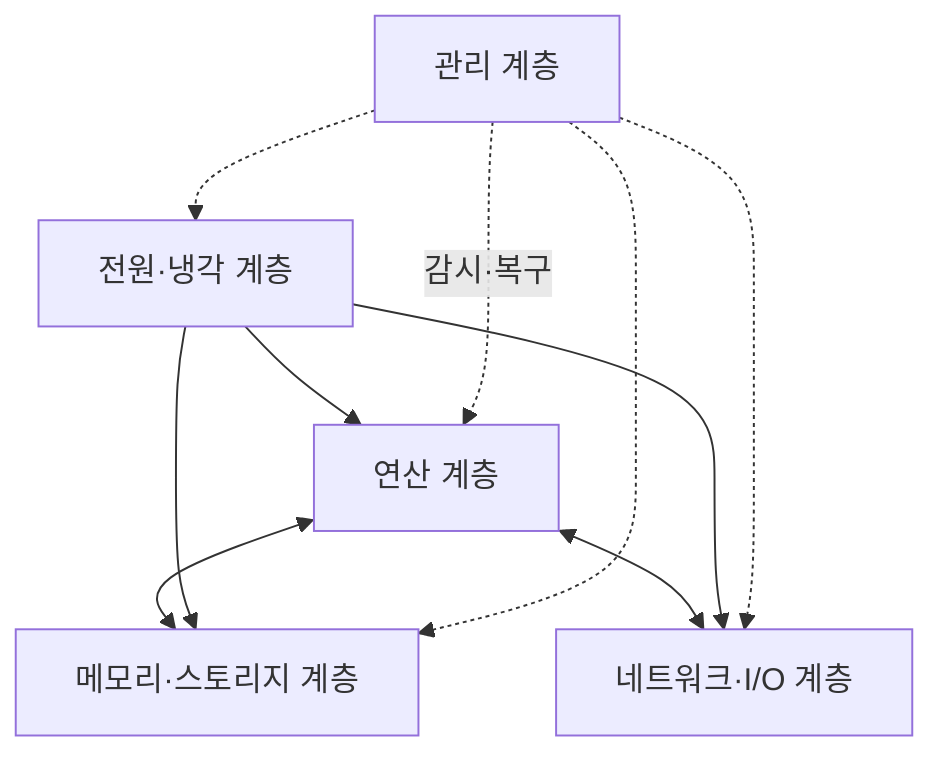
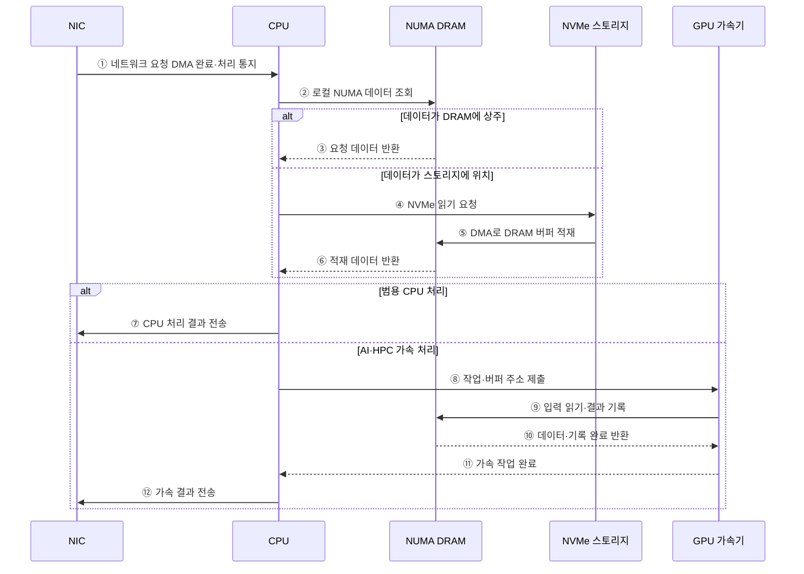

---
sidebar:
  order: 54
  label: "054. 데이터 센터 서버 아키텍처 (Data Center Server Architecture)"
  badge:
    text: "미출 · 50%"
    variant: note
title: "데이터 센터 서버 아키텍처 (Data Center Server Architecture)"
date: "2026-07-28T13:01:55+09:00"
tags:
  - "notes-hardware"
weight: 54
extra:
  question_no: "054"
  source_status: "미출"
  source_history: ""
  priority: 50
  priority_note: "서버 자원·장애 범위·랙 한도의 균형"
---

## 미리 알고가기

- **서버 노드(Server Node)**: CPU·메모리·스토리지·NIC를 한 운영 단위로 관리하는 서버
- **비균일 메모리 접근(Non-Uniform Memory Access, NUMA)**: 프로세서 소켓별 로컬·원격 메모리의 접근 지연이 달라지는 서버 구조
- **주변 구성요소 상호연결 익스프레스(Peripheral Component Interconnect Express, PCIe)**: CPU와 가속기·NVMe 장치를 연결하는 고속 직렬 인터커넥트
- **비휘발성 메모리 익스프레스(Non-Volatile Memory Express, NVMe)**: PCIe 기반 SSD의 병렬 큐와 명령 형식을 정의한 저장장치 규격
- **네트워크 인터페이스 카드(Network Interface Card, NIC)**: 서버의 서비스·클러스터 네트워크 트래픽을 송수신하는 장치
- **베이스보드 관리 제어기(Baseboard Management Controller, BMC)**: 운영체제와 독립적으로 서버의 전원·온도·센서·원격 관리를 담당하는 제어기
- **장애 범위(Failure Domain)**: 한 고장이 영향을 미치는 노드·섀시·랙 범위
- **랙 전력 밀도(Rack Power Density)**: 랙당 전력·냉각 용량의 수용 한계
- **중앙 처리 장치(Central Processing Unit, CPU)**: 범용 명령어 실행과 서버 자원 제어를 담당하는 프로세서
- **입출력(Input/Output, I/O)**: 서버와 주변장치 사이에서 명령과 데이터를 전달하는 작업
- **동적 임의 접근 메모리(Dynamic Random-Access Memory, DRAM)**: 실행 중인 프로그램의 데이터와 상태를 저장하는 주기억장치
- **그래픽 처리 장치(Graphics Processing Unit, GPU)**: 다수 병렬 코어로 AI·과학 연산을 처리하는 가속기
- **고대역폭 메모리(High Bandwidth Memory, HBM)**: GPU 가까이에서 가중치·활성값을 병렬 공급하는 적층 메모리
- **인공지능(Artificial Intelligence, AI)**: 가속 서버가 학습·추론으로 처리하는 대표 워크로드
- **고성능 컴퓨팅(High-Performance Computing, HPC)**: 여러 노드와 가속기를 병렬 연결하여 대규모 과학 계산을 수행하는 컴퓨팅 방식
- **가상 중앙 처리 장치(Virtual Central Processing Unit, vCPU)**: 가상 머신에 할당되고 물리 CPU 시간에 스케줄되는 논리 실행 자원
- **가상화(Virtualization)**: 한 물리 서버의 CPU·메모리·장치를 여러 격리된 가상 머신에 나눠 제공하는 기술
- **펌웨어(Firmware)**: BMC·장치에 내장되어 전원·초기화·하드웨어 제어를 수행하는 소프트웨어
- **처리량·지연·가용성**: 처리량은 단위 시간당 완료량, 지연은 요청 완료 시간, 가용성은 서비스가 정상 제공되는 시간 비율
- **PCIe 루트 포트(PCIe Root Port)**: CPU·칩셋에서 PCIe 장치 트리로 트랜잭션이 출발하는 연결 지점
- **열 스로틀링(Thermal Throttling)**: 온도 한도를 지키기 위해 CPU·GPU·메모리의 주파수나 전력·처리량을 낮추는 제어
- **관리망(Management Network)**: 서비스 데이터망과 분리해 BMC 원격 전원·콘솔·펌웨어 관리에 사용하는 네트워크

## Ⅰ. 개요

- 정의/개념: 서버의 연산·메모리·I/O·관리 구조다
- 기존 한계: 연산·메모리·저장·네트워크 자원을 독립적으로 설계하면 특정 구간의 병목으로 전체 처리량과 확장성이 제한될 수 있다.

### 쉽게 이해하기 (학습용)

- 병원이 환자 유형에 맞춰 진료실·기록실·연락망·비상전원을 한 병동에 배치하는 것과 같다

## Ⅱ. 특징

- **연산·메모리·I/O 균형**이 종단 처리량 결정
- **전력·냉각 한도** 초과 시 스로틀링·중단 발생
- **관리망·장애 범위 분리**로 원격 복구와 가용성 확보

### 쉽게 이해하기 (학습용)

- 진료실만 늘려도 기록실이나 전력이 막히면 환자를 더 받을 수 없다

## Ⅲ. 아키텍처

**도표안 A — 구조도**

**도표안 B — sequenceDiagram**

| 설계 요소 | 입력·상태 | 역할 |
|:---|:---|:---|
| 연산 계층 | 작업·CPU·가속기 상태 | 범용·병렬 연산 처리 |
| 메모리·스토리지 계층 | 작업 데이터·용량·대역폭 | DRAM·NVMe 저장·공급 |
| 네트워크·I/O 계층 | 서비스·장치 트래픽 | NIC·PCIe 데이터 전송 |
| 전원·냉각 계층 | 소비 전력·온도·냉각 상태 | 열·전력 한도 유지 |
| 관리 계층 | 센서·장애·펌웨어 상태 | BMC 원격 감시·복구 |

> 요약: 관리 계층이 자원 경로와 전력·냉각을 통제

**동작 원리**

- **① 네트워크 요청 DMA 완료·처리 통지**: NIC가 수신 버퍼 기록 후 CPU에 알림
- **② 로컬 NUMA 데이터 조회**: 같은 노드의 상태·캐시·작업 데이터 우선 확인
- **③ 요청 데이터 반환**: DRAM 상주 데이터를 로컬 채널로 전달
- **④ NVMe 읽기 요청**: 미상주 데이터를 PCIe 저장장치에 요청
- **⑤ DMA로 DRAM 버퍼 적재**: CPU 복사 없이 주기억장치에 기록
- **⑥ 적재 데이터 반환**: 완료 후 새 상주 데이터 처리
- **⑦ CPU 처리 결과 전송**: 범용 요청 결과를 NIC 송신 큐에 전달
- **⑧ 작업·버퍼 주소 제출**: AI·HPC 작업을 GPU에 등록
- **⑨ 입력 읽기·결과 기록**: GPU가 입력을 읽고 병렬 연산 결과 저장
- **⑩ 데이터·기록 완료 반환**: 읽기 데이터와 쓰기 상태 제공
- **⑪ 가속 작업 완료**: 결과 버퍼 준비를 CPU에 통지
- **⑫ 가속 결과 전송**: 응답 형식으로 만들어 NIC에 전달

### 쉽게 이해하기 (학습용)

- NIC 요청은 CPU·NUMA 메모리를 거치고, 필요하면 NVMe나 GPU를 사용한 뒤 NIC로 결과를 보낸다

## Ⅳ. 종류 및 비교

| 판단 기준 | 범용 데이터센터 서버 | AI·HPC 가속 서버 |
|:---|:---|:---|
| 핵심 특징 | CPU·메모리·I/O 균형 구성 | GPU·HBM·고속 연결 집중 구성 |
| 적용 기준 | 가상화·웹·데이터베이스 | AI 학습·추론·과학 연산 |
| 주요 위험 | CPU·메모리·I/O 불균형 | 가속기 유휴·전력·냉각 한도 |

> 요약: 범용은 균형, 가속 서버는 병렬 연산을 우선한다

### 쉽게 이해하기 (학습용)

- 범용 서버는 일반 병동, 가속 서버는 전력·장비를 집중한 전문 병동에 가깝다

## Ⅴ. 실무 고려사항 및 대책

| 운영 위험 | 대응 | 기대 효과 |
|:---|:---|:---|
| CPU·메모리·PCIe 장치의 NUMA 위치 불일치 | 워크로드·메모리·장치 친화도와 원격률 공동 조정 | 데이터 경로 지연 감소 |
| 가속기·NVMe 집중으로 PCIe 대역폭 포화 | 루트 포트·스위치 토폴로지와 링크별 처리량 검증 | I/O 병목 완화 |
| 랙 전력·냉각 한도 초과로 스로틀링·중단 | 전력 상한·온도·냉각 여유 감시와 배치 분산 | 지속 성능·가용성 확보 |
| BMC 침해 또는 전원·랙 상관 장애 | 관리망 격리·펌웨어 서명과 장애 도메인 분산 | 관리 보안·복원력 향상 |

> 가상화 클러스터는 vCPU 수만 늘리지 않고 VM 메모리·NIC·스토리지의 NUMA 위치와 물리 코어 비율을 함께 맞춘다.

### 쉽게 이해하기 (학습용)

- 가상화 서버는 vCPU뿐 아니라 VM 메모리·NIC·스토리지의 NUMA 위치와 물리 코어 비율을 함께 맞춘다

## Ⅵ. 결론

- 병목·장애 범위·랙 한도로 서버 자원 비율을 정한다

### 쉽게 이해하기 (학습용)

- 병동을 늘리기 전에 막힌 단계·정전 범위·전력·냉방 여유를 함께 본다
