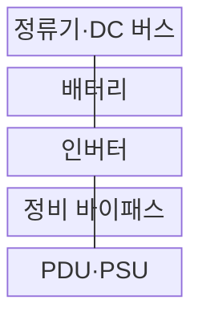

---
sidebar:
  order: 55
  label: "055. 전원 공급 장치·UPS"
  badge:
    text: "기출 · 50%"
    variant: note
title: "전원 공급 장치·UPS"
date: "2026-08-02T11:15:00+09:00"
tags:
  - "notes-hardware"
weight: 55
extra:
  question_no: "055"
  source_status: "기출"
  source_history: "126회"
  priority: 50
  priority_note: "PSU·UPS 절체·런타임의 단일 기출 핵심"
---

## Ⅰ. 개요

핵심 용어

- **전원 공급 장치(Power Supply Unit, PSU)**: 상용 교류 전원을 서버가 사용하는 안정된 직류 전원으로 변환하는 장치이다.
- **무정전 전원 공급 장치(Uninterruptible Power Supply, UPS)**: 정전이나 입력 전원 이상 시 배터리로 부하 전원을 계속 공급하는 장치이다.
- **전원 경로(Power Path)**: 상용 전원부터 UPS와 PDU 및 PSU를 거쳐 장비에 전력을 공급하는 연결 경로이다.

- 정의/개념: **PSU 전력 변환과 UPS 비상 공급**을 결합한 체계
- 배경/필요성: 단일 전원 경로 고장은 **장비 중단·데이터 손실**로 직결

### 쉽게 이해하기 (학습용)

- PSU가 장비용 전기로 바꾸고 UPS가 정전 동안 비상 전력을 이어 준다

## Ⅱ. 특징

핵심 용어

- **온라인 UPS(Online UPS)**: 정류기와 인버터의 이중 변환 경로를 통해 상시 부하 전원을 공급하는 UPS 방식이다.
- **A/B 이중 경로(A/B Dual Path)**: 서로 독립된 두 전원 입력과 분배 경로로 단일 장애를 격리하는 구성이다.
- **런타임(Runtime)**: 정전 후 UPS 배터리가 현재 부하에 전력을 공급할 수 있는 예상 시간이다.
- **부하율(Load Factor)**: UPS나 PSU의 정격 용량 가운데 장비가 실제로 사용하는 전력의 비율이다.

> 부하율 증가에 따른 **백업 시간 역비례 감소**, 실제 값은 열화·손실 영향

- **이중 PSU 경로**로 단일 변환기 고장 격리
- **온라인 UPS**의 상시 이중 변환으로 무중단 절체
- **UPS 배터리 런타임**은 부하율·열화에 따라 감소

$$
Runtime \approx \frac{Usable\ Battery\ Energy \times Conversion\ Efficiency}{Load\ Power}
$$

> 일정 부하 근사식이며 **온도·열화·인버터 손실**에 따라 변동

### 쉽게 이해하기 (학습용)

- 어댑터를 둘로 나누고 비상 배터리까지 두되 실제로 전원을 끊어 확인해야 한다

## Ⅲ. 구조 및 구성요소

핵심 용어

- **정류기(Rectifier)**: 상용 교류 전원을 직류로 변환하여 DC 버스와 배터리에 공급하는 장치이다.
- **직류 버스(Direct Current Bus, DC Bus)**: 정류기와 배터리 및 인버터 사이에서 직류 전력을 전달하는 공통 경로이다.
- **인버터(Inverter)**: DC 버스의 직류 전력을 서버 부하에 필요한 안정된 교류 전력으로 변환하는 장치이다.
- **정비 바이패스(Maintenance Bypass)**: UPS 점검 동안 부하를 UPS 대신 상용 전원 경로로 공급하는 우회 장치이다.

| 구성요소 | 책임 |
|:---|:---|
| 정류기·DC 버스 | 변환·**충전 경로** 제공 |
| 배터리 | 입력 상실 시 **저장 전력 공급** |
| 인버터 | 안정된 **부하용 교류 생성** |
| 정비 바이패스 | UPS 점검 시 **상용 전원으로 부하 공급** |
| PDU·PSU | 분배·**장비용 직류 변환** |

### 쉽게 이해하기 (학습용)

- 정류기와 배터리가 DC 버스를 유지하고 인버터와 PDU가 서버에 전력을 공급한다.

## Ⅳ. 흐름도

핵심 용어

- **입력 전원 이상(Input Power Anomaly)**: 상용 전원의 전압이나 주파수가 허용 범위를 벗어나 정상 공급이 어려운 상태이다.
- **배터리 방전(Battery Discharge)**: 저장한 전기 에너지를 DC 버스와 인버터에 공급하여 부하 전력을 유지하는 동작이다.
- **복전(Power Restoration)**: 정전됐던 상용 전원이 정상 전압과 주파수로 다시 공급되는 상태이다.
- **안전 종료(Graceful Shutdown)**: 남은 배터리 시간 안에 데이터를 저장하고 서비스를 정리한 뒤 장비 전원을 끄는 절차이다.

**동작 원리**

1. **정상 전력 공급**: 정류·인버터 경로와 배터리 충전 상태 유지
2. **입력 상태 신호**: 전압·주파수 이상으로 비상 운전 개시
3. **배터리 방전 명령**: DC 버스를 끊지 않고 인버터 전력 유지
4. **런타임 경보**: 잔여 용량·예상 지속 시간을 서버에 통지
5. **안전 종료 요청**: 종료 임계치 도달 시 데이터 저장 후 전원 차단

### 쉽게 이해하기 (학습용)

- 평소 충전한 비상 물탱크가 단수 때 같은 배관으로 물을 이어 주는 구조다

## Ⅴ. 종류 및 비교

핵심 용어

- **이중 PSU·UPS(Dual PSU·UPS)**: 장비의 이중 전원 변환기와 배터리 백업을 함께 사용하여 PSU 고장과 외부 정전에 대응하는 구성이다.
- **이중 PSU(Dual PSU)**: 두 독립 전원 입력과 PSU로 변환기나 입력선 하나의 고장을 격리하는 구성이다.
- **단일 PSU(Single PSU)**: 하나의 전원 입력과 변환 경로만 사용하여 고장 시 즉시 부하가 중단되는 구성이다.

| 전원 보호 구성 | 이중 PSU·UPS | 이중 PSU | 단일 PSU |
|:---|:---|:---|:---|
| 적용 기준 | 외부 정전까지 **연속 공급** | PSU·입력선 **단일 고장 대응** | 중단 허용 **비핵심 장비** |
| 핵심 특징 | A/B 경로·**배터리 백업** | A/B 입력의 **PSU 고장 격리** | 단일 입력·**단일 변환 경로** |
| 한계 | 배터리 열화·**절체 실패** | 전체 입력 **동시 상실** | 단일 장애 시 **즉시 중단** |

> 요약: PSU 단일 고장은 **이중 PSU**, 외부 정전은 **UPS** 선택

### 쉽게 이해하기 (학습용)

- 어댑터 두 개는 한쪽 고장만 격리하고 비상 배터리까지 있어야 건물 정전을 견딘다

## Ⅵ. 실무 고려사항 및 대책

핵심 용어

- **배터리 열화(Battery Degradation)**: 충방전과 고온 및 시간 경과로 저장 용량과 출력 능력이 줄어드는 현상이다.
- **공통 원인 장애(Common-cause Failure)**: 겉으로 분리한 A/B 경로가 같은 상위 전원이나 PDU를 공유하여 함께 중단되는 장애이다.
- **절체 전류(Transfer Current)**: 한 전원 경로가 상실되어 전체 부하가 남은 경로로 이동할 때 순간적으로 흐르는 전류이다.
- **정전·복전 시험(Outage·Restoration Test)**: 실제 전원 상실과 복구 조건에서 UPS 전환과 안전 종료 및 재기동을 확인하는 시험이다.

| 문제 | 대책 | 효과 |
|:---|:---|:---|
| 배터리 열화로 표시 런타임과 실제 시간 불일치 | **온도·내부 저항·방전 시험** 기반 용량 보정 | **안전 종료 시간** 예측 오차 감소 |
| A/B 경로가 같은 상위 전원·PDU를 공유 | **상용·UPS·PDU 장애 범위** 추적 | **공통 원인 장애** 방지 |
| 한 경로 상실 시 잔여 경로 과부하 | 단일 장애 **부하율·절체 전류** 검증 | **절체 중단** 방지 |
| 바이패스 오조작·종료 자동화 실패 | **권한 통제·정전·복전 시험** 적용 | **운용 복구성** 검증 |

> 요약: A/B 한 경로 차단 후 **잔여 부하율·절체 전류** 검증

### 쉽게 이해하기 (학습용)

- 서버 랙은 A/B 전원 한쪽을 실제 차단해 남은 경로가 전체 부하와 절체 전류를 견디는지 확인한다

## Ⅶ. 결론

핵심 용어

- **외부 정전(Utility Outage)**: 데이터센터로 들어오는 상용 전원 공급이 끊겨 건물 전체 전력 경로에 영향을 주는 장애이다.
- **PSU 고장(PSU Failure)**: 서버 내부 전원 변환기 하나가 정상 직류 전력을 출력하지 못하는 장애이다.
- **연속 공급(Continuous Supply)**: 전원 이상이나 경로 전환 중에도 부하에 허용 범위의 전력을 끊김 없이 제공하는 성질이다.

- **외부 정전**은 이중 PSU•UPS, **PSU 고장**은 이중 PSU 선택

### 쉽게 이해하기 (학습용)

- 장비 전원 고장만 견디면 이중 PSU, 건물 정전까지 견디면 UPS를 더한다
