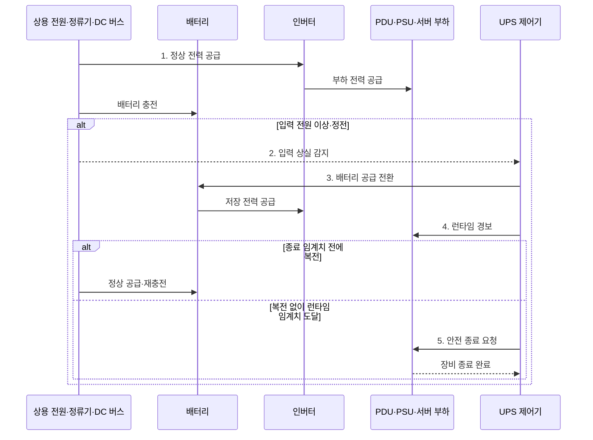

---
sidebar:
  order: 55
  label: "055. 전원 공급 장치·UPS"
  badge:
    text: "기출 · 50%"
    variant: note
title: "전원 공급 장치·UPS"
date: "2026-07-30T18:00:00+09:00"
tags:
  - "notes-hardware"
weight: 55
extra:
  question_no: "055"
  source_status: "기출"
  source_history: "126회"
  priority: 50
  priority_note: "PSU·UPS 절체·런타임의 단일 기출 핵심"
---

## 미리 알고가기

- **전원 공급 장치(Power Supply Unit, PSU)**: 교류 전원을 장비가 사용하는 직류 전원으로 변환하는 장치
- **무정전 전원 공급 장치(Uninterruptible Power Supply, UPS)**: 정전이나 입력 전원 이상 시 배터리로 부하 전원을 유지하는 장치
- **온라인 UPS(Online UPS)**: 정류기와 인버터를 거쳐 상시 전원 공급
- **직류 버스(Direct Current Bus, DC Bus)**: 정류기·배터리·인버터 사이에서 직류 전력을 전달하는 공통 전력 경로
- **전력 분배 장치(Power Distribution Unit, PDU)**: 전원을 랙과 장비별로 분배하고 전압·전류·전력을 계측하는 장치
- **A/B 이중 경로**: 독립 전원 입력으로 단일 장애를 격리
- **정비 바이패스(Maintenance Bypass)**: UPS 점검 때 부하를 상용 전원으로 우회
- **절체(Transfer)**: 부하를 예비·우회 경로로 전환
- **교류·직류(Alternating Current·Direct Current, AC·DC)**: 주기적으로 방향이 바뀌는 상용 전력과 한 방향으로 흐르는 장비 내부 전력을 구분하는 전류 방식
- **정류기·인버터(Rectifier·Inverter)**: 정류기는 교류를 직류로 바꾸고 인버터는 직류를 부하용 교류로 되돌리는 전력 변환기
- **런타임(Runtime)**: 정전 후 UPS 배터리가 현재 부하에 전력을 공급할 수 있는 예상 시간
- **부하율(Load Factor)**: UPS·PSU 정격 용량 중 장비가 실제로 사용하는 전력의 비율
- **배터리 열화(Battery Degradation)**: 충방전·고온·시간 경과로 저장 용량과 출력 능력이 줄어드는 현상
- **복전(Power Restoration)**: 정전됐던 상용 전원이 정상 전압·주파수로 다시 공급되는 상태
- **안전 종료(Graceful Shutdown)**: 남은 전력 안에 데이터 저장과 서비스 정리를 마친 뒤 장비 전원을 끄는 절차

## Ⅰ. 개요

- 정의/개념: **PSU 전력 변환과 UPS 비상 공급**을 결합한 체계
- 배경/필요성: 단일 전원 경로의 **고장·정전 중단** 방지

### 쉽게 이해하기 (학습용)

- PSU가 장비용 전기로 바꾸고 UPS가 정전 동안 비상 전력을 이어 준다

## Ⅱ. 특징

> 공식 기반 파란 선은 사용 가능 에너지와 효율이 같을 때 부하율이 25%→100%로 증가하면 정규화 백업 시간이 4→1로 역비례 감소하며, 실제 시간은 방전율·온도·열화·손실에 따라 달라진다.

- **이중 PSU 경로**로 단일 변환기 고장 격리
- **UPS 배터리**로 정전 중 부하 전원 유지
- **부하율·배터리 열화**가 백업 시간 결정

$$
Runtime \approx \frac{Usable\ Battery\ Energy \times Conversion\ Efficiency}{Load\ Power}
$$

> 일정 부하와 사용 가능한 배터리 에너지를 가정한 근사식이며, 실제 런타임은 방전율·온도·배터리 열화·인버터 손실로 달라진다.

### 쉽게 이해하기 (학습용)

- 어댑터를 둘로 나누고 비상 배터리까지 두되 실제로 전원을 끊어 확인해야 한다

## Ⅲ. 구조 및 구성요소

| 구성요소 | 책임 |
|:---|:---|
| 정류기·DC 버스 | 변환·**충전 경로** 제공 |
| 배터리 | 입력 상실 시 **저장 전력 공급** |
| 인버터 | 안정된 **부하용 교류 생성** |
| 정비 바이패스 | 점검·고장 **우회 공급** |
| PDU·PSU | 분배·**장비용 직류 변환** |

### 쉽게 이해하기 (학습용)

- 정류기와 배터리가 DC 버스를 유지하고 인버터와 PDU가 서버에 전력을 공급한다.

## Ⅳ. 흐름도

**동작 원리**

- **1. 정상 전력 공급**: 정류·인버터 경로로 부하를 공급하며 배터리 충전 상태 유지
- **2. 입력 상실 감지**: 전압·주파수 이상을 판정해 비상 운전 개시
- **3. 배터리 공급 전환**: DC 버스를 끊지 않고 저장 에너지로 인버터 유지
- **4. 런타임 경보**: 잔여 용량과 예상 지속 시간을 운영자·서버에 통지
- **5. 안전 종료 요청**: 복전 전 종료 임계치 도달 시 데이터 손상 없는 종료 수행

### 쉽게 이해하기 (학습용)

- 평소 충전한 비상 물탱크가 단수 때 같은 배관으로 물을 이어 주는 구조다

## Ⅴ. 종류 및 비교

| 전원 보호 구성 | 이중 PSU·UPS | 이중 PSU | 단일 PSU |
|:---|:---|:---|:---|
| 적용 기준 | 외부 정전까지 **연속 공급** | PSU·입력선 **단일 고장 대응** | 중단 허용 **비핵심 장비** |
| 핵심 특징 | A/B 경로·**배터리 백업** | A/B 입력의 **PSU 고장 격리** | 단일 입력·**단일 변환 경로** |
| 한계 | 배터리 열화·**절체 실패** | 전체 입력 **동시 상실** | 단일 장애 시 **즉시 중단** |

> 요약: UPS 배터리가 외부 정전에도 공급을 유지한다

### 쉽게 이해하기 (학습용)

- 어댑터 두 개는 한쪽 고장만 격리하고 비상 배터리까지 있어야 건물 정전을 견딘다

## Ⅵ. 실무 고려사항 및 대책

| 고려사항 | 대책 | 효과 |
|:---|:---|:---|
| 배터리 열화로 표시 런타임과 실제 시간 불일치 | 온도·내부 저항·방전 시험 기반 용량 보정 | 종료 가능 시간 신뢰성 향상 |
| A/B 경로가 같은 상위 전원·PDU를 공유 | 상용·발전기·UPS·PDU 장애 도메인 추적 | 공통 원인 장애 방지 |
| 한 경로 상실 시 잔여 경로 과부하 | 정상·단일 장애 부하율과 절체 순간 전류 검증 | 절체 중단 방지 |
| 바이패스 오조작·종료 자동화 실패 | 정비 절차·권한 통제와 정전·복전 모의 시험 | 운용 복구성 확보 |

> 서버 랙은 A/B PDU 중 한 경로를 실제로 차단해 남은 PSU·PDU가 전체 부하와 절체 순간 전류를 감당하는지 시험한다.

### 쉽게 이해하기 (학습용)

- 서버 랙은 A/B 전원 한쪽을 실제 차단해 남은 경로가 전체 부하와 절체 전류를 견디는지 확인한다

## Ⅶ. 결론

- **중단 시간·최대 부하**에 맞춰 PSU·UPS를 이중화한다.

### 쉽게 이해하기 (학습용)

- 견딜 정전 범위를 정하고 실제 절체와 방전 시간으로 설계를 증명한다
