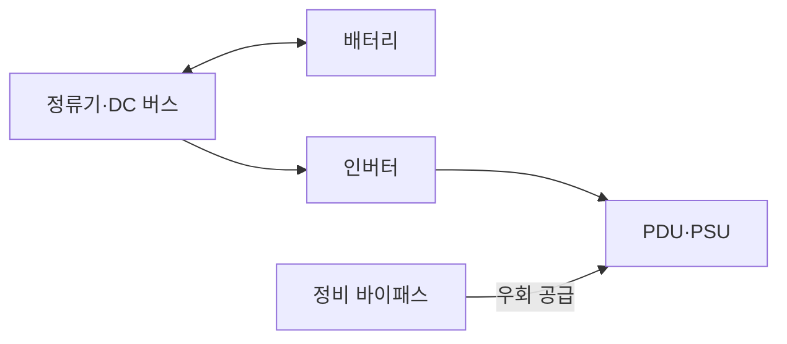
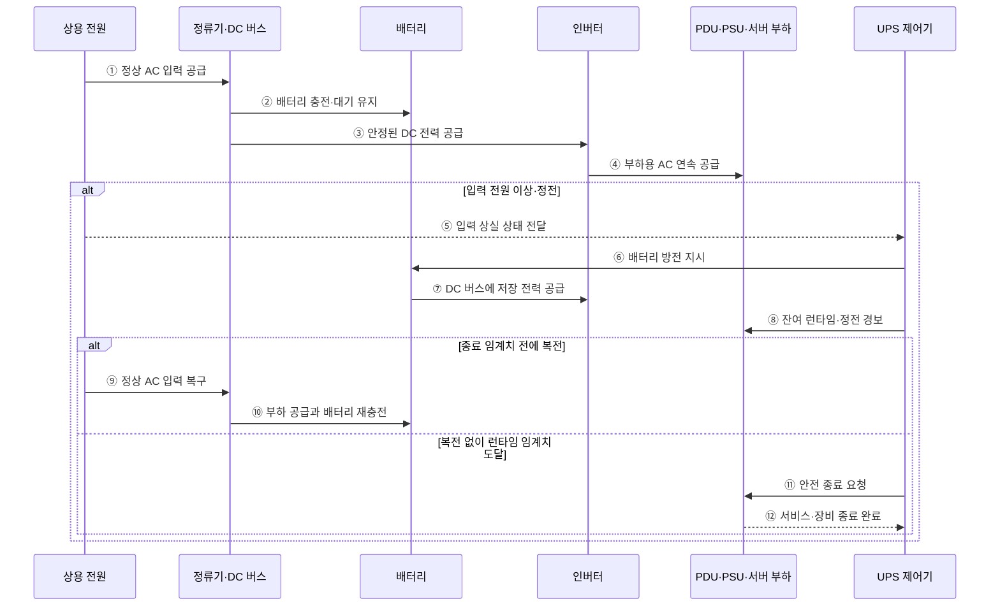

---
sidebar:
  order: 55
  label: "055. 전원 공급 장치·UPS"
  badge:
    text: "기출 · 50%"
    variant: note
title: "전원 공급 장치·UPS"
date: "2026-07-28T13:02:49+09:00"
tags:
  - "notes-hardware"
weight: 55
extra:
  question_no: "055"
  source_status: "기출"
  source_history: "126회"
  priority: 50
  priority_note: "PSU·UPS 절체·런타임의 단일 기출 핵심"
---

## 미리 알고가기

- **전원 공급 장치(Power Supply Unit, PSU)**: 교류 전원을 장비가 사용하는 직류 전원으로 변환하는 장치
- **무정전 전원 공급 장치(Uninterruptible Power Supply, UPS)**: 정전이나 입력 전원 이상 시 배터리로 부하 전원을 유지하는 장치
- **온라인 UPS(Online UPS)**: 정류기와 인버터를 거쳐 상시 전원 공급
- **직류 버스(Direct Current Bus, DC Bus)**: 정류기·배터리·인버터 사이에서 직류 전력을 전달하는 공통 전력 경로
- **전력 분배 장치(Power Distribution Unit, PDU)**: 전원을 랙과 장비별로 분배하고 전압·전류·전력을 계측하는 장치
- **A/B 이중 경로**: 독립 전원 입력으로 단일 장애를 격리
- **정비 바이패스(Maintenance Bypass)**: UPS 점검 때 부하를 상용 전원으로 우회
- **절체(Transfer)**: 부하를 예비·우회 경로로 전환
- **교류·직류(Alternating Current·Direct Current, AC·DC)**: 주기적으로 방향이 바뀌는 상용 전력과 한 방향으로 흐르는 장비 내부 전력을 구분하는 전류 방식
- **정류기·인버터(Rectifier·Inverter)**: 정류기는 교류를 직류로 바꾸고 인버터는 직류를 부하용 교류로 되돌리는 전력 변환기
- **런타임(Runtime)**: 정전 후 UPS 배터리가 현재 부하에 전력을 공급할 수 있는 예상 시간
- **부하율(Load Factor)**: UPS·PSU 정격 용량 중 장비가 실제로 사용하는 전력의 비율
- **배터리 열화(Battery Degradation)**: 충방전·고온·시간 경과로 저장 용량과 출력 능력이 줄어드는 현상
- **복전(Power Restoration)**: 정전됐던 상용 전원이 정상 전압·주파수로 다시 공급되는 상태
- **안전 종료(Graceful Shutdown)**: 남은 전력 안에 데이터 저장과 서비스 정리를 마친 뒤 장비 전원을 끄는 절차

## Ⅰ. 개요

- 정의/개념: PSU 전력 변환과 **UPS 비상 전원**을 결합한 체계
- 기존 한계: 단일 전원 경로는 **고장·정전 즉시 서비스 중단**

### 쉽게 이해하기 (학습용)

- PSU가 장비용 전기로 바꾸고 UPS가 정전 동안 비상 전력을 이어 준다

## Ⅱ. 특징

- **이중 PSU 경로**로 단일 변환기 고장 격리
- **UPS 배터리**로 정전 중 부하 전원 유지
- **부하율·배터리 열화**가 백업 시간 결정

$$
Runtime \approx \frac{Usable\ Battery\ Energy \times Conversion\ Efficiency}{Load\ Power}
$$

> 일정 부하와 사용 가능한 배터리 에너지를 가정한 근사식이며, 실제 런타임은 방전율·온도·배터리 열화·인버터 손실로 달라진다.

### 쉽게 이해하기 (학습용)

- 어댑터를 둘로 나누고 비상 배터리까지 두되 실제로 전원을 끊어 확인해야 한다

## Ⅲ. 아키텍처 및 구성요소

### 도표안 A. 온라인 UPS 전력 경로 정적 구조

| 설계 요소 | 입력·상태 | 역할 |
|:---|:---|:---|
| 정류기·DC 버스 | 교류 입력·직류 전압 | 전력 변환·배터리 충전 경로 |
| 배터리 | 충전량·온도·열화 상태 | 입력 상실 시 저장 전력 공급 |
| 인버터 | DC 버스 전력·부하 상태 | 안정된 부하용 교류 생성 |
| 정비 바이패스 | 상용 전원·절체 상태 | UPS 점검·고장 우회 공급 |
| PDU·PSU | 랙 부하·A/B 입력 | 전력 분배·장비용 직류 변환 |

> 요약: 배터리가 DC 버스에서 인버터 공급을 유지한다

### 도표안 B. 정상 공급·정전·복전·안전 종료 시퀀스

### 동작 원리

1. **① 정상 AC 입력 공급**: 평상시 상용 전원이 온라인 UPS의 정류기에 교류 전력을 공급한다.
2. **② 배터리 충전·대기 유지**: 정류기는 교류를 직류로 바꾸고 배터리를 규정 충전 상태로 유지한다.
3. **③ 안정된 DC 전력 공급**: 정류기와 공통 DC 버스는 배터리 상태와 무관하게 인버터에 안정된 직류 전력을 제공한다.
4. **④ 부하용 AC 연속 공급**: 인버터는 직류를 서버 PSU가 사용할 교류로 변환해 PDU와 장비에 계속 공급한다.
5. **⑤ 입력 상실 상태 전달**: UPS 제어기는 상용 전압·주파수가 허용 범위를 벗어나거나 완전히 사라진 상태를 감지한다.
6. **⑥ 배터리 방전 지시**: 제어기는 외부 입력 대신 배터리가 DC 버스를 유지하도록 방전 경로를 활성화한다.
7. **⑦ DC 버스에 저장 전력 공급**: 배터리는 같은 DC 버스에 전력을 내므로 온라인 UPS는 부하 경로를 끊어 절체할 필요 없이 인버터를 유지한다.
8. **⑧ 잔여 런타임·정전 경보**: 제어기는 현재 부하, 배터리 충전량·온도·열화 상태로 잔여 시간을 추정해 서버 관리 계층에 알린다.
9. **⑨ 정상 AC 입력 복구**: 안전 종료 임계치 전에 복전되면 정류기가 다시 상용 전원을 받아 DC 버스 공급을 담당한다.
10. **⑩ 부하 공급과 배터리 재충전**: 정류기는 부하를 계속 공급하면서 방전된 배터리를 허용 전류로 재충전한다.
11. **⑪ 안전 종료 요청**: 복전되지 않아 잔여 시간이 종료에 필요한 시간 아래로 떨어지면 UPS 제어기는 서버에 안전 종료를 요청한다.
12. **⑫ 서비스·장비 종료 완료**: 서버는 데이터 저장과 서비스 정리를 마치고 종료 상태를 UPS 관리 계층에 반환한다.

### 쉽게 이해하기 (학습용)

- 평소 충전한 비상 물탱크가 단수 때 같은 배관으로 물을 이어 주는 구조다

## Ⅳ. 종류 및 비교

| 전원 보호 구성 | 이중 PSU·UPS | 이중 PSU | 단일 PSU |
|:---|:---|:---|:---|
| 적용 기준 | 외부 정전까지 **연속 공급** | PSU·입력선 **단일 고장 대응** | 중단 허용 **비핵심 장비** |
| 핵심 특징 | A/B 경로·**배터리 백업** | A/B 입력의 **PSU 고장 격리** | 단일 입력·**단일 변환 경로** |
| 한계 | 배터리 열화·**절체 실패** | 전체 입력 **동시 상실** | 단일 장애 시 **즉시 중단** |

> 요약: UPS 배터리가 외부 정전에도 공급을 유지한다

### 쉽게 이해하기 (학습용)

- 어댑터 두 개는 한쪽 고장만 격리하고 비상 배터리까지 있어야 건물 정전을 견딘다

## Ⅴ. 실무 고려사항 및 대응 방안

| 운영 위험 | 대응 | 기대 효과 |
|:---|:---|:---|
| 배터리 열화로 표시 런타임과 실제 시간 불일치 | 온도·내부 저항·방전 시험 기반 용량 보정 | 종료 가능 시간 신뢰성 향상 |
| A/B 경로가 같은 상위 전원·PDU를 공유 | 상용·발전기·UPS·PDU 장애 도메인 추적 | 공통 원인 장애 방지 |
| 한 경로 상실 시 잔여 경로 과부하 | 정상·단일 장애 부하율과 절체 순간 전류 검증 | 절체 중단 방지 |
| 바이패스 오조작·종료 자동화 실패 | 정비 절차·권한 통제와 정전·복전 모의 시험 | 운용 복구성 확보 |

> 서버 랙은 A/B PDU 중 한 경로를 실제로 차단해 남은 PSU·PDU가 전체 부하와 절체 순간 전류를 감당하는지 시험한다.

### 쉽게 이해하기 (학습용)

- 정전이 길어지면 비상 전력의 남은 시간을 보며 복구를 기다리거나 안전하게 끈다.
- 서버 랙은 전원선 하나를 끊어도 다른 선이 전체 부하를 받는지 확인한다

## Ⅵ. 결론

- 전원 연속성을 위해 장애 범위·부하를 검토하여 **UPS** 활용

### 쉽게 이해하기 (학습용)

- 견딜 정전 범위를 정하고 실제 절체와 방전 시간으로 설계를 증명한다
