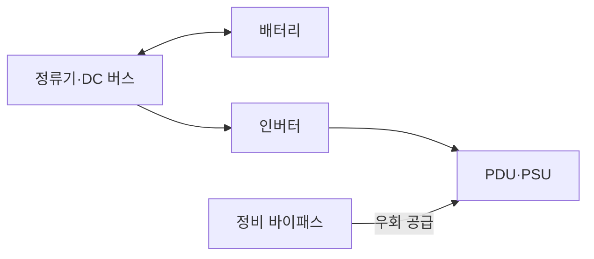
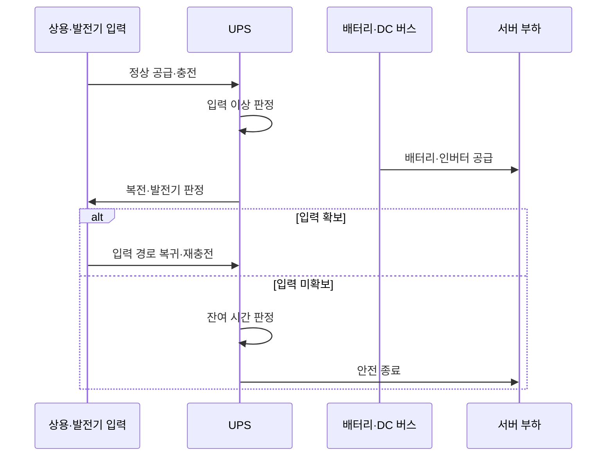

---
sidebar:
  order: 55
  label: "055. 전원 공급 장치·UPS"
  badge:
    text: "기출 · 50%"
    variant: note
title: "전원 공급 장치·UPS"
date: "2026-07-25T10:14:00+09:00"
tags:
  - "notes-hardware"
weight: 55
extra:
  question_no: "055"
  source_status: "기출"
  source_history: "126회"
  priority: 50
  priority_note: "PSU·UPS 절체·런타임의 단일 기출 핵심"
---

## 미리 알고가기

- **전원 공급 장치(Power Supply Unit, PSU)**: ‘피에스유’로 읽고 영문 머리글자를 딴 약어이며, 교류를 장비용 직류로 변환
- **무정전 전원 공급 장치(Uninterruptible Power Supply, UPS)**: ‘유피에스’로 읽고 영문 머리글자를 딴 약어이며, 정전 때 배터리로 부하 전원을 유지
- **온라인 UPS(Online UPS)**: 정류기와 인버터를 거쳐 상시 전원 공급
- **직류 버스(Direct Current Bus, DC Bus)**: ‘디시 버스’로 읽고 직류의 영문 머리글자를 딴 약어이며, 정류기·배터리·인버터를 연결
- **전력 분배 장치(Power Distribution Unit, PDU)**: ‘피디유’로 읽고 영문 머리글자를 딴 약어이며, 랙별 전력을 분배·계측
- **A/B 이중 경로**: 독립 전원 입력으로 단일 장애를 격리
- **정비 바이패스(Maintenance Bypass)**: UPS 점검 때 부하를 상용 전원으로 우회
- **절체(Transfer)**: 부하를 예비·우회 경로로 전환
- **교류·직류(Alternating Current·Direct Current, AC·DC)**: ‘에이시·디시’로 읽고 각 영문 머리글자를 딴 약어이며, 방향이 바뀌는 상용 전력과 한 방향의 장비 전력을 구분
- **정류기·인버터(Rectifier·Inverter)**: 정류기는 교류를 직류로 바꾸고 인버터는 직류를 부하용 교류로 되돌리는 전력 변환기
- **런타임(Runtime)**: 정전 후 UPS 배터리가 현재 부하에 전력을 공급할 수 있는 예상 시간
- **부하율(Load Factor)**: UPS·PSU 정격 용량 중 장비가 실제로 사용하는 전력의 비율
- **배터리 열화(Battery Degradation)**: 충방전·고온·시간 경과로 저장 용량과 출력 능력이 줄어드는 현상
- **복전(Power Restoration)**: 정전됐던 상용 전원이 정상 전압·주파수로 다시 공급되는 상태
- **안전 종료(Graceful Shutdown)**: 남은 전력 안에 데이터 저장과 서비스 정리를 마친 뒤 장비 전원을 끄는 절차

## Ⅰ. 개요

- **정의/개념**: PSU 변환과 UPS 백업을 결합한 체계다
- **배경/필요성**: 전원 장애로 인한 서비스 중단을 막는다

### 쉽게 이해하기 (학습용)

- PSU가 장비용 전기로 바꾸고 UPS가 정전 동안 비상 전력을 이어 준다

## Ⅱ. 특징

- 독립 전원 경로는 단일 고장의 서비스 중단을 막는다
- 부하율·열화 증가는 런타임을 줄여 종료를 앞당긴다

### 쉽게 이해하기 (학습용)

- 어댑터를 둘로 나누고 비상 배터리까지 두되 실제로 전원을 끊어 확인해야 한다

## Ⅲ. 아키텍처 및 구성요소

| 설계 요소 | 설명 |
|:---|:---|
| 정류기·DC 버스 | 교류 정류와 배터리 충전용 직류 경로 |
| 배터리 | 입력 상실 때 DC 버스에 저장 전력 공급 |
| 인버터 | 직류를 안정된 부하용 교류로 변환 |
| 정비 바이패스 | UPS 점검·고장 때 상용 전원으로 우회 |
| PDU·PSU | 랙 전력 분배와 장비용 직류 변환 |

> 요약: 배터리가 DC 버스에서 인버터 공급을 유지한다

### 쉽게 이해하기 (학습용)

- 평소 충전한 비상 물탱크가 단수 때 같은 배관으로 물을 이어 주는 구조다

## Ⅳ. 원리 및 절차 흐름도

| 절차 | 설명 |
|:---|:---|
| 정상 공급·충전 | 정류기·인버터로 공급하며 배터리 충전 |
| 입력 이상 판정 | 전압·주파수 이상과 입력 상실 감지 |
| 배터리·인버터 공급 | DC 버스 배터리로 인버터 출력 유지 |
| 복전·발전기 판정 | 상용·발전기 전원의 안정 여부 확인 |
| 입력 경로 복귀·재충전 | 부하를 안정된 입력으로 돌리고 배터리 충전 |
| 잔여 시간 판정 | 부하·전압·온도로 남은 런타임 추정 |
| 안전 종료 | 임계 도달 전 장비를 순서대로 종료 |

> 요약: 입력 상실 시 배터리로 공급하고 종료를 판단한다

### 쉽게 이해하기 (학습용)

- 정전이 길어지면 비상 전력의 남은 시간을 보며 복구를 기다리거나 안전하게 끈다

## Ⅴ. 종류 및 비교

| 판단 기준 | 이중 PSU·UPS | 이중 PSU | 단일 PSU |
|:---|:---|:---|:---|
| 핵심 특징 | A/B 경로와 배터리 백업 | A/B 입력의 PSU 고장 격리 | 단일 입력·단일 변환 경로 |
| 적용 기준 | 외부 정전까지 연속 공급 | 한쪽 PSU·입력선 고장 대응 | 중단 허용 비핵심 장비 |
| 주요 위험 | 배터리 열화·절체 실패 | 전체 입력 상실 | 단일 장애 즉시 중단 |

> 요약: UPS 배터리가 외부 정전에도 공급을 유지한다

### 쉽게 이해하기 (학습용)

- 어댑터 두 개는 한쪽 고장만 격리하고 비상 배터리까지 있어야 건물 정전을 견딘다

## Ⅵ. 실무 사례

1. 서버 랙: A/B PDU와 이중 PSU 절체를 시험한다
2. 데이터센터: UPS와 발전기 연계를 시험한다

### 쉽게 이해하기 (학습용)

- 서버 랙은 전원선 하나를 끊어도 다른 선이 전체 부하를 받는지 확인한다
- 데이터센터는 비상 배터리가 발전기 기동까지 버티는지 실제로 시험한다

## Ⅶ. 결론

- 단일 고장은 이중 PSU, 외부 정전은 UPS로 막는다

### 쉽게 이해하기 (학습용)

- 견딜 정전 범위를 정하고 실제 절체와 방전 시간으로 설계를 증명한다
