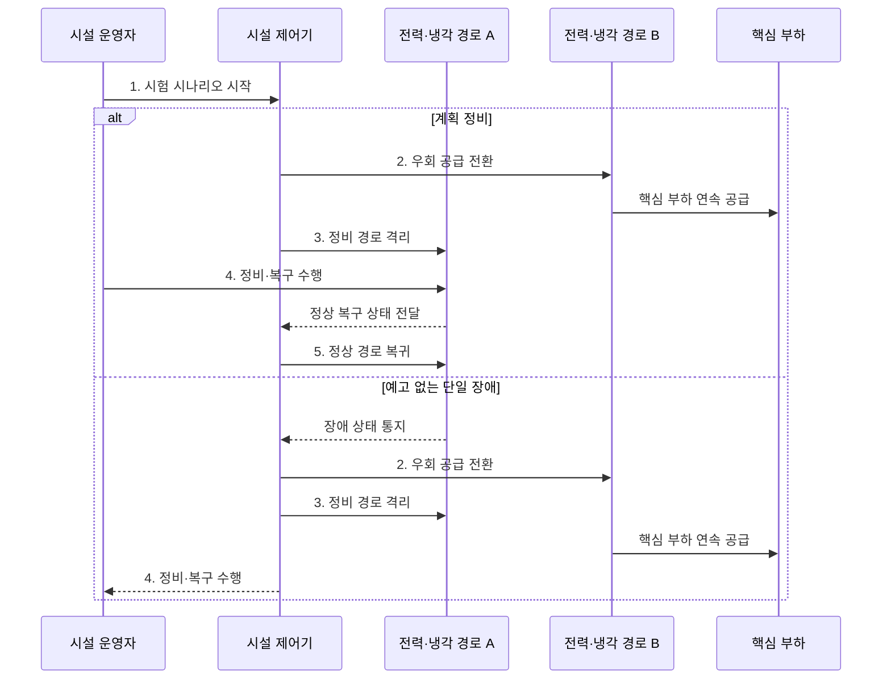

---
sidebar:
  order: 56
  label: "056. 데이터센터 등급 (Tier I~IV·Rated 1~4)"
  badge:
    text: "기출 · 50%"
    variant: note
title: "데이터센터 등급 (Tier I~IV·Rated 1~4)"
date: "2026-07-30T18:21:35+09:00"
tags:
  - "notes-hardware"
weight: 56
extra:
  question_no: "056"
  source_status: "기출"
  source_history: "129회"
  priority: 50
  priority_note: "Tier·Rated 복원력의 단일 기출 핵심"
---

## 미리 알고가기

- **데이터센터 등급(Data Center Rating)**: 설비 정비·장애 시 서비스 지속 수준
- **Uptime Institute Tier**: Tier I~IV의 설비 복원력 평가 체계
- **통신산업협회(Telecommunications Industry Association, TIA)**: 데이터센터 통신·시설 기준인 TIA-942와 Rated 1~4 평가 체계를 제정한 표준화 기관
- **필요 용량(N)**: N은 '엔'으로 읽고 필요한 수량을 나타내는 관례적 변수라서 쓰며, 본문에서 정상 운영에 필요한 설비 용량을 뜻함
- **N+1 구성**: N+1은 '엔 플러스 원'으로 읽고 필요 용량 N에 예비 설비 하나를 더한다는 표기이며, 본문에서 단일 설비 고장에 대비하는 중복 구성을 뜻함
- **동시 유지보수(Concurrent Maintainability)**: 서비스 중단 없는 계획 정비
- **장애 허용(Fault Tolerance)**: 단일 설비 장애에도 서비스 유지
- **Tier I·Rated 1**: 예비 설비와 복수 분배 경로 없이 기본 용량의 단일 경로로 부하를 공급하는 수준
- **Tier II·Rated 2**: 예비 구성요소는 있지만 전력·냉각 분배는 단일 경로인 수준
- **Tier III·Rated 3**: 복수 분배 경로로 계획 정비 중에도 서비스 부하를 유지하는 수준
- **Tier IV·Rated 4**: 독립 경로와 중복 설비로 단일 장애 중에도 핵심 부하를 유지하는 수준
- **복원력(Resilience)**: 설비 장애·정비가 발생해도 서비스를 유지하거나 정해진 시간 안에 복구하는 능력
- **중복 용량(Redundant Capacity)**: 정상 부하에 필요한 용량 외에 고장·정비 때 대신 사용할 예비 설비 용량
- **시험 증적(Test Evidence)**: 설계 문서와 현장 시험 결과로 정비·장애 시 서비스 지속 여부를 입증하는 자료
- **핵심 부하(Critical Load)**: 정전·냉각 중단 때도 계속 전력을 공급해야 하는 서버·네트워크 장비
- **공통 원인 장애(Common-Cause Failure)**: 겉으로 분리된 여러 경로가 같은 상위 전원·배관·제어기·공간을 공유해 하나의 사건으로 함께 중단되는 장애

## Ⅰ. 개요

- 정의/개념: 설비의 **중복·정비·장애 허용 수준** 분류
- 배경/필요성: 가용성 목표에 따른 **과소·과잉 투자** 방지

### 쉽게 이해하기 (학습용)

- 다리를 정비하거나 하나 잃어도 통행을 이어 갈 수 있는 수준을 구분한 기준이다

## Ⅱ. 특징

- **Tier·Rated 독립 기준**으로 등급 간 단순 환산 금지
- **최약 필수 경로**가 전체 시설의 복원력 결정
- **정비 가능성·장애 허용성**을 구분해 목표 등급 선정

### 쉽게 이해하기 (학습용)

- 같은 숫자라도 심사 기준이 다르고 가장 약한 전원·냉각 경로가 전체 등급을 제한한다

## Ⅲ. 구조 및 구성요소

| 구성요소 | 책임 |
|:---|:---|
| 용량 구성 | 정상 부하·**예비 용량 설정** |
| 분배 경로 | 전력·냉각 **경로 격리** |
| 정비·장애 허용 | 부하 **유지 범위 판정** |
| 시험 증적 | 시나리오·**현장 결과 입증** |

### 쉽게 이해하기 (학습용)

- 예비 용량과 독립 경로를 실제 정비·장애 시험으로 검증해 등급을 판정한다.

## Ⅳ. 흐름도

**동작 원리**

- **1. 시험 시나리오 시작**: 안전 조건 적용
- **2. 우회 공급 전환**: 대체 경로의 용량·상태를 검증해 핵심 부하 연속 공급
- **3. 정비 경로 격리**: 작업·장애 구간을 분리해 활성 경로로의 영향 차단
- **4. 정비·복구 수행**: 계획 정비 또는 장애 복구 후 단독 기능 확인
- **5. 정상 경로 복귀**: 검증된 경로를 재투입하고 잔여 중복도 회복

### 쉽게 이해하기 (학습용)

- 용량과 우회 경로를 갖춰도 실제 정비·고장 시험을 통과해야 등급을 입증할 수 있다

## Ⅴ. 종류 및 비교

| 데이터센터 등급 | Tier I | Tier II | Tier III | Tier IV |
|:---|:---|:---|:---|:---|
| 적용 기준 | 중단 허용 **기본 시설** | 구성요소 **고장 대비** | 정비 중 **서비스 연속** | 단일 장애에도 **핵심 부하 유지** |
| 핵심 특징 | 기본 용량·**단일 경로** | **N+1 구성**·단일 경로 | 복수 경로의 **동시 유지보수** | 독립 경로의 **장애 허용** |
| 한계 | 설비·경로 **단일 장애** | 분배 경로 **정비 중단** | 장애 위치별 **중단 가능성** | 높은 투자·**운영 복잡성** |

> 요약: Tier III는 정비, Tier IV는 장애에도 유지한다

### 쉽게 이해하기 (학습용)

- 세 번째는 다리 공사를 우회하고 네 번째는 다리 하나가 무너져도 통행한다

## Ⅵ. 실무 고려사항 및 대책

| 고려사항 | 대책 | 효과 |
|:---|:---|:---|
| 설계 등급과 실제 시공·운영 상태 불일치 | 준공·변경 후 정비·장애 시나리오 시험과 증적 갱신 | 실효 복원력 확인 |
| 겉보기 이중 경로가 전원·냉각 상류를 공유 | 종단 간 경로와 공통 장애점을 추적 | 상관 장애 방지 |
| 정비 절차 오류로 예비 경로까지 중단 | 작업 권한·순서·복구 기준을 문서화하고 모의 훈련 | 동시 유지보수 신뢰성 향상 |
| 업무 요구보다 높은 등급으로 과잉 투자 | 서비스 영향·복구 목표와 수명주기 비용으로 등급 선정 | 비용·가용성 균형 |

> 금융 데이터센터는 전력·냉각 경로 하나를 계획 정비 상태로 격리해도 핵심 서비스가 유지되는지 시험하고 증적을 남긴다.

### 쉽게 이해하기 (학습용)

- 금융 센터는 전력 경로 하나를 정비해도 서비스가 이어지는지 확인한다

## Ⅶ. 결론

- **정비 중 연속성**은 Tier III, **단일 장애 유지**는 Tier IV 선택

### 쉽게 이해하기 (학습용)

- 가장 높은 숫자보다 필요 수준을 선택하고 가장 약한 다리부터 시험한다
