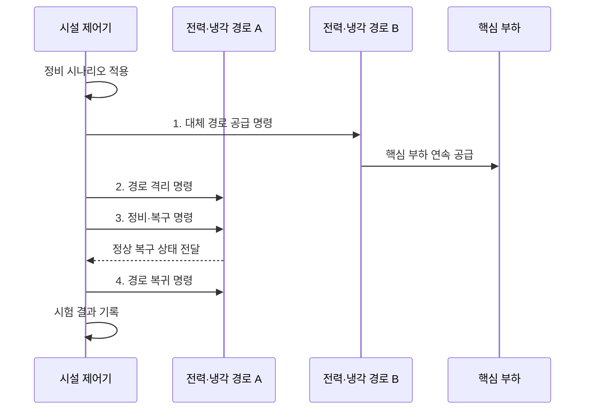

---
sidebar:
  order: 56
  label: "056. 데이터센터 등급 (Tier I~IV·Rated 1~4)"
  badge:
    text: "기출 · 50%"
    variant: note
title: "데이터센터 등급 (Tier I~IV·Rated 1~4)"
date: "2026-08-02T11:16:00+09:00"
tags:
  - "notes-hardware"
weight: 56
extra:
  question_no: "056"
  source_status: "기출"
  source_history: "129회"
  priority: 50
  priority_note: "Tier·Rated 복원력의 단일 기출 핵심"
---

## Ⅰ. 개요

핵심 용어

- **데이터센터 등급(Data Center Rating)**: 전력과 냉각 설비의 정비 또는 장애 중에 서비스를 지속할 수 있는 수준을 구분한 체계이다.
- **복원력(Resilience)**: 설비 장애나 정비가 발생해도 서비스를 유지하거나 정해진 시간 안에 복구하는 능력이다.
- **가용성 목표(Availability Target)**: 서비스가 정상 제공되어야 하는 시간 비율과 허용 중단 수준을 정한 목표이다.

- 정의/개념: **데이터센터 등급**은 전력•냉각 설비의 중복성•정비 가능성•장애 허용 수준으로 시설 복원력을 구분하는 **분류 체계**
- 배경/필요성: 서비스 가용성 목표에 맞는 복원력과 수명주기 비용을 함께 선택할 **공통 평가 기준이 필요**

#### 한줄 요약

- 다리를 정비하거나 하나 잃어도 통행을 이어 갈 수 있는 수준을 구분한 기준이다

## Ⅱ. 특징

핵심 용어

- **Uptime Institute Tier**: 데이터센터 설비의 중복성과 정비 가능성 및 장애 허용성을 Tier I~IV로 평가하는 체계이다.
- **TIA-942 Rated**: 통신산업협회 표준에 따라 데이터센터 시설을 Rated 1~4로 평가하는 독립된 체계이다.
- **최약 필수 경로(Weakest Critical Path)**: 핵심 부하 공급에 반드시 필요하면서 복원력이 가장 낮아 전체 수준을 제한하는 경로이다.
- **장애 허용(Fault Tolerance)**: 하나의 설비나 경로에 예기치 않은 장애가 발생해도 핵심 부하를 유지하는 능력이다.

- **Uptime Tier·TIA-942 Rated** 독립 기준으로 단순 환산 금지
- **최약 필수 경로**가 전체 시설의 복원력 결정
- **정비 가능성·장애 허용성**을 구분해 목표 등급 선정

#### 한줄 요약

- 같은 숫자라도 심사 기준이 다르고 가장 약한 전원·냉각 경로가 전체 등급을 제한한다

## Ⅲ. 구조 및 구성요소

핵심 용어

- **필요 용량(N)**: 정상 상태에서 전체 핵심 부하를 공급하는 데 필요한 설비 용량이다.
- **중복 용량(Redundant Capacity)**: 정상 부하에 필요한 용량 외에 고장이나 정비 때 대신 사용할 예비 설비 용량이다.
- **분배 경로(Distribution Path)**: 전력이나 냉각원을 핵심 부하까지 전달하는 배선·배관 및 제어 설비의 연결 경로이다.
- **시험 증적(Test Evidence)**: 설계 문서와 현장 시험 결과로 정비·장애 중 서비스 지속 여부를 입증하는 자료이다.

| 구성요소 | 책임 |
|:---|:---|
| 용량 구성 | 정상 부하·**예비 용량 설정** |
| 분배 경로 | 전력·냉각 **경로 격리** |
| 정비·장애 허용 | 부하 **유지 범위 판정** |
| 시험 증적 | 시나리오·**현장 결과 입증** |

#### 한줄 요약

- 예비 용량과 독립 경로를 실제 정비·장애 시험으로 검증해 등급을 판정한다.

## Ⅳ. 흐름도

핵심 용어

- **대체 경로(Alternate Path)**: 주 경로를 정비하거나 격리하는 동안 핵심 부하를 계속 공급하는 독립 경로이다.
- **경로 격리(Path Isolation)**: 정비나 고장 구간이 활성 공급 경로에 영향을 주지 않도록 물리적·제어적으로 분리하는 절차이다.
- **중복도 회복(Redundancy Restoration)**: 정비한 경로를 검증 후 재투입하여 예비 설비와 경로의 여유를 되찾는 과정이다.

**동작 원리**

1. **대체 경로 공급 명령**: 대체 경로의 용량·상태를 검증해 부하 유지
2. **경로 격리 명령**: 정비 구간을 분리해 활성 경로 영향 차단
3. **정비·복구 명령**: 격리 경로의 정비 후 단독 기능 확인
4. **경로 복귀 명령**: 검증된 경로를 재투입해 잔여 중복도 회복

#### 한줄 요약

- 용량과 우회 경로를 갖춰도 실제 정비·고장 시험을 통과해야 등급을 입증할 수 있다

## Ⅴ. 종류 및 비교

핵심 용어

- **Tier I·II**: Tier I은 기본 용량과 단일 경로이고, Tier II는 예비 구성요소가 있지만 분배 경로는 단일인 수준이다.
- **Tier III**: 복수 분배 경로를 이용하여 계획된 설비 정비 중에도 핵심 부하를 유지하는 수준이다.
- **Tier IV**: 독립 경로와 중복 설비로 예기치 않은 단일 장애 중에도 핵심 부하를 유지하는 수준이다.
- **동시 유지보수(Concurrent Maintainability)**: 서비스 중단 없이 계획된 설비를 격리하고 정비할 수 있는 성질이다.

| 데이터센터 등급 | Tier I | Tier II | Tier III | Tier IV |
|:---|:---|:---|:---|:---|
| 적용 기준 | 중단 허용 **기본 시설** | 구성요소 **고장 대비** | 정비 중 **서비스 연속** | 단일 장애에도 **핵심 부하 유지** |
| 핵심 특징 | 기본 용량·**단일 경로** | **N+1 구성**·단일 경로 | 복수 경로의 **동시 유지보수** | 독립 경로의 **장애 허용** |
| 한계 | 설비·경로 **단일 장애** | 분배 경로 **정비 중단** | 장애 위치별 **중단 가능성** | 높은 투자·**운영 복잡성** |

> 요약: **Tier III**는 정비, **Tier IV**는 단일 장애 중 부하 유지

#### 한줄 요약

- 세 번째는 다리 공사를 우회하고 네 번째는 다리 하나가 무너져도 통행한다

## Ⅵ. 실무 고려사항 및 대책

핵심 용어

- **공통 장애점(Common Failure Point)**: 여러 공급 경로가 공유하여 하나의 고장으로 모두 영향을 받을 수 있는 상위 설비나 공간이다.
- **상관 장애(Correlated Failure)**: 공통 원인 때문에 겉으로 독립된 여러 설비나 경로가 함께 중단되는 장애이다.
- **복구 기준(Recovery Criteria)**: 정비나 장애 후 설비를 정상 경로에 재투입하기 전에 만족해야 하는 상태와 시험 조건이다.
- **수명주기 비용(Lifecycle Cost)**: 설계와 구축부터 운영·정비·교체까지 시설의 전체 사용 기간에 드는 비용이다.

| 문제 | 대책 | 효과 |
|:---|:---|:---|
| 설계 등급과 실제 시공·운영 상태 불일치 | 준공·변경 후 **정비·장애 시험 증적** 갱신 | **실효 복원력** 확인 |
| 겉보기 이중 경로가 전원·냉각 상류를 공유 | 종단 간 경로의 **공통 장애점** 추적 | **상관 장애** 방지 |
| 정비 절차 오류로 예비 경로까지 중단 | **작업 권한·복구 기준** 문서화와 모의 훈련 | **동시 유지보수** 신뢰성 향상 |
| 업무 요구보다 높은 등급으로 과잉 투자 | **서비스 영향·복구 목표**와 수명주기 비용 비교 | **비용·가용성** 균형 |

> 요약: 경로 계획 정비 중 **핵심 부하 연속성** 시험·증적

#### 한줄 요약

- 금융 센터는 전력 경로 하나를 정비해도 서비스가 이어지는지 확인한다

## Ⅶ. 결론

핵심 용어

- **정비 중 연속성(Maintenance Continuity)**: 계획 정비를 위해 경로를 격리해도 핵심 부하의 서비스가 중단되지 않는 성질이다.
- **단일 장애 유지(Single-failure Continuity)**: 예기치 않은 설비 장애 하나가 발생해도 핵심 부하를 계속 공급하는 성질이다.
- **핵심 부하(Critical Load)**: 전력이나 냉각 중단 중에도 계속 서비스를 유지해야 하는 서버와 네트워크 장비이다.

- **정비 중 연속성**은 Tier III, **단일 장애 유지**는 Tier IV 선택

#### 한줄 요약

- 계획 정비 중 유지가 목표면 Tier III, 단일 장애 중 유지까지면 Tier IV를 고른다
