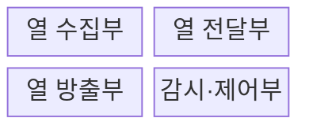
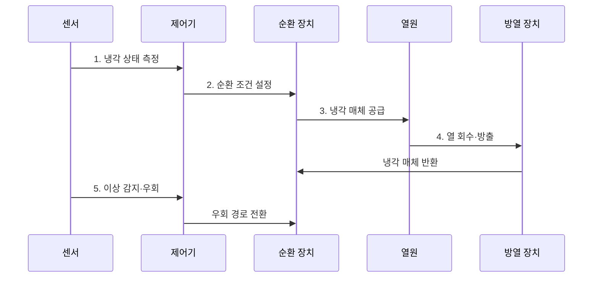

---
sidebar:
  order: 57
  label: "057. 냉각 시스템 (공랭·직접 수랭·액침냉각)"
  badge:
    text: "미출 · 70%"
    variant: note
title: "냉각 시스템 (공랭·직접 수랭·액침냉각)"
date: "2026-07-30T18:00:00+09:00"
tags:
  - "notes-hardware"
weight: 57
extra:
  question_no: "057"
  source_status: "미출"
  source_history: ""
  priority: 70
  priority_note: "고밀도 장비 냉각 방식의 핵심"
---

## 미리 알고가기

- **열 부하(Heat Load)**: 서버의 전력 소비가 냉각 계통으로 방출하는 열량
- **열 저항(Thermal Resistance)**: 온도 차를 열전달률로 나눈 냉각 경로의 열 이동 난이도
- **냉각수 공급 온도(Supply Water Temperature)**: 열원에 들어가기 전 냉각수 온도

## Ⅰ. 개요

- 정의/개념: 장비 열을 냉각 매체로 **외부 방출**하는 체계
- 배경/필요성: 고밀도 장비의 **과열·열 스로틀링** 방지

### 쉽게 이해하기 (학습용)

- 방 안의 열을 바람이나 물로 밖에 내보내는 설비와 같다.

## Ⅱ. 특징

- **열전달 경로** 연속성으로 열원부터 외부 방열까지 열 이동
- 최대 **열 부하** 기준 용량으로 과열·스로틀링 방지
- **온도·유량·압력** 감시로 냉각 성능 저하 조기 탐지

### 쉽게 이해하기 (학습용)

- 열을 빨리 모으고 옮기며 이상을 즉시 찾는 것이 핵심이다.

## Ⅲ. 구조 및 구성요소

| 구성요소 | 책임 |
|:---|:---|
| 열 수집부 | **장비 열 흡수** |
| 열 전달부 | **냉각 매체 순환** |
| 열 방출부 | **외부 열 방출** |
| 감시·제어부 | **온도·유량 제어** |

### 쉽게 이해하기 (학습용)

- 열을 모아 옮기고 버리는 전 과정을 제어부가 감시한다.

## Ⅳ. 흐름도

**동작 원리**

- **1. 냉각 상태 측정**: 온도·유량·압력 수집
- **2. 순환 조건 설정**: 펌프·팬 운전값 결정
- **3. 냉각 매체 공급**: 열원에 공기·액체 전달
- **4. 열 회수·방출**: 가열된 매체의 열을 외기·냉각수 계통으로 방출한 뒤 재순환
- **5. 이상 감지·우회**: 과열·누수·고장을 판정해 장애 구간 격리

### 쉽게 이해하기 (학습용)

- 센서 측정값에 맞춰 냉각 매체를 돌리고 장애 시 우회한다.

## Ⅴ. 종류 및 비교

| 구분 | 공랭 | 직접 수랭 | 액침냉각 |
|:---|:---|:---|:---|
| 적용 기준 | 저·중밀도 랙 | 고밀도 CPU·GPU | 초고밀도 전용 장비 |
| 핵심 특징 | **공기 순환 냉각** | **콜드플레이트 흡열** | **절연액 직접 흡열** |
| 한계 | 공간·팬 전력 증가 | 누수·연결부 관리 | 재료 호환·정비 부담 |

### 쉽게 이해하기 (학습용)

- 발열 밀도가 높아질수록 열원과 가까운 액체 냉각이 유리하다.

## Ⅵ. 실무 고려사항 및 대책

| 고려사항 | 대책 | 효과 |
|:---|:---|:---|
| 센서·펌프 고장으로 냉각 용량 급감 | 센서 교차 검증·N+1 펌프와 장애 우회 | **과열 확산 방지** |
| 직접 수랭 연결부 누수 | 누수 감지선·자동 차단 밸브·드립리스 커넥터 | **장비 손상 방지** |
| 공랭의 배기 재순환·핫스폿 | 냉·열 통로 격리와 랙 입구 온도 감시 | **흡입 온도 안정** |
| 액침액과 케이블·실링 재료 열화 | 재료 호환성 시험·액체 분석·교체 기준 | **수명 예측성 확보** |

### 쉽게 이해하기 (학습용)

- 방식 선택보다 고장 감지와 열 경로 분리가 운영 안정성을 좌우한다.

## Ⅶ. 결론

- **발열 밀도·열 저항·정비 조건** 기반 냉각 방식 선택

### 쉽게 이해하기 (학습용)

- 장비의 열과 관리 여건에 맞는 냉각 방식을 선택한다.
