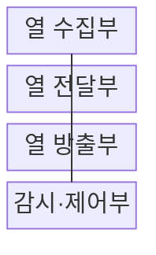
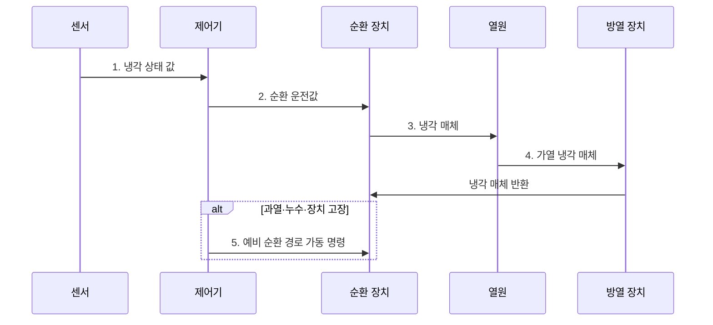

---
sidebar:
  order: 57
  label: "057. 냉각 시스템 (공랭·직접 수랭·액침냉각)"
  badge:
    text: "미출 · 70%"
    variant: note
title: "냉각 시스템 (공랭·직접 수랭·액침냉각)"
date: "2026-07-31T10:34:00+09:00"
tags:
  - "notes-hardware"
weight: 57
extra:
  question_no: "057"
  source_status: "미출"
  source_history: ""
  priority: 70
  priority_note: "고밀도 장비 냉각 방식의 핵심"
---

## 미리 알고가기

- **냉각 시스템(Cooling System)**: 서버가 만든 열을 공기·냉각수·절연액으로 흡수해 외부로 방출하는 설비 체계
- **열 부하(Heat Load)**: 서버의 전력 소비가 냉각 계통으로 방출하는 열량
- **열 저항(Thermal Resistance)**: 온도 차를 열전달률로 나눈 냉각 경로의 열 이동 난이도
- **냉각수 공급 온도(Supply Water Temperature)**: 열원에 들어가기 전 냉각수 온도
- **열 스로틀링(Thermal Throttling)**: 온도 한도를 넘지 않도록 프로세서 주파수·전력을 낮춰 처리량을 제한하는 제어
- **콜드플레이트(Cold Plate)**: CPU·GPU 표면에 밀착해 내부 냉각수로 열을 직접 흡수하는 판형 열교환기
- **절연액(Dielectric Fluid)**: 전기가 통하지 않아 전자 장비를 담근 상태로 열을 흡수할 수 있는 냉각액
- **핫스폿(Hot Spot)**: 주변보다 온도가 높아 냉각 한도를 먼저 넘는 국부 발열 지점
- **N+1 구성**: 정상 운전에 필요한 냉각 장치 수에 예비 장치 하나를 더한 중복 구성
- **드립리스 커넥터(Dripless Connector)**: 수랭 호스를 분리할 때 냉각액 누출을 줄이는 자동 밀폐 연결부

> **키워드:** 냉각 시스템 (공랭·직접 수랭·액침냉각)

## Ⅰ. 개요

- 정의/개념: 장비 열을 냉각 매체로 **외부 방출**하는 체계
- 배경/필요성: 고밀도 장비의 국부 발열은 **열 스로틀링·서비스 중단** 유발

### 쉽게 이해하기 (학습용)

- 방 안의 열을 바람이나 물로 밖에 내보내는 설비와 같다.

## Ⅱ. 특징

- **열전달 경로** 연속성으로 열원부터 외부 방열까지 열 이동
- 최대 **열 부하** 기준 용량으로 과열·스로틀링 방지
- **열 저항** 감소로 열원과 냉각 매체의 온도 차 축소

### 쉽게 이해하기 (학습용)

- 난로의 열을 집열판·배관·실외기로 끊김 없이 넘길수록 장비 온도가 낮아진다

## Ⅲ. 구조 및 구성요소

| 구성요소 | 책임 |
|:---|:---|
| 열 수집부 | **장비 열 흡수** |
| 열 전달부 | **냉각 매체 순환** |
| 열 방출부 | **외부 열 방출** |
| 감시·제어부 | **온도·유량 제어** |

### 쉽게 이해하기 (학습용)

- 열을 모아 옮기고 버리는 전 과정을 제어부가 감시한다.

## Ⅳ. 흐름도

**동작 원리**

1. **냉각 상태 값**: 온도·유량·압력으로 열 제거 상태 판정
2. **순환 운전값**: 열 부하에 맞춰 펌프·팬 출력 결정
3. **냉각 매체**: 공기·액체가 열원에서 열 흡수
4. **가열 냉각 매체**: 흡수한 열을 외기·냉각수 계통으로 방출
5. **예비 순환 경로 가동 명령**: 고장 구간을 격리하고 예비 장치 가동

### 쉽게 이해하기 (학습용)

- 센서 측정값에 맞춰 냉각 매체를 돌리고 장애 시 예비 순환 경로를 가동한다.

## Ⅴ. 종류 및 비교

| 냉각 방식 | 공랭 | 직접 수랭 | 액침냉각 |
|:---|:---|:---|:---|
| 적용 기준 | **저·중밀도 랙** | **고밀도 CPU·GPU** | **초고밀도 전용 장비** |
| 핵심 특징 | **공기 순환 냉각** | **콜드플레이트 흡열** | **절연액 직접 흡열** |
| 한계 | **공간·팬 전력** 증가 | **누수·연결부** 관리 | **재료 호환·정비** 부담 |

### 쉽게 이해하기 (학습용)

- 발열 밀도가 높아질수록 열원과 가까운 액체 냉각이 유리하다.

## Ⅵ. 실무 고려사항 및 대책

| 고려사항 | 대책 | 효과 |
|:---|:---|:---|
| 공급 온도 상승·펌프 고장으로 냉각 용량 급감 | **공급 온도 감시·N+1 펌프**와 예비 펌프 전환 | **냉각 용량** 유지 |
| 직접 수랭 연결부 누수 | **누수 감지선·차단 밸브**와 드립리스 커넥터 | **장비 손상** 방지 |
| 공랭의 배기 재순환·핫스폿 | **냉·열 통로 격리**와 랙 입구 온도 감시 | **흡입 온도** 편차 감소 |
| 액침액과 케이블·실링 재료 열화 | **재료 호환성 시험·액체 분석**과 교체 기준 | **수명 예측성** 향상 |

### 쉽게 이해하기 (학습용)

- 고장 감지와 열 경로 분리가 냉각 중단·핫스폿을 줄인다.

## Ⅶ. 결론

- **저•중밀도**는 공랭, **고밀도**는 직접 수랭, 초고밀도는 액침

### 쉽게 이해하기 (학습용)

- 저·중밀도는 바람, 고밀도는 콜드플레이트, 초고밀도는 절연액을 고른다
