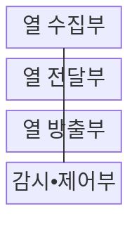

---
sidebar:
  order: 57
  label: "057. 냉각 시스템 (공랭•직접 수랭•액침냉각)"
  badge:
    text: "미출 • 70%"
    variant: note
title: "냉각 시스템 (공랭•직접 수랭•액침냉각)"
date: "2026-08-04T12:31:00+09:00"
tags:
  - "notes-hardware"
weight: 57
extra:
  question_no: "057"
  source_status: "미출"
  source_history: ""
  priority: 70
  priority_note: "고밀도 장비 냉각 방식의 핵심"
---

## Ⅰ. 개요

핵심 용어

- **냉각 시스템(Cooling System)**: 서버가 만든 열을 공기나 냉각수 및 절연액으로 흡수하여 외부로 방출하는 설비 체계이다.
- **열 부하(Heat Load)**: 서버가 소비한 전력 가운데 냉각 계통이 외부로 제거해야 하는 열량이다.
- **열 스로틀링(Thermal Throttling)**: 온도 한도를 넘지 않도록 프로세서 주파수와 전력을 낮춰 처리량을 제한하는 제어이다.

- 정의/개념: 서버가 만든 열을 공기•냉각수•절연액으로 흡수해 외부로 방출하는 **냉각 시스템** 기반 **열 관리 설비 체계**
- 배경/필요성: 고밀도 장비의 국부 발열은 **열 스로틀링•서비스 중단** 유발

#### 한줄 요약

- 방 안의 열을 바람이나 물로 밖에 내보내는 설비와 같다.

## Ⅱ. 특징

핵심 용어

- **열전달 경로(Heat-transfer Path)**: 열원에서 냉각 매체와 열교환기를 거쳐 외부 환경까지 열이 이동하는 연속 경로이다.
- **냉각 용량(Cooling Capacity)**: 냉각 시스템이 단위 시간에 안정적으로 제거할 수 있는 최대 열량이다.
- **열 저항(Thermal Resistance)**: 온도 차를 열전달률로 나눈 값으로 냉각 경로에서 열이 이동하기 어려운 정도이다.

- **열전달 경로** 연속성으로 열원부터 외부 방열까지 열 이동
- 최대 **열 부하** 기준 용량으로 과열•스로틀링 방지
- **열 저항** 감소로 열원과 냉각 매체의 온도 차 축소

#### 한줄 요약

- 난로의 열을 집열판•배관•실외기로 끊김 없이 넘길수록 장비 온도가 낮아진다

## Ⅲ. 구조 및 구성요소

핵심 용어

- **열 수집부(Heat Collection Unit)**: 장비 표면이나 배기 공기에서 발생한 열을 냉각 매체로 흡수하는 구성이다.
- **열 전달부(Heat Transport Unit)**: 팬이나 펌프로 가열된 냉각 매체를 방열 장치까지 순환시키는 구성이다.
- **열 방출부(Heat Rejection Unit)**: 냉각 매체가 가진 열을 외기나 외부 냉각수 계통으로 내보내는 구성이다.
- **감시부(Monitoring Unit)**: 온도•유량•압력을 측정하는 구성
- **제어부(Control Unit)**: 측정값에 따라 팬•펌프•밸브를 제어하는 구성

| 구성요소 | 책임 |
|:---|:---|
| 열 수집부 | **장비 열 흡수** |
| 열 전달부 | **냉각 매체 순환** |
| 열 방출부 | **외부 열 방출** |
| 감시•제어부 | **온도•유량 제어** |

#### 한줄 요약

- 열을 모아 옮기고 버리는 전 과정을 제어부가 감시한다.

## Ⅳ. 흐름도

핵심 용어

- **냉각 상태 값(Cooling-state Value)**: 냉각 성능과 이상 상태를 판단하기 위해 측정한 온도와 유량 및 압력이다.
- **순환 운전값(Circulation Setpoint)**: 현재 열 부하를 제거하도록 제어기가 정한 팬 속도나 펌프 유량이다.
- **예비 순환 경로(Standby Cooling Path)**: 주 냉각 장치나 배관 고장 시 대신 가동하여 냉각을 유지하는 경로이다.

**동작 원리**

1. **냉각 상태 값**: 온도•유량•압력으로 열 제거 상태 판정
2. **순환 운전값**: 열 부하에 맞춰 펌프•팬 출력 결정
3. **냉각 매체**: 공기•액체가 열원에서 열 흡수
4. **가열 냉각 매체**: 흡수한 열을 외기•냉각수 계통으로 방출
5. **예비 순환 경로 가동 명령**: 고장 구간을 격리하고 예비 장치 가동

#### 한줄 요약

- 센서 측정값에 맞춰 냉각 매체를 돌리고 장애 시 예비 순환 경로를 가동한다.

## Ⅴ. 종류 및 비교

핵심 용어

- **공랭(Air Cooling)**: 팬으로 순환시킨 공기가 장비 열을 흡수하고 공조 설비로 전달하는 방식이다.
- **CPU**: Central Processing Unit, 범용 명령을 실행하는 중앙 처리 장치
- **GPU**: Graphics Processing Unit, 대규모 병렬 연산 처리 장치
- **직접 수랭(Direct Liquid Cooling)**: CPU•GPU 콜드플레이트가 열을 직접 흡수하는 방식
- **액침냉각(Immersion Cooling)**: 전자 장비를 전기가 통하지 않는 절연액에 담가 표면 전체에서 열을 흡수하는 방식이다.

| 냉각 방식 | 공랭 | 직접 수랭 | 액침냉각 |
|:---|:---|:---|:---|
| 적용 기준 | **저•중밀도 랙** | **고밀도 CPU•GPU** | **초고밀도 전용 장비** |
| 핵심 특징 | **공기 순환 냉각** | **콜드플레이트 흡열** | **절연액 직접 흡열** |
| 한계 | **공간•팬 전력** 증가 | **누수•연결부** 관리 | **재료 호환•정비** 부담 |

#### 한줄 요약

- 발열 밀도가 높아질수록 열원과 가까운 액체 냉각이 유리하다.

## Ⅵ. 실무 고려사항 및 대책

핵심 용어

- **N+1 펌프 구성(N+1 Pump Redundancy)**: 정상 운전에 필요한 펌프 수에 예비 펌프 하나를 더하여 단일 고장에 대비하는 구성이다.
- **드립리스 커넥터(Dripless Connector)**: 수랭 호스를 분리할 때 자동으로 밀폐되어 냉각액 누출을 줄이는 연결부이다.
- **핫스폿(Hot Spot)**: 주변보다 온도가 높아 장비의 냉각 한도를 먼저 넘는 국부 발열 지점이다.
- **재료 호환성(Material Compatibility)**: 냉각액과 케이블•실링•부품 재료가 장기간 접촉해도 열화되지 않는 성질이다.

| 문제 | 대책 | 효과 |
|:---|:---|:---|
| 공급 온도 상승•펌프 고장으로 냉각 용량 급감 | **공급 온도 감시•N+1 펌프** 와 예비 펌프 전환 | **냉각 용량** 유지 |
| 직접 수랭 연결부 누수 | **누수 감지선•차단 밸브** 와 드립리스 커넥터 | **장비 손상** 방지 |
| 공랭의 배기 재순환•핫스폿 | **냉•열 통로 격리** 와 랙 입구 온도 감시 | **흡입 온도** 편차 감소 |
| 액침액과 케이블•실링 재료 열화 | **재료 호환성 시험•액체 분석** 과 교체 기준 | **수명 예측성** 향상 |

#### 한줄 요약

- 고장 감지와 열 경로 분리가 냉각 중단•핫스폿을 줄인다.

## Ⅶ. 결론

핵심 용어

- **발열 밀도(Heat Density)**: 랙이나 장비의 단위 면적 또는 부피에서 발생하는 열의 크기이다.
- **콜드플레이트(Cold Plate)**: CPU•GPU 표면에 밀착해 냉각수로 열을 흡수하는 판형 열교환기
- **절연액(Dielectric Fluid)**: 전기가 통하지 않아 전자 장비를 담근 상태로 열을 흡수할 수 있는 냉각액이다.

- 저•중밀도 환경에는 **공랭**, 고밀도 환경에는 **직접 수랭**, 초고밀도 환경에는 **액침냉각** 선택

#### 한줄 요약

- 저•중밀도는 바람, 고밀도는 콜드플레이트, 초고밀도는 절연액을 고른다
