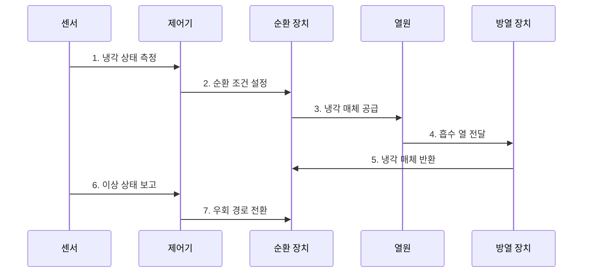

---
sidebar:
  order: 57
  label: "057. 냉각 시스템 (공랭·직접 수랭·액침냉각)"
  badge:
    text: "미출 · 70%"
    variant: note
title: "냉각 시스템 (공랭·직접 수랭·액침냉각)"
date: "2026-07-28T13:03:42+09:00"
tags:
  - "notes-hardware"
weight: 57
extra:
  question_no: "057"
  source_status: "미출"
  source_history: ""
  priority: 70
  priority_note: "고밀도 장비 냉각 방식의 핵심"
---

## Ⅰ. 개요

- 정의/개념: **냉각 시스템**은 장비의 열을 외부로 배출하는 체계
- 배경/필요성: 고밀도 장비의 과열과 성능 저하를 방지

### 쉽게 이해하기 (학습용)

- 방 안의 열을 바람이나 물로 밖에 내보내는 설비와 같다.

## Ⅱ. 특징

- **열전달 경로**: 열원부터 외부 방열까지 연결
- **냉각 용량**: 최대 발열량을 기준으로 설계
- **상태 감시**: 온도·유량·압력으로 이상 탐지

### 쉽게 이해하기 (학습용)

- 열을 빨리 모으고 옮기며 이상을 즉시 찾는 것이 핵심이다.

## Ⅲ. 구조 및 구성요소

| 구성요소 | 책임 |
|:---|:---|
| 열 수집부 | **장비 열 흡수** |
| 열 전달부 | **냉각 매체 순환** |
| 열 방출부 | **외부 열 방출** |
| 감시·제어부 | **온도·유량 제어** |

### 쉽게 이해하기 (학습용)

- 열을 모아 옮기고 버리는 전 과정을 제어부가 감시한다.

## Ⅳ. 흐름도

**동작 원리**

- **1. 냉각 상태 측정**: 온도·유량·압력 수집
- **2. 순환 조건 설정**: 펌프·팬 운전값 결정
- **3. 냉각 매체 공급**: 열원에 공기·액체 전달
- **4. 흡수 열 전달**: 방열 장치로 열 이동
- **5. 냉각 매체 반환**: 냉각된 매체 재순환
- **6. 이상 상태 보고**: 과열·누수·고장 탐지
- **7. 우회 경로 전환**: 장애 구간 격리

### 쉽게 이해하기 (학습용)

- 센서 측정값에 맞춰 냉각 매체를 돌리고 장애 시 우회한다.

## Ⅴ. 종류 및 비교

| 구분 | 공랭 | 직접 수랭 | 액침냉각 |
|:---|:---|:---|:---|
| 적용 기준 | 저·중밀도 랙 | 고밀도 CPU·GPU | 초고밀도 전용 장비 |
| 핵심 특징 | **공기 순환 냉각** | **콜드플레이트 흡열** | **절연액 직접 흡열** |
| 한계 | 공간·팬 전력 증가 | 누수·연결부 관리 | 재료 호환·정비 부담 |

### 쉽게 이해하기 (학습용)

- 발열 밀도가 높아질수록 열원과 가까운 액체 냉각이 유리하다.

## Ⅵ. 실무 고려사항 및 대책

| 고려사항 | 대책 | 효과 |
|:---|:---|:---|
| 센서·펌프 고장 | 이중화와 교차 검증 | **과열 확산 방지** |
| 수랭 연결부 누수 | 누수 감지와 차단 밸브 | **장비 손상 방지** |
| 공랭 열 재순환 | 냉·열 통로 분리 | **흡입 온도 안정** |
| 액침 재료 열화 | 호환성 시험과 교체 기준 | **수명 예측성 확보** |

### 쉽게 이해하기 (학습용)

- 방식 선택보다 고장 감지와 열 경로 분리가 운영 안정성을 좌우한다.

## Ⅶ. 결론

- 발열 밀도와 정비 조건에 맞춰 냉각 방식을 선택한다.

### 쉽게 이해하기 (학습용)

- 장비의 열과 관리 여건에 맞는 냉각 방식을 선택한다.
