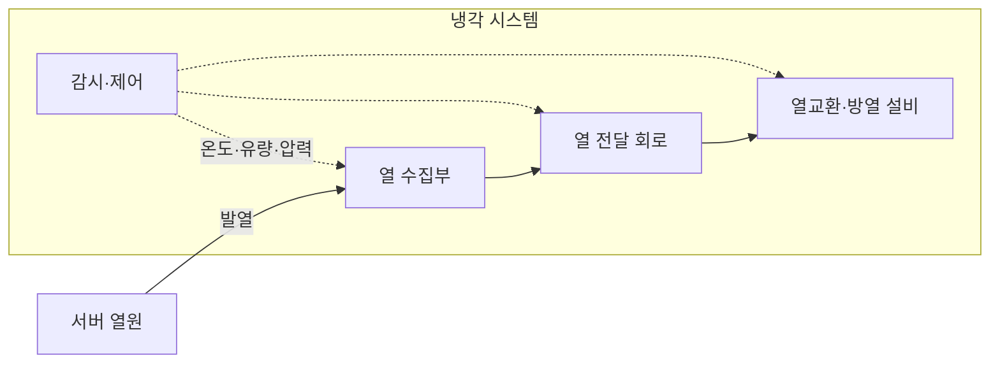
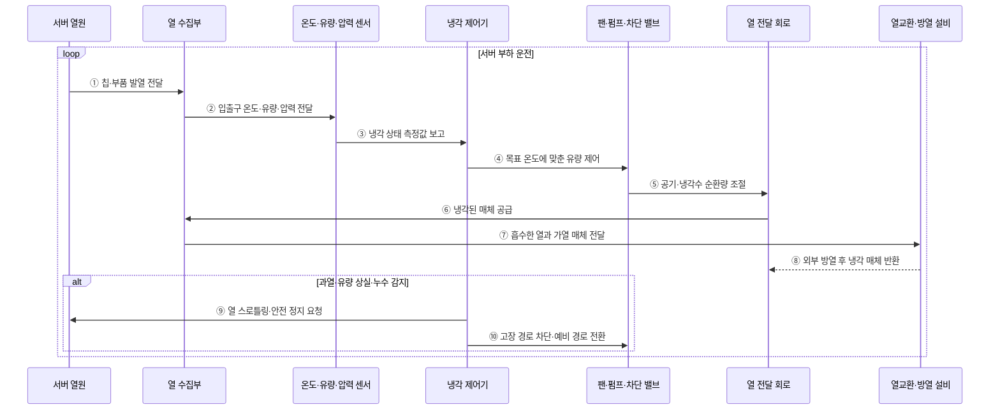

---
sidebar:
  order: 57
  label: "057. 냉각 시스템 (공랭·직접 수랭·액침냉각)"
  badge:
    text: "미출 · 70%"
    variant: note
title: "냉각 시스템 (공랭·직접 수랭·액침냉각)"
date: "2026-07-28T13:03:42+09:00"
tags:
  - "notes-hardware"
weight: 57
extra:
  question_no: "057"
  source_status: "미출"
  source_history: ""
  priority: 70
  priority_note: "고밀도 랙 냉각 방식의 미출제 핵심"
---

## 미리 알고가기

- **냉각 시스템(Cooling System)**: 장비 열을 외부로 옮겨 부품 온도를 허용 범위에 유지하는 설비
- **랙 열밀도(Rack Heat Density)**: 랙 공간에 집중되는 전력과 발열 수준
- **공랭(Air Cooling)**: 차가운 공기로 장비 열을 운반
- **직접 수랭(Direct Liquid Cooling)**: 콜드플레이트 냉각수로 칩 열을 흡수
- **콜드플레이트(Cold Plate)**: 칩에 붙어 냉각수로 열을 전달하는 금속판
- **냉각수 분배 장치(Coolant Distribution Unit, CDU)**: 시설 냉각수와 서버 냉각수 사이의 열교환·유량·압력을 제어하는 장치
- **액침냉각(Immersion Cooling)**: 장비를 절연액에 담가 열을 흡수
- **절연액(Dielectric Fluid)**: 전기가 통하지 않는 액체 냉각 매체
- **유량(Flow Rate)**: 단위 시간에 냉각 경로를 통과하는 공기·액체의 양
- **비열(Specific Heat Capacity)**: 물질의 단위 질량 온도를 1도 높이는 데 필요한 열량
- **열저항(Thermal Resistance)**: 열원에서 냉각 매체로의 열 이동을 방해하는 정도로 값이 클수록 같은 발열에서 온도차가 커짐
- **히트싱크(Heat Sink)**: 칩의 열을 넓은 금속 표면으로 퍼뜨려 공기로 방출하는 부품
- **공기 조화(Air Conditioning)**: 데이터센터의 공기 온도·습도·흐름을 조절해 장비 열을 외부 계통으로 전달하는 설비
- **열 재순환(Heat Recirculation)**: 서버에서 나온 뜨거운 공기가 냉각 설비로 가지 않고 다시 장비 흡입구로 들어오는 현상
- **재료 호환성(Material Compatibility)**: 냉각액이 호스·실링·기판 재료를 부식·팽윤시키지 않고 장기 사용 가능한 성질
- **질량 유량(Mass Flow Rate, \(\dot{m}\))**: 단위 시간에 냉각 경로를 지나는 공기·액체의 질량
- **열 스로틀링(Thermal Throttling)**: 부품 온도가 한계에 가까워지면 주파수·전력·처리량을 낮춰 발열을 줄이는 보호 제어

## Ⅰ. 개요

- 정의/개념: 공기·액체로 장비 열을 배출하는 체계다
- 기존 한계: 고밀도 장비에서 발생하는 열을 적절히 제거하지 못하면 성능 저하와 부품 수명 단축, 시스템 장애가 발생할 수 있다.

### 쉽게 이해하기 (학습용)

- 방의 열이 늘수록 선풍기에서 물길과 냉각 수조로 식히는 방법을 바꾸는 일이다

## Ⅱ. 특징

- 유량·비열·온도차 증가는 열 제거량을 높여 과열을 막는다
- 열저항이 커지면 칩 온도가 올라 수명과 성능이 떨어진다

$$
\dot{Q} = \dot{m} \times c_p \times (T_{out} - T_{in})
$$

> 정상 상태에서 냉각 매체의 상변화가 없고 손실을 무시한 기본 열수지식이다. \(\dot{Q}\)는 제거 열량, \(\dot{m}\)은 질량 유량, \(c_p\)는 비열, \(T_{out}-T_{in}\)은 입·출구 온도차다.

### 쉽게 이해하기 (학습용)

- 같은 열이라도 칩 가까이에서 잡아 더 많이 흐르게 하면 온도를 낮게 유지할 수 있다

## Ⅲ. 아키텍처 및 구성요소

### 도표안 A. 냉각 시스템 정적 구조

| 설계 요소 | 입력·상태 | 역할 |
|:---|:---|:---|
| 열 수집부 | 칩 발열·접촉 열저항 | 히트싱크·콜드플레이트·유체 흡열 |
| 열 전달 회로 | 공기·냉각수 유량 | 열 운반·매체 순환 |
| 열교환·방열 설비 | 입출구 온도·시설 용량 | 공조·CDU를 통한 외부 방열 |
| 감시·제어 | 온도·유량·압력·누수 상태 | 팬·펌프·밸브 조절 |

> 요약: 열을 수집·운반·방출하고 센서로 흐름을 조절한다

### 도표안 B. 냉각 순환·과열 보호 제어 시퀀스

### 동작 원리

1. **① 칩·부품 발열 전달**: CPU·GPU·메모리·전원부에서 발생한 열이 히트싱크·콜드플레이트·절연액 등의 열 수집부로 이동한다.
2. **② 입출구 온도·유량·압력 전달**: 열 수집부와 배관·공기 통로의 센서는 열 제거량과 흐름 건전성을 판단할 물리 상태를 측정한다.
3. **③ 냉각 상태 측정값 보고**: 센서는 서로 교차 검증할 수 있도록 온도·유량·압력·누수 정보를 냉각 제어기에 지속적으로 보낸다.
4. **④ 목표 온도에 맞춘 유량 제어**: 제어기는 서버 부하와 입출구 온도차를 바탕으로 필요한 팬 회전수·펌프 속도·밸브 개도를 계산해 명령한다.
5. **⑤ 공기·냉각수 순환량 조절**: 팬·펌프·밸브는 명령에 따라 질량 유량과 압력을 바꿔 요구 열 제거량을 확보한다.
6. **⑥ 냉각된 매체 공급**: 열 전달 회로는 공조나 CDU에서 식은 공기·냉각수를 서버 열 수집부로 되돌린다.
7. **⑦ 흡수한 열과 가열 매체 전달**: 열 수집부는 서버 열을 흡수해 온도가 오른 매체를 시설 열교환·방열 설비로 보낸다.
8. **⑧ 외부 방열 후 냉각 매체 반환**: 열교환기는 열을 외기·냉각탑·시설수로 방출하고 식은 매체를 순환 회로에 반환한다.
9. **⑨ 열 스로틀링·안전 정지 요청**: 과열이나 냉각 상실이 허용 시간을 넘으면 제어기는 서버에 부하 감축 또는 안전 종료를 요청한다.
10. **⑩ 고장 경로 차단·예비 경로 전환**: 누수·펌프 장애가 발견되면 해당 밸브·회로를 격리하고 이중화된 예비 냉각 경로를 투입한다.

### 쉽게 이해하기 (학습용)

- 열을 담아 나르는 길과 밖으로 버리는 장치를 센서가 계속 조절하는 구조다

## Ⅳ. 종류 및 비교

| 판단 기준 | 공랭 | 직접 수랭 | 액침냉각 |
|:---|:---|:---|:---|
| 핵심 특징 | 공기로 랙 전체 열 운반 | 콜드플레이트로 칩 열 흡수 | 절연액으로 장비 전체 열 흡수 |
| 적용 기준 | 저·중밀도 랙 | 고밀도 가속기 랙 | 초고밀도 전용 설비 |
| 주요 위험 | 팬 전력·열 재순환 | 누수·수질·연결부 | 재료 호환·유체 관리 |

> 요약: 열밀도가 높으면 열원 가까이에 액체를 적용한다

### 쉽게 이해하기 (학습용)

- 방 전체에 바람을 보내기보다 뜨거운 칩 가까이 물이나 절연액을 대면 열을 더 잘 옮긴다

## Ⅴ. 실무 고려사항 및 대응 방안

| 운영 위험 | 대응 | 기대 효과 |
|:---|:---|:---|
| 센서·팬·펌프 장애로 냉각량 급감 | 구성요소 이중화와 온도·유량 교차 검증·자동 감속 | 과열 확산 방지 |
| 직접 수랭 연결부 누수·수질 악화 | 누수 감지·차단 밸브와 전도도·부식 관리 | 장비 손상 방지 |
| 공랭의 열 재순환·핫스폿 | 냉·온 통로 격리와 흡입 온도·압력 지도화 | 랙별 온도 균일화 |
| 액침 유체의 재료 비호환·정비 난도 | 장기 침지 시험·승인 부품·유체 회수 절차 적용 | 수명·정비성 확보 |

> 고밀도 가속기 랙은 CPU·GPU를 직접 수랭하고 DIMM·전원부 등 나머지 부품은 보조 공랭으로 처리한다.

### 쉽게 이해하기 (학습용)

- 뜨거워진 공기나 액체가 열을 밖에 버리고 식어서 다시 돌아온다.
- 가속기 랙은 칩을 물길로 식히고 나머지 부품은 바람으로 식힌다

## Ⅵ. 결론

- 열밀도·배관·재료에 맞는 냉각 방식을 선택한다

### 쉽게 이해하기 (학습용)

- 필요한 발열량과 운영 조건을 수용하는 냉각 방식을 선택한다
