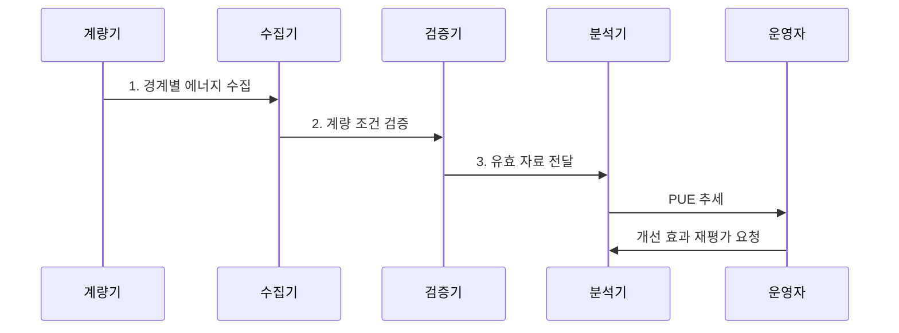

---
sidebar:
  order: 58
  label: "058. 전력 사용 효율 (PUE)"
  badge:
    text: "기출 · 50%"
    variant: note
title: "전력 사용 효율 (PUE)"
date: "2026-07-30T18:21:35+09:00"
tags:
  - "notes-hardware"
weight: 58
extra:
  question_no: "058"
  source_status: "기출"
  source_history: "138회"
  priority: 50
  priority_note: "시설 에너지 오버헤드 계량·비교 기준"
---

## 미리 알고가기

- **전체 시설 에너지(Total Facility Energy)**: 데이터센터 인입 경계 안의 IT·냉각·배전 총에너지
- **IT 장비 에너지(IT Equipment Energy)**: 서버·스토리지·네트워크 장비가 소비한 에너지
- **전력사용효율(Power Usage Effectiveness, PUE)**: 전체 시설 에너지를 IT 장비 에너지로 나눈 효율 지표

## Ⅰ. 개요

- 정의/개념: 전체 시설 에너지를 **IT 에너지로 나눈 PUE**
- 배경/필요성: 전체 전력만으로는 냉각•배전 **비IT 손실 분리 불가**

### 쉽게 이해하기 (학습용)

- 서버가 쓴 전기 외에 시설이 추가로 쓴 전기를 확인하는 값이다.

## Ⅱ. 특징

- 동일 에너지 단위를 나눈 **무차원 비율**
- 이론적 하한 **PUE 1**에 가까울수록 시설 손실 감소
- **경계·기간·IT 부하** 통제 시점 간 추세 비교

$$
PUE = \frac{E_{DC}}{E_{IT}}
    = 1 + \frac{E_{Infrastructure}}{E_{IT}} \ge 1
$$

### 쉽게 이해하기 (학습용)

- 전체 전력 중 서버 작업 외에 쓴 몫이 작을수록 1에 가까워진다.

## Ⅲ. 구조 및 구성요소

| 구성요소 | 책임 |
|:---|:---|
| 전체 에너지 계량 | **PUE 분자 측정** |
| IT 에너지 계량 | **PUE 분모 측정** |
| 시설별 하위 계량 | **손실 원인 분리** |
| PUE 분석 | **비율·추세 산출** |

### 쉽게 이해하기 (학습용)

- 건물 전체와 IT 장비 전력을 따로 재고 차이의 원인을 나눈다.

## Ⅳ. 흐름도

**동작 원리**

- **1. 경계별 에너지 수집**: 동일 기간의 전체 시설·IT 장비 에너지를 계량
- **2. 계량 조건 검증**: 경계·기간·결측과 비IT 부하 혼입 여부 확인
- **3. 유효 자료 전달**: 비교 가능한 계량값만 PUE 산정에 입력

### 쉽게 이해하기 (학습용)

- 같은 기간의 전체·IT 전력을 검증한 뒤 비율과 원인을 비교한다.

## Ⅴ. 종류 및 비교

| 구분 | PUE | WUE | CUE |
|:---|:---|:---|:---|
| 적용 기준 | 시설 전력 개선 | 냉각 수자원 관리 | 탄소 배출 관리 |
| 핵심 특징 | **전체·IT 에너지 비율** | **물 사용량 비율** | **탄소 배출량 비율** |
| 한계 | IT 작업 효율 미반영 | 지역 물 부족도 미반영 | 배출계수 변화 의존 |

### 쉽게 이해하기 (학습용)

- PUE는 전력, WUE는 물, CUE는 탄소 관점의 지표이다.

## Ⅵ. 실무 고려사항 및 대책

| 고려사항 | 대책 | 효과 |
|:---|:---|:---|
| 계량 경계 변경으로 분자·분모 불일치 | 인입·IT 계량점과 장비 편입 이력 고정 | **기간 비교 유지** |
| 전체·IT 계량 시각 불일치 | 계량기 시계·집계 주기 동기화 | **비율 왜곡 방지** |
| IT 부하·외기 변화가 시설 효율과 혼재 | PUE와 IT 부하율·외기 온습도 병기 | **운전 조건 분리** |
| PUE 절감이 물·탄소 사용 증가 유발 | **WUE·CUE**와 절대 에너지 공동 평가 | **자원 상충 통제** |

### 쉽게 이해하기 (학습용)

- 같은 경계와 기간을 유지하고 부하·외기 조건을 함께 기록한다.

## Ⅶ. 결론

- **PUE 상승** 시 냉각•배전 손실을 분석해 **비IT 에너지 절감**

### 쉽게 이해하기 (학습용)

- 전체 전력과 IT 전력의 차이를 같은 조건에서 계속 줄인다.
