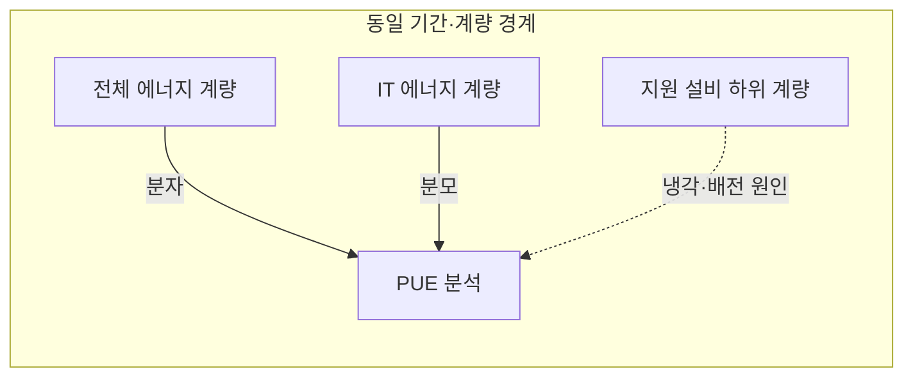
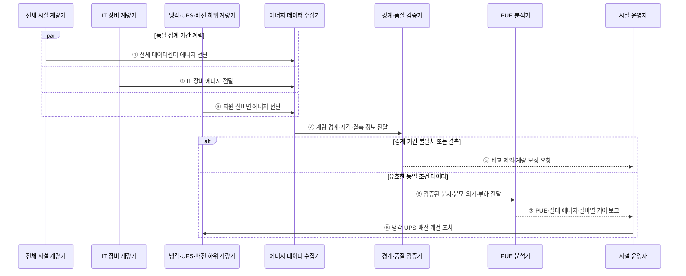

---
sidebar:
  order: 58
  label: "058. 전력 사용 효율 (PUE)"
  badge:
    text: "기출 · 50%"
    variant: note
title: "전력 사용 효율 (PUE)"
date: "2026-07-28T13:04:08+09:00"
tags:
  - "notes-hardware"
weight: 58
extra:
  question_no: "058"
  source_status: "기출"
  source_history: "138회"
  priority: 50
  priority_note: "시설 에너지 오버헤드 계량·비교 기준"
---

## 미리 알고가기

- **전력 사용 효율(Power Usage Effectiveness, PUE)**: 데이터센터 전체 에너지를 IT 장비 에너지로 나눈 전력 효율 지표
- **전체 데이터센터 에너지($E_{DC}$)**: '이 서브 디시'로 읽으며, PUE 산식의 분자로서 IT 장비와 전력·냉각 등 지원 설비가 사용한 총에너지
- **정보기술(Information Technology, IT) 장비 에너지($E_{IT}$)**: '이 서브 아이티'로 읽으며, PUE 산식의 분모인 서버·스토리지·네트워크 장비의 에너지 사용량
- **지원 설비 에너지(Infrastructure Energy)**: 냉각·배전·조명 등이 쓴 에너지
- **계량 경계(Metering Boundary)**: 산식에 포함할 설비와 계량 지점
- **무정전 전원 공급 장치(Uninterruptible Power Supply, UPS)**: 정전 시 배터리의 저장 전력을 IT 장비에 공급하는 장치
- **물 사용 효율(Water Usage Effectiveness, WUE)**: IT 장비 에너지 사용량 대비 데이터센터의 물 사용량
- **탄소 사용 효율(Carbon Usage Effectiveness, CUE)**: IT 장비 에너지 사용량 대비 데이터센터의 온실가스 배출량
- **무차원 비율(Dimensionless Ratio)**: 같은 에너지 단위를 나누어 단위가 사라진 값으로 PUE는 1에 가까울수록 지원 설비 비중이 작음
- **시설 에너지 오버헤드(Facility Energy Overhead)**: 서버 작업 외에 냉각·배전·조명·전력 변환이 추가로 소비한 에너지
- **외기 조건(Outdoor Air Condition)**: 데이터센터 밖의 온도·습도로 냉각 설비의 에너지 사용량을 바꾸는 환경 조건
- **IT 부하(IT Load)**: 서버·스토리지·네트워크 장비가 처리하는 작업과 이에 따른 전력 사용량
- **하위 계량(Submetering)**: 냉각·배전·UPS 등 설비별 에너지를 별도 계량기로 나눠 측정하는 방식
- **냉동기(Chiller)**: 냉각수를 차갑게 만들어 데이터센터의 서버 열을 외부로 방출하는 설비
- **탄소계수(Carbon Emission Factor)**: 전력·연료 단위 사용량당 배출되는 온실가스 양
- **수원 희소성(Water Scarcity)**: 지역별 이용 가능한 물의 부족 정도로 같은 WUE라도 물 사용 영향을 다르게 만드는 조건

## Ⅰ. 개요

- 정의/개념: 전체 에너지를 **IT 장비 에너지로 나눈 비율**
- 기존 한계: 총전력만으로는 **냉각·배전 오버헤드** 분리 불가

### 쉽게 이해하기 (학습용)

- 컴퓨터 전기를 분모로 두고 냉방·배전의 추가 전기를 비교하는 가계부다

## Ⅱ. 특징

- **지원 설비 에너지 증가** 시 PUE 상승
- **동일 경계·기간·부하**에서만 시설 간 비교 가능
- **IT 작업 효율 미반영**으로 서버 내부 낭비 판단 불가

$$
PUE = \frac{E_{DC}}{E_{IT}}
    = 1 + \frac{E_{Infrastructure}}{E_{IT}} \ge 1
$$

> 같은 계량 경계와 집계 기간의 에너지를 사용하며 \(E_{DC}=E_{IT}+E_{Infrastructure}\)로 구분한다. PUE는 무차원 비율이고 1에 가까울수록 시설 오버헤드 비중이 작다.

### 쉽게 이해하기 (학습용)

- 같은 컴퓨터 일을 시킬 때 냉방과 배전에 덜 쓰면 PUE가 1에 가까워진다

## Ⅲ. 아키텍처 및 구성요소

### 도표안 A. PUE 계량·분석 정적 구조

| 설계 요소 | 입력·상태 | 역할 |
|:---|:---|:---|
| 전체 에너지 계량 | 시설 경계·총에너지 | PUE 분자 측정 |
| IT 에너지 계량 | 서버·스토리지·네트워크 에너지 | PUE 분모 측정 |
| 지원 설비 하위 계량 | 냉각·UPS·배전 에너지 | 오버헤드 원인 분리 |
| PUE 분석 | 계량값·외기·IT 부하 | 비율 산정·조건별 비교 |

> 요약: 전체·IT 에너지 비율로 지원 설비 낭비를 찾는다

### 도표안 B. PUE 계량 검증·개선 시퀀스

### 동작 원리

1. **① 전체 데이터센터 에너지 전달**: 시설 인입 경계 계량기는 지정 기간에 IT와 지원 설비가 사용한 전체 에너지를 수집기로 보낸다.
2. **② IT 장비 에너지 전달**: UPS 출력·PDU 등의 IT 경계 계량기는 서버·스토리지·네트워크가 사용한 에너지를 같은 기간으로 전달한다.
3. **③ 지원 설비별 에너지 전달**: 냉동기·팬·펌프·UPS 손실·배전·조명의 하위 계량값을 보내 전체와 IT의 차이를 원인별로 설명한다.
4. **④ 계량 경계·시각·결측 정보 전달**: 수집기는 단순 수치뿐 아니라 계량기 버전, 포함 설비, 시각 동기와 빠진 구간을 검증기에 제공한다.
5. **⑤ 비교 제외·계량 보정 요청**: 분자·분모의 경계나 집계 창이 다르면 왜곡된 PUE를 계산하지 않고 해당 기간을 제외하거나 보정한다.
6. **⑥ 검증된 분자·분모·외기·부하 전달**: 조건이 유효하면 동일 기간의 \(E_{DC}\), \(E_{IT}\), 외기 온습도와 IT 부하를 분석기에 보낸다.
7. **⑦ PUE·절대 에너지·설비별 기여 보고**: 분석기는 PUE뿐 아니라 실제 kWh와 냉각·배전 기여도를 함께 보고해 저부하 비율 착시를 줄인다.
8. **⑧ 냉각·UPS·배전 개선 조치**: 운영자는 가장 큰 시설 오버헤드에 운전 설정·장비·경로 개선을 적용하고 같은 경계에서 전후 효과를 다시 측정한다.

### 쉽게 이해하기 (학습용)

- 건물 전체와 컴퓨터 계량값을 맞춰 냉방·배전의 추가 전기를 찾는다

## Ⅳ. 종류 및 비교

| 데이터센터 효율 지표 | PUE | WUE | CUE |
|:---|:---|:---|:---|
| 적용 기준 | 냉각·배전 **오버헤드 개선** | 냉각 방식·**수원 선택** | 에너지원·**탄소계수 선택** |
| 핵심 특징 | IT 대비 **전체 에너지 비율** | IT 에너지당 **물 사용량** | IT 에너지당 **탄소 배출량** |
| 한계 | IT 작업 효율 **미반영** | 수원별 희소성 **미반영** | 지역·시간별 **계수 의존** |

> 요약: PUE는 전력, WUE는 물, CUE는 탄소를 잰다

### 쉽게 이해하기 (학습용)

- PUE는 전기, WUE는 물, CUE는 탄소에 붙이는 서로 다른 자원 성적표다

## Ⅴ. 실무 고려사항 및 대응 방안

| 운영 위험 | 대응 | 기대 효과 |
|:---|:---|:---|
| 증설·계량기 변경으로 경계가 달라짐 | 경계·포함 설비·계량기 이력을 버전 관리 | 기간별 비교 가능성 유지 |
| 전체·IT 계량 시각·누적 주기 불일치 | 시계 동기화와 동일 집계 창·결측 처리 적용 | 비율 왜곡 방지 |
| 저부하에서 고정 시설 전력이 PUE를 과대 평가 | IT 부하·외기 조건별 PUE와 절대 에너지 병기 | 운전 조건 분리 |
| PUE만 낮추다 물·탄소 영향 증가 | WUE·CUE와 서비스 작업당 에너지 공동 평가 | 자원 최적화 균형 |

> 냉동기 교체 효과는 외기 조건과 IT 부하가 유사한 기간의 PUE·절대 에너지를 같은 계량 경계에서 비교한다.

### 쉽게 이해하기 (학습용)

- 건물 전체와 컴퓨터 전기를 같은 기간에 재고 차이를 냉방·배전별로 나눈다.
- 같은 날씨와 컴퓨터 작업에서 냉동기 교체 전후의 추가 전기를 비교한다

## Ⅵ. 결론

- 전력 효율 개선을 위해 경계·냉각을 검토하여 **PUE** 활용

### 쉽게 이해하기 (학습용)

- PUE가 나빠지면 냉방·배전 계량을 나눠 추가 전기의 원인을 찾는다
