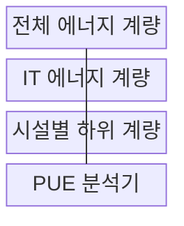
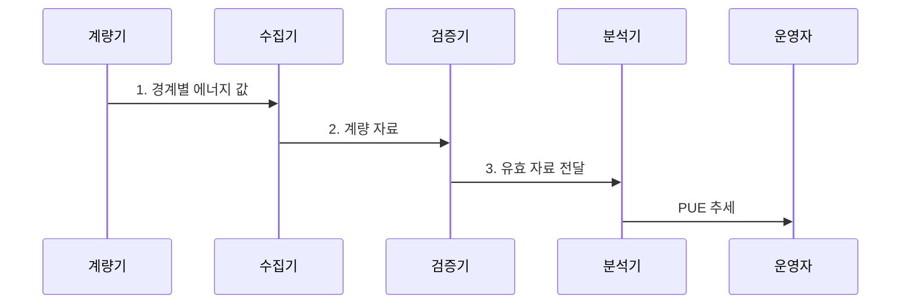

---
sidebar:
  order: 58
  label: "058. 전력 사용 효율 (PUE)"
  badge:
    text: "기출 · 50%"
    variant: note
title: "전력 사용 효율 (PUE)"
date: "2026-08-02T11:18:00+09:00"
tags:
  - "notes-hardware"
weight: 58
extra:
  question_no: "058"
  source_status: "기출"
  source_history: "138회"
  priority: 50
  priority_note: "시설 에너지 오버헤드 계량·비교 기준"
---

## Ⅰ. 개요

핵심 용어

- **전력사용효율(Power Usage Effectiveness, PUE)**: 데이터센터 전체 시설 에너지를 IT 장비 에너지로 나누어 비IT 시설 오버헤드를 나타내는 지표이다.
- **전체 시설 에너지(Total Facility Energy)**: 데이터센터 인입 경계 안에서 IT 장비와 냉각 및 배전 설비가 소비한 총에너지이다.
- **IT 장비 에너지(IT Equipment Energy)**: 서버와 스토리지 및 네트워크 장비가 실제 계산과 저장·전송에 소비한 에너지이다.

- 정의/개념: 전체 시설 에너지를 **IT 장비 에너지**로 나눠 비IT 오버헤드를 재는 **PUE 지표**
- 배경/필요성: 전체 전력만으로는 냉각•배전의 **시설 에너지 분리 불가**

### 쉽게 이해하기 (학습용)

- 서버가 쓴 전기 외에 시설이 추가로 쓴 전기를 확인하는 값이다.

## Ⅱ. 특징

핵심 용어

- **무차원 비율(Dimensionless Ratio)**: 분자와 분모가 같은 에너지 단위여서 단위가 상쇄된 비율이다.
- **비IT 시설 에너지(Non-IT Facility Energy)**: 냉각과 배전 및 조명처럼 IT 장비 외의 시설이 소비한 에너지이다.
- **계량 경계(Metering Boundary)**: PUE 계산에 포함할 건물과 설비 및 IT 장비의 물리적 범위이다.

- 동일 에너지 단위를 나눈 **무차원 비율**
- 이론적 하한 **PUE 1**에 가까울수록 시설 손실 감소
- **경계·기간·IT 부하** 통제 시점 간 추세 비교

$$
PUE = \frac{\text{전체 시설 에너지}}{\text{IT 장비 에너지}}
    = 1 + \frac{\text{비IT 시설 에너지}}{\text{IT 장비 에너지}} \ge 1
$$

### 쉽게 이해하기 (학습용)

- 전체 전력 중 서버 작업 외에 쓴 몫이 작을수록 1에 가까워진다.

## Ⅲ. 구조 및 구성요소

핵심 용어

- **전체 에너지 계량(Total-energy Metering)**: 데이터센터 인입점에서 PUE 분자에 해당하는 에너지를 측정하는 계량이다.
- **IT 에너지 계량(IT-energy Metering)**: UPS 출력이나 PDU 등에서 IT 장비에 공급된 에너지를 별도로 측정하는 계량이다.
- **시설별 하위 계량(Facility Submetering)**: 냉각과 배전 등 비IT 설비별 소비량을 분리하여 손실 원인을 찾는 계량이다.
- **PUE 분석기(PUE Analyzer)**: 검증된 계량값으로 PUE와 시간별 추세를 산출하는 시스템이다.

| 구성요소 | 책임 |
|:---|:---|
| 전체 에너지 계량 | **PUE 분자 측정** |
| IT 에너지 계량 | **PUE 분모 측정** |
| 시설별 하위 계량 | **손실 원인 분리** |
| PUE 분석기 | **비율·추세 산출** |

### 쉽게 이해하기 (학습용)

- 건물 전체와 IT 장비 전력을 따로 재고 차이의 원인을 나눈다.

## Ⅳ. 흐름도

핵심 용어

- **계량 자료(Metering Data)**: 동일한 기간에 수집한 전체 시설과 IT 장비의 누적 에너지 값이다.
- **결측 검증(Missing-data Validation)**: 센서나 통신 오류로 빠진 계량 구간이 있는지 확인하고 계산 사용 여부를 결정하는 절차이다.
- **기간 정렬(Period Alignment)**: PUE 분자와 분모가 정확히 같은 시작·종료 시각의 에너지를 사용하도록 맞추는 과정이다.

**동작 원리**

1. **경계별 에너지 값**: 동일 기간의 전체 시설·IT 장비 에너지 계량
2. **계량 자료**: 경계·기간·결측과 비IT 부하 혼입 여부 검증
3. **유효 자료 전달**: 비교 가능한 계량값만 PUE 산정에 입력

### 쉽게 이해하기 (학습용)

- 같은 기간의 전체·IT 전력을 검증한 뒤 비율과 원인을 비교한다.

## Ⅴ. 종류 및 비교

핵심 용어

- **물사용효율(Water Usage Effectiveness, WUE)**: 데이터센터 물 사용량을 IT 장비 에너지로 나눈 수자원 효율 지표이다.
- **탄소사용효율(Carbon Usage Effectiveness, CUE)**: 데이터센터 운영의 탄소 배출량을 IT 장비 에너지로 나눈 탄소 효율 지표이다.
- **IT 작업 효율(IT Work Efficiency)**: IT 장비가 소비한 에너지로 실제 유효한 계산·저장·전송 작업을 얼마나 수행했는지 나타내는 효율이다.

| 데이터센터 효율 지표 | PUE | WUE | CUE |
|:---|:---|:---|:---|
| 적용 기준 | **시설 전력 개선** | **냉각 수자원 관리** | **탄소 배출 관리** |
| 핵심 특징 | **전체·IT 에너지 비율** | **물 사용량 비율** | **탄소 배출량 비율** |
| 한계 | **IT 작업 효율** 미반영 | **지역 물 부족도** 미반영 | **배출계수 변화** 의존 |

### 쉽게 이해하기 (학습용)

- PUE는 전력, WUE는 물, CUE는 탄소 관점의 지표이다.

## Ⅵ. 실무 고려사항 및 대책

핵심 용어

- **계량점 이력(Meter-point History)**: 계량기의 위치와 포함 장비 및 변경 시점을 기록한 운영 자료이다.
- **IT 부하율(IT Load Factor)**: IT 장비의 정격 또는 최대 전력 가운데 현재 실제로 사용하는 전력의 비율이다.
- **운전 조건(Operating Condition)**: PUE에 영향을 주는 IT 부하와 외기 온습도 및 냉각 운전 상태이다.
- **자원 상충(Resource Trade-off)**: 전력 효율을 개선하는 조치가 물 사용이나 탄소 배출 같은 다른 자원을 악화시키는 관계이다.

| 문제 | 대책 | 효과 |
|:---|:---|:---|
| 계량 경계 변경으로 분자·분모 불일치 | **인입·IT 계량점**과 장비 편입 이력 고정 | **기간 비교 유지** |
| 전체·IT 계량 시각 불일치 | **계량기 시계·집계 주기** 동기화 | **비율 왜곡 방지** |
| IT 부하·외기 변화가 시설 효율과 혼재 | **PUE·IT 부하율**과 외기 온습도 병기 | **운전 조건 분리** |
| PUE 절감이 물·탄소 사용 증가 유발 | **WUE·CUE**와 절대 에너지 공동 평가 | **자원 상충 통제** |

### 쉽게 이해하기 (학습용)

- 같은 경계와 기간을 유지하고 부하·외기 조건을 함께 기록한다.

## Ⅶ. 결론

핵심 용어

- **PUE 상승(PUE Increase)**: IT 에너지에 비해 냉각과 배전 등 비IT 에너지의 비중이 커진 상태이다.
- **냉각 손실(Cooling Loss)**: 서버 열을 제거하는 팬과 펌프 및 냉동 설비에서 소비되는 시설 에너지이다.
- **배전 손실(Power-distribution Loss)**: 변압기와 UPS 및 배선에서 전력 변환과 저항 때문에 소모되는 에너지이다.

- **PUE 상승** 시 냉각•배전 손실을 분석해 **비IT 에너지 절감**

### 쉽게 이해하기 (학습용)

- 전체 전력과 IT 전력의 차이를 같은 조건에서 계속 줄인다.
