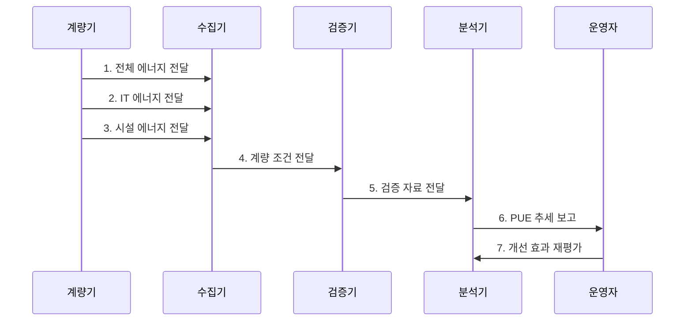

---
sidebar:
  order: 58
  label: "058. 전력 사용 효율 (PUE)"
  badge:
    text: "기출 · 50%"
    variant: note
title: "전력 사용 효율 (PUE)"
date: "2026-07-28T13:04:08+09:00"
tags:
  - "notes-hardware"
weight: 58
extra:
  question_no: "058"
  source_status: "기출"
  source_history: "138회"
  priority: 50
  priority_note: "시설 에너지 오버헤드 계량·비교 기준"
---

## Ⅰ. 개요

- 정의/개념: **PUE**는 전체 에너지를 IT 에너지로 나눈 비율
- 배경/필요성: 냉각·배전 등 시설 소비량을 분리하여 관리

### 쉽게 이해하기 (학습용)

- 서버가 쓴 전기 외에 시설이 추가로 쓴 전기를 확인하는 값이다.

## Ⅱ. 특징

- **무차원 비율**: 같은 에너지 단위의 나눗셈
- **최솟값 1**: 1에 가까울수록 시설 손실 감소
- **조건 통제**: 경계·기간·부하가 같아야 비교 가능

$$
PUE = \frac{E_{DC}}{E_{IT}}
    = 1 + \frac{E_{Infrastructure}}{E_{IT}} \ge 1
$$

### 쉽게 이해하기 (학습용)

- 전체 전력 중 서버 작업 외에 쓴 몫이 작을수록 1에 가까워진다.

## Ⅲ. 구조 및 구성요소

| 구성요소 | 책임 |
|:---|:---|
| 전체 에너지 계량 | **PUE 분자 측정** |
| IT 에너지 계량 | **PUE 분모 측정** |
| 시설별 하위 계량 | **손실 원인 분리** |
| PUE 분석 | **비율·추세 산출** |

### 쉽게 이해하기 (학습용)

- 건물 전체와 IT 장비 전력을 따로 재고 차이의 원인을 나눈다.

## Ⅳ. 흐름도

**동작 원리**

- **1. 전체 에너지 전달**: 시설 인입 전력 집계
- **2. IT 에너지 전달**: IT 장비 전력 집계
- **3. 시설 에너지 전달**: 냉각·배전 소비 분리
- **4. 계량 조건 전달**: 경계·기간·결측 확인
- **5. 검증 자료 전달**: 유효 자료만 분석
- **6. PUE 추세 보고**: 비율과 원인 제시
- **7. 개선 효과 재평가**: 동일 조건으로 재측정

### 쉽게 이해하기 (학습용)

- 같은 기간의 전체·IT 전력을 검증한 뒤 비율과 원인을 비교한다.

## Ⅴ. 종류 및 비교

| 구분 | PUE | WUE | CUE |
|:---|:---|:---|:---|
| 적용 기준 | 시설 전력 개선 | 냉각 수자원 관리 | 탄소 배출 관리 |
| 핵심 특징 | **전체·IT 에너지 비율** | **물 사용량 비율** | **탄소 배출량 비율** |
| 한계 | IT 작업 효율 미반영 | 지역 물 부족도 미반영 | 배출계수 변화 의존 |

### 쉽게 이해하기 (학습용)

- PUE는 전력, WUE는 물, CUE는 탄소 관점의 지표이다.

## Ⅵ. 실무 고려사항 및 대책

| 고려사항 | 대책 | 효과 |
|:---|:---|:---|
| 계량 경계 변경 | 경계·장비 이력 관리 | **기간 비교 유지** |
| 집계 시각 불일치 | 계량 주기 동기화 | **비율 왜곡 방지** |
| IT 부하 변동 | 부하·외기 조건 병기 | **운전 조건 분리** |
| PUE 단독 최적화 | WUE·CUE 공동 평가 | **자원 균형 확보** |

### 쉽게 이해하기 (학습용)

- 같은 경계와 기간을 유지하고 부하·외기 조건을 함께 기록한다.

## Ⅶ. 결론

- 동일 계량 조건의 PUE 추세로 시설 손실을 개선한다.

### 쉽게 이해하기 (학습용)

- 전체 전력과 IT 전력의 차이를 같은 조건에서 계속 줄인다.
