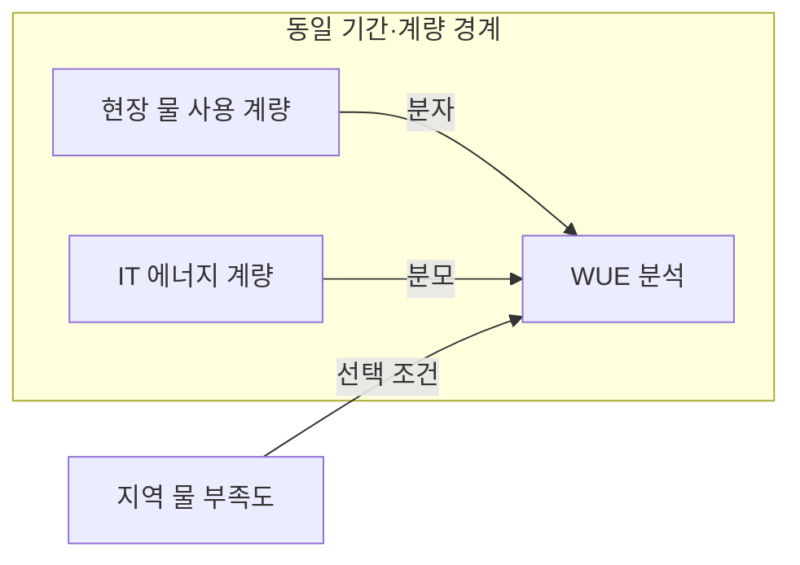
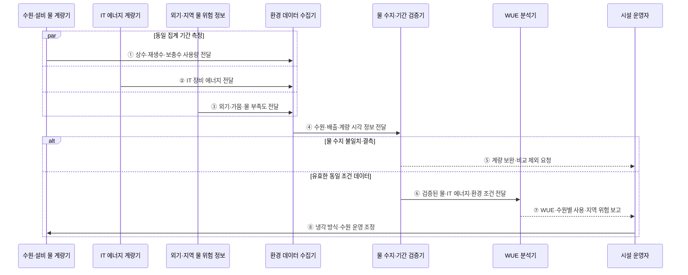

---
sidebar:
  order: 59
  label: "059. 물 사용 효율 (WUE)"
  badge:
    text: "기출 · 50%"
    variant: note
title: "물 사용 효율 (WUE)"
date: "2026-07-28T13:04:34+09:00"
tags:
  - "notes-hardware"
weight: 59
extra:
  question_no: "059"
  source_status: "기출"
  source_history: "138회"
  priority: 50
  priority_note: "지역 물 위험과 냉각·수원 선택 기준"
---

## 미리 알고가기

- **물 사용 효율(Water Usage Effectiveness, WUE)**: IT 장비 에너지 사용량 대비 데이터센터의 현장 물 사용량
- **현장 물 사용량($V_W$)**: '브이 서브 더블유'로 읽으며, WUE 산식의 분자로서 냉각·가습 등 계량 경계 안에서 사용한 물의 부피
- **정보기술(Information Technology, IT) 장비 에너지($E_{IT}$)**: '이 서브 아이티'로 읽으며, WUE 산식의 분모인 서버·스토리지·네트워크 장비의 에너지 사용량
- **물 부족도(Water Stress)**: 취수 수요가 지역 가용 수자원에 주는 압박
- **증발 냉각(Evaporative Cooling)**: 물의 증발 잠열로 장비 열을 방출
- **건식 냉각(Dry Cooling)**: 물 증발 없이 공기로 장비 열을 방출
- **재생수(Reclaimed Water)**: 처리한 폐수를 냉각 보충수로 재사용
- **전력 사용 효율(Power Usage Effectiveness, PUE)**: 데이터센터 전체 에너지를 IT 장비 에너지로 나눈 전력 효율 지표
- **탄소 사용 효율(Carbon Usage Effectiveness, CUE)**: IT 장비 에너지 사용량 대비 데이터센터의 온실가스 배출량
- **물 사용 집약도(Water Use Intensity)**: 같은 IT 에너지를 공급할 때 현장에서 소비하는 물의 양
- **증발 잠열(Latent Heat of Vaporization)**: 물이 온도 상승 없이 액체에서 기체로 바뀌며 흡수하는 열
- **상수(Mains Water)**: 수도 사업자가 공급하는 처리된 물로 재생수와 구분해 수원별 사용량을 계량함
- **수원(Water Source)**: 냉각에 사용하는 상수·지하수·재생수 등 물의 공급원
- **외기 조건(Outdoor Air Condition)**: 데이터센터 밖의 온도·습도로 증발·건식 냉각 성능을 바꾸는 환경 조건
- **IT 부하(IT Load)**: 서버·스토리지·네트워크가 처리하는 작업과 이에 따른 에너지 사용량
- **가뭄(Drought)**: 강수 부족이 이어져 지역 가용 수자원과 취수 여유가 줄어든 상태

## Ⅰ. 개요

- 정의/개념: 현장 물 사용량을 **IT 장비 에너지로 나눈 비율**
- 기존 한계: 에너지 지표만으로는 **냉각 물 소비·지역 위험** 판단 불가

### 쉽게 이해하기 (학습용)

- 컴퓨터가 같은 일을 할 때 냉방에 쓴 물병 수를 적는 물 가계부다

## Ⅱ. 특징

- **현장 물 사용 증가** 시 WUE 상승
- **증발 냉각**은 PUE를 낮춰도 물 위험 증가
- **기후·냉각·IT 부하 통제** 후 시설 간 비교

$$
WUE = \frac{V_W}{E_{IT}}\quad [L/kWh]
$$

> 같은 계량 경계와 집계 기간의 현장 물 사용 부피 \(V_W\)와 IT 장비 에너지 \(E_{IT}\)를 사용한다. 수원별 희소성은 이 비율에 포함되지 않으므로 별도로 병기한다.

### 쉽게 이해하기 (학습용)

- 더운 날 증발 냉각을 늘리면 냉방 전기는 줄 수 있지만 물은 더 쓴다

## Ⅲ. 아키텍처 및 구성요소

### 도표안 A. WUE 계량·분석 정적 구조

| 설계 요소 | 입력·상태 | 역할 |
|:---|:---|:---|
| 현장 물 사용 계량 | 상수·재생수·수원별 부피 | WUE 분자 측정 |
| IT 에너지 계량 | 서버·스토리지·네트워크 에너지 | WUE 분모 측정 |
| WUE 분석 | 계량값·외기·IT 부하·물 부족도 | 비율 산정·냉각 대안 비교 |

> 요약: 물·IT 에너지 비율과 지역 물 부족도를 분석한다

### 도표안 B. WUE 계량 검증·냉각 대안 평가 시퀀스

### 동작 원리

1. **① 상수·재생수·보충수 사용량 전달**: 계량 경계 안의 냉각탑·가습·설비가 사용한 물을 수원별 부피로 측정해 수집기에 보낸다.
2. **② IT 장비 에너지 전달**: 서버·스토리지·네트워크의 동일 기간 에너지를 WUE 분모로 전달한다.
3. **③ 외기·가뭄·물 부족도 전달**: 온도·습도와 지역·계절별 수자원 위험 정보를 함께 수집해 같은 WUE의 환경 영향을 구분한다.
4. **④ 수원·배출·계량 시각 정보 전달**: 수집기는 취수·재생수·배출·증발 경계와 계량 시각·결측 구간을 검증기에 제공한다.
5. **⑤ 계량 보완·비교 제외 요청**: 물 수지나 집계 창이 맞지 않으면 누락 계량을 보완하거나 해당 기간의 WUE 비교를 중단한다.
6. **⑥ 검증된 물·IT 에너지·환경 조건 전달**: 유효한 \(V_W\), \(E_{IT}\), 외기·부하·물 부족도 조건을 분석기에 보낸다.
7. **⑦ WUE·수원별 사용·지역 위험 보고**: 분석기는 L/kWh 비율과 절대 물 사용량, 상수·재생수 비중과 지역 위험을 함께 보고한다.
8. **⑧ 냉각 방식·수원 운영 조정**: 운영자는 증발·건식 냉각 비율과 재생수 사용을 조정하고 PUE·CUE 역효과까지 같은 조건에서 재평가한다.

### 쉽게 이해하기 (학습용)

- 수도계와 컴퓨터 전력계를 맞추고 지역 물 사정까지 함께 본다

## Ⅳ. 종류 및 비교

| 데이터센터 효율 지표 | WUE | PUE | CUE |
|:---|:---|:---|:---|
| 적용 기준 | 냉각 방식·**수원 선택** | 냉각·배전 **오버헤드 개선** | 에너지원·**탄소계수 선택** |
| 핵심 특징 | IT 에너지당 **물 사용량** | IT 대비 **전체 에너지 비율** | IT 에너지당 **탄소 배출량** |
| 한계 | 수원별 희소성 **미반영** | IT 작업 효율 **미반영** | 지역·시간별 **계수 의존** |

> 요약: WUE는 물, PUE는 전력, CUE는 탄소를 잰다

### 쉽게 이해하기 (학습용)

- WUE는 물, PUE는 전기, CUE는 탄소에 붙이는 자원 성적표다

## Ⅴ. 실무 고려사항 및 대응 방안

| 운영 위험 | 대응 | 기대 효과 |
|:---|:---|:---|
| 상수·재생수·보충수 일부가 계량 경계에서 누락 | 수원·배출·설비별 계량점과 물 수지 검증 | 실제 소비량 확보 |
| 물·IT 에너지 계량 기간·시각 불일치 | 시계 동기화와 동일 집계 창·결측 처리 적용 | WUE 왜곡 방지 |
| 같은 WUE가 지역별 물 부족 영향을 숨김 | 수원 종류와 계절별 물 부족도 가중치를 병기 | 지역 환경 위험 반영 |
| 건식 냉각으로 물은 줄지만 전력·탄소 증가 | WUE·PUE·CUE와 총비용을 공동 최적화 | 자원 간 역효과 통제 |

> 가뭄 지역 데이터센터는 증발 냉각 비중을 줄이고 건식 냉각·재생수를 늘리되 전력·탄소 증가를 함께 측정한다.

### 쉽게 이해하기 (학습용)

- 물·전기 사용량과 지역 가뭄을 함께 보고 냉각 방식과 물 종류를 정한다.
- 가뭄 때 물 냉각을 줄이고 공기 냉각을 늘린다

## Ⅵ. 결론

- 용수 효율 개선을 위해 물 부족도·냉각을 검토하여 **WUE** 활용

### 쉽게 이해하기 (학습용)

- 지역 물 사정이 나빠지면 건식 냉각과 재생수 사용을 늘린다
