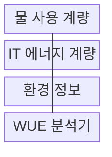
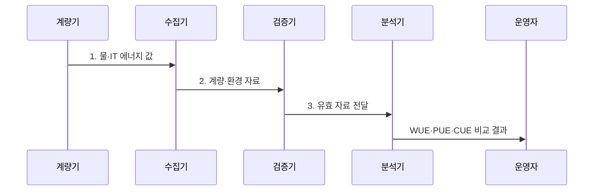

---
sidebar:
  order: 59
  label: "059. 물 사용 효율 (WUE)"
  badge:
    text: "기출 · 50%"
    variant: note
title: "물 사용 효율 (WUE)"
date: "2026-07-31T10:35:00+09:00"
tags:
  - "notes-hardware"
weight: 59
extra:
  question_no: "059"
  source_status: "기출"
  source_history: "138회"
  priority: 50
  priority_note: "지역 물 위험과 냉각·수원 선택 기준"
---

## 미리 알고가기

- **물 사용 효율(Water Usage Effectiveness, WUE)**: IT 장비 에너지 사용량 대비 데이터센터의 현장 물 사용량
- **현장 물 사용량($V_W$)**: '브이 서브 더블유'로 읽으며 물(Water)의 W를 아래첨자로 붙인 부피 기호로, WUE 산식의 분자
- **정보기술(Information Technology, IT) 장비 에너지($E_{IT}$)**: '이 서브 아이티'로 읽으며 에너지(Energy)의 E에 IT를 붙인 기호로, WUE 산식의 분모
- **물 부족도(Water Stress)**: 취수 수요가 지역 가용 수자원에 주는 압박
- **증발 냉각(Evaporative Cooling)**: 물의 증발 잠열로 장비 열을 방출
- **건식 냉각(Dry Cooling)**: 물 증발 없이 공기로 장비 열을 방출
- **재생수(Reclaimed Water)**: 처리한 폐수를 냉각 보충수로 재사용
- **전력 사용 효율(Power Usage Effectiveness, PUE)**: 데이터센터 전체 에너지를 IT 장비 에너지로 나눈 전력 효율 지표
- **탄소 사용 효율(Carbon Usage Effectiveness, CUE)**: IT 장비 에너지 사용량 대비 데이터센터의 온실가스 배출량
- **증발 잠열(Latent Heat of Vaporization)**: 물이 온도 상승 없이 액체에서 기체로 바뀌며 흡수하는 열
- **상수(Mains Water)**: 수도 사업자가 공급하는 처리된 물로 재생수와 구분해 수원별 사용량을 계량함
- **수원(Water Source)**: 냉각에 사용하는 상수·지하수·재생수 등 물의 공급원
- **외기 조건(Outdoor Air Condition)**: 데이터센터 밖의 온도·습도로 증발·건식 냉각 성능을 바꾸는 환경 조건
- **가뭄(Drought)**: 강수 부족이 이어져 지역 가용 수자원과 취수 여유가 줄어든 상태

## Ⅰ. 개요

- 정의/개념: 현장 물 사용량을 **IT 장비 에너지**로 나눠 수자원 효율을 재는 **WUE 지표**
- 배경/필요성: PUE만으로는 냉각 용수의 **지역 물 부족 위험 판단 불가**

### 쉽게 이해하기 (학습용)

- 같은 컴퓨터 작업에 냉각수가 얼마나 필요한지 재는 값이다.

## Ⅱ. 특징

- 같은 IT 에너지에서 **물 사용량 증가** 시 WUE 상승
- **L/kWh 단위**로 물 부피와 IT 에너지 관계 명시
- **경계·기간·기후 조건** 통제 시점 간 추세 비교

$$
WUE = \frac{V_W}{E_{IT}}\quad [L/kWh]
$$

### 쉽게 이해하기 (학습용)

- 증발 냉각은 전력을 줄여도 물 사용량을 늘릴 수 있다.

## Ⅲ. 구조 및 구성요소

| 구성요소 | 책임 |
|:---|:---|
| 물 사용 계량 | **수원별 부피 측정** |
| IT 에너지 계량 | **IT 소비량 측정** |
| 환경 정보 | **기후·물 부족도 기록** |
| WUE 분석기 | **비율·추세 산출** |

### 쉽게 이해하기 (학습용)

- 물과 IT 전력을 같은 기간에 재고 지역 물 사정도 함께 기록한다.

## Ⅳ. 흐름도

**동작 원리**

1. **물·IT 에너지 값**: 같은 기간의 수원별 물 사용량과 IT 에너지 집계
2. **계량·환경 자료**: 계량 범위·결측·외기·가뭄의 비교 가능성 검증
3. **유효 자료 전달**: 검증된 분자·분모만 WUE 산정에 입력

### 쉽게 이해하기 (학습용)

- 물 사용량과 IT 전력을 검증한 뒤 냉각 대안을 다시 측정한다.

## Ⅴ. 종류 및 비교

| 데이터센터 효율 지표 | WUE | PUE | CUE |
|:---|:---|:---|:---|
| 적용 기준 | **냉각 수원 관리** | **시설 전력 개선** | **탄소 배출 관리** |
| 핵심 특징 | **물 사용량 비율** | **전체·IT 에너지 비율** | **탄소 배출량 비율** |
| 한계 | **지역 희소성** 미반영 | **IT 작업 효율** 미반영 | **배출계수 변화** 의존 |

### 쉽게 이해하기 (학습용)

- WUE는 물, PUE는 전력, CUE는 탄소 관점의 지표이다.

## Ⅵ. 실무 고려사항 및 대책

| 고려사항 | 대책 | 효과 |
|:---|:---|:---|
| 상수·재생수·증발량 계량 누락 | 수원별 계량과 급수·배출 **물 수지** 검증 | **실제 소비량 확보** |
| 물·IT 에너지 집계 기간 불일치 | **계량기 시계·집계 주기** 동기화 | **비율 왜곡 방지** |
| 같은 WUE라도 지역 물 부족도 상이 | 계절별 **물 부족도·수원 구성** 병기 | **지역 위험 반영** |
| 건식 냉각 전환으로 전력·탄소 증가 | **WUE·PUE·CUE**와 절대 사용량 공동 평가 | **물·전력·탄소 증감** 확인 |

### 쉽게 이해하기 (학습용)

- 물을 줄이는 대책이 전력과 탄소를 늘리는지도 함께 확인한다.

## Ⅶ. 결론

- **물 부족도**가 높으면 건식 냉각, **전력 제약**이 크면 재생수 증발 냉각 선택

### 쉽게 이해하기 (학습용)

- 물 사정과 전력 소비를 함께 보고 냉각 방식을 선택한다.
