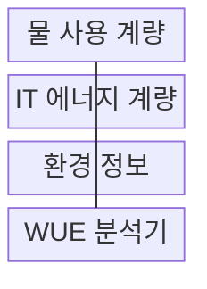
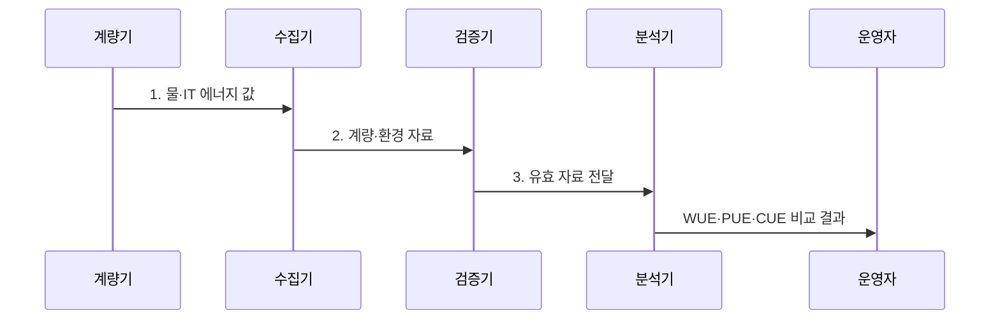

---
sidebar:
  order: 59
  label: "059. 물 사용 효율 (WUE)"
  badge:
    text: "기출 · 50%"
    variant: note
title: "물 사용 효율 (WUE)"
date: "2026-08-02T11:19:00+09:00"
tags:
  - "notes-hardware"
weight: 59
extra:
  question_no: "059"
  source_status: "기출"
  source_history: "138회"
  priority: 50
  priority_note: "지역 물 위험과 냉각·수원 선택 기준"
---

## Ⅰ. 개요

핵심 용어

- **물사용효율(Water Usage Effectiveness, WUE)**: 데이터센터의 현장 물 사용량을 IT 장비 에너지로 나누어 수자원 효율을 나타내는 지표이다.
- **현장 물 사용량($V_W$)**: 데이터센터 경계 안에서 냉각과 운영에 실제로 소비한 물의 부피로 WUE의 분자이다.
- **IT 장비 에너지($E_{IT}$)**: 서버와 스토리지 및 네트워크 장비가 소비한 에너지로 WUE의 분모이다.

- 정의/개념: **물사용효율(WUE)**은 데이터센터의 현장 물 사용량을 IT 장비 에너지로 나눠 계산하는 **수자원 효율 지표**
- 배경/필요성: 증발 냉각은 전력 효율을 높이면서 물 소비를 늘릴 수 있어 **물 사용 집약도를 별도 관리할 필요**

### 쉽게 이해하기 (학습용)

- 같은 컴퓨터 작업에 냉각수가 얼마나 필요한지 재는 값이다.

## Ⅱ. 특징

핵심 용어

- **리터/킬로와트시(L/kWh)**: IT 장비 에너지 1킬로와트시당 소비한 물의 리터 수를 나타내는 WUE 단위이다.
- **증발 냉각(Evaporative Cooling)**: 물이 기체로 변할 때 흡수하는 잠열을 이용하여 장비 열을 방출하는 방식이다.
- **비교 조건(Comparison Condition)**: WUE 추세를 공정하게 비교하기 위해 동일하게 유지하거나 함께 기록해야 하는 경계·기간·기후이다.

- 같은 IT 에너지에서 **물 사용량 증가** 시 WUE 상승
- **L/kWh 단위**로 물 부피와 IT 에너지 관계 명시
- **경계·기간·기후 조건** 통제 시점 간 추세 비교

$$
WUE = \frac{V_W}{E_{IT}}\quad [L/kWh]
$$

### 쉽게 이해하기 (학습용)

- 증발 냉각은 전력을 줄여도 물 사용량을 늘릴 수 있다.

## Ⅲ. 구조 및 구성요소

핵심 용어

- **수원별 계량(Water-source Metering)**: 상수와 지하수 및 재생수처럼 공급원별 사용 부피를 분리하여 측정하는 계량이다.
- **환경 정보(Environmental Information)**: 냉각 성능과 물 위험을 해석하기 위해 기록하는 외기 온습도와 지역 물 부족도이다.
- **WUE 분석기(WUE Analyzer)**: 검증된 물 사용량과 IT 에너지로 WUE와 기간별 추세를 산출하는 시스템이다.

| 구성요소 | 책임 |
|:---|:---|
| 물 사용 계량 | **수원별 부피 측정** |
| IT 에너지 계량 | **IT 소비량 측정** |
| 환경 정보 | **기후·물 부족도 기록** |
| WUE 분석기 | **비율·추세 산출** |

### 쉽게 이해하기 (학습용)

- 물과 IT 전력을 같은 기간에 재고 지역 물 사정도 함께 기록한다.

## Ⅳ. 흐름도

핵심 용어

- **계량 범위(Metering Scope)**: WUE 분자와 분모에 포함하는 물 사용 설비와 IT 장비의 물리적 경계이다.
- **가뭄(Drought)**: 강수 부족이 이어져 지역 가용 수자원과 취수 여유가 줄어든 상태이다.
- **유효 자료(Validated Data)**: 범위와 기간 및 결측 검사를 통과하여 WUE 계산에 사용할 수 있는 계량값이다.

**동작 원리**

1. **물·IT 에너지 값**: 같은 기간의 수원별 물 사용량과 IT 에너지 집계
2. **계량·환경 자료**: 계량 범위·결측·외기·가뭄의 비교 가능성 검증
3. **유효 자료 전달**: 검증된 분자·분모만 WUE 산정에 입력

### 쉽게 이해하기 (학습용)

- 물 사용량과 IT 전력을 검증한 뒤 냉각 대안을 다시 측정한다.

## Ⅴ. 종류 및 비교

핵심 용어

- **전력사용효율(Power Usage Effectiveness, PUE)**: 데이터센터 전체 에너지를 IT 장비 에너지로 나눈 시설 전력 효율 지표이다.
- **탄소사용효율(Carbon Usage Effectiveness, CUE)**: 데이터센터의 온실가스 배출량을 IT 장비 에너지로 나눈 탄소 효율 지표이다.
- **지역 희소성(Local Water Scarcity)**: 같은 물 사용량이라도 지역의 가용 수자원과 취수 수요에 따라 달라지는 물의 부족 정도이다.

| 데이터센터 효율 지표 | WUE | PUE | CUE |
|:---|:---|:---|:---|
| 적용 기준 | **냉각 수원 관리** | **시설 전력 개선** | **탄소 배출 관리** |
| 핵심 특징 | **물 사용량 비율** | **전체·IT 에너지 비율** | **탄소 배출량 비율** |
| 한계 | **지역 희소성** 미반영 | **IT 작업 효율** 미반영 | **배출계수 변화** 의존 |

### 쉽게 이해하기 (학습용)

- WUE는 물, PUE는 전력, CUE는 탄소 관점의 지표이다.

## Ⅵ. 실무 고려사항 및 대책

핵심 용어

- **물 수지(Water Balance)**: 시설로 들어온 물과 배출·증발·저장된 물의 양을 비교하여 계량 누락을 찾는 검증이다.
- **물 부족도(Water Stress)**: 지역의 취수 수요가 이용 가능한 수자원에 주는 압박의 정도이다.
- **재생수(Reclaimed Water)**: 처리한 폐수를 상수 대신 냉각 보충수 등으로 다시 사용하는 물이다.
- **절대 사용량(Absolute Consumption)**: 효율 비율과 별도로 시설이 일정 기간 실제로 소비한 물·에너지·탄소의 총량이다.

| 문제 | 대책 | 효과 |
|:---|:---|:---|
| 상수·재생수·증발량 계량 누락 | 수원별 계량과 급수·배출 **물 수지** 검증 | **실제 소비량 확보** |
| 물·IT 에너지 집계 기간 불일치 | **계량기 시계·집계 주기** 동기화 | **비율 왜곡 방지** |
| 같은 WUE라도 지역 물 부족도 상이 | 계절별 **물 부족도·수원 구성** 병기 | **지역 위험 반영** |
| 건식 냉각 전환으로 전력·탄소 증가 | **WUE·PUE·CUE**와 절대 사용량 공동 평가 | **물·전력·탄소 증감** 확인 |

### 쉽게 이해하기 (학습용)

- 물을 줄이는 대책이 전력과 탄소를 늘리는지도 함께 확인한다.

## Ⅶ. 결론

핵심 용어

- **건식 냉각(Dry Cooling)**: 물을 증발시키지 않고 외부 공기로 열을 방출하여 물 사용을 줄이는 방식이다.
- **재생수 증발 냉각(Reclaimed-water Evaporative Cooling)**: 처리한 재생수의 증발 잠열을 이용해 냉각 전력을 줄이는 방식이다.
- **자원 절충(Resource Trade-off)**: 물을 줄이는 선택이 전력이나 탄소를 늘릴 수 있어 여러 환경 지표를 함께 판단해야 하는 관계이다.

- **물 부족도**가 높으면 건식 냉각, **전력 제약**이 크면 재생수 증발 냉각 선택

### 쉽게 이해하기 (학습용)

- 물 사정과 전력 소비를 함께 보고 냉각 방식을 선택한다.
