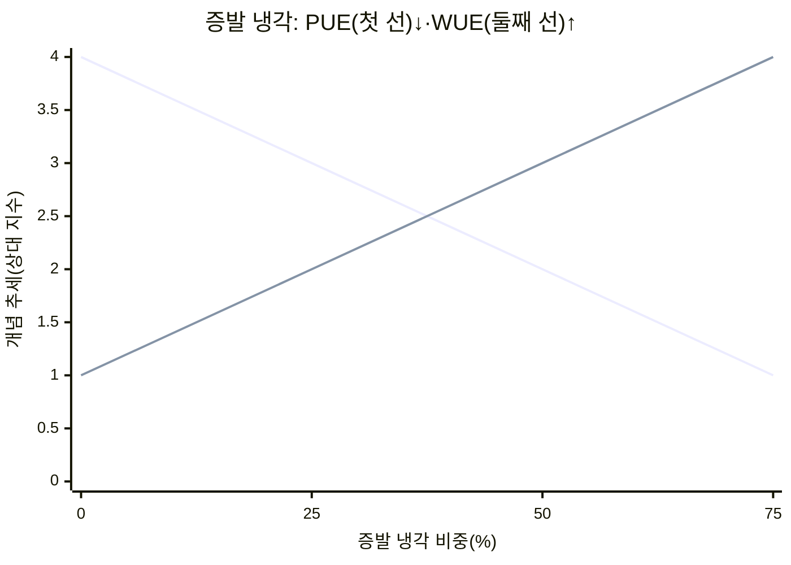
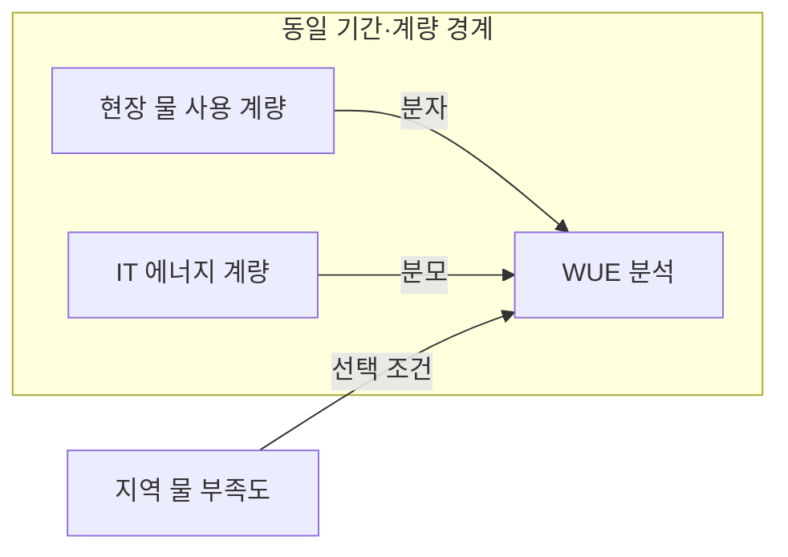
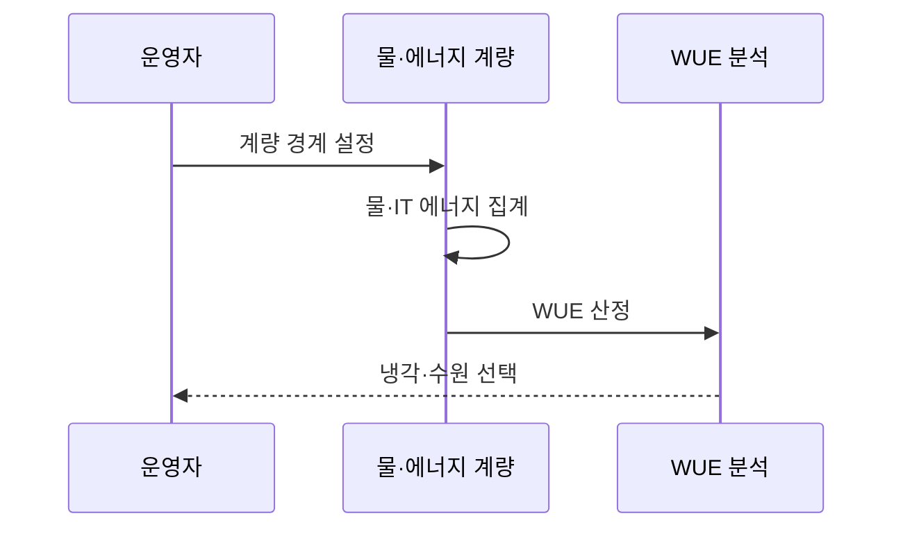

---
sidebar:
  order: 59
  label: "059. 물 사용 효율 (WUE)"
  badge:
    text: "기출 · 50%"
    variant: note
title: "물 사용 효율 (WUE)"
date: "2026-07-27T23:59:59+09:00"
tags:
  - "notes-hardware"
weight: 59
extra:
  question_no: "059"
  source_status: "기출"
  source_history: "138회"
  priority: 50
  priority_note: "지역 물 위험과 냉각·수원 선택 기준"
---

## 미리 알고가기

- **물 사용 효율(Water Usage Effectiveness, WUE)**: ‘더블유유이’로 읽고 영문 머리글자를 딴 약어이며, 정보기술 장비 에너지당 현장 물 사용량
- **현장 물 사용량($V_W$)**: $V_W$는 '브이 서브 더블유'로 읽고 부피(Volume)의 V에 물(Water)의 W 아래첨자를 붙인 표기이며, 본문 WUE 산식의 분자로서 냉각·가습 등 계량 경계 안의 물 사용량을 뜻함
- **정보기술(Information Technology, IT) 장비 에너지($E_{IT}$)**: IT는 ‘아이티’, $E_{IT}$는 ‘이 서브 아이티’로 읽고 영문 머리글자를 에너지 E의 아래첨자로 붙였으며, WUE 분모인 서버·스토리지·네트워크 에너지
- **물 부족도(Water Stress)**: 취수 수요가 지역 가용 수자원에 주는 압박
- **증발 냉각(Evaporative Cooling)**: 물의 증발 잠열로 장비 열을 방출
- **건식 냉각(Dry Cooling)**: 물 증발 없이 공기로 장비 열을 방출
- **재생수(Reclaimed Water)**: 처리한 폐수를 냉각 보충수로 재사용
- **전력 사용 효율(Power Usage Effectiveness, PUE)**: ‘피유이’로 읽고 영문 머리글자를 딴 약어이며, 전체 에너지의 IT 장비 에너지 대비 비율
- **탄소 사용 효율(Carbon Usage Effectiveness, CUE)**: ‘시유이’로 읽고 영문 머리글자를 딴 약어이며, IT 에너지당 온실가스 배출량
- **물 사용 집약도(Water Use Intensity)**: 같은 IT 에너지를 공급할 때 현장에서 소비하는 물의 양
- **증발 잠열(Latent Heat of Vaporization)**: 물이 온도 상승 없이 액체에서 기체로 바뀌며 흡수하는 열
- **상수(Mains Water)**: 수도 사업자가 공급하는 처리된 물로 재생수와 구분해 수원별 사용량을 계량함
- **수원(Water Source)**: 냉각에 사용하는 상수·지하수·재생수 등 물의 공급원
- **외기 조건(Outdoor Air Condition)**: 데이터센터 밖의 온도·습도로 증발·건식 냉각 성능을 바꾸는 환경 조건
- **IT 부하(IT Load)**: 서버·스토리지·네트워크가 처리하는 작업과 이에 따른 에너지 사용량
- **가뭄(Drought)**: 강수 부족이 이어져 지역 가용 수자원과 취수 여유가 줄어든 상태

## Ⅰ. 개요

- 정의/개념: 현장 물 사용량을 **IT 장비 에너지로 나눈 비율**
- 기존 한계: 에너지 지표만으로는 **냉각 물 소비·지역 위험** 판단 불가

### 쉽게 이해하기 (학습용)

- 컴퓨터가 같은 일을 할 때 냉방에 쓴 물병 수를 적는 물 가계부다

## Ⅱ. 특징

- **현장 물 사용 증가** 시 WUE 상승
- **증발 냉각**은 PUE를 낮춰도 물 위험 증가
- **기후·냉각·IT 부하 통제** 후 시설 간 비교

### 쉽게 이해하기 (학습용)

- 더운 날 증발 냉각을 늘리면 냉방 전기는 줄 수 있지만 물은 더 쓴다

## Ⅲ. 아키텍처 및 구성요소

| 설계 요소 | 설명 |
|:---|:---|
| 현장 물 사용 계량 | 상수·재생수 사용량을 수원별 측정 |
| IT 에너지 계량 | 서버·스토리지·네트워크 에너지 측정 |
| WUE 분석 | 같은 기간·외기·IT 부하의 WUE 비교 |

> 요약: 물·IT 에너지 비율과 지역 물 부족도를 분석한다

### 쉽게 이해하기 (학습용)

- 수도계와 컴퓨터 전력계를 맞추고 지역 물 사정까지 함께 본다

## Ⅳ. 원리 및 절차 흐름도

| 절차 | 설명 |
|:---|:---|
| 계량 경계 설정 | 수원·설비·기간·IT 부하 정의 |
| 물·IT 에너지 집계 | 현장 물·IT 에너지를 같은 기간에 집계 |
| WUE 산정 | 현장 물 사용량을 IT 에너지로 나눔 |
| 냉각·수원 선택 | WUE·PUE·물 부족도로 냉각·수원 결정 |

> 요약: WUE·PUE·물 부족도로 냉각과 수원을 정한다

### 쉽게 이해하기 (학습용)

- 물·전기 사용량과 지역 가뭄을 함께 보고 냉각 방식과 물 종류를 정한다

## Ⅴ. 종류 및 비교

| 데이터센터 효율 지표 | WUE | PUE | CUE |
|:---|:---|:---|:---|
| 적용 기준 | 냉각 방식·**수원 선택** | 냉각·배전 **오버헤드 개선** | 에너지원·**탄소계수 선택** |
| 핵심 특징 | IT 에너지당 **물 사용량** | IT 대비 **전체 에너지 비율** | IT 에너지당 **탄소 배출량** |
| 한계 | 수원별 희소성 **미반영** | IT 작업 효율 **미반영** | 지역·시간별 **계수 의존** |

> 요약: WUE는 물, PUE는 전력, CUE는 탄소를 잰다

### 쉽게 이해하기 (학습용)

- WUE는 물, PUE는 전기, CUE는 탄소에 붙이는 자원 성적표다

## Ⅵ. 실무 사례

1. 가뭄 지역 센터는 **건식 냉각·재생수**로 전환

### 쉽게 이해하기 (학습용)

- 가뭄 때 물 냉각을 줄이고 공기 냉각을 늘린다

## Ⅶ. 결론

- 물 부족도가 높으면 **건식 냉각·재생수** 적용

### 쉽게 이해하기 (학습용)

- 지역 물 사정이 나빠지면 건식 냉각과 재생수 사용을 늘린다
