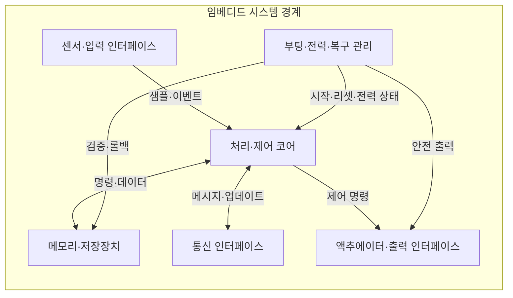
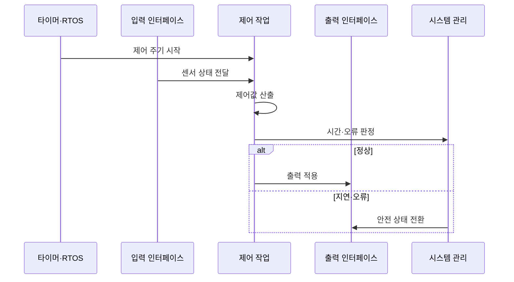

---
sidebar:
  order: 60
  label: "060. 임베디드 시스템 구조 (Embedded System Architecture)"
  badge:
    text: "기출 · 50%"
    variant: note
title: "임베디드 시스템 구조 (Embedded System Architecture)"
date: "2026-07-27T23:59:59+09:00"
tags:
  - "notes-hardware"
weight: 60
extra:
  question_no: "060"
  source_status: "기출"
  source_history: "137회"
  priority: 50
  priority_note: "시간·전력·운영 기능의 구조 선택"
---

## 미리 알고가기

- **임베디드 시스템(Embedded System)**: 특정 장치 기능을 수행하는 전용 컴퓨터
- **펌웨어(Firmware)**: 장치 하드웨어를 직접 제어하는 소프트웨어
- **마이크로컨트롤러(Microcontroller Unit, MCU)**: 프로세서 코어·메모리·제어용 주변장치를 하나의 칩에 통합한 장치
- **마이크로프로세서(Microprocessor Unit, MPU)**: 외부 메모리·주변장치와 연결하여 고기능 운영체제를 실행하는 범용 처리장치
- **시스템온칩(System on Chip, SoC)**: 연산·가속·메모리 제어·주변 기능을 하나의 다이에 통합한 칩
- **실시간 운영체제(Real-Time Operating System, RTOS)**: 작업이 정해진 마감시간 안에 완료되도록 결정적 스케줄링을 제공하는 운영체제
- **마감시간(Deadline)**: 작업 결과가 완료되어야 하는 시점
- **인터럽트(Interrupt)**: 장치 이벤트를 처리 코어에 알리는 비동기 신호
- **워치독(Watchdog)**: 응답 없는 펌웨어를 감지해 재시작
- **원격 업데이트(Over-the-Air, OTA)**: 네트워크를 통해 장치의 펌웨어·소프트웨어 이미지를 원격 갱신하는 방식
- **A/B 파티션(A/B Partition)**: 신규 펌웨어 실패 시 이전 이미지로 복귀
- **하드웨어 연동 검증(Hardware-in-the-Loop, HIL)**: 실제 제어기와 실시간 모의 플랜트를 연결하여 센서·액추에이터 입출력을 검증하는 방식
- **액추에이터(Actuator)**: 전기 명령을 물리 동작으로 변환
- **하드웨어·소프트웨어 경계(Hardware-Software Partitioning)**: 시간·전력·변경 요구에 따라 기능을 전용 회로와 펌웨어 중 어디에서 실행할지 나누는 설계
- **온칩 자원(On-chip Resource)**: MCU 다이 안에 통합된 코어·메모리·타이머·통신 주변장치
- **부팅·리셋(Boot·Reset)**: 부팅은 전원 인가 후 펌웨어를 검증·실행하는 과정이고 리셋은 코어·장치를 초기 상태로 되돌리는 동작
- **롤백(Rollback)**: 새 펌웨어 실행에 실패하면 이전에 검증된 이미지로 되돌리는 복구
- **안전 상태(Safe State)**: 오류·마감시간 초과 때 액추에이터를 정지·제한해 위험을 줄이는 출력 상태
- **제어 주기(Control Cycle)**: 센서 읽기·계산·출력 갱신을 반복하는 고정 시간 간격
- **목표값(Setpoint)**: 제어 시스템이 센서 상태를 맞추려는 기준값
- **현장 게이트웨이(Edge Gateway)**: 센서·제어기와 상위 네트워크 사이에서 프로토콜 변환·데이터 집계를 수행하는 장치
- **모의 플랜트(Simulated Plant)**: 실제 기계·공정의 입력과 반응을 시험 장비에서 재현한 모델
- **추론(Inference)**: 학습된 모델에 새 입력을 넣어 분류·예측 결과를 계산하는 과정

## Ⅰ. 개요

- 정의/개념: 특정 기능을 수행하는 **하드웨어·펌웨어 결합 시스템**
- 기존 한계: 범용 컴퓨터는 **비용·전력·크기·응답시간**에 한계

### 쉽게 이해하기 (학습용)

- 작은 컴퓨터가 센서를 읽고 정해진 시간 안에 모터를 움직인다

## Ⅱ. 특징

- **전용 기능 통합**으로 비용·전력·크기 절감
- **실시간 입출력 제어**로 정해진 응답시간 준수
- **제한 자원·기능 고정**이 확장·변경 범위 제한

### 쉽게 이해하기 (학습용)

- 해야 할 일과 시간·배터리 한도에 맞춰 전용 부품과 프로그램을 나눈다

## Ⅲ. 아키텍처 및 구성요소

| 설계 요소 | 설명 |
|:---|:---|
| 센서·입력 인터페이스 | 물리 신호를 디지털 샘플·이벤트로 변환 |
| 처리·제어 코어 | 제어 펌웨어를 실행해 출력값 산출 |
| 메모리·저장장치 | 코드·상태·설정·업데이트 이미지 보관 |
| 통신 인터페이스 | 장치·네트워크 메시지 송수신 |
| 액추에이터·출력 인터페이스 | 제어값을 물리 출력 신호로 변환 |
| 부팅·전력·복구 관리 | 기동·워치독·전력·롤백·안전 출력 |

> 요약: 메모리·통신·복구 관리가 제어 경로를 지원한다

### 쉽게 이해하기 (학습용)

- 센서가 감각을 보내면 제어 코어가 기억·통신을 이용해 출력 장치를 움직이고 관리 블록이 시작과 복구를 맡는다

## Ⅳ. 원리 및 절차 흐름도

| 절차 | 설명 |
|:---|:---|
| 제어 주기 시작 | 타이머·RTOS가 작업 실행 시점 통지 |
| 센서 상태 전달 | 입력 인터페이스가 최신 상태 전달 |
| 제어값 산출 | 목표값·센서 상태로 출력값 산출 |
| 시간·오류 판정 | 마감시간·워치독으로 정상 여부 판정 |
| 출력 적용 | 정상 출력값을 액추에이터에 전달 |
| 안전 상태 전환 | 안전 출력 후 재시작·이미지 롤백 |

> 요약: 정상은 출력하고 오류면 안전 상태로 복구한다

### 쉽게 이해하기 (학습용)

- 제시간이면 모터를 움직이고 늦거나 멈추면 안전하게 끄고 다시 시작한다

## Ⅴ. 종류 및 비교

| 임베디드 시스템 | MCU 기반 | MPU·SoC 기반 |
|:---|:---|:---|
| 적용 기준 | 센서·모터·**단순 통신 제어** | 화면·네트워크·**대용량 처리** |
| 핵심 특징 | 온칩 자원의 **저전력 실시간 제어** | 외부 메모리·OS의 **고기능 처리** |
| 한계 | 자원 한계·**기능 결합** | 지연 변동·전력·**긴 부팅** |

> 요약: 시간·전력은 MCU, 고기능은 MPU·SoC가 맞다

### 쉽게 이해하기 (학습용)

- 작은 제어기는 한 일을 제시간에, 큰 제어기는 화면과 통신을 함께 처리한다

## Ⅵ. 실무 사례

1. 모터 제어기는 **RTOS 제어 주기**를 HIL로 검증

### 쉽게 이해하기 (학습용)

- 모터 제어기는 모의 기계로 정해진 시간 안에 움직이는지 확인한다

## Ⅶ. 결론

- 임베디드 설계를 위해 시간·전력을 검토하여 **MCU·MPU** 활용

### 쉽게 이해하기 (학습용)

- 마감시간·저전력이 중요하면 작은 칩, 화면·통신이 많으면 큰 칩을 선택한다
